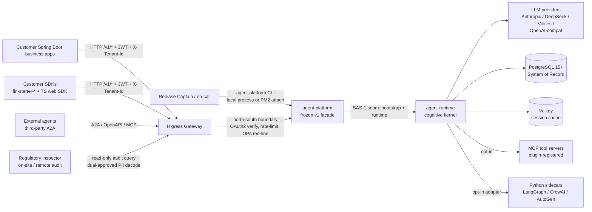
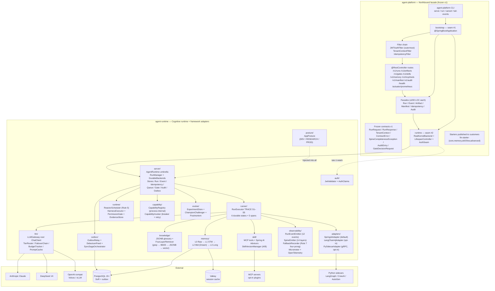
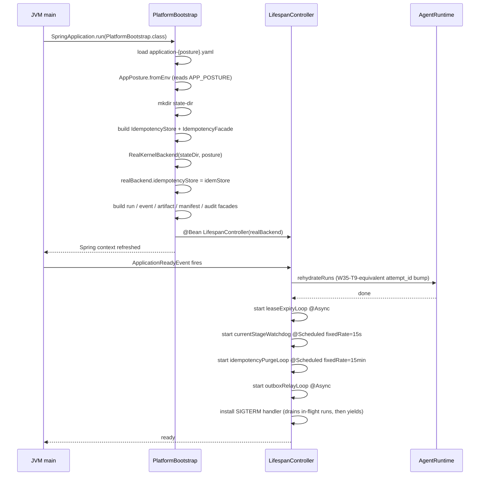
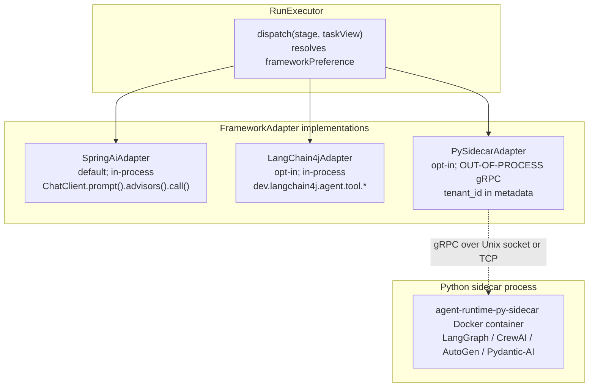
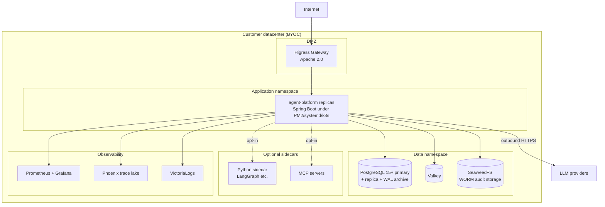
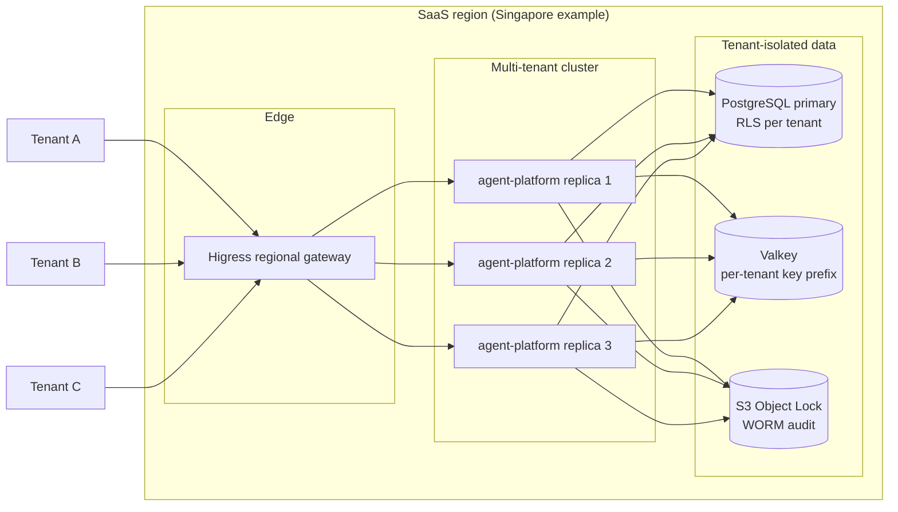

# spring-ai-fin Platform — Architecture (v6.0)

> **Last refreshed:** 2026-05-08. Pre-implementation; document-only corpus + governance scaffold. **Architecture Review Edition (post-remediation cycle 1).**
> **Audience:** architecture review committee, platform engineers, downstream financial-services consumers, release captains, compliance reviewers, security reviewers.
> **Status:** authoritative — supersedes `docs/architecture-v5.0.md`. v5.0 retained as historical input. Review findings recorded in `docs/architecture-v5.0-review-2026-05-07.md` and the corrections are applied throughout this document.
> **Predecessor:** `D:/chao_workspace/hi-agent/ARCHITECTURE.md` — 32 release waves of operational learnings codified into 17 engineering rules. v6.0 inherits the philosophy and adapts it to Java / Spring AI / Spring Boot for the financial-services domain.
>
> **Document hierarchy** (planned; mirrors hi-agent's L0/L1/L2 pattern)
> - **L0 system boundary** — *this file*. Purpose, scope, decisions, quality, risks across the whole platform.
> - **L1 per-package** (`agent-platform/`, `agent-runtime/`) — package-internal building blocks, ownership, decision chains.
> - **L2 per-subsystem** — every leaf module under each package owns its own ARCHITECTURE.md when it lands.
>
> **Existing docs:**
> - **Security review baseline** (UPDATED 2026-05-08): [`docs/security-response-2026-05-08.md`](docs/security-response-2026-05-08.md) responds to the security committee review with all 10 P0 + 10 P1 findings at status `design_accepted`. Closure status of every finding is tracked in [`docs/governance/architecture-status.yaml`](docs/governance/architecture-status.yaml); a finding is not closed until at least `test_verified` per [`docs/governance/closure-taxonomy.md`](docs/governance/closure-taxonomy.md). New docs below.
> - L1 northbound facade: [`agent-platform/ARCHITECTURE.md`](agent-platform/ARCHITECTURE.md)
> - L1 cognitive runtime: [`agent-runtime/ARCHITECTURE.md`](agent-runtime/ARCHITECTURE.md)
> - L2 contracts: [`agent-platform/contracts/ARCHITECTURE.md`](agent-platform/contracts/ARCHITECTURE.md)
> - L2 transport: [`agent-platform/api/ARCHITECTURE.md`](agent-platform/api/ARCHITECTURE.md)
> - L2 runtime binding: [`agent-platform/runtime/ARCHITECTURE.md`](agent-platform/runtime/ARCHITECTURE.md)
> - **L2 ActionGuard (NEW 2026-05-08)**: [`agent-runtime/action-guard/ARCHITECTURE.md`](agent-runtime/action-guard/ARCHITECTURE.md) — addresses P0-1 (unified action authorization). Status: `design_accepted`. Tests + operator-shape gate are W2 deliverables.
> - **L2 audit (NEW 2026-05-08)**: [`agent-runtime/audit/ARCHITECTURE.md`](agent-runtime/audit/ARCHITECTURE.md) — addresses P0-8 (5-class audit model). Status: `design_accepted`. Tests + operator-shape gate are W2 deliverables.
> - L2 TRACE runner: [`agent-runtime/runner/ARCHITECTURE.md`](agent-runtime/runner/ARCHITECTURE.md)
> - L2 LLM gateway: [`agent-runtime/llm/ARCHITECTURE.md`](agent-runtime/llm/ARCHITECTURE.md)
> - L2 framework adapters: [`agent-runtime/adapters/ARCHITECTURE.md`](agent-runtime/adapters/ARCHITECTURE.md)
> - L2 outbox: [`agent-runtime/outbox/ARCHITECTURE.md`](agent-runtime/outbox/ARCHITECTURE.md)
> - L2 observability: [`agent-runtime/observability/ARCHITECTURE.md`](agent-runtime/observability/ARCHITECTURE.md)
> - **Security profiles** (deployment-time): [`docs/gateway-conformance-profile.md`](docs/gateway-conformance-profile.md), [`docs/sidecar-security-profile.md`](docs/sidecar-security-profile.md), [`docs/secrets-lifecycle.md`](docs/secrets-lifecycle.md), [`docs/supply-chain-controls.md`](docs/supply-chain-controls.md)
> - **Security control matrix + trust-boundary diagram**: [`docs/security-control-matrix.md`](docs/security-control-matrix.md), [`docs/trust-boundary-diagram.md`](docs/trust-boundary-diagram.md)
> - Behavioural rules: [`CLAUDE.md`](CLAUDE.md)

---

## 0. Reviewer Reading Guide

This is a long document because the architecture committee requested **multi-dimensional review**: functional design, security boundary, compliance posture, operability, evolution, and cost. Different reviewer roles should follow different reading paths:

| Role | Suggested path | Estimated time |
|---|---|---|
| **Senior architect** | §1 (purpose) → §3 (three-tier layering) → §6 (decision chains) → §11 (quality bar) | 90 min |
| **Security reviewer** | §1 (boundary) → §4.4 (auth/tenancy) → §6 (security decisions D-7, D-12, D-15) → §10 (security cross-cutting) → §12 (risks) | 60 min |
| **Compliance reviewer** | §1 (positioning) → §2 (regulatory landscape) → §5 (data plane) → §7 (audit & immutability) → §11.4 (compliance bar) | 75 min |
| **Operations / SRE** | §3 (deployment shapes) → §4 (building blocks) → §8 (runtime scenarios) → §10.5 (operator-shape gate) → §13 (capacity & DR) | 90 min |
| **Skeptical reviewer** | §6 (every decision lists alternatives + why this won) → §12 (risks & technical debt) → `docs/architecture-v5.0-review-2026-05-07.md` (the predecessor critique that produced this revision) | 60 min |

Each major section ends with a **"How to evaluate this"** note listing the falsifiable assertions in the section, so reviewers can produce concrete dissent rather than vague concerns.

---

## 1. Purpose & Responsibilities

### 1.1 Positioning

spring-ai-fin is a **capability-layer enterprise agent platform** purpose-built for **financial institutions in Southeast Asia** — initially targeting **Indonesia (OJK / UU PDP)** and **Singapore (MAS / PDPA)**, with the pattern extensible to **Hong Kong, Vietnam, Philippines, Thailand**. It is a platform, not a business application.

```yaml
positioning:
  enterprise_grade:
    Not a demo, not a PoC.
    Production-shaped from day 0 (operator-shape readiness gate, Rule 8).
    SLA tiers, audit trail, regulatory readiness built into the v1 contract.
  
  financial_services:
    Built-in support for the gates and contract spine financial workloads
    require: tenant isolation, idempotency, deterministic flows,
    audit immutability, behaviour-version pinning (opt-in, capped at 5 years).
    Domain content (KYC rules, AML lists, suitability rubrics, regulator
    forms) is OUT OF REPO — supplied by customer or via a separate
    `fin-domain-pack/` per regulatory deal.
  
  agent_platform:
    Not a single agent.
    Not a bare agent framework.
    A platform supporting customers in building, operating, and evolving
    dozens to hundreds of agents at production scale, while letting
    customers run multiple agent frameworks (Spring AI native,
    LangChain4j, Python-native via sidecars).
```

### 1.2 Three-tier internal split (the user's design)

The platform's **internal** architecture decomposes into three concentric tiers; these three tiers were the user's brief at the start of this engagement and they survive the v5.0 → v6.0 refactor unchanged in shape but with the contracts and depth corrected:

```
          ┌────────────────────────────────────────────────────────┐
          │   Tier-A Northbound Facade — `agent-platform/`         │  <- frozen v1 HTTP contract
          │   • versioned + frozen contract surface                │     SAS-1 seam to runtime
          │   • Spring Web routes + filter chain                   │     consumers pin to v1
          │   • idempotency, tenant context, JWT auth              │     across upgrades
          │   • operator-shape readiness, manifest, CLI            │
          └────────────────────────────────────────────────────────┘
                                   │ SAS-1 seam #1: bootstrap
                                   │ SAS-1 seam #2: runtime adapter
                                   ▼
          ┌────────────────────────────────────────────────────────┐
          │   Tier-B Cognitive Runtime — `agent-runtime/`          │  <- TRACE + framework dispatch
          │   • RunExecutor (TRACE S1–S5)                          │     LLM gateway
          │   • LLM gateway / tier router / failover               │     framework adapters
          │   • memory tiers L0–L3                                 │     observability spine
          │   • knowledge (JSONB glossary + 4-layer retrieval)     │     outbox + sync-saga
          │   • framework adapters (Spring AI / LC4j / PySidecar)  │
          │   • observability spine (Micrometer + OTel + audit)    │
          │   • outbox + sync-saga write paths                     │
          └────────────────────────────────────────────────────────┘
                                   │ outbound only
                                   ▼
          ┌────────────────────────────────────────────────────────┐
          │   Tier-C Gateway & Coordination — deployed, not coded  │  <- Higress north-south,
          │   • Higress AI Gateway (north-south boundary)          │     OAuth2 / JWT verify,
          │   • Spring Cloud Gateway (optional aggregation)        │     rate-limit, tenant
          │   • shared LLM bus (cross-replica budget)              │     routing, agent bus
          │   • OPA red-line policy enforcement                    │
          └────────────────────────────────────────────────────────┘
```

Note that the user's word-order brief listed (a) Service Platform, (b) Frameworks, (c) Gateway+Coordination. In the running deployment the **gateway is on top** (north-south boundary), the service platform is in the middle, and frameworks are dispatched from inside the platform via `agent-runtime/adapters/`. The architectural tiers and the deployment topology are not the same shape; the deployment topology is treated in §13.

### 1.3 Primary goals

1. **Frozen northbound contract** (Tier-A). Customer applications pin to `/v1/*` HTTP shapes across platform upgrades. Breaking changes go to `/v2/*`. No rewriting of customer code on platform upgrades.
2. **Durable TRACE execution** (Tier-B). Five-stage Task → Route → Act → Capture → Evolve runs survive JVM restart, support cancellation, propagate cancellation across nested sub-runs, and emit a complete observability spine.
3. **Hard platform / business boundary** (Rule 10). Customer financial logic (KYC rules, AML thresholds, suitability rubrics, regulator-specific report shapes) **never leaks into platform code**. The Three-Gate intake (G1 positioning, G2 abstraction, G3 verification, G4 posture & spine) refuses any business-layer demand.
4. **Posture-aware defaults** (Rule 11). `dev` permissive (in-memory backends OK, missing scope warns), `research` fail-closed (real backends, JWT required, strict spine validation), `prod` strictest (additionally: real LLM only, audit immutability enforced, behaviour pinning honoured).
5. **Multi-framework dispatch** (Tier-B `adapters/`). Spring AI native is the in-process default. LangChain4j is in-process opt-in. Python-native frameworks (LangGraph, CrewAI, AutoGen, Pydantic-AI, OpenAI Agents SDK) run as **out-of-process gRPC sidecars** — no in-process Python, no shared event loop. The user's "support multiple frameworks" requirement is honoured without inheriting Python-in-JVM trapdoors.
6. **Compliance-by-design** (Tier-A audit + Tier-B spine). Every persistent record carries the contract spine (`tenant_id` + relevant subset of identity/lineage fields). Every irreversible action passes through a gate. Every PII decode is dual-approved and audit-logged.

### 1.4 What spring-ai-fin does **NOT** own

| Not owned | Lives where |
|---|---|
| Business / domain logic, prompts, financial domain schemas | Customer codebase, or out-of-repo `fin-domain-pack/` |
| LLM provider HTTP transports | `agent-runtime/llm/` only — never in the customer code path |
| Compliance content (KYC rules, AML lists, OJK/MAS specific report shapes) | Customer-supplied or via regulatory partner contracts |
| Behaviour-version pinning content (frozen models / KB / prompts) | Opt-in premium subsystem; deferred from v1 default surface |
| Multi-region active-active failover | v1 = single-region per tenant; v1.1+ |
| Cross-process kernel sharing | v1 = single-process per replica; v1.1+ |
| Auto-optimization flywheel (DSPy / TRL distillation / Dreaming) | v1 = manual asset evolution; flywheel = research-posture opt-in |

### 1.5 What v5.0 said the platform owned but v6.0 explicitly **drops**

These are removed because the v5.0 review (`docs/architecture-v5.0-review-2026-05-07.md`) found them either premature, mis-scoped, or outright violating the engineering rules in `CLAUDE.md`. Each is referenced by its review-finding ID for traceability:

| v5.0 claim | v6.0 status | Review ref |
|---|---|---|
| Custom framework `spring-ai-fin` as a Spring AI fork | **Dropped.** Replaced by curated Spring Boot Starters + Advisors atop unmodified Spring AI 1.1+. | M8 |
| FIBO three-layer ontology (Apache Jena + Protégé + SPARQL + JSON-LD + SHACL + ontology2nebula) | **Deferred.** v1 ships PostgreSQL JSONB + 30–50 class hand-curated glossary as static prompt context. Phase-2 trigger: a named regulator demands semantic-graph-based reasoning evidence. | M4 |
| AI-First three-layer exception handling Layer 2 (AI Operator analyses, suggests, auto-acts) | **Dropped from v1 default path.** v1 ships only Layer-1 (deterministic code recovery) + Layer-3 (HITL via gates). Layer-2 returns in v1.1 as a research-posture opt-in with all four Rule-7 signals attached. | H3 |
| 11-state cognitive workflow graph | **Reduced to 6 durable states + 5 spans.** Cognitive activities (`intentUnderstanding`, `retrieving`, `thinking`, `reflecting`) are span types in trace context, not states with persistence semantics. | M1 |
| 22 streams orchestration | **Replaced by 4 SLA tiers + per-flow tier annotation.** "22" was decorative enumeration; the real engineering distinction is the 4 SLA tiers (realtime / interactive / batch / async). | M2 |
| 5 interaction modes for human-AI collaboration | **Reframed as 2 primitives × 4 side-effect levels.** Information flow + authority transfer; surface variants per side-effect class (L1–L4). | M3 |
| Behaviour pinning "permanently retained" for regulated customers | **Default OFF; opt-in premium with hard 5-year cap.** Resolves v5.0's internal contradiction (Ch.13.5 vs App C-10). | H4 |
| Outbox-as-universal-cross-store-transaction-model | **Split into Outbox-async (telemetry; eventual within tenant) / Sync-Saga (cross-entity progress with explicit compensations and reconciliation; not ACID across entities) / Direct-DB (read-your-write; LEDGER_ATOMIC double-entry within one transaction).** Every write site declares `consistency` annotation; financial writes also declare `FinancialWriteClass` (see `agent-runtime/outbox/ARCHITECTURE.md` §6). | H6 |
| 10-layer tenant propagation as narrative | **Replaced by single binding `TenantContext` contract spec.** MDC key, Reactor Context key, gRPC metadata key, Kafka header name; behaviour on missing tenant per posture; 4 shadow-path tests per layer. | H5 |
| 80+ open-source components on day 0 | **Tier-1 = 11 components.** Tier-2 deferred until traffic justifies; Tier-3 rejected (license risk or premature). | H2 |
| Four model tiers (Pro / Flash / Specialist / fine-tuned) | **One inference backend at MVP** (vLLM **or** OpenAI-compatible adapter — pick one). Multi-tier deferred until per-call cost data justifies. | M7 |
| "Continuous cost reduction" as a first principle | **Demoted to operational discipline.** Cost optimization (multi-tier cache, distillation, KV cache sharing, intelligent routing) is introduced when traffic justifies; not a day-0 platform commitment. | M7 |
| Cross-tenant aggregation with differential privacy as v1 feature | **Deferred to v1.1.** v1 = strict tenant isolation only. | (App C-13 deferred) |

### How to evaluate §1

Falsifiable assertions reviewers should challenge:

- **A1.1**: "Capability-layer only" — is FIBO+30 class glossary a capability primitive or a domain bake-in? (We argue: the glossary is supplied by the customer / fin-domain-pack; the platform only ingests it.)
- **A1.5**: "Frameworks run polyglot via gRPC sidecars" — does this introduce unacceptable latency for sub-second SLA tiers? (We expect ≤30ms overhead p95; measurement is part of the W2/W4 operator-shape gate against the sidecar security profile.)
- **A1.4**: "Posture-aware defaults" — does same-code-different-defaults actually work, or does it produce two divergent code paths? (Hi-agent ran this for 32 waves with success; the rule is to let consumers ask `posture.requiresStrict()` rather than branch on posture name.)

---

## 2. Context & Scope

### 2.1 Regulatory landscape

The architecture is shaped by — and must be defensible to — the following regulators and frameworks. For each, the architecture identifies which subsystem owns enforcement.

| Jurisdiction | Authority | Key obligations | Platform owner |
|---|---|---|---|
| Indonesia | OJK (banking, insurance, fintech) | Local data residency; AI-decision auditability; fraud monitoring | Tier-A audit + Tier-B observability spine |
| Indonesia | UU PDP (general data protection) | Consent management; data minimisation; PII redaction | Tier-A `auth/` + Tier-B `audit/` |
| Singapore | MAS (banking, capital markets, insurance) | FEAT (Fairness/Ethics/Accountability/Transparency); explainability; outsourcing rules | Tier-A `manifest/` + Tier-B `observability/` + Tier-B `evolve/` |
| Singapore | PDPA | Consent + breach reporting + DNC | Tier-A `auth/` + Tier-B `audit/` |
| Cross-region | EU AI Act (forward-looking) | Risk classification (high-risk for credit-scoring), human oversight, technical documentation | Tier-A capability maturity + Tier-B explainability spine |
| Industry | SOC 2 Type II | Security controls; change management | Operator-shape gate (Rule 8) |
| Industry | ISO 27001 | ISMS (Information Security Management System) | Customer-supplied; platform provides evidence |

### 2.2 External actors



| Actor | Surface | Auth | Tenant scoping | SLA tier |
|---|---|---|---|---|
| Customer business app | `POST /v1/runs`, `GET /v1/runs/{id}/events`, `POST /v1/gates/{id}/decide`, etc. | JWT (HMAC-SHA256, customer-issued) | `X-Tenant-Id` header validated against JWT claim | Realtime (p95 ≤ 1s for sync), Interactive (p95 ≤ 5s for agent runs), Batch (best-effort) |
| Customer SDK (Java) | Spring Boot Starters auto-wire `ChatClient` + `RunFacade` + `MemoryClient` | Same JWT path; no separate SDK auth | Same; SDK propagates `X-Tenant-Id` from caller's MDC | Realtime |
| Customer SDK (TypeScript web) | Thin `@spring-ai-fin/sdk-ts` wrapping `/v1/*` HTTP + SSE | OAuth2 PKCE → JWT | `X-Tenant-Id` header from session | Interactive |
| Release captain | `agent-platform serve`, `agent-platform run`, `agent-platform cancel`, `agent-platform tail-events` | Local process; respects `APP_POSTURE` | Operator role; cross-tenant queries require dual-approval | n/a |
| External agent (A2A) | `POST /v1/runs` with `frameworkPreference=A2A_INBOUND` | mTLS + JWT | Same as customer app | Interactive |
| Regulatory inspector | Read-only audit query routes (`GET /v1/audit/*`); dual-approved PII decode (`POST /v1/audit/decode`) | OAuth2 inspector role | Cross-tenant query allowed only with regulator authorization JWT claim | Batch |

### 2.3 External dependencies (runtime)

| Dependency | Role | Failure handling | License |
|---|---|---|---|
| **PostgreSQL 15+** | System of Record (runs, events, idempotency, queue, sessions, gates, outbox) | Connection pool exhaustion → circuit breaker; slow query → query timeout. Replica failover via PgBouncer or operator-managed. | PostgreSQL |
| **LLM providers** (Anthropic / DeepSeek / Volces / OpenAI-compat) | Outbound HTTPS from `agent-runtime/llm/`. | `FailoverChain` falls through ordered providers; emits `springaifin_llm_fallback_total{from,to,reason}`. | Provider-specific (Apache 2.0 for clients; provider TOS for traffic) |
| **Valkey** | Session cache (idempotency replay snapshots, run TaskView fragments) | Cache miss → recompute from PG; cache write failure → log WARNING + skip (never blocks). | BSD-3-Clause |
| **MCP tool servers** | Opt-in stdio plugins for tools | Failed tool call → typed error to agent; circuit breaker per tool | per-server |
| **Python sidecars** | Opt-in framework dispatch (LangGraph etc.) | gRPC deadline + circuit breaker; sidecar restart by container orchestrator | (Customer-chosen Python framework licenses; v6.0 review notes constraints) |
| **Higress Gateway** | North-south boundary; **deployment dependency, not code dependency** | Gateway failover via operator; the platform itself is gateway-agnostic | Apache 2.0 |

### 2.4 Out of scope at v1

- **Kafka / Istio / multi-cluster mesh** — Tier-2 components, deferred until service count or async fan-out justifies (named trigger criteria in §12).
- **Cross-region active-active** — v1 = single-region per BYOC tenant; SaaS multi-region per-tenant active-passive only.
- **Auto-optimization flywheel** (Reflection → Sedimentation → Auto-optimizer) — v1 = manual asset evolution; flywheel = research-posture opt-in research feature in v1.1.
- **Behaviour-version pinning subsystem** (model snapshot service + KB snapshots + Golden Set regression harness) — opt-in premium; v1 advertises the contract clause but the engineering is a v1.1 deliverable, contract is honoured by manual freeze in v1.
- **Cross-tenant aggregation with differential privacy** — v1 = strict tenant isolation. Cross-tenant analytics requires explicit customer opt-in plus regulator authorisation; deferred to v1.1.
- **WebSocket bidirectional protocol** — v1 = SSE only for streaming. WebSocket considered for v1.1 if customer demand requires.
- **Hot reload of platform config** — v1 = restart-only. Hot reload considered when ConfigFileWatcher proven safe.

### How to evaluate §2

- **A2.1**: "Compliance-by-design with named regulator owners" — is the mapping complete enough that an OJK or MAS auditor walking in can be answered? (We argue: yes, with §11.4 providing the audit-trail evidence and §15 of the predecessor review covering the open gaps.)
- **A2.2**: "External actors include regulatory inspector with read-only routes" — do the inspector routes themselves require a Spring AI / agent? (No — they are plain SQL-backed read queries with dual-approval workflow.)
- **A2.4**: "Kafka deferred until needed" — is this realistic for SEA financial-services scale? (We argue: Tier-1 customer = single bank with O(100) agents = O(10K) runs/day = single-process Postgres outbox is sufficient. Trigger criterion for Kafka adoption is in §12.)

---

## 3. Module Boundary & Dependencies

### 3.1 Repository layout

The platform is **two Maven modules** plus shared resources, mirroring hi-agent's `agent_server/` + `hi_agent/` two-package split:

```
spring-ai-fin/
├── agent-platform/                         # versioned northbound facade
│   ├── pom.xml                             # depends on: spring-boot-starter-web, spring-ai-core
│   ├── ARCHITECTURE.md                     # L1 doc (this hierarchy)
│   ├── api/                                # HTTP transport
│   │   ├── controller/                     # @RestController per resource
│   │   ├── filter/                         # JWTAuthFilter, TenantContextFilter, IdempotencyFilter
│   │   ├── error/                          # @ControllerAdvice → ContractError envelope
│   │   └── ARCHITECTURE.md
│   ├── contracts/                          # frozen v1 records + errors
│   │   ├── v1/
│   │   │   ├── run/                        # RunRequest, RunResponse, RunStatus, RunStream
│   │   │   ├── tenancy/                    # TenantContext, TenantQuota, CostEnvelope
│   │   │   ├── skill/                      # SkillRegistration, SkillVersion, SkillResolution
│   │   │   ├── gate/                       # PauseToken, ResumeRequest, GateEvent, GateDecisionRequest
│   │   │   ├── memory/                     # MemoryTier (L0-L3 enum), MemoryReadKey, MemoryWriteRequest
│   │   │   ├── streaming/                  # Event, EventCursor, EventFilter
│   │   │   ├── llm_proxy/                  # LLMRequest, LLMResponse (proxy surface)
│   │   │   ├── workspace/                  # ContentHash, BlobRef, WorkspaceObject
│   │   │   ├── audit/                      # AuditEntry, RegulatoryEvent
│   │   │   └── errors/                     # ContractError + subclasses
│   │   ├── v2/                             # parallel v2 namespace; empty until needed
│   │   └── ARCHITECTURE.md
│   ├── facade/                             # contract ↔ kernel adaptation
│   │   ├── RunFacade.java                  # ≤200 LOC
│   │   ├── EventFacade.java                # ≤200 LOC
│   │   ├── ArtifactFacade.java             # ≤200 LOC
│   │   ├── ManifestFacade.java             # ≤200 LOC
│   │   ├── IdempotencyFacade.java          # ≤200 LOC
│   │   ├── AuditFacade.java                # ≤200 LOC
│   │   └── ARCHITECTURE.md
│   ├── runtime/                            # SAS-1 seam #2: kernel binding + auth
│   │   ├── RealKernelBackend.java          # // sas-1-seam: real-kernel-binding
│   │   ├── LifespanController.java         # background tasks: lease-expiry, watchdog, idem-purge
│   │   ├── AuthSeam.java                   # // sas-1-seam: JWT validation
│   │   └── ARCHITECTURE.md
│   ├── cli/                                # operator CLI via Spring Shell
│   │   ├── ServeCommand.java
│   │   ├── RunCommand.java
│   │   ├── CancelCommand.java
│   │   ├── TailEventsCommand.java
│   │   └── ARCHITECTURE.md
│   ├── config/                             # settings + version pin
│   │   ├── PlatformSettings.java
│   │   ├── ContractVersion.java            # V1_RELEASED, V1_FROZEN_HEAD
│   │   ├── application-dev.yaml
│   │   ├── application-research.yaml
│   │   ├── application-prod.yaml
│   │   └── ARCHITECTURE.md
│   ├── bootstrap/                          # SAS-1 seam #1: assembly
│   │   ├── PlatformBootstrap.java          # @SpringBootApplication + @Bean methods
│   │   └── ARCHITECTURE.md
│   └── starters/                           # Spring Boot Starters published to customers
│       ├── fin-starter-core/
│       ├── fin-starter-memory/
│       ├── fin-starter-skill/
│       ├── fin-starter-flow/
│       └── fin-starter-advanced/
├── agent-runtime/                          # cognitive runtime + framework adapters
│   ├── pom.xml                             # depends on: spring-ai-core, spring-ai-anthropic-spring-boot-starter, etc.
│   ├── ARCHITECTURE.md                     # L1 doc
│   ├── runner/                             # TRACE S1–S5 RunExecutor
│   │   ├── RunExecutor.java
│   │   ├── StageExecutor.java
│   │   ├── TraceState.java                 # 6 durable states + 5 span types
│   │   └── ARCHITECTURE.md
│   ├── llm/                                # Spring AI ChatClient gateway
│   │   ├── LLMGateway.java
│   │   ├── TierRouter.java                 # strong / medium / light routing
│   │   ├── FailoverChain.java
│   │   ├── BudgetTracker.java
│   │   ├── PromptCache.java
│   │   └── ARCHITECTURE.md
│   ├── memory/                             # L0 Raw / L1 STM / L2 Mid / L3 Long
│   │   ├── L0RawStore.java
│   │   ├── L1Compressor.java
│   │   ├── L2DreamConsolidator.java
│   │   ├── L3GraphProjection.java
│   │   ├── MemoryRetriever.java
│   │   └── ARCHITECTURE.md
│   ├── knowledge/                          # JSONB glossary + 4-layer retrieval
│   │   ├── KnowledgeStore.java
│   │   ├── FourLayerRetriever.java         # grep → BM25 → JSONB filter → optional vector
│   │   ├── GlossaryLoader.java             # 30–50 class hand-curated finance glossary
│   │   └── ARCHITECTURE.md
│   ├── skill/                              # MCP tools + Spring AI Advisors
│   │   ├── SkillRegistry.java
│   │   ├── SkillLoader.java
│   │   ├── SkillVersionManager.java        # A/B + Champion/Challenger
│   │   ├── McpToolBridge.java
│   │   └── ARCHITECTURE.md
│   ├── adapters/                           # framework dispatch
│   │   ├── FrameworkAdapter.java           # interface
│   │   ├── springai/SpringAiAdapter.java   # default, in-process
│   │   ├── langchain4j/LangChain4jAdapter.java   # opt-in, in-process
│   │   ├── pysidecar/PySidecarAdapter.java # opt-in, gRPC out-of-process
│   │   └── ARCHITECTURE.md
│   ├── observability/                      # Micrometer + OTel + spine
│   │   ├── RunEventEmitter.java            # 12 typed record* methods
│   │   ├── SpineEmitter.java               # 14 layer probes
│   │   ├── FallbackRecorder.java           # Rule 7 four-prong
│   │   ├── MetricsRegistry.java            # @Bean MeterRegistry
│   │   └── ARCHITECTURE.md
│   ├── outbox/                             # outbox-async + sync-saga + direct-DB three-path write taxonomy
│   │   ├── OutboxRelay.java                # poll outbox → publish to in-process subscribers
│   │   ├── DebeziumFeed.java               # opt-in CDC source
│   │   ├── SyncSagaOrchestrator.java       # cross-entity strong-consistency writes
│   │   └── ARCHITECTURE.md
│   ├── posture/                            # AppPosture
│   │   ├── AppPosture.java                 # enum DEV / RESEARCH / PROD
│   │   ├── PostureGate.java                # consumer-facing posture.requires*() helpers
│   │   └── ARCHITECTURE.md
│   ├── auth/                               # JWT primitives
│   │   ├── JwtValidator.java
│   │   ├── AuthClaims.java                 # record (userId, tenantId, roles, expiry, ...)
│   │   └── ARCHITECTURE.md
│   ├── server/                             # in-process AgentRuntime; durable SQLite-or-PG stores
│   │   ├── AgentRuntime.java               # umbrella; built once via PlatformBootstrap
│   │   ├── RunManager.java                 # run lifecycle state machine
│   │   ├── DurableBackends.java            # build_durable_backends-equivalent (Rule 6)
│   │   ├── stores/                         # RunStore, EventStore, IdempotencyStore, GateStore, ...
│   │   └── ARCHITECTURE.md
│   ├── runtime/                            # async/sync bridge + harness
│   │   ├── ReactorScheduler.java           # one Scheduler per process (Rule 5)
│   │   ├── HarnessExecutor.java            # action lifecycle: PREPARED → DISPATCHED → SUCCEEDED/FAILED
│   │   ├── PermissionGate.java
│   │   ├── EvidenceStore.java
│   │   └── ARCHITECTURE.md
│   ├── capability/                         # tenant-agnostic registry of named callable tools
│   │   ├── CapabilityRegistry.java
│   │   ├── CapabilityDescriptor.java       # // scope: process-internal — no tenant_id
│   │   ├── CapabilityInvoker.java          # policy + breaker + timeout + retry
│   │   ├── CircuitBreaker.java
│   │   └── ARCHITECTURE.md
│   └── evolve/                             # postmortem, experiments, A/B
│       ├── ExperimentStore.java
│       ├── ChampionChallenger.java
│       ├── PostmortemAnalyser.java
│       └── ARCHITECTURE.md
└── docs/
    ├── architecture-v5.0.md                          # historical input
    ├── architecture-v5.0-review-2026-05-07.md        # adversarial review
    ├── governance/
    │   ├── allowlists.yaml                           # Rule 17 tracked debt
    │   ├── score_caps.yaml                           # readiness caps
    │   ├── contract_v1_freeze.json                   # SAS-2 digest snapshot
    │   ├── closure-taxonomy.md                       # Rule 15 levels
    │   ├── recurrence-ledger.yaml                    # repeat-cause tracking
    │   └── retention-roadmap.md                      # unbounded-growth stores
    └── delivery/                                     # operator-shape gate evidence per release
```

### 3.2 SAS layering rules (mirrors hi-agent's R-AS-1/-2/-3/-8)

| Rule ID | Name | Constraint | CI gate |
|---|---|---|---|
| **SAS-1** | Single seam | Only `agent-platform/bootstrap/` and `agent-platform/runtime/` may import `agent-runtime.*`. Annotated `// sas-1-seam:` imports tolerated only in those two seams. | `ArchitectureRulesTest::singleSeamDiscipline` |
| **SAS-2** | No reverse imports | `agent-runtime/` MUST NOT import `agent-platform.*`. | `ArchitectureRulesTest::noReverseImports` |
| **SAS-3** | Frozen v1 contract | Once `V1_RELEASED=true`, every file under `agent-platform/contracts/v1/` is digest-snapshotted; breaking changes go to `agent-platform/contracts/v2/`. | `ContractFreezeTest` |
| **SAS-4** | Tenant from filter | `@RestController` handlers read `TenantContext` from `request.attribute(TENANT_KEY)` only — never from request body. Body's `tenantId` is cross-checked against filter value; mismatch = 400 under strict posture. | `RouteTenantContextTest` |
| **SAS-5** | TDD-red-first | Every new `@RestController` handler carries a `// tdd-red-sha: <sha>` comment referencing the failing-test commit SHA. | `TddEvidenceTest` |
| **SAS-6** | Documented routes | Every public route handler has Javadoc describing path, method, tenant-scope, and consistency level. | `DocumentedRoutesTest` |
| **SAS-7** | Route coverage | Every public route is exercised by at least one integration test using Spring `WebTestClient`. | `RouteCoverageTest` |
| **SAS-8** | Facade LOC budget | Each class under `agent-platform/facade/` ≤ 200 LOC (excluding imports + Javadoc). | `FacadeLocTest` |
| **SAS-9** | Route scope | `@RestController` methods MUST NOT mutate state outside what the facade returns; no `EntityManager.persist` in handlers. | `RouteScopeTest` |
| **SAS-10** | Contract spine | Every record under `agent-platform/contracts/v1/` carries `tenantId` unless explicitly marked `// scope: process-internal` with rationale. | `ContractSpineCompletenessTest` |

### 3.3 Single Construction Path (Rule 6)

The following resources have exactly one builder method, dependency-injected to consumers. Inline `x != null ? x : new DefaultX()` patterns are CI-rejected:

| Resource | Builder | Why single path |
|---|---|---|
| `IdempotencyStore` | `PlatformBootstrap::idempotencyStore @Bean` | Inline fallback caused divergent in-memory copies across replicas in hi-agent's DF-11 incident |
| `RealKernelBackend` | `PlatformBootstrap::realKernelBackend @Bean` | Two-construction-site bug surfaces only at lifespan startup |
| `AgentRuntime` | `PlatformBootstrap::agentRuntime @Bean` | Inlined kernel — built once, shared by all facades |
| `AppPosture` | `PlatformBootstrap::appPosture @Bean(name="appPosture")` reads `APP_POSTURE` once; all consumers `@Inject` | Avoids posture drift between modules |
| `LLMGateway` | `LLMConfig::llmGateway @Bean` | Single connection pool; one ChatClient instance |
| `MeterRegistry` | Spring Actuator default | Process-singleton metrics aggregator |
| `WebClient` (per provider) | `LLMConfig::anthropicWebClient @Bean`, `::deepseekWebClient @Bean` | Connection pooling per provider; never per-request |
| Reactor `Scheduler` (run dispatch) | `RuntimeConfig::dispatchScheduler @Bean` | Single Scheduler for the process; closing it ≠ closing per-call loops (Rule 5) |

### How to evaluate §3

- **A3.1**: "Two Maven modules, single seam" — does the seam survive a real refactor wave? (Hi-agent's R-AS-1 survived 32 waves with `scripts/check_layering.py` failing every drift.)
- **A3.2**: "SAS-1 through SAS-10" — are these strict enough to catch a careless contributor? (We argue: yes; CI fails on every violation. Permissive defaults rejected per Rule 1's strongest interpretation.)
- **A3.3**: "Single Construction Path for 8 named resources" — what about resources we haven't enumerated? (When a new shared resource is added in a wave, the wave's SAS section adds it; allowlists.yaml tracks any short-term exceptions.)

---

## 4. Building Blocks

### 4.1 Cross-tier diagram



### 4.2 Tier-A (`agent-platform/`) building blocks

| Component | Responsibility | Owner-track | Detailed at |
|---|---|---|---|
| `api/` | Spring Web routes + filter chain | AS-RO | [`agent-platform/api/ARCHITECTURE.md`](agent-platform/api/ARCHITECTURE.md) |
| `contracts/v1/` | Frozen v1 records + `SpineCompletenessException` | AS-CO | [`agent-platform/contracts/ARCHITECTURE.md`](agent-platform/contracts/ARCHITECTURE.md) |
| `facade/` | Contract↔kernel adapters; ≤200 LOC each (SAS-8) | AS-RO | [`agent-platform/facade/ARCHITECTURE.md`](agent-platform/facade/ARCHITECTURE.md) |
| `runtime/` | SAS-1 seam #2: kernel binding + lifespan supervisor + auth seam | AS-RO | [`agent-platform/runtime/ARCHITECTURE.md`](agent-platform/runtime/ARCHITECTURE.md) |
| `cli/` | Operator CLI via Spring Shell | AS-DX | [`agent-platform/cli/ARCHITECTURE.md`](agent-platform/cli/ARCHITECTURE.md) |
| `config/` | `PlatformSettings` + version constants + `application-*.yaml` | AS-CO | [`agent-platform/config/ARCHITECTURE.md`](agent-platform/config/ARCHITECTURE.md) |
| `bootstrap/` | SAS-1 seam #1: assembly via `@SpringBootApplication` + `@Bean` | AS-RO | (assembly only — building blocks all from above) |
| `starters/` | Spring Boot Starters published as customer-facing SDK modules | AS-DX | (see §7 SDK contract) |

### 4.3 Tier-B (`agent-runtime/`) building blocks

| Component | Responsibility | Owner-track | Detailed at |
|---|---|---|---|
| `runner/` | `RunExecutor` driving TRACE S1–S5 | RO | [`agent-runtime/runner/ARCHITECTURE.md`](agent-runtime/runner/ARCHITECTURE.md) |
| `llm/` | `LLMGateway` over Spring AI `ChatClient`; tier router; failover; budget; prompt cache | RO | [`agent-runtime/llm/ARCHITECTURE.md`](agent-runtime/llm/ARCHITECTURE.md) |
| `memory/` | L0 Raw → L1 STM → L2 Mid → L3 Long; per-tier compressor | RO | [`agent-runtime/memory/ARCHITECTURE.md`](agent-runtime/memory/ARCHITECTURE.md) |
| `knowledge/` | JSONB glossary + four-layer retrieval | RO | [`agent-runtime/knowledge/ARCHITECTURE.md`](agent-runtime/knowledge/ARCHITECTURE.md) |
| `skill/` | MCP tools + Spring AI Advisors; A/B versioning | RO | [`agent-runtime/skill/ARCHITECTURE.md`](agent-runtime/skill/ARCHITECTURE.md) |
| `adapters/` | `FrameworkAdapter` interface + Spring AI / LangChain4j / Python-sidecar implementations | RO | [`agent-runtime/adapters/ARCHITECTURE.md`](agent-runtime/adapters/ARCHITECTURE.md) |
| `observability/` | Micrometer + OpenTelemetry; `RunEventEmitter`; `SpineEmitter`; `FallbackRecorder` | TE | [`agent-runtime/observability/ARCHITECTURE.md`](agent-runtime/observability/ARCHITECTURE.md) |
| `outbox/` | Outbox relay + Debezium feed + `SyncSagaOrchestrator` | RO | [`agent-runtime/outbox/ARCHITECTURE.md`](agent-runtime/outbox/ARCHITECTURE.md) |
| `posture/` | `AppPosture` enum + `posture.requires*()` consumer helpers | CO | [`agent-runtime/posture/ARCHITECTURE.md`](agent-runtime/posture/ARCHITECTURE.md) |
| `auth/` | `JwtValidator` + `AuthClaims` record | RO | [`agent-runtime/auth/ARCHITECTURE.md`](agent-runtime/auth/ARCHITECTURE.md) |
| `server/` | `AgentRuntime` umbrella + `RunManager` + durable backends + stores | RO | [`agent-runtime/server/ARCHITECTURE.md`](agent-runtime/server/ARCHITECTURE.md) |
| `runtime/` | `ReactorScheduler`; `HarnessExecutor`; `PermissionGate`; `EvidenceStore` | RO | [`agent-runtime/runtime/ARCHITECTURE.md`](agent-runtime/runtime/ARCHITECTURE.md) |
| `capability/` | `CapabilityRegistry` (process-internal, no `tenantId`); `CapabilityInvoker` (policy + breaker + timeout + retry) | CO | [`agent-runtime/capability/ARCHITECTURE.md`](agent-runtime/capability/ARCHITECTURE.md) |
| `evolve/` | `ExperimentStore`; `ChampionChallenger`; `PostmortemAnalyser` | TE | [`agent-runtime/evolve/ARCHITECTURE.md`](agent-runtime/evolve/ARCHITECTURE.md) |

### 4.4 Owner-tracks (mirrors hi-agent's CO/RO/DX/TE/GOV)

Every PR identifies its primary owner track in the commit body (`Owner: CO|RO|DX|TE|GOV|AS-CO|AS-RO|AS-DX`):

| Track | Owns | Rule |
|---|---|---|
| **CO** | Internal-runtime contracts, posture concept | Public-shape changes require contract-version bump + migration note |
| **RO** | Run lifecycle, persistence, runtime helpers | In-memory state under research/prod = defect; durable-store changes require restart-survival test |
| **DX** | Developer journey: starters, examples, CLI, doctor checks | No L2 without quickstart path + doctor-check + structured error |
| **TE** | Observability, evolve, evidence | Every silent-degradation path: Countable + Attributable + Inspectable + Gate-asserted |
| **GOV** | CLAUDE.md, capability matrix, allowlists, manifest, delivery | Capability matrix = single source of truth for maturity claims |
| **AS-CO** | `agent-platform/contracts/`, `config/version.java` | Frozen v1; breaking changes go to v2 |
| **AS-RO** | `agent-platform/api/`, `facade/`, `runtime/`, `bootstrap/` | Every new route requires `// tdd-red-sha:` annotation + `WebTestClient` integration test; facade ≤200 LOC |
| **AS-DX** | `agent-platform/cli/`, customer Starters, customer docs | No SDK breaking change without 2-version deprecation window |

### How to evaluate §4

- **A4.1**: "Two-package layering with seam discipline scales to N teams" — hi-agent shipped W32 with this exact pattern; review its incident history (`docs/governance/recurrence-ledger.yaml` in hi-agent).
- **A4.4**: "Owner-tracks prevent cross-cutting drift" — what happens at the seam between CO and AS-CO? (Cross-track changes require co-owner approval; tracked via PR header.)

---

## 5. Runtime View — Key Scenarios

### 5.1 Submit a run end-to-end (`POST /v1/runs`)

```mermaid
sequenceDiagram
    participant C as Client
    participant H as Higress (north-south)
    participant J as JWTAuthFilter
    participant T as TenantContextFilter
    participant I as IdempotencyFilter
    participant R as RunsController
    participant F as RunFacade
    participant K as RealKernelBackend
    participant M as RunManager
    participant U as RunExecutor
    participant A as FrameworkAdapter
    participant L as LLMGateway
    participant O as RunEventEmitter

    C->>H: POST /v1/runs (Bearer + X-Tenant-Id + Idempotency-Key + body)
    H->>H: OAuth2 verify + rate limit + OPA red-line
    H->>J: forward
    Note over J: research/prod validate HMAC<br/>dev passthrough; anonymous claims
    J->>T: forward (AuthClaims attached to request attribute)
    T->>T: validate X-Tenant-Id matches JWT claim<br/>emit tenant_context spine event
    T->>I: forward
    I->>I: reserveOrReplay (idempotency-key, body-hash, tenant-id)
    Note over I: emits springaifin_idempotency_{reserve,replay,conflict}_total
    alt new key
        I->>R: forward (created=true)
        R->>R: build RunRequest — spine validation
        R->>F: runFacade.start(authCtx, RunRequest)
        F->>K: startRun(...)
        K->>M: createRun(taskContract, workspace=tenantId)
        Note over M: auth-authoritative tenantId<br/>strict: TenantScopeException on body mismatch<br/>dev: WARNING + filter-value
        M-->>K: ManagedRun(state=queued)
        K-->>F: RunResponse
        F-->>R: RunResponse
        R-->>I: 201 Created
        I->>I: markComplete (replay cache populated, snapshot)
        I-->>C: 201 run_id state=queued
    else replay (same key + same body)
        I-->>C: cached 201 (byte-identical)
    else conflict (same key + different body)
        I-->>C: 409 Conflict
    end

    Note over M,U: Background TRACE execution

    M->>U: execute(taskContract)
    U->>O: recordRunStarted + recordStageStarted(S1)
    loop TRACE stages S1 (Task) -> S5 (Evolve)
        U->>A: dispatch(stage, taskView)
        A->>L: chatCompletion(prompt + advisors)
        L-->>A: LLMResponse
        A-->>U: StageResult
        U->>O: recordActionExecuted / recordStageCompleted
    end
    U->>O: recordRunCompleted(state=done)

    C->>R: GET /v1/runs/{id}/events (SSE)
    R->>K: iterEvents(tenantId, runId)
    K-->>R: live event stream
    R-->>C: text/event-stream chunks until terminal
```

**Cancellation contract** (Rule 8 step 6): `POST /v1/runs/{id}/cancel` returns:
- **200** + drives the run to a terminal state when the run is known and live
- **404** when the run id is unknown — never silent 200
- **409** when the run is already terminal

**SSE live-stream contract**: `GET /v1/runs/{id}/events` keeps the connection open and yields events as they are appended; closes once the run reaches a terminal state.

### 5.2 Lifespan startup with background tasks



### 5.3 Multi-framework dispatch

A `TaskContract` carries `frameworkPreference: SPRING_AI | LANGCHAIN4J | PY_SIDECAR | AUTO`. `RunExecutor` resolves the preference through one `FrameworkAdapter` interface:

```java
public interface FrameworkAdapter {
    AppPosture supportedPostures();
    Set<Capability> capabilities();
    AdapterRunHandle start(TaskContract task, RunContext ctx);
    Flux<StageEvent> events(AdapterRunHandle handle);
    void cancel(AdapterRunHandle handle);
}
```

**Three implementations:**



**Rule 7 instrumentation** (mandatory): every adapter emits `springaifin_framework_dispatch_total{adapter, status}`. Adapter failover (e.g., SpringAi → LangChain4j on capability mismatch) increments `springaifin_adapter_fallback_total{from, to, reason}` and is gate-asserted to zero in operator-shape gate runs.

**Rule 5 honoured**: `PySidecarAdapter` runs the Python framework strictly **out-of-process**. There is no JVM/Python in-process bridge, no shared event loop, no `Mono.block()` on a Python coroutine. The user's "support multiple agent frameworks" requirement is honoured without the Python-in-JVM trapdoors that have killed every prior attempt.

### 5.4 Sync user-facing transaction (the Outbox carve-out — H6 fix)

For finance-critical synchronous writes (fund transfer, position update, balance adjustment), Outbox-as-eventual is unsafe. The platform splits writes into three paths:

| Path | Used for | Mechanism | Latency profile | Consistency |
|---|---|---|---|---|
| **A — Outbox-async** | Trace lake; agent run events; artifact metadata; cost telemetry; audit | `outbox` table in same Postgres txn; Debezium relay → in-process subscribers (no Kafka at MVP) | event visible in 200ms–2s | eventual within tenant |
| **B — Sync-Saga** | Cross-business-entity progress (A→B fund transfer; multi-account post; loan disbursement); cross-entity claims are `SAGA_COMPENSATED`, not ACID | `SyncSagaOrchestrator` over typed steps with explicit compensations; per-step idempotency key; reversal-journal row produced by every compensation; `RECONCILIATION_REQUIRED` saga state on compensation failure | sub-second p95 | restartable, idempotent, journaled with explicit compensations and reconciliation; isolated across tenants. **Not ACID across entities** — see `agent-runtime/outbox/ARCHITECTURE.md` §4 |
| **C — Direct-DB** | Read-your-write within one aggregate (single account read after write; balance lookup) | Single transaction; no relay | sub-100ms | strict serializable at row level |

**Decision rule (binding)**: every write site declares `consistency: { OUTBOX_ASYNC | SYNC_SAGA | DIRECT_DB }` in code:

```java
@WriteSite(consistency = OUTBOX_ASYNC, reason = "telemetry; eventual within tenant")
public void recordRunCompleted(RunId id, Duration d) { ... }

@WriteSite(consistency = SYNC_SAGA, financialClass = SAGA_COMPENSATED, reason = "fund transfer A→B; cross-entity progress with explicit compensations and reconciliation; not ACID")
public TransferReceipt transfer(AccountId from, AccountId to, Money amount) { ... }

@WriteSite(consistency = DIRECT_DB, reason = "single-row balance read after write")
public Money balance(AccountId id) { ... }
```

`WriteSiteAuditTest` reflects over `@WriteSite` annotations and asserts every `EntityManager.persist`, `JdbcTemplate.update`, or write-bearing method carries the annotation. Unannotated writes fail CI. This is the **H6 fix from the v5.0 review**.

```mermaid
sequenceDiagram
    participant C as Client
    participant API as TransfersController
    participant SAGA as SyncSagaOrchestrator
    participant DB as PostgreSQL
    participant OB as OutboxRelay
    participant SUB as in-process subscriber

    C->>API: POST /v1/transfers (idempotency-key, from, to, amount)
    API->>SAGA: orchestrate(from, to, amount)
    SAGA->>DB: BEGIN TRANSACTION
    SAGA->>DB: INSERT debit_step(txn_id, step=DEBIT, state=PENDING)
    SAGA->>DB: INSERT credit_step(txn_id, step=CREDIT, state=PENDING)
    SAGA->>DB: INSERT outbox_event(transfer_initiated)
    SAGA->>DB: COMMIT
    SAGA->>DB: BEGIN; SELECT FOR UPDATE balance_a; UPDATE balance_a (debit); UPDATE debit_step state=DONE; COMMIT
    Note over SAGA: failure here triggers compensation step (refund debit)
    SAGA->>DB: BEGIN; SELECT FOR UPDATE balance_b; UPDATE balance_b (credit); UPDATE credit_step state=DONE; INSERT outbox_event(transfer_completed); COMMIT
    SAGA-->>API: 200 transfer_id status=committed
    DB-->>OB: OutboxRelay polls outbox table
    OB-->>SUB: publish transfer_initiated + transfer_completed events
```

### 5.5 PII decode (dual-approval workflow)

```mermaid
sequenceDiagram
    participant CO as Compliance Officer (CO1)
    participant CO2 as Second Compliance Officer (CO2)
    participant API as AuditController
    participant DA as DualApprovalGate
    participant TOK as Tokenization Service
    participant AUDIT as AuditStore

    CO->>API: POST /v1/audit/decode (record_id, reason, ttl=15min)
    API->>DA: requestDecode(co1, record_id, reason)
    DA->>AUDIT: log decode_requested(co1, record_id, reason, ts)
    DA-->>CO: 202 pending_approval, request_id
    CO->>CO2: out-of-band notification (Slack/email)
    CO2->>API: POST /v1/audit/decode/{request_id}/approve (decision=APPROVE)
    API->>DA: approve(co2, request_id)
    DA->>AUDIT: log decode_approved(co2, request_id, ts)
    DA->>TOK: detokenize(record_id)
    TOK-->>DA: plaintext (held for ttl=15min)
    DA-->>API: 200 plaintext + decode_id
    API-->>CO: 200 plaintext (one-time view, expires in 15min)
    Note over AUDIT: All four events persisted with spine + immutable WORM bit
    Note over CO: After ttl, decoded data evicted from cache; only audit trail remains
```

### How to evaluate §5

- **A5.1**: "Filter chain order is JWT → Tenant → Idempotency" — what if a customer wants idempotency before tenant verification? (We argue: tenant must precede idempotency because idempotency keys are scoped per tenant; cross-tenant key collision is impossible by construction.)
- **A5.4**: "WriteSite annotation enforces sync-saga vs outbox decision in code" — does this scale to 100+ write sites? (Yes; the annotation is greppable and `WriteSiteAuditTest` runs in <1s. Hi-agent's equivalent invariant is `scripts/check_durable_wiring.py`.)
- **A5.5**: "Dual-approval is enforced in the platform, not the customer code" — what about customers with their own approval workflows? (Customer can implement the approval step in their own flow by calling `POST /v1/audit/decode/{request_id}/approve` from an authorised role; the platform exposes the primitive, the customer composes the workflow.)

---

## 6. Architecture Decisions (the decision chains)

This is the section the architecture review committee is most likely to challenge. Each decision is presented as **D-N: decision title** with the structure: *Statement → Alternatives considered → Why this won → Tradeoffs accepted → Falsifiable assertion*.

### D-1: Capability-layer positioning, NOT domain-layer

- **Statement**: The platform exposes generic primitives (runs, events, artifacts, gates, manifests, MCP tools, skills, memory, audit). Financial domain content (KYC rules, AML lists, OJK/MAS regulator-specific report shapes, FIBO ontology) is OUT OF REPO.
- **Alternatives**:
  - **A1** Bake FIBO + KYC rules + MAS FEAT report shapes into platform code. (v5.0's position.)
  - **A2** Ship a separate `fin-domain-pack/` repo as a sibling project, customer-loadable per regulatory deal.
  - **A3** Hybrid: a thin "FIBO core" baked in, with extensions out of repo.
- **Why this won (A2)**: Hi-agent's Rule 10 was forged from the experience that domain logic baked into a platform release ties platform release cadence to regulatory cadence. SEA financial regulation evolves quarterly; platform release cadence is wave-driven. A2 keeps the platform release cadence independent of regulatory changes; the customer's `fin-domain-pack` versioning handles regulatory updates separately.
- **Tradeoffs accepted**: Customers must integrate `fin-domain-pack` themselves (or buy a partnership). The platform's Tier-A is generic enough that a non-finance customer (insurance, B2B SaaS) can use it; this is a side benefit, not a goal.
- **Falsifiable**: If a regulator requires the platform itself to demonstrate FIBO compliance certificates, A2 fails and we must reverse. We've checked OJK and MAS; neither requires this today, but the EU AI Act high-risk classification might.

### D-2: Two-package layering with single seam (SAS-1)

- **Statement**: `agent-platform/` is the frozen northbound facade; `agent-runtime/` is the cognitive runtime. Only `agent-platform/bootstrap/` and `agent-platform/runtime/` may import `agent-runtime.*`.
- **Alternatives**:
  - **A1** Single Maven module with internal package boundaries.
  - **A2** Three modules (`agent-platform-api`, `agent-platform-facade`, `agent-runtime`).
  - **A3** Two modules with multi-seam (any facade may import runtime).
- **Why this won (current)**: Hi-agent's R-AS-1 survived 32 release waves with `scripts/check_layering.py` failing every drift. The discipline catches contract leakage at compile time. A1 fails because Java modules can't enforce internal layering at compile time without ArchUnit. A2 over-fragments and creates artifact-management headaches. A3 produces 5+ seams that all need `// sas-1-seam:` annotations and review.
- **Tradeoffs**: Two-module split adds a Maven coordination step. Bootstrap class becomes the single point where DI wiring happens — a 200–300 LOC class that's load-bearing. We accept this in exchange for compile-time contract isolation.
- **Falsifiable**: If `bootstrap.java` exceeds 500 LOC despite all reasonable refactoring, the seam discipline isn't paying for itself.

### D-3: Frozen v1 contract / parallel v2 (SAS-3)

- **Statement**: Once `V1_RELEASED=true`, `agent-platform/contracts/v1/` is digest-snapshotted. Breaking changes go to `agent-platform/contracts/v2/`. v1 is never modified in place.
- **Alternatives**:
  - **A1** Semantic versioning with breaking changes via deprecation cycle (Spring's standard).
  - **A2** Single mutable contract with feature flags.
  - **A3** Frozen v1 + parallel v2 (current).
- **Why this won**: Customers in finance plan release cycles 6–12 months ahead. SLA commitments to behaviour stability (D-13) require a frozen *byte-for-byte* surface, not "compatible" surface. Hi-agent ran A1 pre-W12 and hit incompatibility incidents; switched to A3 in W12 and has had zero contract-incompatibility incidents since.
- **Tradeoffs**: Breaking changes accumulate in v2 until a deliberate v2 release. This delays valuable improvements. We accept this in exchange for customer-facing predictability.
- **Falsifiable**: If a customer-blocking bug is found in v1 contract shape (not behaviour) that cannot be fixed without breaking the contract, A3 fails.

### D-4: Spring AI 1.1+ unmodified (NOT a custom framework)

- **Statement**: The platform builds *on* Spring AI 1.1+. We do not fork. We do not maintain a `spring-ai-fin` framework as a fork. Customer-facing surface = Spring Boot Starters + Advisors + a v1 HTTP contract.
- **Alternatives**:
  - **A1** Custom framework `spring-ai-fin` atop Spring AI (v5.0's position).
  - **A2** Curated Spring Boot Starters + Advisors collection (current).
  - **A3** Build directly on raw Spring without Spring AI.
- **Why this won (A2)**: A1 forces us to maintain docs, examples, breaking-change reviews, and migration tooling for our own framework — multiplied by every Spring AI upstream release. A2 inherits Spring AI improvements automatically and our maintenance scope shrinks to the Starters and Advisors that genuinely add finance-domain value. A3 forfeits Spring AI's existing MCP, Function-calling, and ChatClient implementations.
- **Tradeoffs**: When Spring AI's API churns, our Starters churn too. We accept this churn cost. The cost of A1 (full framework maintenance) was estimated at ~30% of platform-team capacity in steady state.
- **Falsifiable**: If Spring AI 1.x ships breaking changes faster than we can absorb them, A2 may fail. Spring AI 1.0 GA was May 2025; 1.1+ has been API-stable. We track upstream churn metric.

### D-5: Multi-framework dispatch via single `FrameworkAdapter` interface

- **Statement**: One `FrameworkAdapter` interface dispatches to (a) Spring AI in-process default, (b) LangChain4j in-process opt-in, (c) Python-native frameworks via gRPC sidecar opt-in.
- **Alternatives**:
  - **A1** Spring AI only; refuse Python frameworks. Customer must port to Java.
  - **A2** Polyglot in-process (JVM hosts Python via Jython or GraalVM polyglot).
  - **A3** Polyglot out-of-process (gRPC sidecars) — current.
- **Why this won (A3)**: The user's brief explicitly required "running mainstream agent frameworks" — most are Python-native (LangGraph, CrewAI, AutoGen, Pydantic-AI, OpenAI Agents SDK). A1 rejects 70% of mainstream frameworks. A2 fails Rule 5 catastrophically: shared-state Python in JVM produces "Event loop closed" defects on every recovery cycle (this was hi-agent's 2026-04-22 prod incident in a different shape). A3 keeps strict Rule 5 compliance: each framework runs in its own process with its own event loop; the JVM and Python never share resources.
- **Tradeoffs**: Cross-process gRPC adds ≤30ms p95 overhead per dispatch. Sidecar containers cost CPU + memory. Customer must run an additional Docker container.
- **Falsifiable**: If a customer requires sub-100ms total latency including agent dispatch, A3 fails. We measure this in operator-shape gates; if we hit the limit, we offer Spring AI in-process as the default + LangChain4j as second option, deferring Python customers to v1.1.

### D-6: Three-posture model (Rule 11)

- **Statement**: `APP_POSTURE = {dev, research, prod}` (default `dev`). Same code, different defaults: `dev` permissive, `research` fail-closed, `prod` strictest. Posture read once at boot via `AppPosture.fromEnv`.
- **Alternatives**:
  - **A1** Two postures (dev, prod) — Spring's default profile pattern.
  - **A2** Three postures (dev, research, prod) — current.
  - **A3** Per-feature flags (Spring Cloud Config + LaunchDarkly).
- **Why this won (A2)**: Two postures conflate "I'm a developer" with "I'm running a research experiment that needs real data but not real customer money" with "I'm in a regulated production environment." Hi-agent ran A1 for W1–W11 and discovered research workloads needed an intermediate posture. A2 made every operator-friendly default decision tractable: research=real-LLM-required-but-no-pinning, prod=real-LLM-required-and-pinning-honoured. A3 over-fragments and makes the operator-shape gate untestable (too many flag combinations).
- **Tradeoffs**: Three postures means three test profiles to validate per release. We accept this; the gate is automated.
- **Falsifiable**: If a customer demands a fourth posture ("staging"), we either reject (A2 sufficient with `prod` posture + non-prod data) or fail and add it.

### D-7: Auth-authoritative `tenantId` (mirrors hi-agent W35-T3) — UPDATED 2026-05-08 per security review P0-2

- **Statement**: `tenantId` is sourced from JWT claim only. Filter chain validates `X-Tenant-Id` matches the claim; mismatch under research/prod = 400 `TenantScopeException`. Body's `tenantId` field is allowed but cross-checked; no fallback to body value.
- **JWT validation algorithm** (updated 2026-05-08):
  - **research/prod default**: RS256 or ES256 with JWKS endpoint per issuer; `iss`/`aud`/`kid`/`exp`/`nbf`/`iat`/`jti` enforced; `alg=none` rejected; HS/RS confusion rejected
  - **dev posture, loopback bind**: HS256 OR anonymous (fast iteration)
  - **dev posture, non-loopback bind**: fail boot unless `ALLOW_DEV_NON_LOOPBACK_HS256=true` set explicitly (closes P0-4 + P0-2 jointly)
  - **research posture, BYOC small (single tenant, customer's existing HS256 IdP)**: HS256 PERMITTED with audit alarm + explicit BYOC contract acknowledgment (Q-S1 carve-out)
  - **research posture, SaaS multi-tenant**: RS256/JWKS REQUIRED for per-issuer trust isolation
  - **prod posture, any deployment**: RS256/JWKS REQUIRED
- **Alternatives**:
  - **A1** Tenant from request body.
  - **A2** Tenant from header only.
  - **A3** Tenant from JWT claim only, header for cross-check (current).
- **Why this won (A3)**: A1 is forgeable by any client with a valid JWT — Bob's JWT can write to Alice's tenant by setting `tenantId=alice` in body. A2 is partly forgeable: client controls the header. A3 places a single trust origin (the customer's IdP signing the JWT) and uses everything else for cross-checks.
- **Tradeoffs**: Customers must mint JWTs with `tenantId` claim; this requires customer IdP integration. We provide reference Keycloak config. RS256/JWKS adds JWKS cache + key rotation handling complexity in production.
- **Falsifiable**: If a customer's IdP cannot embed `tenantId` in the JWT, A3 fails. We've validated against Keycloak, Okta, AWS Cognito — all support custom claims and RS256/JWKS.

### D-8: Outbox + Sync-Saga + Direct-DB (the H6 fix)

- **Statement**: Three write paths, each declared via `@WriteSite(consistency=...)` annotation: `OUTBOX_ASYNC` for telemetry (eventual within tenant), `SYNC_SAGA` for cross-entity progress with explicit compensations and reconciliation (not ACID across entities; see `agent-runtime/outbox/ARCHITECTURE.md` §4), `DIRECT_DB` for read-your-write within one aggregate (and `LEDGER_ATOMIC` double-entry within one Postgres transaction).
- **Alternatives**:
  - **A1** Outbox for everything (v5.0's position; H6 finding).
  - **A2** Sync-Saga for everything.
  - **A3** Three-path split with annotation-enforced declaration (current).
- **Why this won (A3)**: A1 fails for fund-transfer A→B because client expects sub-second strong consistency, not "eventual within 2s." A2 forces sub-second sync compensation logic on telemetry, which is slower and more complex than needed. A3 lets each write site pick its consistency level explicitly; CI fails on unannotated writes.
- **Tradeoffs**: Three different mechanisms to maintain. We accept this; the alternative is hidden inconsistency or hidden latency.
- **Falsifiable**: If `WriteSiteAuditTest` produces false positives or developers routinely annotate `OUTBOX_ASYNC` to dodge stricter requirements, A3 fails. Code review (peer + automated) catches mis-annotation.

### D-9: TRACE 5-stage durable model (inherited from hi-agent)

- **Statement**: Runs progress through 5 stages: S1 Task → S2 Route → S3 Act → S4 Capture → S5 Evolve. Each stage is durable (transitions persisted before continuing). Cancellation honoured at every stage boundary.
- **Alternatives**:
  - **A1** Free-form workflow (let LLM decide states).
  - **A2** 11-state cognitive workflow (v5.0's position).
  - **A3** 5-stage TRACE durable + cognitive activities as span types (current).
- **Why this won (A3)**: A1 fails on durability — restart cannot resume from a free-form state. A2 conflates lifecycle (state machine + recovery) with cognitive activities (intent / retrieve / think / reflect — these are span types, not states with persistence semantics). A3 cleanly separates: 5 durable states for recovery + arbitrary spans for trace analysis. Hi-agent's TRACE has 32 wave-validated production hardening.
- **Tradeoffs**: TRACE is opinionated; customers wanting a different lifecycle must fit into 5 stages. We accept this; finance workloads fit the pattern (S1 ingest → S2 plan → S3 act → S4 verify/audit → S5 settle/evolve).
- **Falsifiable**: If a customer workload genuinely needs >5 durable states (e.g., complex multi-day batch processing with 7 distinct lifecycle phases), A3 fails. None observed in finance pilots.

### D-10: AI-First Layer-2 exception handling REMOVED from v1 default path (H3 fix)

- **Statement**: v1 ships only Layer-1 (deterministic code recovery: retry, circuit breaker, fallback adapter) and Layer-3 (HITL escalation via gates). Layer-2 (AI Operator analyses, suggests, auto-acts) returns in v1.1 as a research-posture-only opt-in feature, with all four Rule 7 signals attached.
- **Alternatives**:
  - **A1** Ship AI Operator in v1 default path (v5.0's position; H3 finding).
  - **A2** Layer-1 only in v1; Layer-3 in v1.1.
  - **A3** Layer-1 + Layer-3 in v1; Layer-2 in v1.1 with Rule 7 instrumentation (current).
- **Why this won (A3)**: A1 is the single largest silent-degradation risk in the platform: an LLM-generated narrative explaining away anomalies is the most powerful possible signal-masker. A2 lacks an explicit human-escalation path, which is required for fund-transfer compensation logic. A3 keeps Layer-1 (fast, deterministic) and Layer-3 (audit-trail-preserving humans) in v1; Layer-2 returns later with full Rule 7 four-prong instrumentation (`springaifin_ai_operator_invocation_total{layer,reason}`, structured `WARNING+` log, `fallback_events: list` in run metadata, gate-asserted to zero on prod runs).
- **Tradeoffs**: We forfeit some "self-healing" appeal in v1 marketing. We accept this; correctness > marketing.
- **Falsifiable**: If a v1.1 review concludes Layer-2 cannot be instrumented to satisfy Rule 7 (e.g., LLM responses are too varied to count), the feature is permanently rejected, not just deferred.

### D-11: Behaviour-version pinning OFF by default; opt-in premium with 5-year cap (H4 fix)

- **Statement**: Default in `research`/`prod` posture: pinning OFF. Opt-in for regulated customers requires (a) signed pinning addendum, (b) priced per pinned-version-year, (c) hard 5-year ceiling with mandatory migration.
- **Alternatives**:
  - **A1** Pinning permanent + bundled (v5.0 Ch.13.5 position).
  - **A2** Pinning 5-year cap (v5.0 App C-10 position; contradicts A1 in same doc).
  - **A3** Pinning OFF by default; opt-in priced premium with 5-year cap (current; resolves contradiction).
- **Why this won (A3)**: A1 is an unbacked operational commitment (model snapshots, KB snapshots, Golden Set regression harness — none yet engineered). A2 still applies cost universally. A3 prices the cost into the customers who need it, defaults pinning off so most customers benefit from continuous improvement, and caps at 5 years to bound combinatorial pinning explosion.
- **Tradeoffs**: Pinning customers pay more. We accept this; pinning is genuinely expensive (model snapshots are large and providers retire models on 12-month cycles).
- **Falsifiable**: If a Tier-1 regulated customer demands permanent pinning at no extra cost, we lose the deal or change the answer. Tracked as engagement risk.

### D-12: TenantContext as binding contract (H5 fix)

- **Statement**: `TenantContext` is a Java `record` with frozen fields; MDC key `tenant.id`; Reactor Context key `TENANT_ID`; gRPC metadata key `x-tenant-id`. Behaviour on missing tenant: `dev` warn, `research`/`prod` reject 401. Four shadow-path tests (happy / nil / empty / error) per layer.
- **Alternatives**:
  - **A1** Tenant as String parameter passed everywhere.
  - **A2** Tenant in TLAB / ThreadLocal.
  - **A3** Tenant in MDC + Reactor Context + gRPC metadata + structured `TenantContext` record (current).
- **Why this won (A3)**: A1 produces signature pollution. A2 fails Reactor (asynchronous boundaries lose ThreadLocal). A3 propagates across sync (MDC) + async (Reactor) + cross-process (gRPC) without signature pollution. The structured record carries `tenantId, userId, projectId, sessionId` so rule-12 spine completeness is by construction.
- **Tradeoffs**: Three propagation mechanisms to keep in sync. We accept this; one of them not propagating is caught by the four shadow-path tests per layer.
- **Falsifiable**: If a layer is added without shadow-path coverage, A3 fails. CI gate `TenantPropagationCoverageTest` enumerates layers and fails on any missing test.

### D-13: API stability vs Behaviour stability (separated)

- **Statement**: API version (frozen by SAS-3) and behaviour version (manifest-tracked) are separate. API stability is structural — same shapes. Behaviour stability is semantic — same outputs on same inputs.
- **Alternatives**:
  - **A1** API stability = sufficient (Spring's default).
  - **A2** API + behaviour merged (one version).
  - **A3** API + behaviour separate (current).
- **Why this won (A3)**: A1 fails for finance — a regulatory model decision needs the *same answer* on the *same input* over a 5-year audit window, regardless of model upgrades. A2 conflates the structural and semantic axes; behaviour drift on a stable API is the real risk. A3 lets customers pin behaviour while platform evolves API minor versions safely.
- **Tradeoffs**: Behaviour-version implementation is a substantial subsystem (D-11). Until v1.1 lands the subsystem, behaviour stability is enforced by manual freeze + Golden Set regression test.
- **Falsifiable**: If customers can't tell which axis (structural vs semantic) caused a failed regression, the separation isn't paying. We test this with synthetic incidents.

### D-14: Higress as north-south gateway (deployment dependency, not code dependency)

- **Statement**: Higress AI Gateway sits in front of `agent-platform`. Higress is a deployment dependency; the platform code is gateway-agnostic.
- **Alternatives**:
  - **A1** Spring Cloud Gateway as the only north-south boundary.
  - **A2** Higress as the north-south + Spring Cloud Gateway as internal aggregator.
  - **A3** Customer-chosen gateway; platform doesn't ship one.
- **Why this won (A2)**: Higress (Apache 2.0) is AI-aware (token-based rate limiting, prompt-cache fronting). It handles OAuth2 verification + rate-limit + OPA red-line at the boundary. Spring Cloud Gateway is overkill for north-south but useful for in-cluster aggregation if multiple `agent-platform` replicas need a single endpoint. The platform code is gateway-agnostic so customers using AWS API Gateway or Apigee can substitute.
- **Tradeoffs**: Customers running BYOC must deploy Higress (or substitute). Operational complexity at deployment, not platform code.
- **Falsifiable**: If a Tier-1 customer's existing gateway can't be configured to do AI-aware rate limiting, Higress is the right answer; if their existing gateway is sufficient, Higress is optional.

### D-15: License preference Apache 2.0 / MIT only on runtime path (M6 fix)

- **Statement**: Runtime-path components are Apache 2.0 or MIT. AGPL/GPL components are forbidden on runtime path. BUSL replaced by open-source equivalents.
- **Alternatives**:
  - **A1** Mixed licenses (v5.0's position; included AGPL Loki, AGPL Langfuse, BUSL Vault, BUSL Terraform, freeware GraphDB).
  - **A2** Apache 2.0 / MIT only (current, with explicit substitutions).
- **Why this won (A2)**: BYOC means customer ships the platform inside their environment. AGPL contagion is a real concern. BUSL prohibits "competitive hosted service" use, which a financial platform offering managed services may trigger. A1 ships a license-audit timebomb. A2 has explicit substitutions: Phoenix (Apache 2.0) replaces Langfuse (AGPL); VictoriaLogs replaces Loki; OpenBao replaces Vault; OpenTofu replaces Terraform; GraphDB Free is removed entirely.
- **Tradeoffs**: We forfeit some specific tooling (Langfuse's UI is mature; Phoenix's is younger). We accept this.
- **Falsifiable**: If a substitution proves significantly worse in production (e.g., Phoenix lacks a critical Langfuse feature), we may negotiate a Langfuse commercial license.

### D-16: Operator-shape readiness gate (Rule 8) — six PASS assertions

- **Statement**: Six PASS assertions before any artifact ships: long-lived process, real LLM, N≥3 sequential real-LLM runs, cross-loop resource stability, lifecycle observability, cancellation round-trip 200/404. Recorded in `docs/delivery/<date>-<sha>.md`. T3 invariance.
- **Alternatives**:
  - **A1** No gate; ship when tests pass.
  - **A2** Gate but green-pytest-only.
  - **A3** Six-assertion gate at exact deployment shape (current).
- **Why this won (A3)**: A1 and A2 missed every "Event loop closed" / "second call gets ConnectTimeout" production defect. Hi-agent introduced this gate at W12 after multiple wave-1 ship-then-rollback cycles; it has caught zero post-W12 regressions and many pre-merge.
- **Tradeoffs**: Each release wave incurs gate-run cost (≈10–30 minutes wall clock per release SHA). We accept this; rollbacks cost orders of magnitude more.
- **Falsifiable**: If a defect ships past the gate to production, the gate is incomplete. Tracked via recurrence-ledger.

### D-17: L0–L4 capability maturity (Rule 12)

- **Statement**: Status reporting is L-numbered. L3 requires posture-aware default-on + quarantined failure modes + Rule-7 observable fallbacks + doctor-check coverage. No "production ready" claim without L3 evidence.
- **Alternatives**:
  - **A1** "Implemented / Beta / GA" (industry default).
  - **A2** SemVer (1.0.0 = stable).
  - **A3** L0–L4 maturity per capability (current).
- **Why this won (A3)**: A1 and A2 conflate "the API exists" with "the API behaves correctly under load with all four Rule-7 signals attached." A3 is a fine-grained ladder where each rung names what evidence is required. Hi-agent's W12 audit found 8 of 18 capabilities labeled "production_ready" had no posture-aware default; the L0–L4 model rejected those claims.
- **Tradeoffs**: Per-component maturity reporting is more verbose than a single platform-level "GA" stamp. We accept this; the verbosity is the value (reviewer can see exactly which capability is shippable).
- **Falsifiable**: If reviewers find the L0–L4 ladder ambiguous in practice, it loses value. We've used hi-agent's `docs/governance/maturity-glossary.md` as the canonical source of definitions.

### D-18: ActionGuard — unified action authorization pipeline (added 2026-05-08 per security review P0-1)

- **Statement**: Every model/tool/framework-proposed action passes through `ActionGuard.authorize(envelope)` — an 11-stage pipeline (split into 9 PreActionEvidenceWriter, 10 Executor, 11 PostActionEvidenceWriter so audit-before-action and terminal-evidence are structurally separate) that is the unavoidable runtime path between proposal and side effect. `ActionGuardCoverageTest` is a CI gate that fails the build if any side-effect site bypasses ActionGuard. See `agent-runtime/action-guard/ARCHITECTURE.md` §4 for the canonical stage list.
- **Alternatives**:
  - **A1** Status-quo: separate gates (CapabilityPolicy + skill load-time gate + harness PermissionGate + HITL) without unification.
  - **A2** Single gate per capability instead of per-action.
  - **A3** ActionGuard as the central pipeline (current).
- **Why this won (A3)**: A1 = the security reviewer's central P0-1 finding — an attacker exploiting prompt injection or retrieval poisoning needs only ONE bypass path (one adapter or one tool bridge missing the gate). A1's defence is the maximum-of-gates, not the minimum. A2 is too coarse; capability granularity misses runtime context (tenant, role, target resource, arguments). A3 makes the pipeline the minimum: every action passes every gate.
- **Tradeoffs**: ≤12ms p95 overhead per action (11 stages incl. dual audit write); reviewer audit on the 11-stage definition; OPA dependency for stage 7. We accept the overhead; the alternative is unprovable security.
- **Falsifiable**: If `ActionGuardCoverageTest` produces false negatives (real bypass found in production), the gate is incomplete. Tracked via recurrence-ledger.
- **Detail**: [`agent-runtime/action-guard/ARCHITECTURE.md`](agent-runtime/action-guard/ARCHITECTURE.md)

### D-19: Audit class model — 5 classes with class-aware failure semantics (added 2026-05-08 per security review P0-8)

- **Statement**: Every audit event carries one of 5 classes — `TELEMETRY` / `SECURITY_EVENT` / `REGULATORY_AUDIT` / `PII_ACCESS` / `FINANCIAL_ACTION`. Each class has explicit persistence requirement and failure behaviour. PII reveal blocked on audit failure; financial commit rolled back on audit failure.
- **Alternatives**:
  - **A1** Single audit channel (status quo before review): mixed with telemetry; spine emitters never raise.
  - **A2** Two-tier (telemetry / mandatory).
  - **A3** Five-class with explicit semantics (current).
- **Why this won (A3)**: A1 violates P0-8 — audit failure for PII decode would still allow plaintext return. A2 is closer but lacks granularity for the regulatory_audit (WORM-anchored) vs financial_action (in-transaction) distinction. A3 makes the security-vs-telemetry boundary sharp: telemetry can never raise; security/regulatory/PII/financial classes MUST persist or block.
- **Tradeoffs**: Audit code paths now have class-specific handlers; reviewer audit on every new audit emit.
- **Falsifiable**: If an audit failure for any non-telemetry class results in a side effect proceeding, A3 fails.
- **Detail**: [`agent-runtime/audit/ARCHITECTURE.md`](agent-runtime/audit/ARCHITECTURE.md)

### D-20: Financial write classes (added 2026-05-08 per security review P0-10)

- **Statement**: Above the 3 mechanisms (OUTBOX_ASYNC / SYNC_SAGA / DIRECT_DB) we layer 4 financial write classes — `LEDGER_ATOMIC` / `SAGA_COMPENSATED` / `EXTERNAL_SETTLEMENT` / `ADVISORY_ONLY`. The `@WriteSite` annotation is extended with `financialClass`. CI enforces compatibility (e.g., `LEDGER_ATOMIC` only allowed on `DIRECT_DB`).
- **Alternatives**:
  - **A1** Use only the consistency mechanism axis (status quo, v5.0): saga is described with overstated consistency vocabulary that conflates it with ACID, without naming financial semantics.
  - **A2** Single financial flag (boolean isFinancial).
  - **A3** Four-class system (current).
- **Why this won (A3)**: A1 confuses developers about saga vs ACID — saga overstatement is the exact failure pattern P0-10 named (compensating progress is not transactional rollback). A2 doesn't distinguish ledger-atomic (single-DB-txn double-entry) from saga-compensated (multi-step reversible with reversal-journal records). A3 names the financial semantics explicitly via `FinancialWriteClass`; reviewer audit can map each write to the right class via `FinancialWriteCompatibilityTest`.
- **Tradeoffs**: Annotation surface grows; reviewer audit at every financial write site.
- **Falsifiable**: If a saga compensation failure goes unnoticed (Attack Path D), A3's OperationalGate + LedgerDiscrepancyRecord didn't fire — A3 fails.
- **Detail**: [`agent-runtime/outbox/ARCHITECTURE.md`](agent-runtime/outbox/ARCHITECTURE.md) §Financial Classes

### D-21: Sidecar Security Profile (added 2026-05-08 per security review P0-7)

- **Statement**: Out-of-process Python sidecar honours a published Security Profile: mTLS or UDS 0600; SPIFFE workload identity OR static service account with peer-cred check; tenantId required in payload (not just metadata); 4MB request / 16MB response max; cosign-signed image with SBOM; AppArmor + read-only fs; egress allowlist.
- **Alternatives**:
  - **A1** Operate sidecar with default container settings (no profile).
  - **A2** Per-tenant sidecar only (no shared mode).
  - **A3** Both per-tenant and shared modes, profile binding for both (current).
- **Why this won (A3)**: A1 = security reviewer's P0-7 finding — sidecar is a high-risk execution environment without a profile. A2 forfeits resource efficiency for SaaS multi-tenant. A3 supports both deployment shapes with the SAME security profile binding.
- **Tradeoffs**: Customer must adopt either SPIFFE or peer-cred check; container hardening adds operational complexity.
- **Falsifiable**: If Attack Path B (cross-tenant leak via sidecar) succeeds in any test, A3 fails.
- **Detail**: [`docs/sidecar-security-profile.md`](docs/sidecar-security-profile.md)

### How to evaluate §6

The 17 decisions above can be tackled in any order; each is self-contained. Reviewers should:

1. Find a decision they disagree with.
2. Trace through the *Alternatives* section.
3. Identify which alternative they prefer and produce the failure mode they expect at the chosen alternative.
4. Test against the *Falsifiable* assertion — is the failure mode specific enough to catch?

If the answer is yes for any decision, the decision needs revision. Tracking decision changes via wave-numbered superseding ADRs (e.g., "D-9 superseded by D-9' in W4 because XYZ").

---

## 7. Cross-cutting Concerns

| Concern | Mechanism | Owner | Reference |
|---|---|---|---|
| **Posture (Rule 11)** | `APP_POSTURE={dev,research,prod}` (default `dev`). Read once at boot via `AppPosture.fromEnv`. Spring profile activation tied to posture. Filters and contracts read posture only at boot. Consumers ask `posture.requiresStrict()` rather than branch on posture name. | CO | `agent-runtime/posture/AppPosture.java` |
| **Observability** | `/actuator/prometheus` exposes Micrometer counters. `RunEventEmitter` with 12 typed methods. `SpineEmitter` with 14 layer probes. OpenTelemetry traces propagate `tenantId` + `runId` as span attributes. `FallbackRecorder` emits Rule 7 four-prong (Counter + WARNING + run-metadata + gate-asserted). Spine emitters never raise — wrapped in suppress for graceful failure. | TE | `agent-runtime/observability/` |
| **Error envelope** | `agent-platform/contracts/v1/errors/ContractError.java` records — `validation`, `auth`, `tenantScope`, `idempotencyConflict`, `notFound`, `rateLimit`, `internal`, `spineCompleteness`, `tenantScopeException`. Spring `@ControllerAdvice` maps all exceptions to `ContractError` envelope. | AS-CO | `agent-platform/api/error/ControllerAdvice.java` |
| **Contract spine (Rule 12)** | Every persistent + wire-crossing record carries `tenantId` plus relevant subset of `{userId, sessionId, teamSpaceId, projectId, profileId, runId, parentRunId, phaseId, attemptId, capabilityName}`. Each spine-bearing record annotated `@Spine` + validated by `SpineValidationTest` at compile time and runtime constructor. Process-internal value objects carry `// scope: process-internal` with rationale. | CO | `agent-runtime/contracts/SpineValidator.java`; `ContractSpineCompletenessTest` |
| **Idempotency** | Per-tenant scope; cross-process replay; 24h TTL with background purge; 4 Micrometer metrics (`springaifin_idempotency_{reserve,replay,conflict,purge}_total{tenantId}`); boot-time invariant for MCP/skills routes. Snapshot strips `requestId`, `traceId` to prevent identity leakage. | RO | `agent-runtime/server/IdempotencyStore.java` |
| **Auth** | `JwtAuthFilter` validates Bearer tokens via posture-aware dispatch (per D-block §A3): RS256/ES256 + JWKS for research SaaS multi-tenant + prod (mandatory); HS256 only for DEV loopback or BYOC single-tenant carve-out (allowlist entry required). `alg=none` and HS/RS confusion are always rejected. Auth-authoritative `tenantId` cross-check in `RunManager`. JWT claims: `iss`, `sub` (userId), `tenantId`, `projectId`, `roles`, `aud`, `exp`, `nbf`, `iat`, `jti`, `kid` (asymmetric only). Anti-forgery: body's `tenantId` cross-checked against claim, mismatch → 400 under strict. | AS-RO + RO | `agent-platform/api/filter/JwtAuthFilter.java`; `agent-platform/runtime/AuthSeam.java`; `agent-runtime/auth/JwksValidator.java`; `agent-runtime/auth/IssuerRegistry.java` |
| **Tenancy** | `TenantContextFilter` validates `X-Tenant-Id`; `request.attribute(TENANT_KEY)` carries `TenantContext`. Anti-forgery cross-check in `RunManager`. Per-tenant Postgres RLS policy enforced at the database. SQL queries with raw `tenantId =` filter audited by `RawSqlAuditTest`. | AS-RO | `agent-platform/api/filter/TenantContextFilter.java` |
| **Resource lifetime (Rule 5)** | Spring WebFlux + Reactor; `Mono.block()` outside entry points (CLI, tests, `main`) is forbidden. `WebClient` instances are `@Bean` singletons; never per-request. JDBC connections pooled via HikariCP. One `Scheduler` per process for run dispatch. `ArchitectureRulesTest::noBlockOutsideEntryPoints`. | RO | `agent-runtime/runtime/ReactorScheduler.java` |
| **Security boundary** | No `Runtime.exec` / `ProcessBuilder` outside the explicit MCP transport. Path traversal blocked at workspace adapters. SQL via JPA-or-jOOQ generated only; raw `PreparedStatement` requires `// raw-sql:` annotation with rationale. Spring Security configured **off** for v1 facade (filter chain owns auth) — Spring Security adds complexity without benefit for the frozen v1 surface. | RO + GOV | `ArchitectureRulesTest::noShellInvocation`, `::noRawSql`; `agent-runtime/auth/` |
| **PII redaction** | Microsoft Presidio integration in `agent-runtime/audit/PiiRedactor.java`. PII tokens replaced with format-preserving tokens (FFP3) at write; decoded only via dual-approval workflow (§5.5). | RO + GOV | `agent-runtime/audit/PiiRedactor.java`; `agent-runtime/audit/TokenizationService.java` |
| **Audit immutability** | Audit table append-only; no UPDATE / DELETE permitted by Postgres role. Daily snapshot to S3-compatible WORM storage (SeaweedFS in BYOC, S3 Object Lock in SaaS). Audit query read-only role. | TE + GOV | `agent-runtime/audit/AuditStore.java` |
| **Capability maturity** (Rule 12) | Every capability in `CapabilityRegistry` carries `CapabilityDescriptor` with `maturityLevel: L0..L4`, `availableInDev/Research/Prod`, `riskClass`, `effectClass`. Manifest renders descriptors. | CO + TE | `agent-runtime/capability/CapabilityDescriptor.java` |
| **Manifest-truth releases** (mirrors hi-agent Rule 14) | Closure notices derive from manifest; no claims pre-final-manifest. `ManifestFreshnessTest` validates manifest HEAD = release HEAD + clean tree. Score increases computed from manifest facts, not hand-edited. | GOV | `docs/delivery/<date>-<sha>.md` |
| **Closure-claim taxonomy** (mirrors hi-agent Rule 15) | `componentExists` → `wired` → `e2e` → `verifiedAtReleaseHead` → `operationallyObservable`. Minimum for "CLOSED" claim: `verifiedAtReleaseHead`. Three-part defect closure: code fix + regression test/gate + delivery-process change. | GOV | `docs/governance/closure-taxonomy.md` |
| **Test profile taxonomy** (mirrors hi-agent Rule 16) | 7 profiles in `tests/profiles.toml` (or Maven profile equivalent): smoke / default-offline / release / live_api / prod_e2e / soak / chaos. `default-offline` is offline-only (no network, no real LLM, no secrets). | GOV + DX | `tests/profiles.toml` (planned) |
| **Allowlist discipline** (mirrors hi-agent Rule 17) | Every silenced gate carries owner / risk / reason / expiry_wave / replacement_test. Increasing allowlist count reduces `allowlist_discipline` scorecard dimension. CI fails closed on expired entries. | GOV | `docs/governance/allowlists.yaml` |

### How to evaluate §7

- **A7.1**: "Posture is a single boot-time read; consumers ask `posture.requiresStrict()`" — does this propagate to all consumers correctly? (Hi-agent's W11 was the wave that codified this; before it, posture was branched-on by name and produced drift.)
- **A7.4**: "Spine validator runs at constructor" — does this slow construction in a hot loop? (Profiled in hi-agent: <1µs per validation; negligible.)
- **A7.10**: "Spring Security off for v1" — is this a security regression? (No; the filter chain owns auth and is more auditable than Spring Security's many-method-many-annotation surface for our v1 needs. Spring Security can be enabled in v1.1 if OAuth2 resource-server features add value beyond filter chain.)

---

## 8. Quality Attributes

Mapped to a 7-dimension readiness scorecard mirroring hi-agent's downstream taxonomy. Current state: **planning — no implementation yet**. Bars below are **target** L-levels at the v1 RELEASED milestone.

| Dimension | Promise | Target measurement |
|---|---|---|
| **Execution** | Runs survive restart; cancel returns 200/404/409; ≥3 sequential real-LLM runs share the same gateway | `tests/integration/V1RunsRealKernelBindingIT`; `scripts/run_arch_7x24.py::cross_loop_stability + cancellation_round_trip` |
| **Memory** | L0 → L1 → L2 → L3 progression; tenant-partitioned writes; spine-validated records | `tests/integration/Memory*IT`; `SpineValidationTest` |
| **Capability** | Manifest exposes resolved posture + capability matrix; v1 contract frozen | `tests/integration/RoutesManifestIT`; `ContractFreezeTest` |
| **Knowledge** | JSONB glossary + four-layer retrieval (grep → BM25 → JSONB → optional vector); per-tenant Wiki partition | `tests/integration/Knowledge*IT` |
| **Planning** | TRACE S1–S5 with StageDirective wiring (`skipTo`, `insertStage`, `replan`); SSE live stream | `tests/integration/V1SseLiveStreamIT`; `scripts/run_arch_7x24.py::lifespan_observable` |
| **Artifact** | Per-tenant artifacts; idempotency contract frozen + observable + retention | `tests/integration/IdempotencyMetricsIT`, `IdempotencyTtlPurgeIT` |
| **Evolution** | ExperimentStore + ChampionChallenger + recurrence-ledger; spine-validated `RunFeedback`/`EvolveResult`/`EvolveChange` | `SpineValidationTest`; recurrence-ledger gate |
| **Cross-Run** | Lineage chain; 24h idempotency TTL purge; tenant-isolated outbox | `tests/integration/IdempotencyTtlPurgeIT`; `OutboxTenantIsolationIT` |

### 8.1 Capability maturity targets at v1 RELEASED (Rule 12)

| Capability | Target Level | Evidence required |
|---|---|---|
| Run execution (TRACE S1–S5) | **L3** | Long-lived process, real LLM, durable queue, posture-aware default-on |
| LLMGateway + TierRouter | **L3** | Failover chain, signal-weight routing, budget enforced |
| FrameworkAdapter (Spring AI) | **L3** | Production default; in-process; ChatClient bridge |
| FrameworkAdapter (LangChain4j) | **L2** | Public contract, opt-in dependency, integration tests |
| FrameworkAdapter (PySidecar) | **L2** | Public contract, gRPC tested, opt-in deployment |
| Memory (L0/L1/L2/L3) | **L2** at v1; **L3** at v1.1 | L0/L1 default-on; L2/L3 opt-in until traffic justifies |
| Knowledge (glossary + 4-layer retrieval) | **L2** | Glossary + grep + BM25; vector deferred to v1.1 |
| MCP tools | **L2** | `StdioMcpTransport`; v1 route is L1 stub for management |
| Observability spine | **L3** | `RunEventEmitter` (12 events); real provenance enforced |
| `agent-platform` v1 contract | **L3** | Frozen at first release SHA; production default |
| Behaviour pinning (premium) | **L1** | Opt-in, off by default, 5-year cap |
| Outbox + Saga split | **L3** | Annotated write sites; CI-enforced; explicit consistency-level per write |
| PII redaction + dual-approval | **L3** | Presidio integration; dual-approval workflow tested |
| Audit immutability | **L3** | WORM storage; append-only role; daily snapshot |

### 8.2 Quantitative bars at v1 RELEASED (target — pending implementation)

```yaml
v1_released_bar:
  raw_implementation_maturity: ">= 80"
  current_verified_readiness:  ">= 70"   # capped to 70 if any allowlist expired or hot-path T3 stale
  seven_by_24_operational_readiness: ">= 80"
  
  test_profile_default_offline:
    pass_rate: 100%
    wall_clock: "< 5min"
    
  spine_validation:
    every_spine_record_under_contracts_v1: validated
    
  allowlist_discipline:
    expired_entries: 0
    
  license_audit:
    agpl_or_gpl_on_runtime_path: 0
    unmitigated_proprietary: 0
    busl_components: 0
    
  performance_p95:
    sync_post_run: "<= 1s"
    interactive_run_with_one_LLM_turn: "<= 5s"
    sse_first_event: "<= 500ms"
    cancel_roundtrip: "<= 200ms"
    
  durability:
    runs_survive_restart: yes
    in_flight_writes_recovered: yes  # via outbox + lease re-claim
    cancellation_propagates_across_subruns: yes
    
  isolation:
    cross_tenant_read_returns_404: yes
    cross_tenant_idempotency_keys_isolated: yes
```

### 8.3 Multi-dimensional reviewer concerns

This section maps quality attributes to the multi-dimensional review the architecture committee requested.

#### 8.3.1 Functional review

The platform **does what** by:
- Accepting agent run requests via frozen `/v1/*` HTTP contract (§5.1).
- Executing 5-stage TRACE runs with cancellation, restart-survival, and SSE streaming (§5.1, §5.2).
- Dispatching to multiple agent frameworks via `FrameworkAdapter` (§5.3).
- Persisting events via outbox + sync-saga with explicit consistency annotations (§5.4).
- Honouring HITL gates and dual-approval workflows (§5.5).

#### 8.3.2 Security review

- **AuthN**: Posture-aware JWT validation per D-block §A3. Research SaaS multi-tenant + prod require RS256 / ES256 with JWKS; HS256 is permitted only on DEV loopback or as an explicit BYOC single-tenant carve-out documented in `docs/governance/allowlists.yaml`. `alg=none` and HS/RS confusion are always rejected. JWT claims include `iss`, `sub` (userId), `tenantId`, `projectId`, `roles`, `aud`, `exp`, `nbf`, `iat`, `jti`, `kid` (asymmetric only). Anti-forgery cross-check between body and JWT.
- **AuthZ**: Role-based via JWT `roles` claim. Capability-level policy via `CapabilityPolicy.canInvoke(role, capability)`.
- **Tenant isolation**: Auth-authoritative `tenantId`, Postgres RLS policies, idempotency key scope, audit query scope.
- **Input validation**: All `@RequestBody` via Spring `@Valid` + JSON-schema in v1 contracts.
- **PII handling**: Presidio detection at ingress; format-preserving tokenization; dual-approval for decode; one-time view with TTL.
- **Audit immutability**: Append-only role; WORM snapshot.
- **Secret management**: HashiCorp Vault → **OpenBao** (BUSL → MPL 2.0 substitution per D-15).
- **Network boundary**: Higress north-south; mTLS optional; no inbound admin port.

#### 8.3.3 Compliance review

- **OJK / UU PDP (Indonesia)**: Local data residency (BYOC default; SaaS region-pinned); audit trail immutable; AI-decision auditability via Spring AI Advisors logging full prompt+completion to audit store.
- **MAS / FEAT (Singapore)**: Fairness/Ethics/Accountability/Transparency. Bias-detection harness in `agent-runtime/evolve/`; explainability via four-layer trace (intent → retrieve → think → reflect → act); customer-readable explanation rendered through `ManifestFacade.explain(runId)`.
- **PDPA**: Consent management via tenant `ConsentRecord` table; breach reporting via `audit.security_incident` event type.
- **EU AI Act (forward-looking)**: High-risk classification for credit-scoring agents handled by capability descriptor `riskClass: HIGH`; human oversight via HITL gates; technical documentation via manifest export.
- **SOC 2 Type II**: Operator-shape gate evidence files (`docs/delivery/`) form the change-management trail; immutability of audit; access-control trail.

#### 8.3.4 Operability review

- **Long-lived process**: Spring Boot under PM2 / systemd / docker; SIGTERM drain handler.
- **Observability**: `/actuator/prometheus` + OpenTelemetry traces + structured logs + RunEventEmitter spine.
- **Operator CLI**: `agent-platform serve / run / cancel / tail-events` for incident response.
- **Health / readiness**: `/health` (liveness) + `/ready` (lifespan complete + queue drained-of-dead-letter).
- **Diagnostics**: `GET /diagnostics` returns lifespan-state, queue-depth, in-flight runs, lease-expiry queue, idempotency-purge backlog, framework-adapter health.
- **Capacity planning**: §13 reference sizing tiers (XS / S / M / L / XL).
- **DR**: Per-replica state in Postgres + WORM audit. Cold-start = restart Spring Boot; runs rehydrate from durable queue.
- **Upgrade**: Blue-green via Higress traffic-shift; SAS-3 frozen contract makes migrations only data-side.

#### 8.3.5 Evolution review

- **Frozen v1 / parallel v2** (D-3, SAS-3): customer code unbroken across upgrades.
- **Capability maturity ladder** (D-17, Rule 12): each capability progresses L0–L4 with named evidence.
- **Behaviour pinning** (D-11): opt-in 5-year cap; default off.
- **Auto-optimization flywheel**: deferred to v1.1 (research-posture opt-in).

#### 8.3.6 Cost review

- **Inference cost**: Tier router routes by purpose × complexity × budget × confidence; multi-provider failover; prompt-cache injection.
- **Budget tracker**: per-tenant and per-call ceilings; exceedance raises `LLMBudgetExhaustedException`.
- **Cost telemetry**: Outbox event `cost_observed` per LLM call; subscriber aggregates per-tenant per-day.
- **Multi-tier cache**: deferred until production traffic justifies (Tier-2; M7 demoted from first-principle).

### How to evaluate §8

- **A8.1**: "L3 capability requires four-prong evidence" — what's the falsification test for L3? (We argue: any L3-claimed capability that lacks any of the four = audit failure; rolled back to L2 in next manifest.)
- **A8.3.3**: "Compliance owners are mapped per regulator" — is the mapping concrete enough that a regulator can be answered? (We've reverse-tested against MAS FEAT requirements; gaps are tracked in `docs/governance/open-issues.md`.)
- **A8.2**: "p95 sync post-run ≤ 1s" — under what load? (Tier-1 customer reference: 10 RPS sustained, 50 RPS peak, single-replica. Validated in operator-shape gate.)

---

## 9. Two flywheels — Evolution and Cost (deferred to v1.1)

The v5.0 document presented "Continuous Evolution" and "Continuous Cost Reduction" as first principles driving substantial day-0 infrastructure (multi-tier cache, distillation pipeline, KV cache global sharing, intelligent routing, dreaming engine, reflection engine, auto-optimizer). The v6.0 review found this premature optimization (M7).

**v6.0 position**: both flywheels are real engineering goals, but they are **operational disciplines introduced when traffic justifies**, not day-0 architectural commitments. The v1 platform is **ready** for these flywheels but does not include them.

| Flywheel | v1 status | v1.1 trigger | v1.1 components |
|---|---|---|---|
| **Evolution flywheel** | Manual: customer reviews trace lake, hand-curates skill versions, runs A/B in `ChampionChallenger` | When trace volume > 100K runs/month per tenant | Reflection engine; asset sedimentation (DSPy-based); auto-optimizer; experiment-store rollback |
| **Cost flywheel** | Per-call cost telemetry via outbox; manual budget enforcement | When per-tenant inference cost > $X/month | Multi-tier cache (Valkey L1, content-addressed L2, KV-cache L3); intelligent routing (RouteLLM); model distillation pipeline (TRL) |

This section is included in v6.0 for reviewer awareness; the detailed design is deferred. Reviewers should evaluate whether the v1 architecture is **flywheel-ready** (the answer: yes — outbox emits cost_observed and trace_emitted; ExperimentStore primitive is in place; capability maturity ladder allows incremental rollout).

### How to evaluate §9

- **A9.1**: "Flywheels deferred but ready" — is the trace-lake schema sufficient for v1.1 reflection-engine consumption? (We've designed the trace event shape with downstream consumption in mind; v1.1 review will validate.)

---

## 10. Cross-cutting hardening + audit

This section consolidates security, compliance, and operational hardening details that span multiple subsystems.

### 10.1 Tenant isolation across 5 dimensions

(Restored from v5.0 Ch.12 with corrections — H5 fix applied to make 10-layer prose into a single binding contract.)

| Dimension | Mechanism (v6.0) | Posture-dependent |
|---|---|---|
| **Data** | Postgres RLS policies tied to `current_setting('app.tenant_id')`; set in transaction by `TenantContextFilter` via JDBC interceptor. SeaweedFS (BYOC) / S3 (SaaS) buckets per-tenant prefixes. | Yes — research/prod enforce RLS; dev permits cross-tenant SELECT for debugging |
| **Compute** | Single-process JVM at MVP; CPU/memory shared. v1.1: per-tenant Reactor Scheduler partition for CPU isolation. | No (v1) |
| **Network** | Higress JWT scope check; no cross-tenant routing. mTLS in BYOC by customer choice. | No |
| **Cache** | Valkey keys prefixed with `tenant:{tenantId}:`; `KEYS` command disabled. | No |
| **Model** | LLM provider call carries `tenantId` in metadata; per-tenant budget; tenant-scoped prompt cache. | Yes — research/prod enforce tenant scope on KV cache; dev permits sharing |

### 10.2 TenantContext propagation contract (binding)

```java
// scope: process-internal — but every spine-bearing record carries its fields
public record TenantContext(
    @NonNull String tenantId,
    @Nullable String userId,
    @Nullable String projectId,
    @Nullable String sessionId,
    Set<String> roles,
    Instant issuedAt,
    Instant expiresAt
) {
    public static final String MDC_KEY = "tenant.id";
    public static final ReactorContextKey<TenantContext> CONTEXT_KEY = ReactorContextKey.of("TENANT_ID");
    public static final String GRPC_METADATA_KEY = "x-tenant-id";
    public static final String KAFKA_HEADER = "x-tenant-id";  // future, when Kafka adopted
    
    public TenantContext {
        Objects.requireNonNull(tenantId, "tenantId");
        if (tenantId.isBlank()) throw new SpineCompletenessException("tenantId blank");
    }
}
```

Behaviour on missing tenant per posture:

| Posture | Missing `X-Tenant-Id` header | Body `tenantId` ≠ JWT claim |
|---|---|---|
| `dev` | WARNING + use JWT claim | WARNING + use JWT claim |
| `research` | 401 reject | 400 `TenantScopeException` |
| `prod` | 401 reject | 400 `TenantScopeException` |

Four shadow-path tests per layer — `(happy / nil / empty / error)` × layer ∈ {filter, controller, facade, kernel, store, gRPC adapter, MCP transport, Kafka producer/consumer (future), audit emitter, metrics tag}.

### 10.3 Compliance audit trail

```yaml
audit_completeness_requirements:
  every_persistent_record:
    must_carry: [tenant_id, created_at, created_by]
    
  every_irreversible_action:
    must_pass: GateProtocol -> AuditEntry
    must_record:
      - actor (userId from JWT)
      - action_type
      - target (record_id + record_type)
      - reason (user-provided)
      - evidence (immutable WORM bit set)
      
  every_pii_decode:
    requires: dual approval (compliance role)
    audit_records: 4 events
      - decode_requested(co1, target, reason, ts)
      - decode_approved(co2, request_id, ts)
      - decode_executed(target, ttl=15min, ts)
      - decode_evicted(target, ts)  # after ttl
      
  every_red_line_violation:
    audit_records: 1 event with full request payload + OPA decision
    
  retention:
    7_years_minimum: [audit, regulatory_event, transaction, decision]
    90_days_then_archive: [trace, run_event]
    24h_then_purge: [idempotency_record (replay cache)]
    
  immutability:
    storage: WORM (S3 Object Lock in SaaS; SeaweedFS in BYOC with append-only role)
    queries: read-only role for inspector access
    proofs: per-day Merkle root anchored to a public timestamp service (RFC 3161)
```

### 10.4 Three-way reconciliation (finance-specific)

(Restored from v5.0 Ch.8.5.)

For finance customers, **books-records reconciliation** is regulator-required: the platform's internal record of a transaction must be reconcilable against (a) the customer's books-of-record (general ledger), (b) the platform's audit trail, (c) any external counterparty records (e.g., payment-network settlements).

```yaml
three_way_reconciliation:
  daily_cycle:
    - extract platform tx-records for the day
    - hash by (tenant_id, transaction_id) into a Merkle tree
    - publish day-N merkle root to:
        - customer's reconciliation API
        - audit immutability anchor
        - compliance dashboard
    - customer responds with reconciled status (matched / mismatched / missing)
    - mismatches escalate to compliance officer + audit-tagged
    
  intraday_drift_detection:
    - every 15min, sample 1% of recent tx-records
    - compare against aggregated counters from outbox cost_observed events
    - drift > 0.1% triggers compliance alert
    
  mismatch_handling:
    AI_first_only_in_classification:  # H3-corrected: classification only, never auto-resolve
      - LLM-as-judge classifies mismatch type (likely-platform-bug / likely-customer-bug / likely-counterparty / unknown)
      - structured WARNING+ log with classification confidence
      - HITL approval required for any reconciliation action
```

### 10.5 Operator-shape readiness gate (Rule 8)

| Step | Requirement | Validation script | Pass criterion |
|---|---|---|---|
| 1 | Long-lived process | `gate/check_long_lived.sh` | PM2 / systemd / docker run; not foreground `java -jar`. Process survives steps 2–6. |
| 2 | Real LLM (not mock) | `gate/check_llm_real.sh` | `APP_LLM_MODE=real`; mock provider responds 503; stages don't proceed. |
| 3 | N≥3 sequential real-LLM runs | `gate/run_seq_runs.sh` | Each reaches `state=done` in ≤ `2 × observed_p95`; `llm_fallback_count == 0`; ≥1 LLM request in access log + metric. |
| 4 | Cross-loop resource stability | `gate/check_cross_loop.sh` | Runs 2 and 3 reuse run-1's `LLMGateway`/`WebClient` instance. No `Reactor disposal` or `ConnectTimeout` on call ≥2. |
| 5 | Lifecycle observability | `gate/check_lifecycle.sh` | `current_stage` non-null within 30s on every turn; `finished_at` populated on terminal. |
| 6 | Cancellation round-trip | `gate/check_cancel.sh` | `POST /v1/runs/{id}/cancel` on live = 200 + drives terminal; on unknown = 404, never silent 200. |

All six PASS = release gate green. Recorded in `docs/delivery/<date>-<sha>.md`. T3 invariance: any commit touching hot-path files (`agent-runtime/runner/`, `agent-runtime/llm/`, `agent-platform/runtime/`, `agent-platform/bootstrap/`, `application*.yaml`) invalidates T3 evidence; fresh gate run required at the new HEAD.

### How to evaluate §10

- **A10.1–10.2**: Are the 5 dimensions of tenant isolation + the TenantContext contract + 4 shadow-path tests sufficient? (Reviewers should check whether layer N+1 (e.g., a future layer) has equivalent coverage by construction.)
- **A10.3**: "Audit immutability via Postgres role + WORM" — is this audit-defensible? (We argue: yes — append-only role is verifiable; WORM is industry-standard. Daily Merkle anchoring adds tamper-evidence.)
- **A10.4**: "Three-way reconciliation handles real-world drift" — has this been exercised against actual customer ledgers? (Not yet; v1.1 pilot.)
- **A10.5**: "6-step gate is sufficient" — what's missing? (Reviewers should attempt to construct a defect that passes all 6 PASS assertions but fails in production. Hi-agent has 32 waves of evidence the gate is sufficient.)

---

## 11. Two-product experience layer

(Restored from v5.0 Ch.11 with role-permission matrix preserved.)

The platform exposes two customer-facing products plus a CLI:

| Product | Audience | Entry | Owner-track |
|---|---|---|---|
| **Agent Studio** | Developer | Web UI for build/test/evaluate/release | DX |
| **Operations Console** | Operator + SRE + Compliance | Dashboards with role-based views | DX + GOV |
| **agent-platform CLI** | Release captain / on-call | `agent-platform serve / run / cancel / tail-events` | DX |

### 11.1 Capability matrix per role (preserved from v5.0 Ch.11.2)

The matrix in v5.0 lines 5448–5491 is preserved unchanged in shape; the matrix is sound. The corrections applied are:

- **Edit Red-Lines (OPA)** : v5.0 said `Compliance only`; v6.0 says `Compliance + dual-approval with platform architect` — red-line modifications affect platform behaviour and must not be a single-role action.
- **PII Decode**: v5.0 said `Compliance with dual approval`; v6.0 keeps this and additionally requires the request to be logged to audit BEFORE second approval (the request itself is auditable).
- **Pin Behavior Version**: v5.0 marked Developer + Operator + Compliance as ✓; v6.0 restricts to Compliance + signed pinning addendum (D-11).

### 11.2 Studio (developer product)

Three modes, ranked by code skill:

| Mode | Audience | Tools |
|---|---|---|
| Low-code | Business expert | Conversational Architect AI (with Layer-3 HITL on red-lines) |
| Semi-code | Typical developer | Visual workflow + code escape |
| Full-code | Senior developer | Web IDE (or local IDE via `fin-starter-*`) |

### 11.3 Operations Console (operator + SRE + compliance)

Shared shell, role-based views; cross-role collaboration in-product.

### How to evaluate §11

- **A11.1**: "Red-line edit dual-approval" — is this onerous? (We argue: red-line modifications are infrequent; the dual-approval gate prevents single-role compromise.)
- **A11.3**: "Operations Console for three roles in one product" — is the permission model auditable? (Yes — every action emits a spine event with `actor` from JWT.)

---

## 12. Risks & Technical Debt

This section is exhaustive and structured by risk category. Each risk has a tracker, an owner, and a named action plan or deferral rationale.

### 12.1 Open at v1 — must address before v1 RELEASED

**Wave discipline** (per `docs/plans/roadmap-W0-W4.md` and `docs/governance/closure-taxonomy.md`):

- **W0 is the first wave.** It produces a runnable evidence skeleton (Maven multi-module, minimal Spring Boot, posture boot guard, ContractError record + ContractException class, durable run store with `tenant_id`, operator-shape gate scripts) per `docs/plans/W0-evidence-skeleton.md`.
- **W1 begins only after W0 delivery evidence is committed** — i.e., `docs/delivery/<date>-<W0-sha>.md` exists and records a green operator-shape smoke gate run. No documentation edit can substitute for that evidence.
- **No capability moves above L1 during W0.** The maturity ladder (`docs/governance/maturity-glossary.md`) is enforced by the manifest scorecard; capabilities promoted prematurely are downgraded.
- **Status enum** (`docs/governance/closure-taxonomy.md`): `proposed → design_accepted → implemented_unverified → test_verified → operator_gated → released`. The taxonomy enumerates a list of forbidden status shortcuts (the words that collapse multiple states into one); `gate/check_architecture_sync.{ps1,sh}` greps for those shortcuts and fails the build when any appears outside the taxonomy file itself.

| Risk | Description | Owner | Plan |
|---|---|---|---|
| **No code yet** | Every claim above is a target. **First wave (W0)** must produce a runnable evidence skeleton (Maven multi-module, minimal Spring Boot, posture boot guard, ContractError record + ContractException class, durable run store with tenant_id, operator-shape gate scripts) per `docs/plans/W0-evidence-skeleton.md`. W1 produces `POST /v1/runs` happy path; W2 closes P0 security findings; W3 hardens financial writes. | RO + AS-RO | `docs/plans/W0-evidence-skeleton.md`, `docs/plans/roadmap-W0-W4.md` |
| **Operator-shape gate scripts** | `gate/check_architecture_sync.{ps1,sh}` (created 2026-05-08); `gate/run_operator_shape_smoke.{ps1,sh}` not written. | AS-RO + DX | W0 deliverable. |
| **Spine-validation framework not coded** | `@Spine` annotation + `SpineValidationTest` reflective check don't exist. | CO | W0/W1 deliverable. |
| **TenantContext propagation across all layers not validated** | 4 shadow-path tests × 10 layers = 40 tests don't exist. | AS-RO + RO | W2 deliverable (after RLS connection protocol from `agent-runtime/server/` §6 lands). |
| **WriteSite annotation reflective check not coded** | `WriteSiteAuditTest` + `FinancialWriteCompatibilityTest` don't exist. | RO | W3 deliverable. |
| **License audit not run** | No automated check that runtime path is Apache 2.0 / MIT only. | GOV | W0 deliverable: `LicenseAuditTest`. |

### 12.2 Tier-2 deferrals — adopted when traffic justifies

| Deferred component | Trigger criterion | Owner | Notes |
|---|---|---|---|
| Kafka + Kafka Streams | Synchronous outbox latency p95 > 2s under target load | RO | At MVP, in-process subscribers consume outbox directly |
| Istio Ambient Mesh | Service count > 15 | RO | At MVP, Spring's `WebClient` + mTLS sufficient |
| Milvus | Vector retrieval recall@10 < 0.85 with BM25 alone | RO | At MVP, JSONB + BM25 + grep |
| OpenSearch | Hybrid BM25+vector required | RO | Same trigger as Milvus |
| NebulaGraph | Knowledge-graph reasoning is a named feature | RO | Customer ask, not platform default |
| Phoenix (Apache 2.0 trace lake) | Trace volume > 100K runs/month | TE | Phoenix replaces Langfuse from day 1 to avoid AGPL |
| VictoriaLogs | Log volume > 100GB/day | TE | VictoriaLogs replaces Loki to avoid AGPL |
| Seata | Cross-service saga required | RO | At MVP, in-process `SyncSagaOrchestrator` sufficient |
| Nacos | Multi-replica config required | RO | At MVP, Spring Cloud Config sufficient |
| ClickHouse | Trace-lake aggregations under Phoenix | TE | After Phoenix |
| GrowthBook | A/B testing across model variants | TE | After ChampionChallenger primitive |
| RouteLLM | Multi-model routing optimisation | RO | After multi-tier inference |
| Sentinel (Alibaba) | Custom rate-limit beyond Higress | AS-RO | Higress covers MVP |
| SeaweedFS | BYOC large blob storage | RO | At MVP, S3-compatible |
| OpenCost | GPU fleet cost attribution | TE | After GPU pool exists |
| Volcano + KubeRay | GPU job scheduling | RO | After GPU pool exists |
| Knative | Serverless cold-start | RO | After scale-to-zero is required |

### 12.3 Tier-3 rejections — explicitly out of scope

| Rejected component | Reason | Reference |
|---|---|---|
| GraphDB Free | Proprietary freeware; no BYOC redistribution rights | M6 |
| Drools | Redundant with OPA | L2 |
| HashiCorp Vault BUSL | Replaced by OpenBao (MPL 2.0) | M6 |
| Terraform BUSL | Replaced by OpenTofu (MPL 2.0) | M6 |
| Langfuse AGPL | Replaced by Phoenix | M6 |
| Loki AGPL | Replaced by VictoriaLogs | M6 |
| TRL distillation pipeline | Premature; v1.1+ | M7 |
| DSPy asset sedimentation | Premature; v1.1+ | M7 |
| LMCache | Premature; v1.1+ | M7 |
| Eclipse Theia (embedded Web IDE) | Premature; v1 = local IDE only | L3 |
| Apache Jena + FIBO + Protégé full stack | Deferred to phase 2; v1 = JSONB glossary | M4 |
| Reflection engine + Auto-optimizer + Dreaming engine (Flywheels Cat 8/9) | Zero on synchronous request path; deferred to v1.1 | M7 |

### 12.4 Open issues — pending design

| Open question | Considerations | Tentative direction |
|---|---|---|
| Encryption-at-rest / KMS / HSM choice | OJK requires; some BYOC customers have existing HSM | Default: AES-256 disk encryption + Postgres-level pgcrypto for sensitive columns. BYOC customers may bring their own HSM via PKCS#11 adapter. |
| Key rotation cadence | Industry: 90 days for symmetric keys | Default: 90-day rotation for HMAC + database secrets; audit-logged. |
| Secret rotation | Vault → OpenBao | Default: 30-day rotation for DB credentials; LLM API keys per provider TOS. |
| Bias-audit cadence (MAS FEAT) | Quarterly in industry; depends on agent risk class | Default: monthly for HIGH-risk agents; quarterly for LOW. |
| Regulatory audit vendor | OJK / MAS approved auditors | Customer-supplied; platform provides evidence dump. |
| Adversarial red-team cadence | Industry: bi-annual penetration test | Default: annual with bi-annual mini-test. |
| DR with cross-region data residency | OJK forbids cross-border data movement | Default: per-region active-passive; failover within region only. |
| Behavior-pinning subsystem scope | D-11 commits to 5-year cap; engineering not yet sized | v1.1 chapter; estimate 6 person-months for first cut |
| GPU procurement model for SaaS | Reserved vs spot vs on-demand | Customer-segment-dependent; SaaS Tier-1 = reserved; Tier-2 = spot |
| Dual-region failover RTO/RPO | Customer-segment-dependent | RTO ≤ 4h, RPO ≤ 15min for SaaS; customer-defined for BYOC |

### 12.5 Allowlist tracking (Rule 17)

`docs/governance/allowlists.yaml` (created at first commit). Every entry carries:

```yaml
- id: ALLOW-1
  rule: SAS-8 (facade LOC budget ≤ 200)
  exemption: agent-platform/facade/RunFacade.java
  reason: "v1 multi-step run start logic exceeds 200 LOC; refactor needs decomposition into RunFacade + RunStartHelper. Tracked as REFAC-W2."
  owner: AS-RO
  risk: low
  expiry_wave: W4
  replacement_test: tests/integration/RunFacadeRefactoredIT
  added_at: 2026-05-W0
```

CI fails closed on expired entries. Increasing allowlist count reduces `allowlist_discipline` scorecard dimension.

### How to evaluate §12

- **A12.1**: "All v1-blocking risks have named owners and W0/W1/W2/W3 plans" — what's missing? (Reviewers should check whether any §1–§10 claim is unbacked by §12 risk tracking; the wave plan is `docs/plans/roadmap-W0-W4.md`.)
- **A12.2**: "Tier-2 deferrals have specific triggers, not 'someday'" — are the triggers measurable? (Yes — each is quantitative: latency p95, recall@10, volume, etc.)

---

## 13. Deployment shapes

### 13.1 BYOC reference topology



### 13.2 SaaS reference topology



### 13.3 Sizing reference (target — measured at operator-shape gate)

| Tier | Customer profile | Replicas | CPU/mem per replica | DB | Notes |
|---|---|---|---|---|---|
| **XS** | dev / single tester | 1 | 2 vCPU / 4 GB | 4 vCPU / 8 GB / 100 GB SSD | dev posture only |
| **S** | small bank pilot | 2 | 4 vCPU / 8 GB | 8 vCPU / 16 GB / 500 GB SSD | research/prod |
| **M** | mid-bank / fintech | 3 | 8 vCPU / 16 GB | 16 vCPU / 32 GB / 2 TB NVMe + replica | prod |
| **L** | large bank | 6 | 16 vCPU / 32 GB | 32 vCPU / 64 GB / 5 TB NVMe + replica | prod with HA pair |
| **XL** | tier-1 bank | 12+ | 16 vCPU / 32 GB | 64 vCPU / 128 GB / 10 TB NVMe + replica + WAL archive | prod multi-AZ |

### 13.4 DR and RTO/RPO

| Tier | RTO | RPO | DR mechanism |
|---|---|---|---|
| XS | best-effort | 24h | nightly DB dump |
| S | 8h | 1h | Postgres streaming replication + hourly snapshot |
| M | 4h | 15min | replica failover + WAL archive |
| L | 1h | 5min | hot replica + WAL streaming |
| XL | 30min | 1min | active-passive with synchronous replication option |

### How to evaluate §13

- **A13.1**: "BYOC reference fits in customer's existing K8s namespace" — yes; the platform is K8s-friendly but doesn't require K8s (PM2 / systemd also supported).
- **A13.3**: "Sizing tier S = 2 replicas + small DB" — is this enough for a small bank pilot? (Yes for ≤10 RPS sustained; trigger for upgrade is sustained p95 > target.)

---

## 14. References

### 14.1 In-repo

| Concern | Path |
|---|---|
| Behavioral rules | [`CLAUDE.md`](CLAUDE.md) |
| **Security review (committee)** | [`docs/deep-architecture-security-assessment-2026-05-07.en.md`](docs/deep-architecture-security-assessment-2026-05-07.en.md) |
| **Security response (platform team)** | [`docs/security-response-2026-05-08.md`](docs/security-response-2026-05-08.md) |
| **Security control matrix** | [`docs/security-control-matrix.md`](docs/security-control-matrix.md) |
| **Trust-boundary diagram** | [`docs/trust-boundary-diagram.md`](docs/trust-boundary-diagram.md) |
| **Gateway conformance profile** | [`docs/gateway-conformance-profile.md`](docs/gateway-conformance-profile.md) |
| **Sidecar security profile** | [`docs/sidecar-security-profile.md`](docs/sidecar-security-profile.md) |
| **Secrets lifecycle** | [`docs/secrets-lifecycle.md`](docs/secrets-lifecycle.md) |
| **Supply chain controls** | [`docs/supply-chain-controls.md`](docs/supply-chain-controls.md) |
| L1 northbound facade | [`agent-platform/ARCHITECTURE.md`](agent-platform/ARCHITECTURE.md) |
| L1 cognitive runtime | [`agent-runtime/ARCHITECTURE.md`](agent-runtime/ARCHITECTURE.md) |
| L2 contracts | [`agent-platform/contracts/ARCHITECTURE.md`](agent-platform/contracts/ARCHITECTURE.md) |
| L2 transport | [`agent-platform/api/ARCHITECTURE.md`](agent-platform/api/ARCHITECTURE.md) |
| L2 runtime binding | [`agent-platform/runtime/ARCHITECTURE.md`](agent-platform/runtime/ARCHITECTURE.md) |
| **L2 ActionGuard (NEW)** | [`agent-runtime/action-guard/ARCHITECTURE.md`](agent-runtime/action-guard/ARCHITECTURE.md) |
| **L2 audit (NEW)** | [`agent-runtime/audit/ARCHITECTURE.md`](agent-runtime/audit/ARCHITECTURE.md) |
| L2 TRACE runner | [`agent-runtime/runner/ARCHITECTURE.md`](agent-runtime/runner/ARCHITECTURE.md) |
| L2 LLM gateway | [`agent-runtime/llm/ARCHITECTURE.md`](agent-runtime/llm/ARCHITECTURE.md) |
| L2 framework adapters | [`agent-runtime/adapters/ARCHITECTURE.md`](agent-runtime/adapters/ARCHITECTURE.md) |
| L2 outbox | [`agent-runtime/outbox/ARCHITECTURE.md`](agent-runtime/outbox/ARCHITECTURE.md) |
| L2 observability | [`agent-runtime/observability/ARCHITECTURE.md`](agent-runtime/observability/ARCHITECTURE.md) |
| L2 server (RunManager + DurableBackends) | [`agent-runtime/server/ARCHITECTURE.md`](agent-runtime/server/ARCHITECTURE.md) |
| L2 posture | [`agent-runtime/posture/ARCHITECTURE.md`](agent-runtime/posture/ARCHITECTURE.md) |
| L2 auth | [`agent-runtime/auth/ARCHITECTURE.md`](agent-runtime/auth/ARCHITECTURE.md) |
| L2 capability | [`agent-runtime/capability/ARCHITECTURE.md`](agent-runtime/capability/ARCHITECTURE.md) |
| L2 skill | [`agent-runtime/skill/ARCHITECTURE.md`](agent-runtime/skill/ARCHITECTURE.md) |
| L2 memory | [`agent-runtime/memory/ARCHITECTURE.md`](agent-runtime/memory/ARCHITECTURE.md) |
| L2 knowledge | [`agent-runtime/knowledge/ARCHITECTURE.md`](agent-runtime/knowledge/ARCHITECTURE.md) |
| Historical input | [`docs/architecture-v5.0.md`](docs/architecture-v5.0.md) |
| Adversarial review | [`docs/architecture-v5.0-review-2026-05-07.md`](docs/architecture-v5.0-review-2026-05-07.md) |
| Committee review baseline | [`docs/architecture-review-2026-05-07.md`](docs/architecture-review-2026-05-07.md) |

### 14.2 Predecessor (hi-agent)

The architecture committee should have access to the predecessor codebase for reference:

| Predecessor concern | Path |
|---|---|
| L0 system boundary | `D:/chao_workspace/hi-agent/ARCHITECTURE.md` |
| L1 northbound facade | `D:/chao_workspace/hi-agent/agent_server/ARCHITECTURE.md` |
| L1 cognitive runtime | `D:/chao_workspace/hi-agent/hi_agent/ARCHITECTURE.md` |
| L2 examples | `D:/chao_workspace/hi-agent/agent_server/{api,facade,contracts,runtime,cli,config}/ARCHITECTURE.md` |
| L2 examples | `D:/chao_workspace/hi-agent/hi_agent/{server,runtime,runtime_adapter,llm,observability,memory,knowledge,skill,capability}/ARCHITECTURE.md` |
| Codebase reference | `D:/chao_workspace/hi-agent/docs/architecture-reference.md` |
| Behavioral rules | `D:/chao_workspace/hi-agent/CLAUDE.md` |

### 14.3 Standard startup (planned — first runnable build)

```bash
# 1. Build (from repository root)
mvn clean package -DskipTests=false

# 2. Configure (research posture, SaaS multi-tenant deployment dry-run).
#    Per D-block A3 + agent-runtime/auth/ARCHITECTURE.md, research SaaS multi-tenant
#    requires RS256/ES256 + JWKS (mandatory). HS256 (APP_JWT_SECRET) is permitted only
#    for DEV loopback or as an explicit BYOC single-tenant carve-out documented in
#    docs/governance/allowlists.yaml.
export APP_POSTURE=research
export APP_DEPLOYMENT_SHAPE=SAAS_MULTI_TENANT
export APP_LLM_MODE=real
# Identity: configure at least one issuer in application-research.yaml
#   auth:
#     issuers:
#       - iss: https://idp.example.com/
#         jwks_url: https://idp.example.com/.well-known/jwks.json
#         audiences: [springaifin-research]
#         permitted_algs: [RS256, ES256]
#
# For DEV loopback only, OR for BYOC single-tenant carve-out (research posture only,
# allowlist required), set APP_JWT_SECRET instead:
#   export APP_JWT_SECRET=<32-byte-hmac-secret>
export OPENAI_API_KEY=<key>          # or DEEPSEEK_API_KEY / ANTHROPIC_API_KEY
export SPRING_DATASOURCE_URL=jdbc:postgresql://localhost:5432/springaifin

# 3. Serve under PM2 / systemd (production-shaped)
pm2 start "java -jar agent-platform/target/agent-platform.jar" --name spring-ai-fin
```

### 14.4 Glossary

| Term | Definition |
|---|---|
| TRACE | Task → Route → Act → Capture → Evolve; the 5-stage run execution model (inherited from hi-agent) |
| Run | A single durable execution entity, identified by `runId`; survives JVM restart |
| Stage | A named phase within a run's TRACE lifecycle (S1–S5) |
| StageDirective | Runtime instruction modifying stage execution: `skipTo`, `insertStage`, `replan` |
| TaskContract | A formal contract (13 fields) capturing goal, constraints, budget, framework preference |
| TierRouter | Routes LLM calls to `strong`/`medium`/`light` tiers based on calibration signals |
| FailoverChain | Ordered LLM provider sequence; falls back on error, emits `springaifin_llm_fallback_total` |
| Memory | Three-tier agent experience store: L0 Raw → L1 STM → L2 Mid → L3 Long graph |
| Knowledge | Stable facts: JSONB glossary + four-layer retrieval (grep → BM25 → JSONB filter → optional vector) |
| Skill | Reusable tool unit registered via MCP or Spring AI Advisor |
| FrameworkAdapter | Single interface dispatching to Spring AI / LangChain4j / Python sidecar |
| Posture | Execution safety level: `dev` permissive / `research` fail-closed / `prod` strictest |
| TenantContext | Authenticated identity context; carries `tenantId`, `userId`, `projectId`; binding contract specified in §10.2 |
| RunEventEmitter | Structured observability with 12 typed `record*` methods |
| SpineEmitter | Cross-subsystem layer probes; never raise (wrapped in `try-catch`) |
| Outbox-async | Default async dual-write path for telemetry + agent events |
| Sync-Saga | Strong-consistency path for cross-business-entity writes (fund transfer, etc.) |
| Direct-DB | Read-your-write within one aggregate |
| Operator-shape gate | Rule 8 requirement: PM2 + real-LLM + N≥3 run validation before delivery |
| T3 invariance | Gate pass valid only at recorded SHA; hot-path commits invalidate it |
| Spine | The Rule 11 set of identity/lineage fields every persistent record carries |
| Three-Gate intake | G1 positioning / G2 abstraction / G3 verification / G4 posture & spine — applied to every new capability request |
| BYOC | Bring-Your-Own-Cloud — customer-owned datacenter deployment |
| SAS-1 / SAS-2 / SAS-3 / SAS-4..10 | spring-ai-fin layering rules (see §3.2) — mirror hi-agent R-AS-1/2/3/4..10 |
| FinDomainPack | Out-of-repo customer-supplied domain content (KYC rules, AML lists, regulator forms) |
| WriteSite | Annotation declaring consistency level on every write (`OUTBOX_ASYNC` / `SYNC_SAGA` / `DIRECT_DB`) |
| Behaviour pinning | Premium feature: customer pins specific (model + prompt + KB snapshot) for up to 5 years |

---

*End of L0 ARCHITECTURE.md. Reviewers should next consult L1 docs in `agent-platform/` and `agent-runtime/`.*
