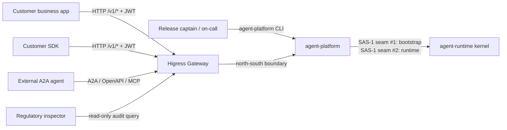
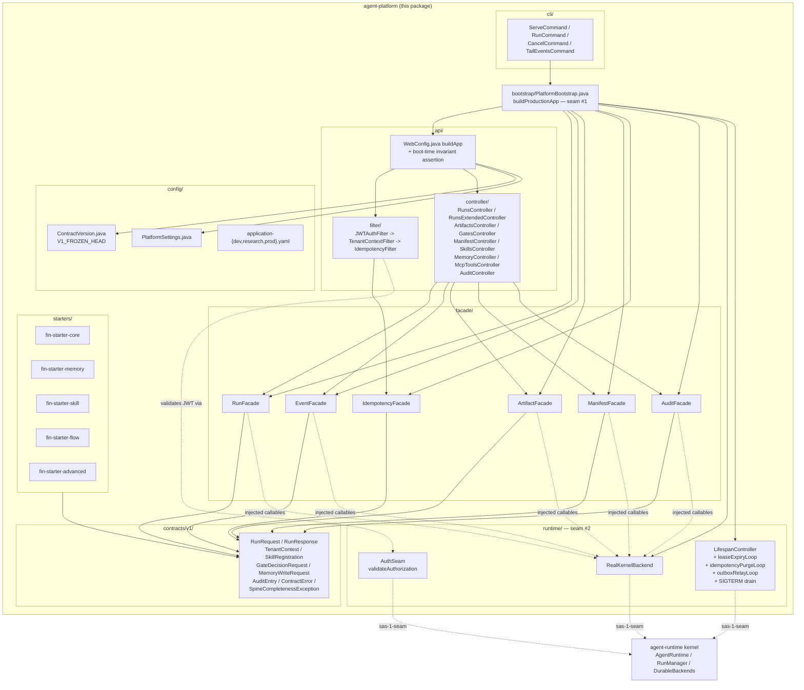
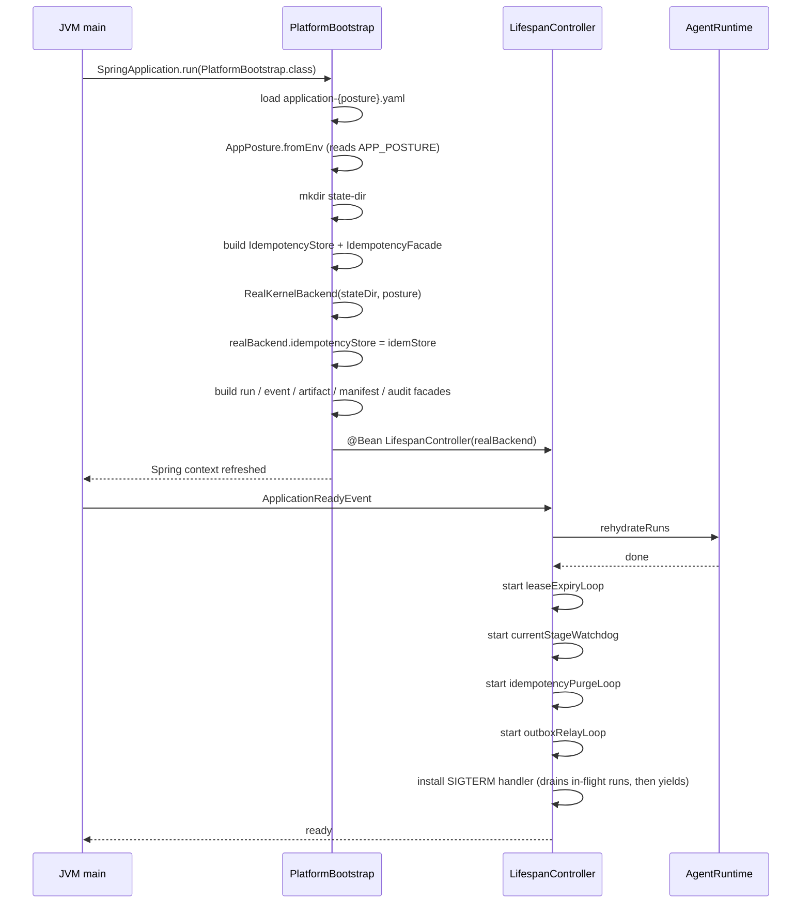

# agent-platform — Architecture (L1)

> **Last refreshed:** 2026-05-07. Pre-implementation v6.0.
> **Audience:** AS-CO / AS-RO / AS-DX owners, downstream contract consumers, release captains.
> **Status:** authoritative for the v1 northbound facade. Supersedes prose elsewhere. v1 contracts will be FROZEN at the first release SHA (`agent-platform/config/ContractVersion.java::V1_FROZEN_HEAD`).
>
> **Sub-package docs:**
> - [`api/ARCHITECTURE.md`](api/ARCHITECTURE.md) — HTTP transport (controllers + filter chain)
> - [`contracts/ARCHITECTURE.md`](contracts/ARCHITECTURE.md) — frozen v1 records + spine validation
> - [`facade/ARCHITECTURE.md`](facade/ARCHITECTURE.md) — contract↔kernel adapters (≤200 LOC each)
> - [`runtime/ARCHITECTURE.md`](runtime/ARCHITECTURE.md) — kernel binding seam + lifespan supervisor + auth
> - [`cli/ARCHITECTURE.md`](cli/ARCHITECTURE.md) — operator CLI via Spring Shell
> - [`config/ARCHITECTURE.md`](config/ARCHITECTURE.md) — settings + version pin
>
> **Up-references:**
> - L0 system boundary: [`../ARCHITECTURE.md`](../ARCHITECTURE.md)
> - Behavioural rules: [`../CLAUDE.md`](../CLAUDE.md)
> - Predecessor: `D:/chao_workspace/hi-agent/agent_server/ARCHITECTURE.md`

---

## 1. Purpose & Responsibilities

`agent-platform/` is the **versioned northbound HTTP facade** of the spring-ai-fin platform. It is the only contract surface that customer applications and SDKs depend on; direct imports of `agent-runtime.*` from customer code are unsupported and CI-rejected.

The package owns three boundaries simultaneously:

1. **Platform / business separation** (Rule 10). Domain logic, prompts, and business schemas live outside this repository. `agent-platform/` publishes only generic primitives — runs, events, artifacts, gates, manifests, MCP tools, skills, memory, audit.
2. **Versioned contract surface** (SAS-3). v1 will be RELEASED at the first stable SHA (`config/ContractVersion.java::V1_FROZEN_HEAD`); the digest will be re-rolled if additive changes (e.g., new `@PostConstruct` validators) are made — **never** if shapes change.
3. **SAS-1 single-seam discipline.** Only two locations under `agent-platform/` may import from `agent-runtime.*`: `bootstrap/` (assembly seam #1) and `runtime/` (kernel binding seam #2 + auth). Every other module talks to the runtime exclusively through facade-injected callables.

### Owns:

- HTTP route shape, request/response schemas — `api/`
- v1 contract version + freeze — `config/ContractVersion.java`
- JWT validation seam — `runtime/AuthSeam.java`
- Customer-facing Starters published to Maven Central — `starters/`
- Operator CLI (Spring Shell) — `cli/`
- Lifespan supervisor (background tasks: lease-expiry, watchdog, idempotency-purge, outbox-relay loop, SIGTERM drain) — `runtime/LifespanController.java`

### Does NOT own:

- Agent execution, memory, cognition (lives in `agent-runtime/`)
- Run lifecycle, durable persistence, event log (lives in `agent-runtime/server/`)
- Business logic, prompts, domain schemas (out-of-repo, customer's overlay or `fin-domain-pack/`)
- LLM provider transport (lives in `agent-runtime/llm/`)
- Framework-adapter dispatch logic (lives in `agent-runtime/adapters/`)

---

## 2. Context & Scope

`agent-platform/` sits between business-layer callers (customer applications, third-party SDKs, the operator CLI, external A2A agents, regulatory inspectors) and the cognitive runtime + inlined kernel under `agent-runtime/`. It exposes HTTP `/v1/*` plus a few non-versioned operator endpoints (`/health`, `/ready`, `/diagnostics`, `/actuator/prometheus`).



**External actors:**

- **Customer business app** — primary consumer. JWT-authenticated, tenant-scoped via `X-Tenant-Id`.
- **Customer SDK** (Java Starters, TypeScript wrapper) — same surface, same auth. Frozen contract grants SDK authors stability.
- **Operator** — local process via `agent-platform` CLI; same Spring Boot app via `bootstrap`.
- **External A2A agent** — third-party agent calling our routes; same JWT auth model.
- **Regulatory inspector** — read-only audit routes; dual-approved PII decode workflow.

**External dependencies:**

- **`agent-runtime/`** — same repo, same JVM, same process. Imported only at the two SAS-1 seams.
- **LLM providers** — outbound HTTPS from `agent-runtime/llm/`. `agent-platform/` never speaks to providers directly.
- **PostgreSQL** — local/networked durability owned by `agent-runtime/server/`.

---

## 3. Module Boundary & Dependencies

SAS-1 single-seam discipline:

```
agent-platform/            <- can NOT import agent-runtime.* anywhere except:
├── bootstrap/             [SEAM #1] assembly
│   └── PlatformBootstrap.java
└── runtime/               [SEAM #2] kernel binding + auth
    ├── RealKernelBackend.java         // sas-1-seam: real-kernel-binding
    ├── LifespanController.java        // sas-1-seam: real-kernel-binding (background tasks + SIGTERM drain)
    └── AuthSeam.java                  // sas-1-seam: JWT primitives
```

### Inbound dependencies (what depends on `agent-platform/`)

- `agent-runtime/` — none. Reverse imports are forbidden (SAS-2; `ArchitectureRulesTest::noReverseImports`).
- Tests under `tests/` and `examples/` may freely import.
- The `agent-platform` Spring Shell entry point (`mvn spring-boot:run` or `java -jar`) → `agent-platform/bootstrap/PlatformBootstrap.java`.
- Customer Starters (`fin-starter-*`) depend on `agent-platform/contracts/v1/` only.

### Outbound dependencies

- Spring Boot Web (`spring-boot-starter-web`) / Spring AI core — transport.
- `agent-runtime.posture.AppPosture` — read at `bootstrap/PlatformBootstrap.java` and at every facade enforcement call site (Rule 11).
- `agent-runtime.server.IdempotencyStore` — the persistent Postgres-backed store; built once in bootstrap, shared via DI.
- `agent-runtime.server.AgentRuntime` — the cognitive runtime; built once via `RealKernelBackend`, shared via DI.

### Rule 6 single-construction-path (agent-platform-relevant resources)

- `IdempotencyStore` — built by `PlatformBootstrap::idempotencyStore @Bean`; passed to `IdempotencyFacade` and surfaced on `RealKernelBackend.getIdempotencyStore()` so the lifespan purge loop can find it without poking `ApplicationContext`.
- `RealKernelBackend` — built by `PlatformBootstrap::realKernelBackend @Bean` exactly once.
- `AppPosture` — read by `AppPosture.fromEnv()` once in bootstrap, threaded into facades; contracts read it via `Environment.getProperty("APP_POSTURE")` directly so the `contracts/` module never imports `agent-runtime.posture`.

### Forbidden patterns (CI-blocked)

- `agent-platform/api/*` importing `agent-runtime.*`.
- `agent-platform/facade/*` importing `agent-runtime.*`.
- Inline fallbacks `x != null ? x : new DefaultX()` (Rule 6).
- Raw `EntityManager.persist` / `JdbcTemplate.update` in `@RestController` (SAS-9).

---

## 4. Building Blocks

| Component | Responsibility | Owner-track |
|---|---|---|
| `bootstrap/` | Assembly seam #1 — builds `IdempotencyStore`, picks backend (stub vs real), wires every facade, returns Spring `ApplicationContext` | AS-RO |
| `runtime/` | Seam #2 — `RealKernelBackend`, lifespan supervisor (purge loop + lease-expiry + watchdog + outbox relay + SIGTERM drain), JWT validation seam | AS-RO |
| `api/` | Spring Web `@RestController`s + filter chain; thin handlers, no kernel imports; boot-time invariant assertion (Rule 8 readiness) | AS-RO |
| `facade/` | Contract↔kernel adaptation; constructor-injected callables; ≤200 LOC each (SAS-8) | AS-RO |
| `contracts/` | Frozen v1 records + `SpineCompletenessException` + spine validators (`@PostConstruct`-style validation in record canonical constructors) | AS-CO |
| `config/` | `PlatformSettings`, `V1_RELEASED`, `V1_FROZEN_HEAD`, `application-{dev,research,prod}.yaml` | AS-CO |
| `cli/` | Spring Shell dispatcher (operator-facing): `serve`, `run`, `cancel`, `tail-events` | AS-DX |
| `starters/` | Customer-facing Starters: `fin-starter-{core,memory,skill,flow,advanced}` | AS-DX |



---

## 5. Runtime View — Key Scenarios

### 5.1 `POST /v1/runs` happy path

End-to-end through the filter chain.

```mermaid
sequenceDiagram
    participant C as Client
    participant J as JWTAuthFilter
    participant T as TenantContextFilter
    participant I as IdempotencyFilter
    participant R as RunsController
    participant F as RunFacade
    participant K as RealKernelBackend
    participant M as agent-runtime RunManager

    C->>J: POST /v1/runs (Bearer + X-Tenant-Id + Idempotency-Key + body)
    Note over J: research/prod validate HMAC<br/>dev passthrough; anonymous claims
    J->>T: forward (AuthClaims attached to request attribute)
    T->>T: validate X-Tenant-Id matches JWT claim<br/>emit tenant_context spine event
    T->>I: forward
    I->>I: facade.reserveOrReplay(tenantId, key, body)
    Note over I: emits springaifin_idempotency_{reserve,replay,conflict}_total
    alt new key
        I->>R: forward (created=true)
        R->>R: build RunRequest — spine validation
        R->>F: start(authCtx, RunRequest)
        F->>K: startRun(tenantId, profileId, goal, ...)
        K->>M: createRun(taskContract, workspace=tenantId)
        Note over M: auth-authoritative tenantId<br/>body mismatch -> TenantScopeException under strict<br/>WARNING + middleware-value-used under dev
        M-->>K: ManagedRun(state=queued)
        K-->>F: dict
        F-->>R: RunResponse
        R-->>I: 201 + JSON
        I->>I: facade.markComplete (replay cache populated)
        I-->>C: 201 Created
    else replay (same key + same body)
        I-->>C: cached 201 (byte-identical)
    else conflict (same key + different body)
        I-->>C: 409 Conflict
    end
```

### 5.2 Lifespan startup



### 5.3 Cancellation contract (Rule 8 step 6)

`POST /v1/runs/{id}/cancel` returns:

- **200** + drives the run to a terminal state when the run is known and live
- **404** when the run id is unknown — never silent 200
- **409** when the run is already terminal

This invariant is asserted on every release HEAD by `gate/check_cancel.sh`.

### 5.4 Audit dual-approval PII decode

(See L0 §5.5 for the cross-cutting flow.)

---

## 6. Cross-cutting Concerns

| Concern | Implementation |
|---|---|
| **Posture (Rule 11)** | `APP_POSTURE={dev,research,prod}` (default `dev`). Read once in bootstrap; threaded into facades; contracts read via `Environment.getProperty` to avoid importing `agent-runtime.posture`. Spring profile activation via `@Profile` tied to posture. |
| **Observability** | `/actuator/prometheus` exposes Micrometer families. `RunEventEmitter` (12 typed events) lives in `agent-runtime/observability/`. agent-platform emits idempotency metrics (`springaifin_idempotency_{reserve,replay,conflict,purge}_total{tenantId}`) and tenant-context spine events. |
| **Error envelope** | `agent-platform/contracts/v1/errors/ContractError.java` for all `/v1/*` errors. Categories: `validation`, `auth`, `tenantScope`, `idempotencyConflict`, `notFound`, `rateLimit`, `internal`, `spineCompleteness`. Spring `@ControllerAdvice` maps all exceptions. |
| **Contract spine (Rule 12)** | Every wire-crossing record in `contracts/` carries `tenantId`. Spine-bearing records validate at canonical-constructor time (Java 16+ records). Reference: `contracts/v1/run/RunRequest.java`. |
| **Idempotency** | Per-tenant key scope; cross-process replay via Postgres (not in-memory); 24h TTL with background purge; 4 Micrometer metrics; boot-time invariant for MCP/skills routes (asserts idempotency facade present). Contract: `contracts/v1/idempotency/IdempotencyResult.java`. |
| **Auth** | JWT HMAC at `JwtAuthFilter` (HMAC-SHA256). Secret from `APP_JWT_SECRET`. Dev posture passes through with anonymous claims; research/prod fail-closed. `AuthSeam.java` is the only `agent-platform/runtime/` file that imports `agent-runtime.auth.*`. |
| **Tenancy** | `TenantContextFilter` validates `X-Tenant-Id`; `request.attribute(TENANT_KEY)` carries `TenantContext`. Anti-forgery cross-check in `RunManager.createRun` — body's `tenantId` must match filter's; mismatch = 400 under strict. |
| **Resource lifetime (Rule 5)** | Single Reactor `Scheduler` per process. `WebClient` instances are `@Bean` singletons; never per-request. `IdempotencyStore` connection pool + background tasks (`leaseExpiryLoop`, `currentStageWatchdog`, `idempotencyPurgeLoop`, `outboxRelayLoop`) all bound to the LifespanController's executor. No `Mono.block()` outside CLI / tests / `main`. |

---

## 7. Architecture Decisions (key trade-offs)

The design decisions that have the largest blast radius today:

- **Two-seam SAS-1 split.** `bootstrap/` is the assembly seam; `runtime/` is the kernel-binding seam. Splitting kernel binding out of bootstrap keeps bootstrap from breaching its LOC budget while preserving "only two places import `agent-runtime.*`" as a CI invariant. Gate: `ArchitectureRulesTest::singleSeamDiscipline`.
- **Frozen-v1, parallel-v2 evolution** (SAS-3). Breaking changes go to `agent-platform/contracts/v2/`. This is asymmetric on purpose: customers MUST be able to pin to v1 across platform upgrades.
- **Posture in `Environment.getProperty` for contracts.** The `contracts/` package reads `APP_POSTURE` directly so it does not import `agent-runtime.posture`, preserving SAS-1 layering even with `@PostConstruct`-style validators in record canonical constructors.
- **Auth-authoritative tenantId.** When the body's `tenantId` differs from the filter's `X-Tenant-Id`, research/prod raises `TenantScopeException` (anti-forgery); dev logs WARNING and uses the filter value. Hi-agent's W35-T3 incident drove this.
- **Idempotency labels are raw `tenantId`.** Cardinality control is an ops-side concern (PromQL recording rules), not contract-side label rewriting. Hi-agent's W35-corrective C-1 drove this.
- **Spring Security off for v1.** The filter chain owns auth; Spring Security adds complexity without benefit for the frozen v1 surface. Revisit when OAuth2 resource-server features are needed.
- **Three-tier readiness (mirrors hi-agent Rule 14).** `raw_implementation_maturity` / `current_verified_readiness` / `seven_by_24_operational_readiness`. Headlines cite `current_verified_readiness` only. Score increases are computed from manifest facts, never hand-edited.
- **`@WriteSite(consistency=...)` annotation reflective check.** Every write site declares `OUTBOX_ASYNC` / `SYNC_SAGA` / `DIRECT_DB`. CI fails on unannotated writes (review H6 fix).

---

## 8. Quality Attributes

Mapped to L0 §8's 7-dimension scorecard for the `agent-platform/` slice:

| Dimension | What this package promises | How it is measured |
|---|---|---|
| **Execution** | `POST /v1/runs` survives restart; cancel is 200/404/409 (never silent 200) | `tests/integration/V1RunsRealKernelBindingIT`; `gate/check_cancel.sh` |
| **Memory** | `POST /v1/memory` accepts spine-validated records; tenant-partitioned at write | `tests/integration/RoutesSkillsMemoryIT`; `ContractSpineCompletenessTest` |
| **Capability** | `GET /v1/manifest` exposes the resolved posture + capability matrix | `tests/integration/RoutesManifestIT`; `ContractFreezeTest` |
| **Knowledge graph** | No v1 northbound route today; KG is exposed via `agent-platform/facade/` with future v2 path reserved | (deferred to v1.1) |
| **Planning** | TRACE S1–S5 stage events stream over `/v1/runs/{id}/events` (SSE live) | `tests/integration/V1SseLiveStreamIT`; `gate/check_lifecycle.sh` |
| **Artifact** | `POST/GET /v1/artifacts` per-tenant; idempotency contract frozen + observable | `tests/integration/RoutesArtifactsIT`; `IdempotencyMetricsIT` |
| **Evolution** | ExperimentStore + recurrence-ledger reachable via facades; spine validation across `RunFeedback`, `EvolveResult`, `EvolveChange` | `ContractSpineCompletenessTest`; recurrence-ledger consistency gate |
| **Cross-Run** | Lineage chain (parent_run_id + attempt_id bump on re-lease) + 24h idempotency TTL purge | `tests/integration/IdempotencyTtlPurgeIT`; `tests/unit/ReLeaseAttemptIdTest` |

---

## 9. Risks & Technical Debt

Open items tracked at the package level:

- **First implementation wave** — none of the above is coded yet. W1 plan: `docs/plans/W1-mvp-happy-path.md` (to be written).
- **`agent-platform/contracts/v2/` authoring guide** — drafted only when a breaking change is approved; not yet needed.
- **Streaming uploads via multipart** through `ArtifactFacade.register` — deferred to v1.1+.
- **Per-error-category metrics roll-up** — deferred.
- **Cross-process run sharing via external durable backend** — deferred; v1 architecture is single-process by design.
- **Boot-time assertions catalogue** — clones hi-agent's W35-T8 / W36-A5 work: assert `APP_JWT_SECRET` set under research/prod, state-dir writable, posture/backend compatible.

Allowlist entries: see `../docs/governance/allowlists.yaml`. Every entry carries owner / risk / reason / expiry_wave / replacement_test (Rule 17).

---

## 10. References

**Implementation entry points** (planned — not yet committed):

- `agent-platform/pom.xml` — Maven coordinates (`com.springaifin:agent-platform:1.0.0-SNAPSHOT`)
- `agent-platform/bootstrap/PlatformBootstrap.java` — `@SpringBootApplication`, `buildProductionApp` is the primary `@Bean` factory
- `agent-platform/api/WebConfig.java` — `buildApp` + boot-time invariant assertion
- `agent-platform/cli/CliApp.java` — `agent-platform` Spring Shell dispatcher
- `agent-platform/config/ContractVersion.java` — `V1_RELEASED`, `V1_FROZEN_HEAD`

**Sub-package architecture documents:**

- [`api/ARCHITECTURE.md`](api/ARCHITECTURE.md) — controllers + filter chain
- [`facade/ARCHITECTURE.md`](facade/ARCHITECTURE.md) — contract↔kernel adaptation (≤200 LOC each)
- [`contracts/ARCHITECTURE.md`](contracts/ARCHITECTURE.md) — frozen v1 schemas + spine validation
- [`runtime/ARCHITECTURE.md`](runtime/ARCHITECTURE.md) — real-kernel binding + auth seam + lifespan supervisor
- [`cli/ARCHITECTURE.md`](cli/ARCHITECTURE.md) — operator-facing CLI
- [`config/ARCHITECTURE.md`](config/ARCHITECTURE.md) — settings, version constants, contract freeze

**Kernel boundary** (cited because the facade adapts to these symbols):

- `agent-runtime/server/AgentRuntime.java`
- `agent-runtime/server/RunManager.java::createRun`
- `agent-runtime/server/IdempotencyStore.java::purgeExpired`
- `agent-runtime/observability/IdempotencyMetrics.java`

**Governance:**

- [`../CLAUDE.md`](../CLAUDE.md) — Rules 1–12, Three-Gate intake, owner-tracks
- [`../docs/governance/closure-taxonomy.md`](../docs/governance/closure-taxonomy.md) — Closure-claim levels
- [`../docs/governance/score_caps.yaml`](../docs/governance/score_caps.yaml) — readiness caps
- [`../docs/governance/contract_v1_freeze.json`](../docs/governance/contract_v1_freeze.json) — re-snapshotted on additive contract changes
