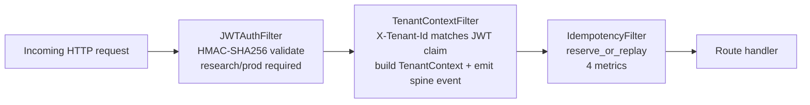

> **Pre-refresh design rationale (DEFERRED in 2026-05-08 refresh)**
> MERGED INTO `agent-platform/web/ARCHITECTURE.md`
> The authoritative L0 is `ARCHITECTURE.md`; the
> systems-engineering plan is `docs/plans/architecture-systems-engineering-plan.md`.
> This file is retained as v6 design rationale and will be
> archived under `docs/v6-rationale/` at W0 close.

# api -- HTTP Transport (L2)

> **L2 sub-architecture of `agent-platform/`.** Up: [`../ARCHITECTURE.md`](../ARCHITECTURE.md) . L0: [`../../ARCHITECTURE.md`](../../ARCHITECTURE.md)

---

## 1. Purpose & Boundary

`agent-platform/api/` owns the **HTTP transport layer**: Spring Web `@RestController`s and the filter chain. It does NOT own contract types (delegated to `../contracts/`), facade adaptation (delegated to `../facade/`), kernel binding (delegated to `../runtime/`), or background tasks (delegated to `../runtime/LifespanController.java`).

Route handlers are thin: parse -> dispatch to facade -> serialize. Tenant identity is read exclusively from filter-attached request attribute, never the request body.

Owns:

- 9 `@RestController` classes (one per major resource family)
- Filter chain (3 filters, ordered: JWTAuth -> TenantContext -> Idempotency)
- `@ControllerAdvice` for `ContractError` envelope mapping
- `WebConfig` + boot-time invariant assertion

Does NOT own:

- ChatClient or LLM call (delegated to `agent-runtime/llm/`)
- Spring Security configuration (off for v1; filter chain owns auth)
- WebSocket handlers (deferred to v1.1+; SSE only at v1)

---

## 2. Routes (frozen v1 surface)

| Resource | Method + Path | Owner |
|---|---|---|
| Run lifecycle | `POST /v1/runs` | RunsController |
| Run lifecycle | `GET /v1/runs/{id}` | RunsController |
| Run lifecycle | `POST /v1/runs/{id}/cancel` | RunsController |
| Run lifecycle | `POST /v1/runs/{id}/signal` | RunsController |
| Run streaming | `GET /v1/runs/{id}/events` | RunsExtendedController |
| Artifacts | `POST /v1/artifacts` | ArtifactsController |
| Artifacts | `GET /v1/artifacts/{id}` | ArtifactsController |
| Artifacts | `GET /v1/runs/{id}/artifacts` | ArtifactsController |
| Gates | `GET /v1/gates/{id}` | GatesController |
| Gates | `POST /v1/gates/{id}/decide` | GatesController |
| Manifest | `GET /v1/manifest` | ManifestController |
| Skills | `POST /v1/skills` | SkillsController (L1 stub at v1) |
| Skills | `GET /v1/skills` | SkillsController |
| Memory | `POST /v1/memory/write` | MemoryController (L1 stub at v1) |
| Memory | `GET /v1/memory/{key}` | MemoryController |
| MCP tools | `GET /v1/mcp/tools` | McpToolsController (L1 stub at v1) |
| MCP tools | `POST /v1/mcp/tools/{name}` | McpToolsController |
| Audit | `GET /v1/audit/{recordId}` | AuditController |
| Audit | `POST /v1/audit/decode` | AuditController (dual-approval) |
| Audit | `POST /v1/audit/decode/{requestId}/approve` | AuditController |
| Operator | `GET /health` | HealthController (Spring Boot Actuator) |
| Operator | `GET /ready` | ReadinessController |
| Operator | `GET /diagnostics` | DiagnosticsController |
| Operator | `GET /actuator/prometheus` | (Spring Boot Actuator) |

---

## 3. Filter chain (order matters)



**Why this order**:

1. **JWTAuth outermost**: cannot trust anything until JWT verified
2. **Tenant before idempotency**: idempotency keys are per-tenant; cross-tenant collision impossible by construction
3. **Idempotency before handler**: reservation MUST happen before any side effect

Spring Boot's `OncePerRequestFilter` order set explicitly via `@Order(10/20/30)` annotations.

---

## 4. Controllers -- design philosophy

### Thin handlers

Every `@RestController` method is <= 30 lines:

```java
@RestController
@RequestMapping("/v1/runs")
public class RunsController {
    private final RunFacade runFacade;
    
    // tdd-red-sha: <will be filled at first commit>
    @PostMapping
    public ResponseEntity<RunResponse> postRun(
            @RequestBody RunRequest body,
            @RequestAttribute(TENANT_KEY) TenantContext tenant,
            @RequestAttribute(IDEM_KEY) IdempotencyResult idem) {
        // SAS-4: tenant from request attribute, NEVER body
        var response = runFacade.start(tenant, body);
        return idem.cached() 
            ? ResponseEntity.status(idem.cachedStatus()).body(idem.cachedBody())
            : ResponseEntity.status(201).body(response);
    }
}
```

### SAS-4: tenant-from-attribute discipline

`@RequestAttribute(TENANT_KEY)` reads from filter-attached attribute. Body's `tenantId` is **also** populated by the JSON deserializer; the filter cross-checks. Any controller that reads tenant from body fails `RouteTenantContextTest`.

### SAS-9: no in-handler state mutation

Controllers MUST NOT call `EntityManager.persist`, `JdbcTemplate.update`, or any direct DB mutation. They delegate to facade. `RouteScopeTest` reflectively scans controllers and fails on direct DB access.

### SAS-5: TDD red-first annotation

Every new route handler carries `// tdd-red-sha: <commit-sha>` referencing the failing-test commit. `TddEvidenceTest` enforces.

### SAS-6: Documented routes

Every public route handler has Javadoc:

```java
/**
 * POST /v1/runs
 * Tenant scope: per-tenant via filter-attached TenantContext
 * Consistency: OUTBOX_ASYNC (run lifecycle event); facade may enter SYNC_SAGA
 * Posture: research/prod fail-closed on missing JWT or X-Tenant-Id
 * Idempotency: required; per-tenant key scope; 24h TTL
 */
```

`DocumentedRoutesTest` checks every controller method has the four required annotations in Javadoc.

### SAS-7: Route coverage

Every public route exercised by >=1 integration test using `WebTestClient`. `RouteCoverageTest` enumerates routes from `RequestMappingHandlerMapping` and asserts coverage.

---

## 5. Boot-time invariant assertion

`WebConfig.buildApp` asserts essential invariants at construction:

```java
@Configuration
public class WebConfig {
    @Bean
    @ConditionalOnProperty(name = "app.idempotency.required-routes-enabled", havingValue = "true", matchIfMissing = true)
    WebMvcConfigurer routeConfigurer(IdempotencyFacade facade) {
        Objects.requireNonNull(facade, 
            "IdempotencyFacade required for mutable routes. " +
            "Disable with app.idempotency.required-routes-enabled=false " +
            "OR provide an IdempotencyFacade @Bean.");
        return /* ... */;
    }
}
```

Mirrors hi-agent's W35-T8: fail-fast at boot rather than 500 at first request.

---

## 6. Architecture decisions

| ADR | Decision | Why |
|---|---|---|
| **AD-1: Spring Web (not WebFlux) for v1 facade** | Sync handler model | Spring Web is simpler; sync handler binds nicely to filter chain; reactive handler complexity unnecessary for v1 thin handlers. WebFlux used inside `agent-runtime/` for reactive resource lifetime |
| **AD-2: Filter chain, not Spring Security** | 3-filter custom chain | v1's auth + tenant + idempotency is simpler than Spring Security's many-method-many-annotation surface; revisit at v1.1 if OAuth2 resource-server features add value |
| **AD-3: SAS-4 tenant from attribute** | `@RequestAttribute(TENANT_KEY)`; never read body's tenantId | Body forgeable; filter is single trust origin |
| **AD-4: SAS-5 TDD-red-first** | `// tdd-red-sha:` annotation enforced by `TddEvidenceTest` | Discipline carryover from hi-agent's W31-N N.4 |
| **AD-5: SAS-9 no in-handler state mutation** | Controllers delegate to facade; RouteScopeTest enforces | Layering rule: controllers don't know about persistence |
| **AD-6: SSE for streaming, WebSocket deferred** | `text/event-stream` for `/v1/runs/{id}/events` | SSE is simpler, browser-friendly, http/2-compatible; WebSocket adds bidirectional which v1 doesn't need |
| **AD-7: Boot-time invariant** | Fail at construction if mutable routes lack idempotency | hi-agent W35-T8 lesson |
| **AD-8: ContractError envelope via `@ControllerAdvice`** | All exceptions -> `ContractError` JSON | Single error shape; reviewers grep error categories |

---

## 7. Cross-cutting hooks

- **Posture (Rule 11)**: `JWTAuthFilter` strict in research/prod; passthrough in dev
- **Spine (Rule 11)**: every `RunRequest` / `MemoryWriteRequest` etc. validated at canonical-constructor; spine completeness enforced
- **Resilience (Rule 7)**: filter failures emit `springaifin_filter_errors_total{filter, reason}` + WARNING
- **Operator-shape (Rule 8)**: every route exercised in OperatorShapeGate's N>=3 sequential runs

---

## 8. Quality

| Attribute | Target | Verification |
|---|---|---|
| Filter chain p95 latency | <= 5ms | OperatorShapeGate |
| All routes documented | 100% | DocumentedRoutesTest |
| All routes covered by integration test | 100% | RouteCoverageTest |
| All routes have TDD red-first SHA | 100% | TddEvidenceTest |
| Filter chain order respected | filter ordering 10/20/30 | `tests/unit/FilterOrderTest` |
| Cross-controller LOC budget | controllers <= 200 LOC | `RouteScopeTest` (controller LOC measure) |

---

## 9. Risks

- **Filter ordering bug**: ordering test catches; reviewer audit on every new filter
- **Spring Web migration to WebFlux**: deferred; if performance hits a wall, reactive handler considered
- **OAuth2 resource server**: deferred; current JWT HMAC sufficient for v1

## 10. References

- L1: [`../ARCHITECTURE.md`](../ARCHITECTURE.md)
- Contracts: [`../contracts/ARCHITECTURE.md`](../contracts/ARCHITECTURE.md)
- Hi-agent prior art: `D:/chao_workspace/hi-agent/agent_server/api/ARCHITECTURE.md`
