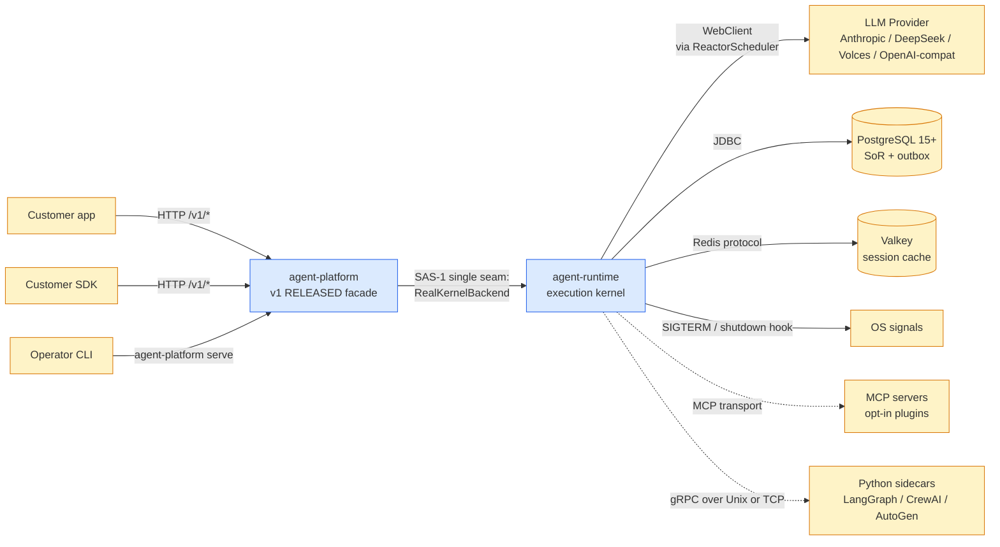
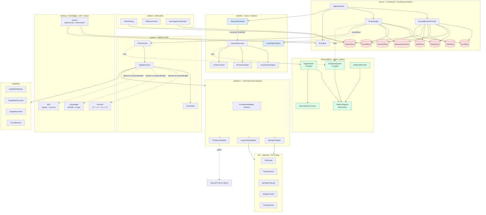
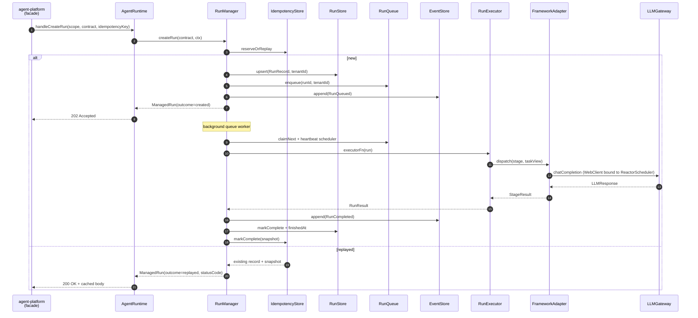
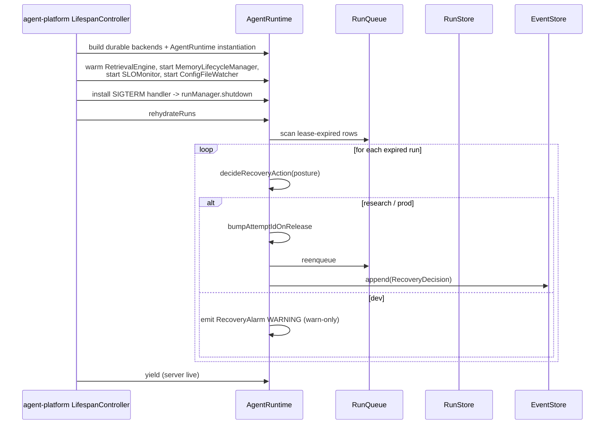

# agent-runtime -- Architecture (L1)

> **Last refreshed:** 2026-05-07. Pre-implementation v6.0.
> **Audience:** RO / TE / CO owners, platform engineers.
> **Status:** authoritative.
>
> **Sub-package docs:**
> - **[`action-guard/ARCHITECTURE.md`](action-guard/ARCHITECTURE.md) -- Unified action authorization pipeline (NEW 2026-05-08; addresses P0-1; status: design_accepted; tracked in `../docs/governance/architecture-status.yaml`)**
> - **[`audit/ARCHITECTURE.md`](audit/ARCHITECTURE.md) -- 5-class audit model + WORM (NEW 2026-05-08; addresses P0-8; status: design_accepted)**
> - [`runner/ARCHITECTURE.md`](runner/ARCHITECTURE.md) -- TRACE S1-S5 RunExecutor
> - [`llm/ARCHITECTURE.md`](llm/ARCHITECTURE.md) -- Spring AI ChatClient gateway, tier router, failover, budget
> - [`memory/ARCHITECTURE.md`](memory/ARCHITECTURE.md) -- L0 -> L1 -> L2 -> L3 progression
> - [`knowledge/ARCHITECTURE.md`](knowledge/ARCHITECTURE.md) -- JSONB glossary + 4-layer retrieval
> - [`skill/ARCHITECTURE.md`](skill/ARCHITECTURE.md) -- MCP tools + Spring AI Advisors
> - [`adapters/ARCHITECTURE.md`](adapters/ARCHITECTURE.md) -- Spring AI / LangChain4j / Python sidecar
> - [`observability/ARCHITECTURE.md`](observability/ARCHITECTURE.md) -- Micrometer + OpenTelemetry + spine
> - [`outbox/ARCHITECTURE.md`](outbox/ARCHITECTURE.md) -- Outbox + Sync-Saga + Direct-DB
> - [`posture/ARCHITECTURE.md`](posture/ARCHITECTURE.md) -- AppPosture
> - [`auth/ARCHITECTURE.md`](auth/ARCHITECTURE.md) -- JWT primitives
> - [`server/ARCHITECTURE.md`](server/ARCHITECTURE.md) -- AgentRuntime umbrella + RunManager + DurableBackends
> - [`runtime/ARCHITECTURE.md`](runtime/ARCHITECTURE.md) -- Reactor scheduler + harness + permission gate + evidence store
> - [`capability/ARCHITECTURE.md`](capability/ARCHITECTURE.md) -- registry + invoker + circuit breaker
> - [`evolve/ARCHITECTURE.md`](evolve/ARCHITECTURE.md) -- postmortem + experiments + champion/challenger
>
> **Up-references:**
> - L0 system boundary: [`../ARCHITECTURE.md`](../ARCHITECTURE.md)
> - Behavioural rules: [`../CLAUDE.md`](../CLAUDE.md)
> - Predecessor: `D:/chao_workspace/hi-agent/hi_agent/ARCHITECTURE.md`

---

## 1. Purpose & Responsibilities

`agent-runtime/` is the **platform execution kernel** of the spring-ai-fin stack. It owns the substrate that runs an agent task end-to-end: run lifecycle, durable persistence, async/reactive resource lifetimes, capability dispatch, observability spine, memory tiers, knowledge stores, skill ecosystem, LLM transport, and **multi-framework adapter dispatch**.

It is **not** the public surface. The frozen northbound HTTP contract lives in `agent-platform/` (v1 RELEASED at the first stable SHA). `agent-platform/` calls into `agent-runtime/` through exactly **two** seams: `agent-platform/runtime/RealKernelBackend.java` mounts `agent-runtime.server.AgentRuntime`, and `agent-platform/runtime/AuthSeam.java` mounts `agent-runtime.auth.JwtValidator`. No other module under `agent-platform/` is permitted to import `agent-runtime.*` (SAS-1, enforced by `ArchitectureRulesTest::singleSeamDiscipline`).

This split makes `agent-runtime/` free to evolve internal shapes wave over wave while `agent-platform/` remains contract-stable. The seam is one-directional: `agent-runtime/` never imports `agent-platform.*` (SAS-2).

### Owns:

- Run lifecycle state machine (`server/RunManager.java`)
- Durable persistence boundaries -- runs, events, idempotency, queue, sessions, gates, audit, outbox (`server/DurableBackends.java`)
- Async/reactive resource bridge (`runtime/ReactorScheduler.java`, Rule 5)
- Capability registry + invoker + circuit breaker + governance harness (`capability/`, `runtime/HarnessExecutor.java`)
- Unified action harness (governance, permission, evidence) (`runtime/`)
- LLM gateway with tier routing, failover, prompt cache, streaming (`llm/`)
- **Multi-framework adapter dispatch** (`adapters/`) -- Spring AI / LangChain4j / Python sidecar
- Observability spine -- 12 typed lifecycle events + 14 spine layers + Micrometer metrics + OpenTelemetry traces (`observability/`)
- Memory tiers L0-L3 + compression (`memory/`)
- Knowledge JSONB glossary + four-layer retrieval (`knowledge/`)
- Skill registry + version manager + champion/challenger (`skill/`)
- Outbox + Sync-Saga + Direct-DB write paths (`outbox/`)
- Posture model (`posture/`)
- JWT validation primitives (`auth/`)
- Postmortem + experiments + asset evolution (`evolve/`)

### Does not own:

- HTTP route shape, request/response schemas -- `agent-platform/api/`
- v1 contract version + freeze -- `agent-platform/config/ContractVersion.java`
- Customer-facing JWT issuance (we validate; we do not issue) -- customer's IdP
- Business-agent profiles (customer-owned) -- wired through `profileRegistry` from customer Starter
- Domain content (KYC rules, AML lists, FIBO ontology, regulator forms) -- out-of-repo `fin-domain-pack/`

---

## 2. Context & Scope



`agent-runtime/` runs entirely in-process. It has no inbound network surface of its own; every request reaches it through `agent-platform/`. Outbound dependencies are LLM providers (HTTPS via WebClient), Postgres + Valkey (JDBC + Redis protocol), MCP servers (stdio or HTTP), Python sidecars (gRPC), and process signals.

---

## 3. Module Boundary & Dependencies

| Sub-package | Owns | Lives at | Detail doc |
|---|---|---|---|
| `runner/` | TRACE S1-S5 RunExecutor; 6 durable states + 5 spans | `agent-runtime/runner/` | `runner/ARCHITECTURE.md` |
| `llm/` | LLMGateway over Spring AI ChatClient; tier router; failover; budget; prompt cache | `agent-runtime/llm/` | `llm/ARCHITECTURE.md` |
| `memory/` | L0 raw -> L1 compressed -> L2 mid-term -> L3 KG | `agent-runtime/memory/` | `memory/ARCHITECTURE.md` |
| `knowledge/` | JSONB glossary + four-layer retrieval | `agent-runtime/knowledge/` | `knowledge/ARCHITECTURE.md` |
| `skill/` | MCP tools + Spring AI Advisors; SkillVersionManager (A/B + Champion/Challenger) | `agent-runtime/skill/` | `skill/ARCHITECTURE.md` |
| `adapters/` | FrameworkAdapter interface + Spring AI / LangChain4j / Python sidecar implementations | `agent-runtime/adapters/` | `adapters/ARCHITECTURE.md` |
| `observability/` | Micrometer + OpenTelemetry + RunEventEmitter (12 events) + SpineEmitter (14 layers) + FallbackRecorder (Rule 7 four-prong) | `agent-runtime/observability/` | `observability/ARCHITECTURE.md` |
| `outbox/` | OutboxRelay + DebeziumFeed + SyncSagaOrchestrator | `agent-runtime/outbox/` | `outbox/ARCHITECTURE.md` |
| `posture/` | AppPosture (DEV / RESEARCH / PROD) | `agent-runtime/posture/` | `posture/ARCHITECTURE.md` |
| `auth/` | JwtValidator + AuthClaims | `agent-runtime/auth/` | `auth/ARCHITECTURE.md` |
| `server/` | AgentRuntime umbrella + RunManager + DurableBackends + stores | `agent-runtime/server/` | `server/ARCHITECTURE.md` |
| `runtime/` | ReactorScheduler + HarnessExecutor + PermissionGate + EvidenceStore | `agent-runtime/runtime/` | `runtime/ARCHITECTURE.md` |
| `capability/` | CapabilityRegistry (process-internal) + CapabilityInvoker + CircuitBreaker | `agent-runtime/capability/` | `capability/ARCHITECTURE.md` |
| `evolve/` | ExperimentStore + ChampionChallenger + PostmortemAnalyser | `agent-runtime/evolve/` | `evolve/ARCHITECTURE.md` |

### Public API surface (consumed by `agent-platform/runtime/`)

| Symbol | Purpose |
|---|---|
| `AgentRuntime` | Umbrella: `start()`, `stop()`, getters for `RunManager`, `EventStore`, `IdempotencyStore`, etc. |
| `RunManager` | `createRun(taskContract, ctx)`, `cancel(runId)`, `iterEvents(tenantId, runId)`, `rehydrateRuns()` |
| `JwtValidator` | `validateAuthorization(headers) -> AuthClaims` |
| `AppPosture` | `fromEnv()`, `requiresStrict()`, `requiresRealLLM()` |
| `LifespanController` (constructed by `agent-platform/runtime/`) | `startBackgroundTasks()`, `installSigtermHandler()` |

### Forbidden directionality

- `agent-platform/` -> `agent-runtime/` only via `agent-platform/runtime/RealKernelBackend.java`, `LifespanController.java`, `AuthSeam.java`, and `agent-platform/bootstrap/PlatformBootstrap.java` (SAS-1).
- `agent-runtime/` -> `agent-platform/` is a hard ban; CI fails on any such import (SAS-2).
- Sub-packages of `agent-runtime/` may depend across each other but the dependency graph must remain acyclic. The detail docs name allowed inbound edges per package.

---

## 4. Building Blocks



The **Single Construction Path** (Rule 6) for durable resources is `DurableBackends.build()` (`agent-runtime/server/DurableBackends.java`). Every consumer of a durable store receives it by injection; inline `x != null ? x : new DefaultX()` fallbacks are forbidden.

---

## 5. Runtime View -- Key Scenarios

### 5.1 Submit a run end-to-end (`POST /v1/runs`)



The reactive resource (`WebClient`) is constructed once on the ReactorScheduler and reused across every dispatch -- Rule 5's whole point. See `runtime/ARCHITECTURE.md` for the deep-dive on why this matters.

### 5.2 Lifespan startup + lease recovery



### 5.3 Per-store retention purge loop (mirrors hi-agent W36-A3)

```mermaid
sequenceDiagram
    participant Lifespan as agent-platform LifespanController
    participant Loop as @Scheduled purge method
    participant Store as Durable store
    participant Met as Micrometer

    Lifespan->>Loop: schedule with @Scheduled fixedRate
    loop every interval
        Loop->>Loop: fixedRate triggers
        Loop->>Store: purgeExpired(now)
        Store-->>Loop: deletedCount
        opt deleted >= 100
            Store->>Store: VACUUM (best-effort)
        end
        opt deleted > 0
            Loop->>Met: springaifin_<store>_purged_total{tenantId} += deleted
        end
    end
```

This shape clones hi-agent's `IdempotencyStore.purge_expired` reference impl and applies to every durable store: idempotency, events, audit, gates, sessions, outbox.

---

## 6. Cross-cutting Concerns

| Concern | Mechanism | Reference |
|---|---|---|
| **Posture-aware defaults** (Rule 11) | `AppPosture.fromEnv()`; `dev` permissive, `research`/`prod` fail-closed | `posture/AppPosture.java` |
| **Async resource lifetime** (Rule 5) | One persistent `Scheduler`; `Mono.block()` forbidden in library code | `runtime/ReactorScheduler.java` |
| **Single construction path** (Rule 6) | `DurableBackends.build` for stores; `SystemBuilder` for runtime; required-kwargs for scope | `server/DurableBackends.java`, `posture/AppPosture.java` |
| **Resilience without silence** (Rule 7) | Every fallback emits Counter + WARNING + fallbackEvent + gate-asserted | `observability/FallbackRecorder.java` |
| **Operator-shape gate** (Rule 8) | T3 evidence under `docs/delivery/`; gate scripts in `gate/` | `docs/governance/score_caps.yaml` |
| **Auth-authoritative tenantId** | TenantId sourced only from `agent-platform/auth`; `agent-runtime` never trusts request body | `agent-platform/auth/`, `server/RunManager.java` |
| **Contract spine** (Rule 11) | Every persistent record carries `tenantId`, `userId`, `sessionId`, `projectId`, `runId`, `parentRunId`, `attemptId`, `phaseId` | `runner/SpineValidator.java`, `RunRecord.@PostConstruct` |
| **Capability maturity** (Rule 12) | L0-L4 levels; default-on requires posture-aware default + observable fallbacks | `docs/governance/maturity-glossary.md` |
| **Manifest-truth releases** (Rule 14-equiv) | Closure notices derive from manifest; no claims pre-final-manifest | `gate/check_manifest_freshness.sh` |
| **Closure level taxonomy** (Rule 15-equiv) | `componentExists` -> `wired` -> `e2e` -> `verifiedAtReleaseHead` -> `operationallyObservable` | `docs/governance/closure-taxonomy.md` |
| **Test profile taxonomy** (Rule 16-equiv) | Maven profiles: smoke / default-offline / release / live-api / prod-e2e / soak / chaos | `pom.xml` profiles |
| **Allowlist discipline** (Rule 17-equiv) | Every silenced gate carries owner / risk / expiry_wave / replacement_test | `docs/governance/allowlists.yaml` |
| **WriteSite annotation** | Every write declares `OUTBOX_ASYNC` / `SYNC_SAGA` / `DIRECT_DB`; CI fails on unannotated writes | `runtime/WriteSiteAuditTest.java` |

---

## 7. Architecture Decisions

| ADR | Decision | Why |
|---|---|---|
| **SAS-1: Single seam** | Only `agent-platform/runtime/` and `agent-platform/bootstrap/` may import `agent-runtime.*` | Lets `agent-platform/` freeze its v1 contract while `agent-runtime/` evolves; one diff surface for breaking-change reviews |
| **Rule 5: ReactorScheduler** | One persistent `Scheduler` for the JVM, not `Mono.block()` per call | Reactive resources (`WebClient`) bound to a doomed dispatcher cause "Reactor dispatcher disposed" on retry; same failure class as hi-agent's 04-22 incident |
| **Rule 6: DurableBackends.build** | All durable stores constructed in one method; injected by name | Inline `x != null ? x : new DefaultX()` produces unshared in-memory copies (hi-agent DF-11 incident); single construction path eliminates the class |
| **Rule 7: Observable degradation** | Every fallback path = Micrometer counter + WARNING + `fallbackEvents` list + ship-gate assertion | Silent fallbacks were classified as "successful" runs while real signal was lost (hi-agent's pre-W12 lesson) |
| **Multi-framework via single `FrameworkAdapter` interface** | One interface dispatching to Spring AI / LangChain4j / Python sidecar | Customer's "support multiple frameworks" requirement honoured without polyglot in-process trapdoors |
| **Python sidecars OUT-OF-PROCESS only** | gRPC sidecar containers; no in-process Python in JVM | Polyglot in-process violates Rule 5 catastrophically -- Python event loop and JVM event loop cannot share resources |
| **OUTBOX_ASYNC + SYNC_SAGA + DIRECT_DB** | Three write paths, declared via `@WriteSite(consistency=...)` annotation | Outbox-as-universal punts the canonical financial transaction; explicit annotation makes consistency choice greppable + CI-enforced (review H6) |
| **Auth-authoritative tenantId** | TenantId sourced only from JWT in `agent-platform/auth/`; `agent-runtime` rejects request-body tenantId under research/prod | Request-body tenantId is bypassable; a single trust origin (JWT claim) is now the only legal source |
| **Idempotency TTL purge** | `IdempotencyStore.purgeExpired` + lifespan loop + `springaifin_idempotency_purged_total` | Reference implementation for all unbounded-growth stores; cloned across audit / events / gates / outbox / sessions |
| **L0-L4 capability maturity (Rule 12)** | Status reporting is L-numbered; L3 requires posture-aware default + observable fallbacks + doctor-check | "Production ready" claim without four-prong evidence is forbidden |

---

## 8. Quality Attributes

| Attribute | Target | How verified |
|---|---|---|
| **Run dispatch latency** | p95 <= `2x observed_p95` per Rule 8 step 3 | `docs/delivery/<date>-<sha>.md` gate run |
| **Cross-loop stability** | 3 sequential real-LLM runs reuse the same gateway/adapter | Rule 8 step 4 (ReactorScheduler guarantees this) |
| **Lifecycle observability** | `currentStage` non-null within 30s on every turn | Rule 8 step 5 |
| **Cancellation round-trip** | `POST /runs/{id}/cancel` on live run = 200; on unknown = 404 | Rule 8 step 6 |
| **Tenant isolation** | Every persistent row carries `tenantId`; cross-tenant read returns 404 | `ContractSpineCompletenessTest`, `RunRecord.@PostConstruct` |
| **Lint clean** | `mvn checkstyle:check` exits 0 | `.github/workflows/spring-ai-fin-rules.yml` |
| **Test honesty** | No mock on subsystem under test in integration tests | Rule 4 + manual review |
| **Architectural 7x24** | 5 assertions PASS at each release HEAD: cross-loop, lifespan, cancellation, spine real, chaos runtime-coupled | `docs/verification/<sha>-arch-7x24.json` |
| **Multi-framework dispatch** | All three adapters (Spring AI / LangChain4j / Python sidecar) pass operator-shape gate | `gate/check_adapter_dispatch.sh` |
| **Outbox vs Sync-Saga** | Every write annotated; CI fails on unannotated; saga compensation tested | `WriteSiteAuditTest`, `tests/integration/SyncSagaCompensationIT` |

---

## 9. Risks & Technical Debt

| Risk | Tracker | Plan |
|---|---|---|
| **No code yet** | -- | W1 deliverable: `POST /v1/runs` happy path under `dev` posture |
| **Multi-framework gRPC overhead p95** | (to be measured) | Operator-shape gate at W2; if > 100ms p95, defer Python sidecar to v1.1 |
| **Outbox + Sync-Saga overhead** | (to be measured) | Sync-saga adds round-trip latency; benchmark vs Postgres single-txn |
| **Boot-time assertions catalogue** | clones hi-agent's W36-A5 work | W2 deliverable: assert APP_JWT_SECRET, state-dir writable, posture/backend compat |
| **Reactor scheduler tuning** | thread count, queue capacity | W3 -- empirical tuning under operator-shape gate |
| **Memory L2/L3 deferred until traffic** | -- | v1.1 trigger: production trace volume warrants Dream consolidation |
| **MCP transport plugin model** | -- | v1 = stdio only; HTTP MCP transport in v1.1 |
| **EventBus is process-local** | -- | Multi-replica deployment requires every replica to wire the same event store; the bus does not federate. v1.1 if Kafka adopted |
| **Cross-process run sharing via external durable backend** | -- | Deferred to v1.1; current architecture is single-process by design |
| **Hot-reload of platform config** | -- | Currently restart-only; v1.1 candidate |

Allowlist entries: see `../docs/governance/allowlists.yaml`. Every entry carries owner, risk, reason, expiry_wave, replacement_test (Rule 17).

---

## 10. References

- Sub-package detail docs (see top of file for full list)
- Runtime layering rule: `runtime/ARCHITECTURE.md`
- Contracts: spine validation primitives in `runner/`
- Top-level system context: [`../ARCHITECTURE.md`](../ARCHITECTURE.md)
- Northbound facade: [`../agent-platform/ARCHITECTURE.md`](../agent-platform/ARCHITECTURE.md)
- CLAUDE.md: [`../CLAUDE.md`](../CLAUDE.md) -- Rules 1-12 + Three-Gate intake + owner-tracks
- Predecessor: `D:/chao_workspace/hi-agent/hi_agent/ARCHITECTURE.md`
- Roadmaps: `../docs/governance/retention-roadmap.md`, `../docs/governance/boot-time-assertions-roadmap.md`
- Gate scripts (planned): `../gate/check_layering.sh`, `../gate/run_t3_gate.sh`, `../gate/check_manifest_freshness.sh`, `../gate/check_contract_spine_completeness.sh`, `../gate/check_seam_isolation.sh`, `../gate/check_durable_wiring.sh`
