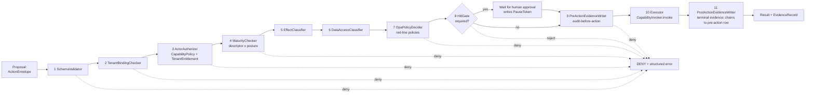

> **Pre-refresh design rationale (DEFERRED in 2026-05-08 refresh)**
> RENAMED to `agent-runtime/action/ARCHITECTURE.md` in the refresh. The 11-stage v6 design is collapsed to the 5-stage refresh design.
> The authoritative L0 is `ARCHITECTURE.md`; the
> systems-engineering plan is `docs/plans/architecture-systems-engineering-plan.md`.
> This file is retained as v6 design rationale and will be
> archived under `docs/v6-rationale/` at W0 close.

# action-guard -- Unified Action Authorization Pipeline (L2)

> **L2 sub-architecture of `agent-runtime/`.** Up: [`../ARCHITECTURE.md`](../ARCHITECTURE.md) . L0: [`../../ARCHITECTURE.md`](../../ARCHITECTURE.md)
>
> **Origin**: created 2026-05-08 in response to security review finding **P0-1**. ActionGuard is the unavoidable runtime path between every model/tool/framework output and every side-effectful execution.

---

## 1. Purpose & Boundary

`action-guard/` owns the **single unavoidable action-authorization pipeline**. Every action proposed by a model, framework adapter, or tool -- before it can produce any side effect -- passes through `ActionGuard.authorize(envelope)`. Code that reaches a side-effectful operation without passing through ActionGuard is a **CI-detected violation** (`ActionGuardCoverageTest`).

This is the architectural answer to the security reviewer's central observation: an agent system's dangerous moment is not the user prompt, it is **"model output -> tool call -> side effect"**. If every action path does not pass through the same gate, one adapter or one tool bridge becomes the bypass.

Owns:

- `ActionGuard` -- the pipeline orchestrator
- `ActionEnvelope` -- the typed proposal record passed through the pipeline
- `PolicyDecision` -- outcome record (approve / deny / require-hitl + rationale)
- `ActionGuardCoverageTest` -- reflective CI gate ensuring no side-effect site bypasses
- 11 pipeline stages (each pluggable via `@Bean`):
  1. `SchemaValidator`
  2. `TenantBindingChecker`
  3. `ActorAuthorizer` (consults CapabilityPolicy + TenantEntitlement)
  4. `MaturityChecker` (capability descriptor x posture)
  5. `EffectClassifier`
  6. `DataAccessClassifier`
  7. `OpaPolicyDecider` (OPA red-line)
  8. `HitlGate` (escalate to human if required)
  9. `PreActionEvidenceWriter` (audit-before-action; class-aware durability)
  10. `Executor` (delegates to CapabilityInvoker)
  11. `PostActionEvidenceWriter` (terminal evidence; chains back to pre-action row)

Does NOT own:

- Capability registry (delegated to `../capability/`)
- Skill metadata (delegated to `../skill/`)
- LLM transport (delegated to `../llm/`)
- Audit storage (delegated to `../audit/`)
- HITL gate primitive (delegated to existing `gate/` infrastructure; ActionGuard composes)

---

## 2. The dangerous moment

```
User / retrieved content / memory
  -> model output
  -> [SIDE-EFFECT BOUNDARY: ActionGuard.authorize REQUIRED]
  -> tool call
  -> side effect
```

Pre-v6.0 review, the architecture had:

- `CapabilityPolicy` -- RBAC at registry
- Skill dangerous-capability gate at LOAD time
- HarnessExecutor PermissionGate
- LLMGateway budget/failover
- HITL gate for irreversible

These are useful but each is individually addressable. An attacker exploiting prompt injection, retrieval poisoning, or malicious tool metadata could induce:

- A cross-tenant data lookup
- A PII decode request
- A network call to attacker infrastructure
- A filesystem write
- A non-idempotent transaction
- A framework fallback that changes execution semantics

If even one path skips one gate, the architecture's defence is the maximum, not the minimum, of the gate set. **ActionGuard makes the pipeline the minimum: every action passes through every gate.**

---

## 3. ActionEnvelope (the contract)

```java
public record ActionEnvelope(
    @NonNull String tenantId,
    @NonNull String actorUserId,
    @NonNull String runId,
    @NonNull String capabilityName,
    @NonNull String toolName,
    @NonNull EffectClass effectClass,           // READ_ONLY / IDEMPOTENT_WRITE / NON_IDEMPOTENT
    @NonNull RiskClass riskClass,               // LOW / MEDIUM / HIGH
    @NonNull DataAccessClass dataAccessClass,   // PUBLIC / TENANT_INTERNAL / PII / FINANCIAL_LEDGER
    @NonNull String resourceScope,              // e.g., "account:1234567890" or "knowledge:tenant-bank-a:kyc-glossary"
    @NonNull String argumentsHash,              // SHA-256 of serialized args; for replay + audit
    @NonNull ProposalSource proposalSource,     // LLM_OUTPUT / FRAMEWORK_ADAPTER / DEVELOPER_DIRECT / OPERATOR_CLI
    @NonNull TaintLevel proposalTaint,          // TRUSTED / ATTRIBUTED_USER / UNTRUSTED / ADVERSARIAL_SUSPECTED
    @Nullable String policyDecisionId,          // populated by OpaPolicyDecider
    @Nullable String approvalId,                // populated by HitlGate if approved
    @Nullable String preActionEvidenceId        // populated by PreActionEvidenceWriter; chained by PostActionEvidenceWriter
) {
    public ActionEnvelope {
        // Constructor canonical validation:
        // - All non-nullable fields validated
        // - argumentsHash matches re-hash of args (anti-tampering check)
        // - tenantId non-blank under research/prod (Rule 11 spine)
    }
}

public enum EffectClass { READ_ONLY, IDEMPOTENT_WRITE, NON_IDEMPOTENT }
public enum RiskClass { LOW, MEDIUM, HIGH }
public enum DataAccessClass { PUBLIC, TENANT_INTERNAL, PII, FINANCIAL_LEDGER }
public enum ProposalSource { LLM_OUTPUT, FRAMEWORK_ADAPTER, DEVELOPER_DIRECT, OPERATOR_CLI }
public enum TaintLevel { TRUSTED, ATTRIBUTED_USER, UNTRUSTED, ADVERSARIAL_SUSPECTED }
```

---

## 4. The pipeline



### Stage 1: SchemaValidator

Validates `argumentsJson` against `CapabilityDescriptor.argsSchema` (JSON-Schema). Rejects:
- Wrong types
- Missing required fields
- Unknown fields (additionalProperties=false)
- Patterns (e.g., account-id format)

### Stage 2: TenantBindingChecker

Validates `envelope.tenantId == ctx.tenantContext.tenantId`. Rejects mismatch under research/prod (`TenantBindingException`); warns under dev. **This is the explicit fix for Attack Path B** (cross-tenant leak via sidecar metadata loss).

### Stage 3: ActorAuthorizer

Two-tier check (addresses P1-7; status: design_accepted):

1. **RBAC**: `CapabilityPolicy.canRoleInvoke(actor.roles, capabilityName)` -- does the actor's role permit this capability?
2. **TenantEntitlement**: `TenantEntitlementStore.isGranted(tenantId, capabilityName)` -- has the tenant been granted access?

BOTH must pass. Default-deny.

### Stage 4: MaturityChecker

Reads `CapabilityDescriptor.maturityLevel` and `availableInDev/Research/Prod` flags. Rejects if posture forbids capability at current maturity level. Closes the v6.0 capability descriptor -> posture interaction.

### Stage 5: EffectClassifier

Reads `descriptor.effectClass`; cross-checks against envelope. If envelope says READ_ONLY but descriptor says NON_IDEMPOTENT -> reject (anti-tampering). The descriptor is authoritative.

### Stage 6: DataAccessClassifier

Reads `descriptor.dataAccessClass` and any `resourceScope`-derived class. If accessing PII or FINANCIAL_LEDGER:
- DataAccessClass = PII -> require dual-approval workflow integration (P0-8 PII_ACCESS audit class)
- DataAccessClass = FINANCIAL_LEDGER -> cross-check against `FinancialWriteClass` (P0-10)

### Stage 7: OpaPolicyDecider

Sends envelope to OPA red-line policy engine. Policies are versioned in `agent-platform/contracts/v1/policies/`. Decision returned with `policyDecisionId` for audit. Common policies:

```rego
# Example: deny PII decode without dual approval evidence
package springAiAscend.actions.pii_decode

default allow = false

allow {
    input.envelope.dataAccessClass == "PII"
    input.envelope.approvalId != null
    valid_dual_approval(input.envelope.approvalId)
}

# Example: deny non-idempotent action without idempotency key
package springAiAscend.actions.idempotency

default allow = false

allow {
    input.envelope.effectClass != "NON_IDEMPOTENT"
}

allow {
    input.envelope.effectClass == "NON_IDEMPOTENT"
    input.envelope.argumentsHash != ""  # idempotency key derivable from args hash
}
```

Adds the policy decision id to the envelope for the next stage.

### Stage 8: HitlGate

If `descriptor.requiresHumanGate || (effectClass == NON_IDEMPOTENT && posture == prod) || riskClass == HIGH`:
- Issue `PauseToken` linking the run to the gate
- Wait for human decision via `POST /v1/gates/{id}/decide`
- If decided=APPROVE: continue; envelope.approvalId populated
- If decided=REJECT: deny with structured error; emit `SECURITY_EVENT` audit
- If timeout: emit alarm; per posture, fail-closed or revert to safe default

### Stage 9: PreActionEvidenceWriter (audit-before-action)

Decides what evidence MUST be persisted **before** the side-effect runs. Calls `AuditFacade.write(entry)` where `entry.auditClass` is computed from envelope:

| Envelope condition | Audit class | Persistence requirement | On audit-write failure |
|---|---|---|---|
| `dataAccessClass == PII` | `PII_ACCESS` | MUST persist before reveal | Action denied; plaintext never returned (P0-8) |
| `dataAccessClass == FINANCIAL_LEDGER` AND `effectClass != READ_ONLY` AND `financialClass != ADVISORY_ONLY` | `FINANCIAL_ACTION` | MUST persist in same DB transaction OR same saga journal as the action (see `../audit/` AD-3) | Rollback; commit blocked |
| `dataAccessClass == FINANCIAL_LEDGER` AND `financialClass == ADVISORY_ONLY` | `SECURITY_EVENT` | MUST persist or block in research/prod | Alarm; in prod the action that triggered the event also blocks |
| HitlGate produced an approval | `SECURITY_EVENT` | MUST persist or block in research/prod | Alarm; in prod block |
| TELEMETRY-only path (no PII / no financial / no HITL) | `TELEMETRY` | Best effort | Log-only; action proceeds |

The `preActionEvidenceId` is written into the envelope for chaining at Stage 11.

### Stage 10: Executor

Delegates to `CapabilityInvoker.invoke(envelope, args)`. The invoker carries policy + circuit breaker + timeout + retry as before. Exceptions surface to the orchestrator with the original envelope; PostActionEvidenceWriter still runs to record the failure.

### Stage 11: PostActionEvidenceWriter (terminal evidence)

Records the **terminal** outcome: success, business-failure, or exception. Always chains the entry to `envelope.preActionEvidenceId` so the audit trail is contiguous.

| Outcome | Audit class (terminal) | Notes |
|---|---|---|
| Success and pre-action class was PII_ACCESS | `PII_ACCESS` (terminal) | Records what was actually revealed (token / hash, not plaintext) and decode TTL |
| Success and pre-action class was FINANCIAL_ACTION | `FINANCIAL_ACTION` (terminal) | Records ledger entry id + journal id; in same saga transaction as the action |
| Success and pre-action class was SECURITY_EVENT | `SECURITY_EVENT` (terminal) | Records the executed effect summary |
| Failure (any class) | original class (terminal failure) | Records exception class + redacted message; pre-action chain preserved so the failed authorization is permanently auditable |

PostActionEvidenceWriter MUST NOT be skipped on Executor failure; the audit trail's value is precisely that failures are recorded with the same fidelity as successes.

---

## 5. ActionGuard coverage enforcement

Every side-effectful operation in `agent-runtime/` is required to enter through `ActionGuard.authorize(envelope)`. The CI gate `ActionGuardCoverageTest`:

1. Reflectively walks classes with `@Bean` `CapabilityInvoker`
2. Walks framework adapters in `adapters/`
3. Walks MCP tool bridge in `skill/McpToolBridge`
4. Walks Spring AI Advisors that produce tool calls
5. Asserts every entry path passes through `ActionGuard.authorize` (verified by static analysis or at-runtime spy in test profile)

Any side-effect site outside ActionGuard fails CI.

---

## 6. Architecture decisions

| ADR | Decision | Why |
|---|---|---|
| **AD-1: Single mandatory pipeline** | Every action passes ActionGuard | addresses P0-1 (status: design_accepted); minimum-of-gates not maximum |
| **AD-2: 11 pluggable stages, ordered, evidence split into pre/post** | Each stage has a typed responsibility; PreActionEvidenceWriter (9), Executor (10), PostActionEvidenceWriter (11) are explicit and separate stages | Composability + audit clarity; reordering = explicit ADR; audit-before-action is a structural property of the pipeline, not a stage-internal switch |
| **AD-3: Audit-before-action for PII/financial** | PreActionEvidenceWriter writes BEFORE Executor; failure denies the action | addresses P0-8 (status: design_accepted); "PII decode cannot return plaintext if audit fails" |
| **AD-4: Default-deny at every stage** | Any stage reject = action denied | Fail-closed by construction |
| **AD-5: OPA for red-line policies** | Externalized; versioned | Compliance team can author policies without platform code change |
| **AD-6: ProposalSource carries taint** | LLM_OUTPUT default UNTRUSTED | Closes Attack Path A |
| **AD-7: argumentsHash anti-tampering** | Hash re-validated; mismatch = reject | Prevents post-authorization argument substitution |
| **AD-8: HitlGate is composed not embedded** | Existing `gate/` primitive | Avoid duplicate HITL implementations |
| **AD-9: ActionGuardCoverageTest is CI-blocking** | Reflective coverage check | Closes "one bypass = whole defence falls" |
| **AD-10: Posture-dependent gate strictness** | dev permissive (warn); research/prod fail-closed | Mirrors Rule 11 |
| **AD-11: PostActionEvidenceWriter runs on failure too** | Terminal evidence is unconditional | The audit trail's value is in capturing failures as faithfully as successes |

---

## 7. Cross-cutting hooks

- **Rule 1 strongest interpretation**: deny-by-default; ambiguous request = reject
- **Rule 6**: ActionGuard built once via `@Bean`; stages each `@Bean`
- **Rule 7**: every stage rejection emits Counter + WARNING + envelope serialized to fallbackEvents
- **Rule 8**: ActionGuardCoverageTest is part of operator-shape gate
- **Rule 11**: ActionGuard is THE Rule 11 enforcement point at runtime
- **Rule 12**: capability maturity gate is stage 4

---

## 8. Quality

| Attribute | Target | Verification |
|---|---|---|
| Pipeline latency overhead | <= 12ms p95 (11 stages incl. audit dual write) | `tests/integration/ActionGuardLatencyIT` |
| Coverage of side-effect sites | 100% | `ActionGuardCoverageTest` (CI gate) |
| Cross-tenant rejection | 100% under research/prod | `tests/integration/CrossTenantActionGuardIT` |
| OPA decision latency | <= 5ms p95 | `tests/integration/OpaPolicyLatencyIT` |
| Audit-before-action correctness | PII decode without successful audit = no plaintext | `tests/integration/AuditBeforeActionIT` |
| Anti-tampering hash check | argument substitution = rejected | `tests/integration/ArgumentsHashTamperingIT` |
| Pre/post evidence chaining | every terminal entry references its pre-action entry id | `tests/integration/EvidenceChainContiguityIT` |
| Terminal evidence on failure | Executor exception still produces a PostActionEvidenceWriter entry | `tests/integration/PostEvidenceOnFailureIT` |

### Reviewer's acceptance tests (all adopted)

| Test | Expected |
|---|---|
| LLM attempts `shell.exec` without permission | rejected at stage 3 (ActorAuthorizer) |
| Retrieved content instructs model to call PII decode | rejected at stage 7 (OpaPolicyDecider) unless dual approval; HitlGate at stage 8 |
| Adapter-generated tool call without tenantId | rejected at stage 1 (SchemaValidator) or 2 (TenantBindingChecker) |
| Tool call with valid schema but wrong tenant resource | rejected at stage 2 (TenantBindingChecker) |
| Non-idempotent action without idempotency key | rejected at stage 7 (OpaPolicyDecider) |
| PII decode whose audit write fails | denied at stage 9 (PreActionEvidenceWriter); plaintext never returned |
| Financial action that succeeds | post-action entry chains to pre-action entry; both in same saga |

---

## 9. Risks & Technical Debt

- **Pipeline latency**: 11 stages add overhead; profiled at <12ms p95; if measured higher in operator-shape gate, parallelize stages 1-6 (independent) or remove non-critical stages
- **OPA dependency**: introduces external policy engine; pin OPA version; alternative is an in-process Rego runtime
- **HitlGate timeout policy**: per-posture; default 24h research, 4h prod; configurable per capability
- **Posture-aware gate strictness**: reviewer audit on every gate addition
- **Audit dual-write cost**: pre + post evidence doubles audit volume; PII/financial paths require it; TELEMETRY-only paths skip pre-action and may merge post-action with terminal counter

---

## 10. References

- L1: [`../ARCHITECTURE.md`](../ARCHITECTURE.md)
- Capability registry: [`../capability/ARCHITECTURE.md`](../capability/ARCHITECTURE.md)
- Skill: [`../skill/ARCHITECTURE.md`](../skill/ARCHITECTURE.md)
- LLM gateway (proposal source): [`../llm/ARCHITECTURE.md`](../llm/ARCHITECTURE.md)
- Audit (evidence writer): [`../audit/ARCHITECTURE.md`](../audit/ARCHITECTURE.md)
- Outbox financial write classes: [`../outbox/ARCHITECTURE.md`](../outbox/ARCHITECTURE.md)
- Security review: [`../../docs/deep-architecture-security-assessment-2026-05-07.en.md`](../../docs/deep-architecture-security-assessment-2026-05-07.en.md) sec-P0-1
- Response: [`../../docs/security-response-2026-05-08.md`](../../docs/security-response-2026-05-08.md) sec-P0-1
- Systematic-architecture-improvement-plan: [`../../docs/systematic-architecture-improvement-plan-2026-05-07.en.md`](../../docs/systematic-architecture-improvement-plan-2026-05-07.en.md) sec-4.5
- OPA: https://www.openpolicyagent.org/
