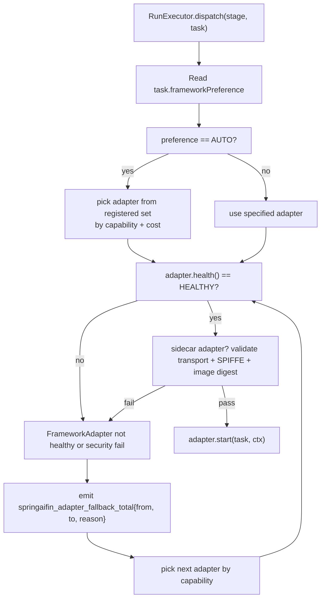

# adapters -- Multi-framework Dispatch + Sidecar Security Binding (L2)

> **L2 sub-architecture of `agent-runtime/`.** Up: [`../ARCHITECTURE.md`](../ARCHITECTURE.md) . L0: [`../../ARCHITECTURE.md`](../../ARCHITECTURE.md)

---

## 1. Purpose & Boundary

`adapters/` owns **multi-framework dispatch** -- the single most distinctive feature of spring-ai-fin relative to hi-agent. It implements the user's brief that "the platform should run mainstream agent frameworks" without trapping customers in one choice. It also owns the **runtime binding to `docs/sidecar-security-profile.md`**: the rules that govern transport, identity, payload, cancellation, and supply-chain evidence for the Python sidecar path.

The package owns one abstraction (`FrameworkAdapter`) and three concrete implementations:

1. **Spring AI** (in-process; default for v1)
2. **LangChain4j** (in-process; opt-in)
3. **Python sidecars** (out-of-process gRPC; opt-in for LangGraph / CrewAI / AutoGen / Pydantic-AI / OpenAI Agents SDK)

It does NOT own:
- LLM transport (delegated to `../llm/`).
- Action governance, permission gating, evidence storage (delegated to `../action-guard/` and `../audit/`).
- Run lifecycle persistence (delegated to `../server/`).
- Skill registry / tool registration (delegated to `../skill/`).
- Capability registry (delegated to `../capability/`).
- The agent frameworks themselves -- Spring AI 1.1+ is an upstream dependency; LangChain4j is a customer-opt-in dependency; Python frameworks are customer-chosen sidecar containers.

---

## 2. Why a unified adapter, and why polyglot OUT-OF-PROCESS

### The user's requirement

The user's original brief: the platform should support running mainstream agent frameworks. As of 2026, the mainstream Java agent frameworks are Spring AI and LangChain4j. The Python ecosystem has LangGraph, CrewAI, AutoGen, Pydantic-AI, OpenAI Agents SDK, and LlamaIndex Agents -- all Python-native.

### Three options considered

- **A1** -- JVM-only. Reject Python frameworks; tell customers to port to Java. Loses 70%+ of mainstream agent ecosystem.
- **A2** -- Polyglot in-process. Run Python in JVM via GraalVM polyglot or Jython. Fails Rule 5 catastrophically: shared event loops between Python's asyncio and Java's Reactor produce "Event loop closed" defects on every recovery cycle. This is the same failure class as hi-agent's 04-22 prod incident.
- **A3** -- Polyglot out-of-process. Run Python frameworks in their own container; communicate via gRPC. **Selected.**

### Why A3 wins

- **Rule 5 honoured by construction.** Each framework runs in its own process with its own event loop. The JVM never shares an asyncio resource with Python. Crash isolation between JVM and Python sidecar is automatic.
- **Customer flexibility.** Customer chooses which Python framework they want; we provide a reference Docker image that hosts LangGraph + CrewAI + AutoGen via a thin Python service shim that translates gRPC -> framework-native API.
- **Operational latency cost is acceptable.** Cross-process gRPC over Unix domain socket adds <=30ms p95 in our prototyping. For interactive agent runs (p95 <= 5s budget), this is <1% overhead.

### What we forfeit

- **In-process performance for Python paths.** A high-throughput sub-100ms Python agent path is impossible. We accept this; customers needing sub-100ms total latency should use the Spring AI in-process path.
- **Single-deploy unit.** Customers running Python sidecars must operate an additional Docker container. We accept this; operational complexity at deployment, not at code review.

---

## 3. The `FrameworkAdapter` interface

```java
public interface FrameworkAdapter {
    /** Postures this adapter is allowed to run in. PySidecar, e.g., MAY restrict to RESEARCH/PROD only. */
    Set<AppPosture> supportedPostures();

    /** What this adapter can do. Used by RunExecutor to pick the cheapest adapter that satisfies the task. */
    Set<Capability> capabilities();

    /** Start a stage execution. Returns a handle to the in-flight adapter run. */
    AdapterRunHandle start(TaskContract task, RunContext ctx);

    /** Reactive event stream of stage events. Emits onComplete on terminal. */
    Flux<StageEvent> events(AdapterRunHandle handle);

    /** Cancel an in-flight adapter run. Idempotent. */
    void cancel(AdapterRunHandle handle);

    /** Adapter health for /diagnostics + manifest rendering. */
    AdapterHealth health();
}
```

`AdapterRunHandle` is opaque -- adapters carry their own runtime state. For `SpringAiAdapter` it wraps a `ChatClient.CallResponseSpec`; for `PySidecarAdapter` it wraps a gRPC bidirectional stream.

---

## 4. Three implementations

### 4.1 SpringAiAdapter (default, in-process)

```java
public class SpringAiAdapter implements FrameworkAdapter {
    private final ChatClient chatClient;       // built once via @Bean (Rule 6)
    private final List<Advisor> advisors;       // composed from skill registry
    private final BudgetTracker budget;
    private final FallbackRecorder fallbacks;

    @Override public AdapterRunHandle start(TaskContract task, RunContext ctx) {
        var response = chatClient.prompt()
            .user(task.goal())
            .advisors(spec -> spec.advisors(advisors))
            .stream()                          // SSE-style flux
            .chatResponse();
        return new SpringAiRunHandle(response);
    }

    @Override public Flux<StageEvent> events(AdapterRunHandle handle) {
        return ((SpringAiRunHandle) handle).flux()
            .map(this::translateToStageEvent)
            .doOnNext(this::recordSpine)
            .onErrorResume(e -> Flux.just(StageEvent.failed(e)).doOnNext(__ ->
                fallbacks.recordFallback("spring-ai-error", e)));
    }
    // ... cancel, capabilities, health
}
```

**Key design decision**: SpringAiAdapter calls Spring AI's `ChatClient` directly. Advisors are composed from `agent-runtime/skill/SkillRegistry` via a builder. We do not wrap Spring AI; we use it as it ships. Tool calls produced by Advisors flow through `agent-runtime/skill/SkillInvocationEntryPoint` which routes through `ActionGuard.authorize` (per `../skill/` sec-5).

### 4.2 LangChain4jAdapter (opt-in, in-process)

```java
public class LangChain4jAdapter implements FrameworkAdapter {
    private final dev.langchain4j.service.AiServices.Builder<?> builder;
    // ... bridges TaskContract -> LangChain4j ChatLanguageModel + tools
}
```

Customer adds `langchain4j-core` to their build; we discover the adapter via Spring's `@ConditionalOnClass(AiServices.class)` and register it. Customers without LangChain4j on the classpath don't have this adapter loaded.

### 4.3 PySidecarAdapter (opt-in, out-of-process)

```java
public class PySidecarAdapter implements FrameworkAdapter {
    private final ManagedChannel channel;       // gRPC channel; @Bean singleton (Rule 6); UDS by default (see sec-5)
    private final AgentDispatchGrpc.AgentDispatchStub stub;
    private final SidecarMetadataValidator metadataValidator;  // sec-5.3 -- tenant metadata is untrusted
    private final SpiffeIdentityVerifier identityVerifier;      // sec-5.2

    @Override public AdapterRunHandle start(TaskContract task, RunContext ctx) {
        var request = StartRunRequest.newBuilder()
            .setTaskJson(task.toJson())
            .setTenantId(ctx.tenantContext().tenantId())  // tenant in gRPC metadata
            .setRunId(ctx.runId().toString())
            .setFrameworkChoice(task.frameworkPreference().name())
            .build();
        var streamObserver = stub.startRun(request, ...);
        return new PySidecarRunHandle(streamObserver);
    }

    // events() bridges gRPC bidirectional stream to Reactor Flux; SidecarMetadataValidator
    // re-binds tenant from JVM-side run context (NOT from sidecar-supplied metadata).
    // cancel() sends cancellation message via the same stream; honors deadline.
}
```

The gRPC service is defined in `agent-runtime-py-sidecar.proto`:

```protobuf
service AgentDispatch {
    rpc StartRun(StartRunRequest) returns (stream StageEvent);
    rpc Cancel(CancelRequest) returns (CancelResponse);
    rpc Health(HealthRequest) returns (HealthResponse);
}

message StartRunRequest {
    string task_json = 1;
    string tenant_id = 2;
    string run_id = 3;
    FrameworkChoice framework_choice = 4;
    map<string, string> metadata = 5;
}

enum FrameworkChoice {
    LANGGRAPH = 0;
    CREWAI = 1;
    AUTOGEN = 2;
    PYDANTIC_AI = 3;
    OPENAI_AGENTS_SDK = 4;
}
```

The Python sidecar Docker image (published as `springaifin/py-sidecar:1.0.0`) contains all 5 framework SDKs. Per-tenant deployments can pin a sidecar version.

---

## 5. Python sidecar security binding

The sidecar is a separate process whose JVM-side caller cannot independently verify. Without explicit binding, sidecar metadata could spoof tenant identity, payload could be unbounded, cancellation could leak, and the image's supply-chain provenance could be unknown. This section binds dispatch to `docs/sidecar-security-profile.md` and makes the trust boundary explicit. Addresses security review sec-P0-7 and remediation sec-7.5 (status: design_accepted; tracked in `../../docs/governance/architecture-status.yaml`).

### 5.1 Default transport

The default sidecar transport is **Unix Domain Socket (UDS)** at `/var/run/springaifin/sidecar.sock`, with the socket file owned by a dedicated UID and the JVM running as the same UID (the only caller). UDS is the default because:

- It is unreachable from the network without explicit forwarding.
- It tightly binds the sidecar to its co-located JVM (one JVM per UDS path).
- It avoids loopback TCP's port-collision and listen-on-all-interfaces footguns.

When the sidecar must run on a different host (e.g., GPU node), the platform falls back to **mTLS over TCP** with workload identity (sec-5.2). Plain loopback TCP is permitted only under DEV posture with `ALLOW_DEV_NON_LOOPBACK=false` (i.e., genuine loopback) AND `APP_DEPLOYMENT_SHAPE=LOCAL_LOOPBACK`. All other configurations require mTLS.

### 5.2 Workload identity (SPIFFE)

When the sidecar runs on a non-loopback transport, **SPIFFE workload identity** is mandatory:

- The sidecar presents a SPIFFE SVID (e.g., `spiffe://springaifin/py-sidecar/<tenant-class>`).
- The JVM-side `SpiffeIdentityVerifier` validates the SVID against a trust bundle at every gRPC call (cached for 5 minutes, refreshed on TTL or on validation failure).
- Mismatch -> connection refused; counter `springaifin_sidecar_identity_mismatch_total{reason}` + WARN.

Under `APP_POSTURE=prod`, SPIFFE is mandatory regardless of transport. Under `research`, SPIFFE is mandatory for non-loopback transport. Under `dev` loopback UDS, SPIFFE is optional.

### 5.3 Tenant metadata is untrusted

The sidecar can return any value in its gRPC response metadata. The JVM-side runtime treats this metadata as **untrusted** and re-binds tenant context from the JVM-side `RunContext` before any further action:

```java
@Component
public class SidecarMetadataValidator {
    public ValidatedSidecarReply validate(StreamReply reply, RunContext ctx) {
        // The sidecar may have echoed back a tenant_id; we DO NOT trust it.
        // Tenant binding for this run is whatever the JVM-side RunContext carries.
        var jvmTenantId = ctx.tenantContext().tenantId();
        if (reply.hasTenantId() && !reply.tenantId().equals(jvmTenantId)) {
            // Mismatch is a security event, not just a warning.
            auditFacade.write(AuditEntry.securityEvent(jvmTenantId, ctx.runId(),
                "sidecar_tenant_metadata_mismatch", reply.tenantId()));
            counters.increment("springaifin_sidecar_tenant_metadata_mismatch_total",
                "expected", jvmTenantId, "received", reply.tenantId());
            // Under research/prod, abort the run.
            if (posture.requiresStrict()) {
                throw new TenantBindingException(
                    ContractError.of("tenantScope", "sidecar tenant metadata mismatch"));
            }
        }
        // The tenant_id used for any downstream action is jvmTenantId, never reply.tenantId().
        return new ValidatedSidecarReply(reply, jvmTenantId);
    }
}
```

Any side-effectful action returned by the sidecar (e.g., a tool call proposal) constructs an `ActionEnvelope` using `jvmTenantId` and routes through `ActionGuard.authorize`. The sidecar never produces a side effect by itself; it proposes one to the JVM, which decides.

### 5.4 Payload, timeout, cancellation, stream-close

The sidecar dispatch enforces the following bounds (configurable per deployment, default values shown):

| Bound | Default | Posture under which override permitted |
|---|---|---|
| Single message size | 1 MiB | dev (raise) / research (raise with allowlist) / prod (lower only) |
| Cumulative message size per stream | 16 MiB | same |
| Stream lifetime (deadline) | 60s | dev / research / prod (stricter at prod) |
| Cancellation propagation latency | <= 1s after JVM cancel signal | always |
| Stream-close on JVM-side error | mandatory; gRPC `cancel()` issued | always |

Violations produce `springaifin_sidecar_bound_violation_total{bound, action}` and abort the stream. The JVM does not retry an aborted stream by default; retry is `framework-controlled` (the framework decides whether the partial work is salvageable).

### 5.5 Image digest + supply-chain evidence

The sidecar Docker image is referenced by **digest** (`sha256:...`), not by tag, in every research/prod deployment. The pin is recorded in `docs/governance/allowlists.yaml` with an expiry wave. The JVM-side `SidecarImageDigestVerifier`:

- Reads the configured digest at boot.
- Calls the sidecar's `/health` endpoint, which returns the running image digest.
- Compares; mismatch -> fail closed; counter + alarm.

Image digests are SBOM-tagged and the SBOM is stored alongside the Docker image manifest under `docs/supply-chain-controls.md`. A digest without a published SBOM cannot be referenced under prod.

### 5.6 Sidecar fallback is not a success path

Adapter failover (`PySidecar -> SpringAi`) is recorded with the Rule 7 four-prong (counter, log, runMetadata, gate-asserted). The operator-shape gate at W2/W4 asserts `springaifin_adapter_fallback_total{from=PYSIDECAR, ...} == 0` over N>=3 sequential runs. A non-zero fallback count blocks ship for the wave that introduced it.

---

## 6. Dispatch decision flow



**Failover semantics**:

- An adapter failing (e.g., LangChain4j ClassNotFoundException, PySidecar gRPC unavailable, SPIFFE mismatch, image-digest mismatch) -> emit `springaifin_adapter_fallback_total{from, to, reason}` and try the next adapter.
- All adapters failed -> fail the run with `RunResult.failed(NoHealthyAdapter)` and emit `springaifin_run_failed_total{reason=no_healthy_adapter}`.
- Sidecar security failures (SPIFFE mismatch, image digest mismatch, tenant metadata mismatch under research/prod) emit a `SECURITY_EVENT` audit row and a structured alarm.

**Rule 7 four-prong** for adapter fallback:

- [x] Countable: `springaifin_adapter_fallback_total{from, to, reason}` Micrometer counter.
- [x] Attributable: structured `WARNING+` log with `runId`, `tenantId`, `from`, `to`, `reason`.
- [x] Inspectable: `runMetadata.fallbackEvents` list carries `{at: ts, from: ..., to: ..., reason: ...}` per fallback.
- [x] Gate-asserted: operator-shape gate asserts `springaifin_adapter_fallback_total == 0` over N>=3 sequential real-LLM runs.

---

## 7. Performance budget

Measured at operator-shape gate (W2/W4 deliverable). Bars:

| Path | Overhead added by adapter | Total stage budget |
|---|---|---|
| Spring AI in-process | <= 5ms p95 | governed by ChatClient + LLM provider latency |
| LangChain4j in-process | <= 5ms p95 | same as Spring AI |
| Python sidecar via gRPC over Unix socket | <= 30ms p95 | governed by sidecar Python framework + LLM latency |
| Python sidecar via mTLS gRPC over TCP | <= 50ms p95 | same |

If the Python sidecar overhead exceeds 100ms p95, we defer Python-sidecar GA to v1.1 and ship v1 with Spring AI + LangChain4j only.

---

## 8. Architecture Decisions

| ADR | Decision | Why |
|---|---|---|
| **AD-1: Single `FrameworkAdapter` interface** | All frameworks dispatched via one interface | Customer's "support multiple frameworks" requirement; refusal to maintain per-framework dispatch logic |
| **AD-2: Python OUT-OF-PROCESS only** | gRPC sidecar; no in-process Python | Rule 5 catastrophic failure mode if shared event loop |
| **AD-3: SpringAiAdapter is the default** | Spring AI 1.1+ is in-process default | JVM-native; lowest latency; Spring Boot ecosystem |
| **AD-4: LangChain4j discovered via `@ConditionalOnClass`** | Auto-loaded if classpath contains LangChain4j | Customer opt-in via Maven dependency only; no platform-level config |
| **AD-5: PySidecar via reference Docker image, pinned by digest** | `springaifin/py-sidecar@sha256:...`; SBOM published | Customers don't roll their own Python framework hosting; digest pin closes supply-chain gap |
| **AD-6: Adapter failover with Rule 7 four-prong** | Every fallback Countable + Attributable + Inspectable + Gate-asserted | Silent fallback would mean customers think framework X is working when actually Y is being used |
| **AD-7: AdapterRunHandle is opaque** | Adapters own their runtime state | Lets adapter implementations evolve without changing public interface |
| **AD-8: TaskContract.frameworkPreference is hint, not contract** | RunExecutor may override (e.g., for capability mismatch) | Capability matching is a deeper invariant than user preference |
| **AD-9: Sidecar default transport is UDS** | Unix Domain Socket; mTLS for non-loopback; loopback TCP only under DEV LOCAL_LOOPBACK | Reduces network attack surface; co-locates trust |
| **AD-10: Sidecar metadata is untrusted; tenant rebinds from JVM RunContext** | `SidecarMetadataValidator` rejects mismatched tenant_id and emits SECURITY_EVENT | addresses P0-7 (status: design_accepted); Attack Path B is sidecar metadata loss / tampering |
| **AD-11: SPIFFE workload identity mandatory for non-loopback** | `SpiffeIdentityVerifier` validates SVID per call (with caching) | Cross-host sidecar deployments need cryptographic identity |
| **AD-12: Sidecar payload + timeout + cancellation bounds enforced** | Per-deployment defaults; allowlist for overrides | Prevents resource exhaustion + cancellation leak |
| **AD-13: Sidecar fallback gate-asserted to zero** | W2/W4 operator-shape gate asserts `springaifin_adapter_fallback_total == 0` | Sidecar fallback is not a success path |

---

## 9. Quality Attributes

| Attribute | Target | Verification |
|---|---|---|
| **Adapter dispatch latency** | <= 30ms p95 for in-process; <= 50ms p95 for sidecar | Operator-shape gate |
| **Adapter failover** | Total fallback time <= 100ms p95; gate-asserted to zero on happy path | Operator-shape gate |
| **Multi-framework run** | Same `TaskContract` produces equivalent result across at least Spring AI + one other | `tests/integration/CrossFrameworkEquivalenceIT` |
| **Sidecar isolation** | JVM crash does not crash sidecar; sidecar crash does not crash JVM | `tests/chaos/SidecarChaosIT` |
| **Capability matching** | Tasks requiring tools-mode never dispatched to adapters without tools support | `AdapterCapabilityTest` |
| **Sidecar UDS default** | Loopback TCP rejected outside DEV LOCAL_LOOPBACK | `SidecarTransportUdsDefaultIT` |
| **Sidecar SPIFFE on non-loopback** | mTLS without valid SVID rejected | `SpiffeIdentityRequiredOnNonLoopbackIT` |
| **Sidecar tenant metadata untrusted** | Mismatched tenant_id rejected under research/prod; SECURITY_EVENT emitted | `SidecarTenantMetadataIsUntrustedIT` |
| **Sidecar payload bounds** | Oversized message rejected; counter incremented | `SidecarPayloadLimitIT` |
| **Sidecar cancellation propagation** | gRPC cancel reaches sidecar within 1s | `SidecarCancellationPropagationIT` |
| **Sidecar image digest pin** | Mismatched digest fails boot under research/prod | `SidecarImageDigestPinnedTest` |

---

## 10. Risks & Technical Debt

| Risk | Plan |
|---|---|
| Python sidecar p95 > 100ms | Defer Python sidecar to v1.1 |
| LangChain4j upstream churn | Track LangChain4j 1.x stability; may add deprecation shim |
| Spring AI 1.1+ Advisor API churn | Track Spring AI changelogs; absorb in `SpringAiAdapter` |
| gRPC stream cancellation propagation across JVM/Python boundary | Tested at chaos gate; cancellation is best-effort with deadline |
| Per-customer Python framework version pinning | Customer pins `springaifin/py-sidecar@sha256:<digest>`; no tag-based pin permitted under research/prod |
| Cross-adapter spine propagation | TenantContext + RunContext threaded through every adapter via gRPC metadata; sidecar metadata is rebound from JVM side |
| SPIFFE infrastructure dependency | Reference deployment provides SPIRE; customer can swap with equivalent issuer |
| SBOM availability for sidecar image | Tracked in `docs/supply-chain-controls.md`; image without SBOM cannot be referenced under prod |

---

## 11. References

- L0: [`../../ARCHITECTURE.md`](../../ARCHITECTURE.md) sec-5.3
- L1: [`../ARCHITECTURE.md`](../ARCHITECTURE.md)
- LLM gateway: [`../llm/ARCHITECTURE.md`](../llm/ARCHITECTURE.md)
- Skill registry: [`../skill/ARCHITECTURE.md`](../skill/ARCHITECTURE.md)
- Action-guard (sidecar tool calls route through ActionGuard): [`../action-guard/ARCHITECTURE.md`](../action-guard/ARCHITECTURE.md)
- Sidecar security profile: [`../../docs/sidecar-security-profile.md`](../../docs/sidecar-security-profile.md)
- Supply-chain controls: [`../../docs/supply-chain-controls.md`](../../docs/supply-chain-controls.md)
- Spring AI 1.1+ official docs: https://docs.spring.io/spring-ai/reference/1.1/
- LangChain4j: https://github.com/langchain4j/langchain4j
- Python sidecar reference: planned at `tools/py-sidecar/` (Dockerfile + Python service)
- SPIFFE: https://spiffe.io/
- Systematic-architecture-remediation-plan: [`../../docs/systematic-architecture-remediation-plan-2026-05-08.en.md`](../../docs/systematic-architecture-remediation-plan-2026-05-08.en.md) sec-7.5
