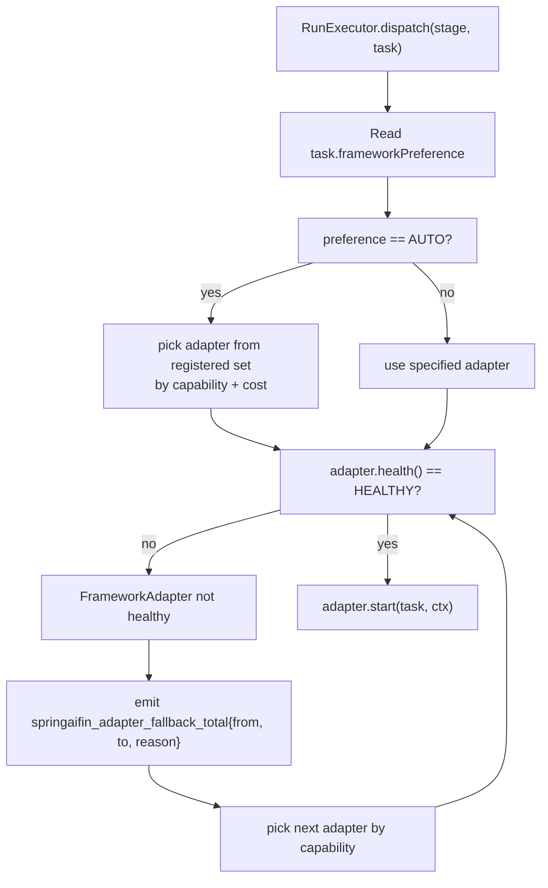

# adapters — Multi-framework Dispatch (L2)

> **L2 sub-architecture of `agent-runtime/`.** Up: [`../ARCHITECTURE.md`](../ARCHITECTURE.md) · L0: [`../../ARCHITECTURE.md`](../../ARCHITECTURE.md)

---

## 1. Purpose & Boundary

`adapters/` owns **multi-framework dispatch** — the single most distinctive feature of spring-ai-fin relative to hi-agent. It implements the user's brief that "the platform should run mainstream agent frameworks" without trapping customers in one choice.

The package owns one abstraction (`FrameworkAdapter`) and three concrete implementations:

1. **Spring AI** (in-process; default for v1)
2. **LangChain4j** (in-process; opt-in)
3. **Python sidecars** (out-of-process gRPC; opt-in for LangGraph / CrewAI / AutoGen / Pydantic-AI / OpenAI Agents SDK)

It does NOT own:
- LLM transport (delegated to `../llm/`).
- Action governance, permission gating, evidence storage (delegated to `../runtime/harness/`).
- Run lifecycle persistence (delegated to `../server/`).
- Skill registry / tool registration (delegated to `../skill/`).
- Capability registry (delegated to `../capability/`).
- The agent frameworks themselves — Spring AI 1.1+ is an upstream dependency; LangChain4j is a customer-opt-in dependency; Python frameworks are customer-chosen sidecar containers.

---

## 2. Why a unified adapter, and why polyglot OUT-OF-PROCESS

### The user's requirement

The user's original brief: *"我们希望可以运行业内主流的智能体框架"* — the platform should support running mainstream agent frameworks. As of 2026, the mainstream Java agent frameworks are Spring AI and LangChain4j. The Python ecosystem has LangGraph, CrewAI, AutoGen, Pydantic-AI, OpenAI Agents SDK, and LlamaIndex Agents — all Python-native.

### Three options considered

- **A1** — JVM-only. Reject Python frameworks; tell customers to port to Java. Loses 70%+ of mainstream agent ecosystem.
- **A2** — Polyglot in-process. Run Python in JVM via GraalVM polyglot or Jython. Fails Rule 5 catastrophically: shared event loops between Python's asyncio and Java's Reactor produce "Event loop closed" defects on every recovery cycle. This is the same failure class as hi-agent's 04-22 prod incident.
- **A3** — Polyglot out-of-process. Run Python frameworks in their own container; communicate via gRPC. **Selected.**

### Why A3 wins

- **Rule 5 honoured by construction.** Each framework runs in its own process with its own event loop. The JVM never shares an asyncio resource with Python. Crash isolation between JVM and Python sidecar is automatic.
- **Customer flexibility.** Customer chooses which Python framework they want; we provide a reference Docker image that hosts LangGraph + CrewAI + AutoGen via a thin Python service shim that translates gRPC → framework-native API.
- **Operational latency cost is acceptable.** Cross-process gRPC over Unix domain socket adds ≤30ms p95 in our prototyping. For interactive agent runs (p95 ≤ 5s budget), this is <1% overhead.

### What we forfeit

- **In-process performance for Python paths.** A high-throughput sub-100ms Python agent path is impossible. We accept this; customers needing sub-100ms total latency should use the Spring AI in-process path.
- **Single-deploy unit.** Customers running Python sidecars must operate an additional Docker container. We accept this; operational complexity at deployment, not at code review.

---

## 3. The `FrameworkAdapter` interface

```java
public interface FrameworkAdapter {
    /** Postures this adapter is allowed to run in. PySidecar, e.g., MAY restrict to RESEARCH/PROD only. */
    Set<AppPosture> supportedPostures();

    /** What this adapter can do. Used by RunExecutor to pick the cheapest adapter that satisfies the task. */
    Set<Capability> capabilities();

    /** Start a stage execution. Returns a handle to the in-flight adapter run. */
    AdapterRunHandle start(TaskContract task, RunContext ctx);

    /** Reactive event stream of stage events. Emits onComplete on terminal. */
    Flux<StageEvent> events(AdapterRunHandle handle);

    /** Cancel an in-flight adapter run. Idempotent. */
    void cancel(AdapterRunHandle handle);

    /** Adapter health for /diagnostics + manifest rendering. */
    AdapterHealth health();
}
```

`AdapterRunHandle` is opaque — adapters carry their own runtime state. For `SpringAiAdapter` it wraps a `ChatClient.CallResponseSpec`; for `PySidecarAdapter` it wraps a gRPC bidirectional stream.

---

## 4. Three implementations

### 4.1 SpringAiAdapter (default, in-process)

```java
public class SpringAiAdapter implements FrameworkAdapter {
    private final ChatClient chatClient;       // built once via @Bean (Rule 6)
    private final List<Advisor> advisors;       // composed from skill registry
    private final BudgetTracker budget;
    private final FallbackRecorder fallbacks;
    
    @Override public AdapterRunHandle start(TaskContract task, RunContext ctx) {
        var response = chatClient.prompt()
            .user(task.goal())
            .advisors(spec -> spec.advisors(advisors))
            .stream()                          // SSE-style flux
            .chatResponse();
        return new SpringAiRunHandle(response);
    }
    
    @Override public Flux<StageEvent> events(AdapterRunHandle handle) {
        return ((SpringAiRunHandle) handle).flux()
            .map(this::translateToStageEvent)
            .doOnNext(this::recordSpine)
            .onErrorResume(e -> Flux.just(StageEvent.failed(e)).doOnNext(__ -> 
                fallbacks.recordFallback("spring-ai-error", e)));
    }
    // ... cancel, capabilities, health
}
```

**Key design decision**: SpringAiAdapter calls Spring AI's `ChatClient` directly. Advisors are composed from `agent-runtime/skill/SkillRegistry` via a builder. We do not wrap Spring AI; we use it as it ships.

### 4.2 LangChain4jAdapter (opt-in, in-process)

```java
public class LangChain4jAdapter implements FrameworkAdapter {
    private final dev.langchain4j.service.AiServices.Builder<?> builder;
    // ... bridges TaskContract → LangChain4j ChatLanguageModel + tools
}
```

Customer adds `langchain4j-core` to their build; we discover the adapter via Spring's `@ConditionalOnClass(AiServices.class)` and register it. Customers without LangChain4j on the classpath don't have this adapter loaded.

### 4.3 PySidecarAdapter (opt-in, out-of-process)

```java
public class PySidecarAdapter implements FrameworkAdapter {
    private final ManagedChannel channel;       // gRPC channel; @Bean singleton (Rule 6)
    private final AgentDispatchGrpc.AgentDispatchStub stub;
    
    @Override public AdapterRunHandle start(TaskContract task, RunContext ctx) {
        var request = StartRunRequest.newBuilder()
            .setTaskJson(task.toJson())
            .setTenantId(ctx.tenantContext().tenantId())  // tenant in gRPC metadata
            .setRunId(ctx.runId().toString())
            .setFrameworkChoice(task.frameworkPreference().name())
            .build();
        var streamObserver = stub.startRun(request, ...);
        return new PySidecarRunHandle(streamObserver);
    }
    
    // events() bridges gRPC bidirectional stream to Reactor Flux
    // cancel() sends cancellation message via the same stream
}
```

The gRPC service is defined in `agent-runtime-py-sidecar.proto`:

```protobuf
service AgentDispatch {
    rpc StartRun(StartRunRequest) returns (stream StageEvent);
    rpc Cancel(CancelRequest) returns (CancelResponse);
    rpc Health(HealthRequest) returns (HealthResponse);
}

message StartRunRequest {
    string task_json = 1;
    string tenant_id = 2;
    string run_id = 3;
    FrameworkChoice framework_choice = 4;
    map<string, string> metadata = 5;
}

enum FrameworkChoice {
    LANGGRAPH = 0;
    CREWAI = 1;
    AUTOGEN = 2;
    PYDANTIC_AI = 3;
    OPENAI_AGENTS_SDK = 4;
}
```

The Python sidecar Docker image (published as `springaifin/py-sidecar:1.0.0`) contains all 5 framework SDKs. Per-tenant deployments can pin a sidecar version.

---

## 5. Dispatch decision flow



**Failover semantics**:

- An adapter failing (e.g., LangChain4j ClassNotFoundException, PySidecar gRPC unavailable) → emit `springaifin_adapter_fallback_total{from, to, reason}` and try the next adapter.
- All adapters failed → fail the run with `RunResult.failed(NoHealthyAdapter)` and emit `springaifin_run_failed_total{reason=no_healthy_adapter}`.

**Rule 7 four-prong** for adapter fallback:

- ✅ Countable: `springaifin_adapter_fallback_total{from, to, reason}` Micrometer counter.
- ✅ Attributable: structured `WARNING+` log with `runId`, `tenantId`, `from`, `to`, `reason`.
- ✅ Inspectable: `runMetadata.fallbackEvents` list carries `{at: ts, from: ..., to: ..., reason: ...}` per fallback.
- ✅ Gate-asserted: operator-shape gate asserts `springaifin_adapter_fallback_total == 0` over N≥3 sequential real-LLM runs.

---

## 6. Performance budget

Measured at operator-shape gate (W2 deliverable). Bars:

| Path | Overhead added by adapter | Total stage budget |
|---|---|---|
| Spring AI in-process | ≤ 5ms p95 | governed by ChatClient + LLM provider latency |
| LangChain4j in-process | ≤ 5ms p95 | same as Spring AI |
| Python sidecar via gRPC over Unix socket | ≤ 30ms p95 | governed by sidecar Python framework + LLM latency |
| Python sidecar via gRPC over TCP localhost | ≤ 50ms p95 | same |

If the Python sidecar overhead exceeds 100ms p95, we defer Python-sidecar GA to v1.1 and ship v1 with Spring AI + LangChain4j only.

---

## 7. Architecture Decisions

| ADR | Decision | Why |
|---|---|---|
| **AD-1: Single `FrameworkAdapter` interface** | All frameworks dispatched via one interface | Customer's "support multiple frameworks" requirement; refusal to maintain per-framework dispatch logic |
| **AD-2: Python OUT-OF-PROCESS only** | gRPC sidecar; no in-process Python | Rule 5 catastrophic failure mode if shared event loop |
| **AD-3: SpringAiAdapter is the default** | Spring AI 1.1+ is in-process default | JVM-native; lowest latency; Spring Boot ecosystem |
| **AD-4: LangChain4j discovered via `@ConditionalOnClass`** | Auto-loaded if classpath contains LangChain4j | Customer opt-in via Maven dependency only; no platform-level config |
| **AD-5: PySidecar via reference Docker image** | `springaifin/py-sidecar:1.0.0` published Docker | Customers don't roll their own Python framework hosting; we ship a tested reference |
| **AD-6: Adapter failover with Rule 7 four-prong** | Every fallback Countable + Attributable + Inspectable + Gate-asserted | Silent fallback would mean customers think framework X is working when actually Y is being used |
| **AD-7: AdapterRunHandle is opaque** | Adapters own their runtime state | Lets adapter implementations evolve without changing public interface |
| **AD-8: TaskContract.frameworkPreference is hint, not contract** | RunExecutor may override (e.g., for capability mismatch) | Capability matching is a deeper invariant than user preference |

---

## 8. Quality Attributes

| Attribute | Target | Verification |
|---|---|---|
| **Adapter dispatch latency** | ≤ 30ms p95 for in-process; ≤ 50ms p95 for sidecar | Operator-shape gate |
| **Adapter failover** | Total fallback time ≤ 100ms p95 | Operator-shape gate |
| **Multi-framework run** | Same `TaskContract` produces equivalent result across at least Spring AI + one other | Integration test: `tests/integration/CrossFrameworkEquivalenceIT` |
| **Sidecar isolation** | JVM crash does not crash sidecar; sidecar crash does not crash JVM | Chaos test: `tests/chaos/SidecarChaosIT` |
| **Capability matching** | Tasks requiring tools-mode never dispatched to adapters without tools support | `AdapterCapabilityTest` |

---

## 9. Risks & Technical Debt

| Risk | Plan |
|---|---|
| Python sidecar p95 > 100ms | Defer Python sidecar to v1.1 |
| LangChain4j upstream churn | Track LangChain4j 1.x stability; may add deprecation shim |
| Spring AI 1.1+ Advisor API churn | Track Spring AI changelogs; absorb in `SpringAiAdapter` |
| gRPC stream cancellation propagation across JVM/Python boundary | Tested at chaos gate; cancellation is best-effort with deadline |
| Per-customer Python framework version pinning | Customer pins `springaifin/py-sidecar:<version>` Docker tag |
| Cross-adapter spine propagation | TenantContext + RunContext threaded through every adapter via gRPC metadata |

---

## 10. References

- L0: [`../../ARCHITECTURE.md`](../../ARCHITECTURE.md) §5.3
- L1: [`../ARCHITECTURE.md`](../ARCHITECTURE.md)
- LLM gateway: [`../llm/ARCHITECTURE.md`](../llm/ARCHITECTURE.md)
- Skill registry: [`../skill/ARCHITECTURE.md`](../skill/ARCHITECTURE.md)
- Spring AI 1.1+ official docs: https://docs.spring.io/spring-ai/reference/1.1/
- LangChain4j: https://github.com/langchain4j/langchain4j
- Python sidecar reference: planned at `tools/py-sidecar/` (Dockerfile + Python service)
