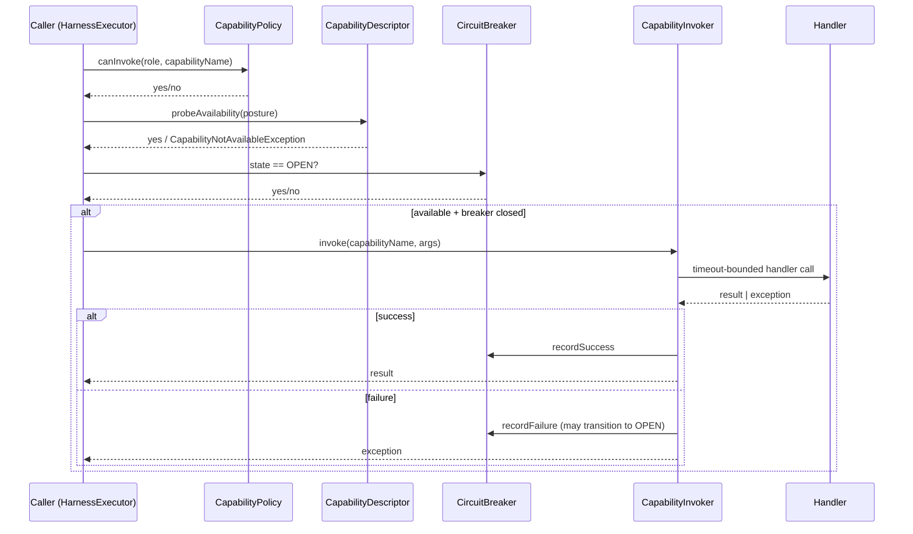

# capability — Tenant-Agnostic Registry of Named Tools (L2)

> **L2 sub-architecture of `agent-runtime/`.** Up: [`../ARCHITECTURE.md`](../ARCHITECTURE.md) · L0: [`../../ARCHITECTURE.md`](../../ARCHITECTURE.md)

---

## 1. Purpose & Boundary

`capability/` owns the **platform-level capability registry** — named, callable, schema-described tools available to all tenants equally. Capabilities are tenant-agnostic metadata; per-tenant override is the responsibility of route/policy gates above this layer.

This is the one place in the platform where records do **not** carry `tenantId`. They are explicitly `// scope: process-internal` per Rule 11. The reasoning: a capability descriptor describes a callable; the callable's invocation is per-tenant (handled by `../runtime/HarnessExecutor` + `../auth/`).

Owns:

- `CapabilityRegistry` — name → `CapabilitySpec` map
- `CapabilitySpec` — handler reference + metadata
- `CapabilityDescriptor` — frozen metadata: `riskClass`, `effectClass`, `requiresAuth`, `availableInDev/Research/Prod`, `maturityLevel L0..L4`, `sandboxLevel`
- `CapabilityInvoker` — policy + breaker + timeout + retry wrapper
- `CapabilityPolicy` — RBAC resolver (role → capability set)
- `CircuitBreaker` — per-capability OPEN/HALF_OPEN/CLOSED state
- `CapabilityBundle` — registration grouping (e.g., "kyc-bundle" registers 5 KYC-related capabilities)

Does NOT own:

- Action orchestration (delegated to `../runtime/HarnessExecutor`)
- MCP dispatch (delegated to `../skill/McpToolBridge`)
- Skill resolution (delegated to `../skill/`)
- LLM gating (delegated to `../llm/`)

---

## 2. Why platform-level (NOT per-tenant)

A "capability" is a primitive — `{tenant}.transfer.execute`, `{tenant}.kyc.lookup`, `{tenant}.skill.invoke` etc. The capability metadata (risk class, effect class, required auth, posture availability) is the same across tenants. What differs per-tenant is:

- Whether the tenant has been granted access (RBAC; in `CapabilityPolicy`)
- The tenant's specific skill versions or tool variants (in `../skill/`)

Adding `tenantId` to `CapabilitySpec` would force a per-tenant copy of every capability descriptor — wasteful and easy to drift. The current decision: capabilities are platform metadata; tenant filtering happens at invocation.

This is documented in code:

```java
public record CapabilityDescriptor(
    @NonNull String name,
    @NonNull String version,
    @NonNull RiskClass riskClass,             // LOW / MEDIUM / HIGH
    @NonNull EffectClass effectClass,         // READ_ONLY / IDEMPOTENT_WRITE / NON_IDEMPOTENT
    @NonNull boolean requiresAuth,
    boolean availableInDev,
    boolean availableInResearch,
    boolean availableInProd,
    @NonNull MaturityLevel maturityLevel,     // L0 .. L4
    @NonNull SandboxLevel sandboxLevel        // OPEN / RESTRICTED / SANDBOXED
) {
    // scope: process-internal — capability descriptors are platform-level metadata, not per-tenant records
    // No tenantId field by design.
}
```

---

## 3. Capability invocation flow



---

## 4. Architecture decisions

| ADR | Decision | Why |
|---|---|---|
| **AD-1: Platform-level (not per-tenant) registry** | `// scope: process-internal` Rule 11 exemption | Capabilities are tenant-agnostic metadata; per-tenant filtering at invocation |
| **AD-2: `CapabilityDescriptor` is canonical metadata** | Single frozen record carries all metadata | Avoids separate metadata sources drifting |
| **AD-3: Posture gate is hard fail** | `probeAvailability(posture)` raises `CapabilityNotAvailableException` (400 envelope) | Strongest interpretation of Rule 1 — gate, not notification |
| **AD-4: CircuitBreaker per capability** | OPEN / HALF_OPEN / CLOSED state | Standard resilience pattern; protects downstream from cascading failures |
| **AD-5: CapabilityBundle for registration** | Bundle groups (e.g., "kyc-bundle") for batch register | Customer Starters can register a bundle; cleaner than 5 separate registrations |
| **AD-6: Heuristic fallback under non-prod** | If LLM gateway missing under dev, capability falls through to heuristic stub | Faster dev iteration; prod fail-closed |
| **AD-7: MaturityLevel L0..L4 per capability** | Mirror Rule 12 ladder per capability | Manifest exposes per-capability maturity |

---

## 5. Cross-cutting hooks

- **Rule 6**: `CapabilityRegistry` is `@Bean` singleton
- **Rule 7**: capability invocation failures emit `springaifin_capability_failures_total{capability, reason}` + breaker state changes
- **Rule 11**: `CapabilityDescriptor` is process-internal; documented exception to spine completeness
- **Rule 12**: every capability declares `MaturityLevel`; manifest reflects
- **Posture-aware**: hard-fail under prod when capability not `availableInProd`; heuristic fallback under dev

---

## 6. Quality

| Attribute | Target | Verification |
|---|---|---|
| Capability registration latency | ≤ 100ms for 100-capability bundle | `tests/integration/CapabilityBundleIT` |
| Posture gate enforcement | hard-fail under prod when descriptor flag false | `tests/integration/CapabilityPostureIT` |
| Circuit breaker correctness | OPEN after threshold; HALF_OPEN probing; CLOSED on success | `tests/unit/CircuitBreakerStateTest` |
| Maturity level reporting in manifest | every capability rendered with its level | `tests/integration/ManifestCapabilityIT` |

## 7. Risks

- **Per-tenant override demand**: customer asks for tenant-specific capability variant — handled by `../skill/` versioning, not capability registry
- **Bundle versioning**: customer Starter bundle version drift — tracked at Starter version (`fin-starter-kyc:1.0.2`)
- **Heuristic fallback under prod misconfig**: explicit boot assertion that prod has LLM gateway

## 8. References

- L1: [`../ARCHITECTURE.md`](../ARCHITECTURE.md)
- Harness consumer: [`../runtime/ARCHITECTURE.md`](../runtime/ARCHITECTURE.md)
- Skill consumer: [`../skill/ARCHITECTURE.md`](../skill/ARCHITECTURE.md)
- Hi-agent prior art: `D:/chao_workspace/hi-agent/hi_agent/capability/ARCHITECTURE.md`
