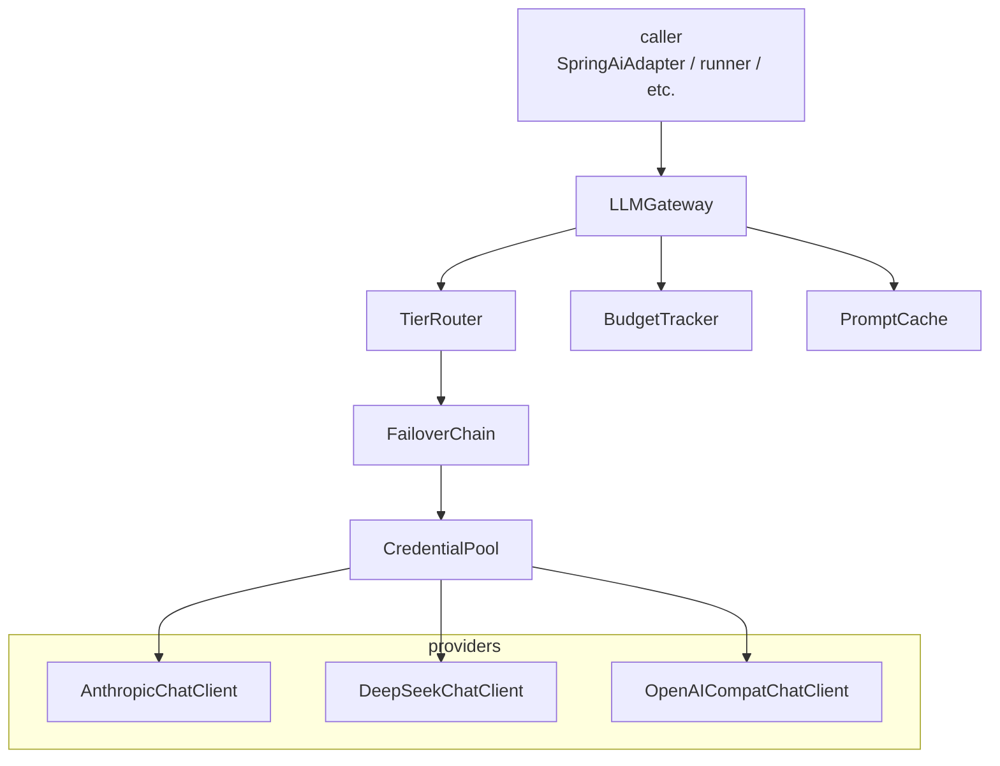

# llm — LLM Gateway over Spring AI ChatClient (L2)

> **L2 sub-architecture of `agent-runtime/`.** Up: [`../ARCHITECTURE.md`](../ARCHITECTURE.md) · L0: [`../../ARCHITECTURE.md`](../../ARCHITECTURE.md)

---

## 1. Purpose & Boundary

`llm/` is the **access layer for all real-LLM traffic**. Every LLM call in spring-ai-fin flows through this package: gateway, tier router, failover chain, prompt cache, budget tracker. Outside test paths, no module constructs raw `WebClient` to LLM providers or hand-rolls model RPC.

Owns:

- `LLMGateway` — wraps Spring AI `ChatClient` per provider; binds to ReactorScheduler (Rule 5)
- `TierRouter` — maps purpose × complexity × budget × confidence → tier (`strong` / `medium` / `light`)
- `FailoverChain` — ordered provider sequence with HTTP-error classification
- `BudgetTracker` — per-tenant per-call cost ceilings; raises `LLMBudgetExceededException`
- `PromptCache` — Spring AI prompt cache adapter (Anthropic-style cache_control blocks; OpenAI-compat prefix cache)
- `CredentialPool` — per-provider credential rotation; disable on auth_permanent / billing errors

Does NOT own:

- Capability invocation, action governance (delegated to `../runtime/harness/`)
- Persisted run state (delegated to `../server/`)
- Framework dispatch (delegated to `../adapters/`) — adapters call this gateway

---

## 2. Why a single gateway, not direct ChatClient usage

### v5.0 vs v6.0

v5.0 listed 80+ components including 4 model tiers (Pro / Flash / Specialist / fine-tuned). v6.0 review (M7) found this premature: at MVP, one provider is sufficient; multi-tier is added when traffic justifies.

v6.0: `LLMGateway` is the single seam. Adapters never call Spring AI's `ChatClient` directly except inside `SpringAiAdapter` — and even there, `SpringAiAdapter.chatClient` is provided as `@Bean`, built by this package.

### Three reasons for the wrapper

1. **Failover**: Spring AI's `ChatClient` doesn't have multi-provider failover; we add `FailoverChain`.
2. **Budget**: per-tenant per-call cost tracking is application-level concern; budget exhaustion raises typed exception.
3. **Spine + observability**: every LLM call emits spine event with `tenantId, runId, providerName, modelName, tokenCount, latencyMs`.

---

## 3. Building blocks



---

## 4. Key data structures

```java
public record LLMRequest(
    @NonNull String tenantId,                      // spine
    @Nullable String runId,                        // spine
    @NonNull String prompt,
    @Nullable List<Message> history,
    @Nullable Map<String, Object> tools,
    @Nullable LLMTier tierHint,                    // suggested tier; router may override
    @Nullable Duration timeout,
    @Nullable Map<String, Object> metadata
) {
    public LLMRequest { /* spine validation */ }
}

public record LLMResponse(
    @NonNull String tenantId,                      // spine
    @Nullable String runId,                        // spine
    @NonNull String text,
    @NonNull String modelUsed,
    @NonNull String providerUsed,
    @NonNull TokenUsage tokens,
    @NonNull Duration latency,
    @Nullable List<ToolCall> toolCalls,
    @Nullable List<FallbackEvent> fallbackEvents   // from FailoverChain
) {
    public LLMResponse { /* spine validation */ }
}

public enum LLMTier { STRONG, MEDIUM, LIGHT }

public record FailoverReason(
    String classification,    // auth_permanent | billing | rate_limit | overloaded | server_error | timeout | context_overflow | unknown
    boolean retryable,
    @Nullable Throwable cause
) {}
```

---

## 5. Architecture decisions

| ADR | Decision | Why |
|---|---|---|
| **AD-1: One LLMGateway, one ReactorScheduler, one connection pool** | Every WebClient bound to persistent Reactor scheduler (Rule 5) | Hi-agent's 04-22 prod incident was "Event loop is closed" on retry; same fix |
| **AD-2: Spring AI ChatClient under the hood, not direct HTTP** | Use Spring AI 1.1+ ChatClient API; configure provider-specific via Starters | Lets us inherit Spring AI's prompt cache, function calling, structured output |
| **AD-3: FailoverChain sequential, not parallel** | Try each credential in order, not fan-out | Simplicity; reproducible logs; no fan-out budget pressure |
| **AD-4: Hand-classified HTTP errors** | `classifyHttpError(throwable, response)` returns `FailoverReason` | Spring AI's exceptions are too generic; we need to know if 429 is rate-limit (retry) or quota (mark disabled) |
| **AD-5: BudgetTracker raises LLMBudgetExceededException** | Sync exception, not silent return | Budget exhaustion is an explicit signal; runner decides to fail or gate |
| **AD-6: Per-tenant prompt cache namespace** | Cache keys prefixed with `tenant:{tenantId}:` | Cross-tenant cache leak prevented at construction (Rule 11) |
| **AD-7: TierRouter is pluggable** | Default rolling-EMA-per-tier; customer can override via @ConditionalOnMissingBean | Cost-sensitive customers can swap to RouteLLM (deferred Tier-2) |
| **AD-8: One inference engine at MVP** | vLLM **or** OpenAI-compat — pick one (review M7) | v5.0's 3-engine multi-tier was premature |

---

## 6. Failover taxonomy

```java
public enum FailoverClassification {
    // Retryable: try next credential or wait
    RATE_LIMIT,       // 429
    OVERLOADED,       // 529 / x-anthropic-overloaded
    SERVER_ERROR,     // 500-503
    TIMEOUT,          // request timeout
    
    // Permanent for this credential: mark disabled
    AUTH_PERMANENT,   // 401 with persistent invalid_api_key
    BILLING,          // payment_required / quota_exceeded
    CONTEXT_OVERFLOW, // request too large; not a credential issue but propagate
    MODEL_NOT_FOUND,  // model retired
    
    // Unknown
    UNKNOWN           // catch-all; flagged for taxonomy expansion
}
```

`FailoverChain.execute(request)`:

1. For each `(credential, provider)` in chain:
   - try `chatClient.prompt(request).call()` bound to ReactorScheduler
   - on success: emit `springaifin_llm_request_total{provider, model, status=success}`; return response
   - on failure: classify; if permanent for credential, mark disabled; if retryable, try next
2. All exhausted: emit `springaifin_llm_fallback_total{reason=exhausted}`; throw `LLMUnavailableException`

Every fallback is recorded in `LLMResponse.fallbackEvents` (Rule 7 four-prong).

---

## 7. Cross-cutting hooks

| Concern | Implementation |
|---|---|
| **Rule 5** | Single ReactorScheduler per process; `WebClient` bound to it; no `Mono.block()` |
| **Rule 7** | Every fallback path: `springaifin_llm_fallback_total{provider, reason}` + WARNING + `LLMResponse.fallbackEvents` + Rule-8 gate-asserted to zero |
| **Rule 8 hot-path** | `agent-runtime/llm/**` is hot-path; T3 evidence required on every commit |
| **Posture (Rule 11)** | dev: mock provider permitted; research/prod: real provider only (`APP_LLM_MODE=real` boot assertion) |
| **Spine (Rule 11)** | Every `LLMRequest`/`LLMResponse` carries `tenantId, runId` |
| **Budget** | Per-tenant ceiling read from `TenantQuota.maxCostPerRun`; exhaustion raises `LLMBudgetExceededException` |

---

## 8. Quality

| Attribute | Target | Verification |
|---|---|---|
| LLM call p95 (excl. provider) | ≤ 50ms gateway overhead | OperatorShapeGate |
| Failover round-trip | ≤ 200ms p95 (one fallback) | `tests/integration/FailoverChainIT` |
| Cross-loop stability | 3 sequential runs reuse same WebClient | `gate/check_cross_loop.sh` |
| Mock vs real | T3 gate refuses mock provider in research/prod | `gate/check_llm_real.sh` |
| Provenance | Every run has ≥1 real-provider request | `gate/check_real_provenance.sh` |

---

## 9. Risks

- **Spring AI 1.1+ API churn**: track upstream; absorb in `LLMGateway`
- **Provider-specific quirks**: Anthropic prompt cache is different from OpenAI prefix cache; encoded in adapter
- **Token-counting accuracy**: provider-reported tokens may differ from local count; use provider-reported as source of truth
- **MockProvider divergence**: deterministic; ignores latency/retries; T3 gate refuses mock in prod

## 10. References

- Hi-agent prior art: `D:/chao_workspace/hi-agent/hi_agent/llm/ARCHITECTURE.md` — Python equivalent with same architecture
- Spring AI 1.1+ ChatClient: https://docs.spring.io/spring-ai/reference/1.1/api/chatclient.html
- L1: [`../ARCHITECTURE.md`](../ARCHITECTURE.md)
- Adapters: [`../adapters/ARCHITECTURE.md`](../adapters/ARCHITECTURE.md)
