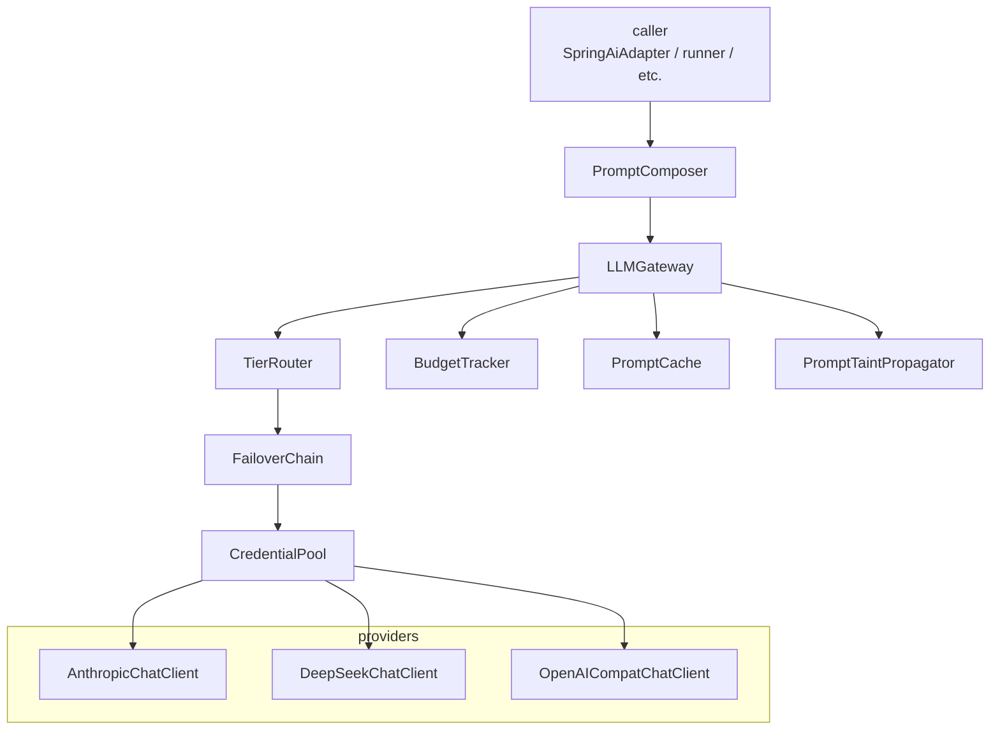

# llm — LLM Gateway + Prompt-Security Control Plane (L2)

> **L2 sub-architecture of `agent-runtime/`.** Up: [`../ARCHITECTURE.md`](../ARCHITECTURE.md) · L0: [`../../ARCHITECTURE.md`](../../ARCHITECTURE.md)

---

## 1. Purpose & Boundary

`llm/` is the **access layer for all real-LLM traffic** AND the **prompt-security control plane**. Every LLM call in spring-ai-fin flows through this package: gateway, tier router, failover chain, prompt cache, budget tracker, prompt-section composer, taint propagator. Outside test paths, no module constructs raw `WebClient` to LLM providers, hand-rolls model RPC, or assembles prompts from raw user input.

Owns:

- `LLMGateway` — wraps Spring AI `ChatClient` per provider; binds to ReactorScheduler (Rule 5)
- `TierRouter` — maps purpose × complexity × budget × confidence → tier (`strong` / `medium` / `light`)
- `FailoverChain` — ordered provider sequence with HTTP-error classification
- `BudgetTracker` — per-tenant per-call cost ceilings; raises `LLMBudgetExceededException`
- `PromptCache` — Spring AI prompt cache adapter (Anthropic-style cache_control blocks; OpenAI-compat prefix cache); cache keys include security classification (see §6)
- `CredentialPool` — per-provider credential rotation; disable on auth_permanent / billing errors
- `PromptComposer` — constructs the prompt from typed sections (see §6); never accepts a single raw String "prompt"
- `PromptSection` — typed enum naming each prompt region (see §6.1)
- `TaintLevel` — typed enum for the kind of trust attached to a piece of prompt input (see §6.2)
- `PromptTaintPropagator` — propagates taint from input sections to model output and to any tool calls the model produces

Does NOT own:

- Capability invocation, action governance (delegated to `../action-guard/`) — but tool calls produced by the LLM go through ActionGuard with their taint preserved
- Persisted run state (delegated to `../server/`)
- Framework dispatch (delegated to `../adapters/`) — adapters call this gateway
- Audit storage (delegated to `../audit/`) — audit class for tool calls is computed by ActionGuard from the propagated taint

---

## 2. Why a single gateway, not direct ChatClient usage

### v5.0 vs v6.0

v5.0 listed 80+ components including 4 model tiers (Pro / Flash / Specialist / fine-tuned). v6.0 review (M7) found this premature: at MVP, one provider is sufficient; multi-tier is added when traffic justifies.

v6.0: `LLMGateway` is the single seam. Adapters never call Spring AI's `ChatClient` directly except inside `SpringAiAdapter` — and even there, `SpringAiAdapter.chatClient` is provided as `@Bean`, built by this package.

### Four reasons for the wrapper

1. **Failover**: Spring AI's `ChatClient` doesn't have multi-provider failover; we add `FailoverChain`.
2. **Budget**: per-tenant per-call cost tracking is application-level concern; budget exhaustion raises typed exception.
3. **Spine + observability**: every LLM call emits spine event with `tenantId, runId, providerName, modelName, tokenCount, latencyMs`.
4. **Prompt security**: the gateway is the only legitimate place to construct a prompt. `PromptComposer` requires typed sections + taint inputs; no caller can hand the gateway a raw concatenated string.

---

## 3. Building blocks



---

## 4. Key data structures

```java
public record LLMRequest(
    @NonNull String tenantId,                      // spine
    @Nullable String runId,                        // spine
    @NonNull List<PromptSegment> segments,         // typed segments; replaces raw "prompt" string
    @Nullable List<Message> history,
    @Nullable Map<String, Object> tools,
    @Nullable LLMTier tierHint,                    // suggested tier; router may override
    @Nullable Duration timeout,
    @Nullable Map<String, Object> metadata
) {
    public LLMRequest { /* spine validation */ }
}

public record PromptSegment(
    @NonNull PromptSection section,                // see §6.1
    @NonNull TaintLevel taint,                     // see §6.2
    @NonNull String content                        // canonical text or token stream
) {}

public record LLMResponse(
    @NonNull String tenantId,                      // spine
    @Nullable String runId,                        // spine
    @NonNull String text,
    @NonNull TaintLevel outputTaint,               // see §6.3 (output taint = sup of input taints)
    @NonNull String modelUsed,
    @NonNull String providerUsed,
    @NonNull TokenUsage tokens,
    @NonNull Duration latency,
    @Nullable List<ToolCall> toolCalls,            // each carries inherited taint
    @Nullable List<FallbackEvent> fallbackEvents   // from FailoverChain
) {
    public LLMResponse { /* spine validation */ }
}

public enum LLMTier { STRONG, MEDIUM, LIGHT }

public record FailoverReason(
    String classification,    // auth_permanent | billing | rate_limit | overloaded | server_error | timeout | context_overflow | unknown
    boolean retryable,
    @Nullable Throwable cause
) {}
```

---

## 5. Architecture decisions

| ADR | Decision | Why |
|---|---|---|
| **AD-1: One LLMGateway, one ReactorScheduler, one connection pool** | Every WebClient bound to persistent Reactor scheduler (Rule 5) | Hi-agent's 04-22 prod incident was "Event loop is closed" on retry; same fix |
| **AD-2: Spring AI ChatClient under the hood, not direct HTTP** | Use Spring AI 1.1+ ChatClient API; configure provider-specific via Starters | Lets us inherit Spring AI's prompt cache, function calling, structured output |
| **AD-3: FailoverChain sequential, not parallel** | Try each credential in order, not fan-out | Simplicity; reproducible logs; no fan-out budget pressure |
| **AD-4: Hand-classified HTTP errors** | `classifyHttpError(throwable, response)` returns `FailoverReason` | Spring AI's exceptions are too generic; we need to know if 429 is rate-limit (retry) or quota (mark disabled) |
| **AD-5: BudgetTracker raises LLMBudgetExceededException** | Sync exception, not silent return | Budget exhaustion is an explicit signal; runner decides to fail or gate |
| **AD-6: Prompt cache namespace + classification** | Cache keys composed of `tenant_id`, `model`, `prompt_version`, `section_classification` | Cross-tenant cache leak prevented at construction (Rule 11); cross-classification leak (e.g., a tenant-policy hash also keying user-input output) prevented by classification (P0-5; P1-3) |
| **AD-7: TierRouter is pluggable** | Default rolling-EMA-per-tier; customer can override via `@ConditionalOnMissingBean` | Cost-sensitive customers can swap to RouteLLM (deferred Tier-2) |
| **AD-8: One inference engine at MVP** | vLLM **or** OpenAI-compat — pick one (review M7) | v5.0's 3-engine multi-tier was premature |
| **AD-9: Typed PromptSegment, no raw String prompts** | `LLMRequest.segments: List<PromptSegment>`; raw String constructor forbidden | P0-5 closure; the dangerous moment is "raw user input → tool call"; making sections + taint mandatory makes the dangerous shape unconstructable |
| **AD-10: Output taint = supremum of input taints** | `outputTaint = max(inputTaint)` per `TaintLevel` ordering | Conservatively propagate; tool calls produced from a UNTRUSTED retrieved-context segment carry UNTRUSTED through ActionGuard |

---

## 6. Prompt-security control plane

The dangerous moment in an LLM-driven agent is not the user prompt itself — it is the conversion of model output (which absorbed taint from many sections) into a side effect via a tool call. The control plane makes the prompt's structure, taint, and cache classification **typed and verifiable** rather than convention-driven.

### 6.1 PromptSection taxonomy

```java
public enum PromptSection {
    /** Platform-owned system instructions; never tenant-supplied. */
    SYSTEM,
    /** Customer/operator-owned instructions for this run; supplied at task creation. */
    DEVELOPER,
    /** Tenant-scoped policy overlay (e.g., "this tenant cannot use shell.exec"). */
    TENANT_POLICY,
    /** End-user message text; the original input from outside the trust boundary. */
    USER_INPUT,
    /** RAG / knowledge retrieval results; content sourced from a store, not from the user. */
    RETRIEVED_CONTEXT,
    /** Output from a previous tool call in this run; cycled back into the model. */
    TOOL_OUTPUT,
    /** Model's own scratch space (chain-of-thought style); never user-visible; never persisted. */
    PRIVATE_SCRATCH,
    /** Model output itself; produced by the model; carries supremum-of-inputs taint. */
    MODEL_OUTPUT
}
```

`PromptComposer` is the only sanctioned constructor of an `LLMRequest`. It accepts typed segments and emits the wire-format prompt the provider understands. A caller cannot hand the gateway a raw String.

### 6.2 TaintLevel propagation

```java
public enum TaintLevel {
    /** Platform-controlled; cannot be tampered with by tenant or user. */
    TRUSTED,
    /** Tenant-attributed but otherwise trusted (e.g., DEVELOPER, TENANT_POLICY). */
    TENANT_TRUSTED,
    /** User-attributed; not adversarial by default but unverified. */
    ATTRIBUTED_USER,
    /** Retrieved from a knowledge source the user could have influenced (RAG). */
    UNTRUSTED,
    /** Output from a tool call whose origin and content cannot be vouched for by the platform. */
    UNTRUSTED_TOOL,
    /** Specific known threat patterns (prompt injection, jailbreak strings). */
    ADVERSARIAL_SUSPECTED;

    /** PII / FINANCIAL / SECRET data classifications layered orthogonally on top. */
}
```

Specialized data-class taints (`PII`, `FINANCIAL`, `SECRET_MATERIAL`) are layered orthogonally and tracked alongside `TaintLevel` per segment.

`PromptTaintPropagator.propagate(segments)` produces:

- the **output taint** = supremum of input segment taints under the `TaintLevel` order (`TRUSTED < TENANT_TRUSTED < ATTRIBUTED_USER < UNTRUSTED < UNTRUSTED_TOOL < ADVERSARIAL_SUSPECTED`);
- a **per-tool-call taint** for each tool call the model produces, which downstream becomes `ActionEnvelope.proposalTaint`;
- a **PII flag** on the response if any input segment carried PII (so the post-action audit class is `PII_ACCESS`).

### 6.3 PromptCache classification

Prompt cache keys are derived from:

```text
key = sha256(
  tenant_id || model || prompt_version || section_classification || content_hash
)

section_classification = sorted-tuple-of (
  (section_id, taint_level, data_class)
)
```

Two important consequences:

- A cache hit is only possible when **every** section's classification matches — a SYSTEM-sections-only key cannot retrieve an entry that included a USER_INPUT section.
- Raw user prompt content never enters key derivation. The classifier consumes a `Redactor.classifyAndRedact(content)` hash for any segment whose taint is `ATTRIBUTED_USER` or higher.

### 6.4 Forbidden surfaces

The platform guarantees that **none** of the following surfaces ever carries a raw prompt section, raw retrieved-context content, or raw tool arguments:

- log lines (`log.info("prompt={}", ...)`)
- metric labels (`tenant_id`, `provider`, `model`, etc. are typed; raw text is never a label value)
- OpenTelemetry span attributes (the prompt is referenced by hash, not by content)
- prompt cache keys (see §6.3)
- audit metadata (audit stores classification + hash, not raw text)

These are enforced by named CI gates in `../observability/` and tested per §7 below.

### 6.5 Tool-call taint to ActionGuard

When the model produces a tool call, `LLMGateway` constructs the `ActionEnvelope` with:

- `proposalSource = LLM_OUTPUT`
- `proposalTaint = output taint of the prompt that produced the model output`

The ActionEnvelope flows into `ActionGuard.authorize` (`../action-guard/`). Because ActionGuard's Stage 7 (OpaPolicyDecider) reads `proposalTaint`, an attacker who plants a "call shell.exec" instruction in a RAG document gets a tool call envelope with `proposalTaint=UNTRUSTED`, and the OPA red-line policy denies the action. The taint travel from input segment to ActionGuard is the system-property guarantee P0-5 closure rests on.

---

## 7. Failover taxonomy

```java
public enum FailoverClassification {
    // Retryable: try next credential or wait
    RATE_LIMIT,       // 429
    OVERLOADED,       // 529 / x-anthropic-overloaded
    SERVER_ERROR,     // 500-503
    TIMEOUT,          // request timeout

    // Permanent for this credential: mark disabled
    AUTH_PERMANENT,   // 401 with persistent invalid_api_key
    BILLING,          // payment_required / quota_exceeded
    CONTEXT_OVERFLOW, // request too large; not a credential issue but propagate
    MODEL_NOT_FOUND,  // model retired

    // Unknown
    UNKNOWN           // catch-all; flagged for taxonomy expansion
}
```

`FailoverChain.execute(request)`:

1. For each `(credential, provider)` in chain:
   - try `chatClient.prompt(request).call()` bound to ReactorScheduler
   - on success: emit `springaifin_llm_request_total{provider, model, status=success}`; return response
   - on failure: classify; if permanent for credential, mark disabled; if retryable, try next
2. All exhausted: emit `springaifin_llm_fallback_total{reason=exhausted}`; throw `LLMUnavailableException`

Every fallback is recorded in `LLMResponse.fallbackEvents` (Rule 7 four-prong).

---

## 8. Cross-cutting hooks

| Concern | Implementation |
|---|---|
| **Rule 5** | Single ReactorScheduler per process; `WebClient` bound to it; no `Mono.block()` |
| **Rule 7** | Every fallback path: `springaifin_llm_fallback_total{provider, reason}` + WARNING + `LLMResponse.fallbackEvents` + Rule-8 gate-asserted to zero |
| **Rule 8 hot-path** | `agent-runtime/llm/**` is hot-path; T3 evidence required on every commit |
| **Posture (Rule 11)** | dev: mock provider permitted; research/prod: real provider only (`APP_LLM_MODE=real` boot assertion) |
| **Spine (Rule 11)** | Every `LLMRequest`/`LLMResponse` carries `tenantId, runId` |
| **Budget** | Per-tenant ceiling read from `TenantQuota.maxCostPerRun`; exhaustion raises `LLMBudgetExceededException` |
| **Action-guard integration** | Tool calls produced by the LLM construct an ActionEnvelope with `proposalTaint = output taint`; routed through `ActionGuard.authorize` |
| **Privacy (P0-5, P1-3, P1-6)** | Raw prompt / retrieved context / tool args never appear in logs, metrics, traces, or cache keys; enforced by `../observability/ObservabilityPrivacyPolicy` named tests |

---

## 9. Quality

| Attribute | Target | Verification |
|---|---|---|
| LLM call p95 (excl. provider) | ≤ 50ms gateway overhead | OperatorShapeGate |
| Failover round-trip | ≤ 200ms p95 (one fallback) | `tests/integration/FailoverChainIT` |
| Cross-loop stability | 3 sequential runs reuse same WebClient | `gate/check_cross_loop.sh` |
| Mock vs real | T3 gate refuses mock provider in research/prod | `gate/check_llm_real.sh` |
| Provenance | Every run has ≥1 real-provider request | `gate/check_real_provenance.sh` |
| No raw prompt in logs / traces / metric labels / cache keys | enforced by CI | `NoRawPromptInLogsTest`, `NoRawToolArgsInTracesTest`, `PromptCacheClassificationTest` (in `../observability/`) |
| Prompt segments are typed | `LLMRequest.segments: List<PromptSegment>` is the only constructor | `PromptSectionTaxonomyTest` |
| Tool-output taint reaches ActionGuard | every model-generated tool call's envelope has the right `proposalTaint` | `ToolOutputTaintToActionGuardIT` |
| Retrieved-context redaction | RAG content with PII reaches the model only after `Redactor` classification | `RetrievedContextRedactionIT` |

---

## 10. Risks

- **Spring AI 1.1+ API churn**: track upstream; absorb in `LLMGateway`
- **Provider-specific quirks**: Anthropic prompt cache is different from OpenAI prefix cache; encoded in adapter
- **Token-counting accuracy**: provider-reported tokens may differ from local count; use provider-reported as source of truth
- **MockProvider divergence**: deterministic; ignores latency/retries; T3 gate refuses mock in prod
- **Taint over-propagation**: a single ATTRIBUTED_USER segment taints all model output ATTRIBUTED_USER. This is intentional (conservative); compliance team reviews any reduction proposal.
- **Cache miss rate after classification**: keys are now wider; profiled at <5% additional miss; acceptable cost for the privacy guarantee.

## 11. References

- Hi-agent prior art: `D:/chao_workspace/hi-agent/hi_agent/llm/ARCHITECTURE.md`
- Spring AI 1.1+ ChatClient: https://docs.spring.io/spring-ai/reference/1.1/api/chatclient.html
- L1: [`../ARCHITECTURE.md`](../ARCHITECTURE.md)
- Adapters: [`../adapters/ARCHITECTURE.md`](../adapters/ARCHITECTURE.md)
- Action-guard (consumer of ActionEnvelope from LLM tool calls): [`../action-guard/ARCHITECTURE.md`](../action-guard/ARCHITECTURE.md)
- Observability privacy policy: [`../observability/ARCHITECTURE.md`](../observability/ARCHITECTURE.md) §6
- Security review §P0-5: [`../../docs/deep-architecture-security-assessment-2026-05-07.en.md`](../../docs/deep-architecture-security-assessment-2026-05-07.en.md)
- Systematic-architecture-remediation-plan: [`../../docs/systematic-architecture-remediation-plan-2026-05-08.en.md`](../../docs/systematic-architecture-remediation-plan-2026-05-08.en.md) §7.4
