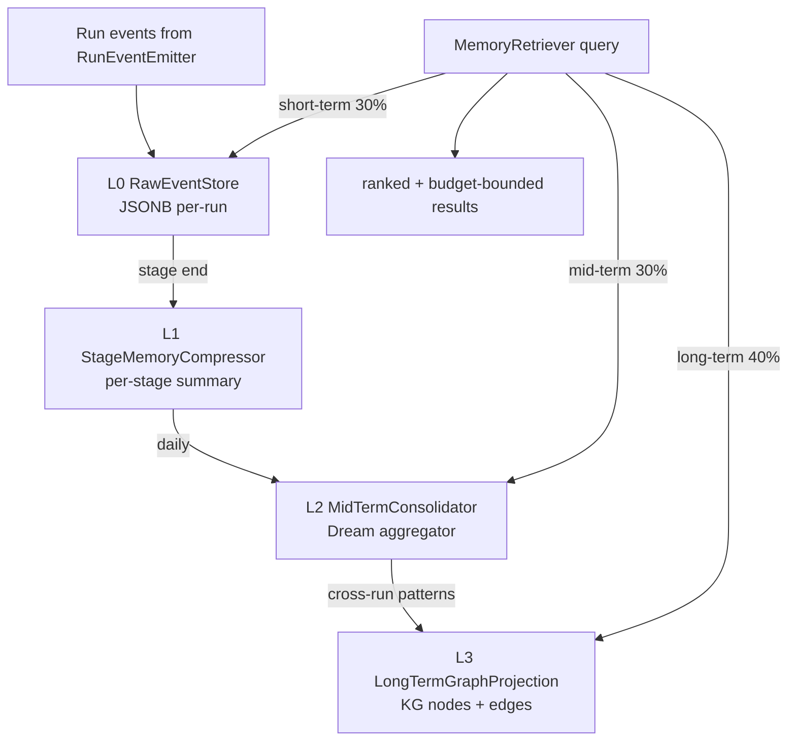

# memory -- L0-L3 Layered Run Memory (L2)

> **L2 sub-architecture of `agent-runtime/`.** Up: [`../ARCHITECTURE.md`](../ARCHITECTURE.md) . L0: [`../../ARCHITECTURE.md`](../../ARCHITECTURE.md)

---

## 1. Purpose & Boundary

`memory/` owns the **layered run-memory pipeline** converting raw run events -> compressed stage summaries -> episodic records -> long-term knowledge-graph nodes. Mirrors hi-agent's L0 -> L1 -> L2 -> L3 progression with Postgres as primary durable backend.

Owns:

- L0: `RawEventStore` -- JSONB-typed run events; per-run partition
- L1: `StageMemoryCompressor` -- compresses L0 stream to per-stage summary records
- L2: `MidTermConsolidator` -- daily aggregates ("Dream consolidation"); cross-run patterns
- L3: `LongTermGraphProjection` -- KG nodes/edges projected from L2 records
- `MemoryRetriever` -- unified retrieval across L0-L3 with budget allocation (40% long / 30% mid / 30% short)

Does NOT own:

- Knowledge ingest endpoints (delegated to `../knowledge/`)
- Retrieval ranking primitives (BM25, embedding) -- delegated to `../knowledge/FourLayerRetriever.java`
- Dream scheduling (delegated to `../server/LifespanController` background task)
- LLM gating for L1 compression (delegated to `../llm/`)

---

## 2. Why progressive fidelity (mirrors hi-agent)

L0 -> L1 -> L2 -> L3 is a **filter + compress** pipeline. Each layer:

1. **Compresses** -- L0 raw events become L1 stage summaries (~10x reduction); L1 -> L2 daily aggregates (~10x); L2 -> L3 episodic patterns (~10x)
2. **Filters** -- irrelevant events dropped at L1; transient noise dropped at L2; only stable patterns reach L3
3. **Reranks fidelity vs cost** -- L0 verbose, L3 compact; retrieval can pick layer based on token budget

Posture-aware backend:

- **dev**: JSON files for L0-L2 (inspectable for debugging); JSON for L3 (small graphs)
- **research/prod**: Postgres JSONB for L0-L2; Postgres graph table for L3 (with optional Neo4j adapter when KG reasoning is a named feature -- Tier-2)

---

## 3. Building blocks

---

## 4. Architecture decisions

| ADR | Decision | Why |
|---|---|---|
| **AD-1: Four layers** | L0 raw / L1 stage / L2 mid / L3 long | Progressive fidelity; mirrors hi-agent's proven shape |
| **AD-2: Postgres JSONB at research/prod** | Not Neo4j by default | Hi-agent's verdict (W12): JSON+SQLite covered all KG ops at scale; Neo4j adds operational complexity without gain |
| **AD-3: Posture-aware backend** | dev=JSON; research/prod=Postgres | Inspectability vs durability tradeoff |
| **AD-4: Compressor is hot-path** | T3 evidence required on every change | hi-agent classified this as Rule 8 hot-path; same here |
| **AD-5: Spine on every record** | tenant_id, project_id, run_id, parent_run_id, attempt_id required | Rule 11 strict-posture validation in record canonical constructor |
| **AD-6: 40/30/30 retrieval budget** | long 40% / mid 30% / short 30% allocation | hi-agent's empirical default; tunable per-tenant in v1.1+ |
| **AD-7: Pre-W31 legacy bucket** | Rows missing tenant_id auto-mapped to `__pre_v6_legacy__` | Zero-downtime migration pattern |

---

## 5. Cross-cutting hooks

- **Rule 8 hot-path**: `agent-runtime/memory/StageMemoryCompressor.java` is hot-path; T3 evidence required
- **Rule 11**: every persistent record validates spine at canonical constructor
- **Rule 7**: compression failures emit `springaifin_memory_compression_errors_total` + WARNING + fallback to L0 retention
- **Posture (Rule 11)**: backend factory reads posture; fail-closed under research/prod if Postgres unavailable

---

## 6. Quality

| Attribute | Target | Verification |
|---|---|---|
| L0 -> L1 compression ratio | >= 5x for typical runs | `tests/integration/MemoryCompressionRatioIT` |
| Retrieval p95 latency | <= 200ms (cached); <= 500ms (cold) | `tests/integration/MemoryRetrievalIT` |
| Spine completeness across all records | 100% | `MemorySpineValidationTest` |
| Cross-tenant read returns 404 | yes | `tests/integration/MemoryTenantIsolationIT` |
| Compressor restart-survival | survives mid-compression crash | `tests/integration/CompressorCrashRecoveryIT` |

## 7. Risks

- **L2 Dream consolidation deferred**: v1 ships L0+L1; L2 introduced when traffic justifies (single-tenant traces large enough to warrant aggregation)
- **L3 graph at scale**: Postgres graph table is sufficient until ~10M edges; Neo4j adapter as Tier-2 when warranted
- **Compressor LLM cost**: L0->L1 uses LLM; per-run cost tracked via outbox `cost_observed`

## 8. References

- L1: [`../ARCHITECTURE.md`](../ARCHITECTURE.md)
- Knowledge: [`../knowledge/ARCHITECTURE.md`](../knowledge/ARCHITECTURE.md)
- Hi-agent prior art: `D:/chao_workspace/hi-agent/hi_agent/memory/ARCHITECTURE.md` -- same 4-layer shape
