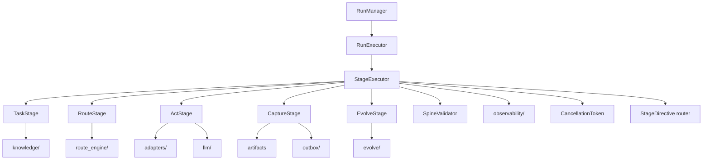

> **Pre-refresh design rationale (DEFERRED in 2026-05-08 refresh)**
> MERGED INTO `agent-runtime/run/ARCHITECTURE.md` in the refresh.
> The authoritative L0 is `ARCHITECTURE.md`; the
> systems-engineering plan is `docs/plans/architecture-systems-engineering-plan.md`.
> This file is retained as v6 design rationale and will be
> archived under `docs/v6-rationale/` at W0 close.

# runner -- TRACE Run Executor (L2)

> **L2 sub-architecture of `agent-runtime/`.** Up: [`../ARCHITECTURE.md`](../ARCHITECTURE.md) . L0: [`../../ARCHITECTURE.md`](../../ARCHITECTURE.md)

---

## 1. Purpose & Boundary

`runner/` owns the **TRACE 5-stage durable execution model** -- the heart of agent run lifecycle. It implements `RunExecutor` which drives a `TaskContract` through 5 stages (Task -> Route -> Act -> Capture -> Evolve) with restart-survival, cancellation, observability, and stage-directive support.

Owns:

- `RunExecutor` -- async stage driver
- `StageExecutor` -- single-stage execution (5 implementations: TaskStage, RouteStage, ActStage, CaptureStage, EvolveStage)
- `TraceState` -- 6 durable states + 5 span types
- `StageDirective` -- runtime instruction (`skipTo`, `insertStage`, `replan`)
- `SpineValidator` -- runtime spine-record validation entry point

Does NOT own:

- Run persistence (delegated to `../server/RunManager.java` and stores)
- LLM transport (delegated to `../llm/`)
- Framework dispatch (delegated to `../adapters/`)
- Cancellation token primitive (delegated to `../runtime/CancellationToken.java`)
- HTTP / route handling (delegated to `agent-platform/api/`)

---

## 2. Why TRACE 5 stages (D-9 in L0)

v5.0 proposed an 11-state cognitive workflow graph. The v6.0 review (M1) found this conflated two orthogonal concerns:

- **Lifecycle states** (need persistence + recovery semantics): 6 of v5.0's 11 actually require durability.
- **Cognitive activities** (intent, retrieve, think, reflect): these are span types in trace context, not states with persistence.

v6.0 separates: 5 TRACE stages (S1-S5) drive the run; cognitive activities are recorded as spans within stages.

### TRACE stages

| Stage | Purpose | Typical duration | Cognitive activities (as spans) |
|---|---|---|---|
| **S1 -- Task** | Parse goal; build TaskView; validate inputs | sub-second | intent_understanding, validate |
| **S2 -- Route** | Decide capability + framework + tier | sub-second | retrieving (knowledge), thinking (route decision) |
| **S3 -- Act** | Execute via FrameworkAdapter; LLM calls; tool invocations | majority of run time | thinking, tool_call, retrieving |
| **S4 -- Capture** | Persist artifacts; outbox events; spine emit | sub-second | reflecting (self-eval) |
| **S5 -- Evolve** | Recurrence-ledger update; postmortem trigger; A/B feedback | sub-second | reflecting |

### 6 durable run states

| State | Persisted | Notes |
|---|---|---|
| `INITIALIZED` | yes | RunManager.createRun returns this |
| `WORKING` | yes | rolled-up state for S1-S5 in progress |
| `AWAITING_TOOL` | yes | external tool/MCP invocation in flight |
| `AWAITING_HITL` | yes | human gate paused; PauseToken issued |
| `FINALIZING` | yes | terminal but cleanup in progress |
| `TERMINAL` | yes | sub-states: COMPLETED / CANCELLED / FAILED |

State transitions go through `RunManager.transition` (single-write path; rejects illegal edges) and emit `record_run_*` events.

---

## 3. Building blocks



---

## 4. Key data structures

```java
public sealed interface TraceState {
    record Initialized(RunId id) implements TraceState {}
    record Working(RunId id, String currentStage) implements TraceState {}
    record AwaitingTool(RunId id, String toolName, ToolCallId callId) implements TraceState {}
    record AwaitingHitl(RunId id, GateId gateId) implements TraceState {}
    record Finalizing(RunId id, RunResult result) implements TraceState {}
    record Terminal(RunId id, TerminalKind kind) implements TraceState {}
    
    enum TerminalKind { COMPLETED, CANCELLED, FAILED }
}

public sealed interface StageDirective {
    record Continue() implements StageDirective {}
    record SkipTo(String stageName) implements StageDirective {}
    record InsertStage(StageDescriptor stage, InsertPosition where) implements StageDirective {}
    record Replan(String reason) implements StageDirective {}
    record Pause(GateRequest gate) implements StageDirective {}
}

public record StageEvent(
    @NonNull String tenantId,
    @NonNull String runId,
    @NonNull String stageName,
    @NonNull StageEventKind kind,        // STARTED, COMPLETED, FAILED, SPAN
    @Nullable String spanType,           // intent_understanding | retrieving | thinking | reflecting | tool_call
    @Nullable Map<String, Object> attributes,
    @NonNull Instant ts
) {
    public StageEvent { /* @PostConstruct spine validation */ }
}
```

---

## 5. Architecture decisions

| ADR | Decision | Why |
|---|---|---|
| **AD-1: 5 TRACE stages, not 11** | Lifecycle is 5 stages; cognitive activities are spans | Hi-agent's TRACE has 32 wave-validated production hardening; 11-state was over-modeling |
| **AD-2: 6 durable states** | Recovery only needs 6 states | The other 5 in v5.0 were transient spans without persistence |
| **AD-3: StageDirective as sealed interface** | Type-safe runtime instructions: `Continue` / `SkipTo` / `InsertStage` / `Replan` / `Pause` | Hi-agent's W34 `replan` was implemented after this pattern; sealed interface = compile-time exhaustive switch |
| **AD-4: SpineValidator at every stage boundary** | Validate spine at stage entry + exit | Catches spine drift before it propagates to outbox |
| **AD-5: Cancellation honoured at every stage boundary** | `cancellationToken.checkInterrupt()` between stages | Sub-stage cancellation requires LLM provider cooperation; we cancel cleanly at boundaries |
| **AD-6: StageExecutor is reactive (Mono/Flux)** | `Mono<StageResult> execute(StageContext)` | Reactor scheduler binds resources (Rule 5) |
| **AD-7: TaskContract has 13 fields** | Inherits hi-agent's TaskContract shape | Stable; reviewers can map to hi-agent equivalents |

---

## 6. Cross-cutting hooks

- **Rule 5**: every `Mono.block()` outside CLI/tests is forbidden; StageExecutor is reactive
- **Rule 7**: stage failures emit `springAiAscend_stage_failed_total{stage, reason}` + WARNING + run-metadata fallback list + gate-asserted
- **Rule 8 hot-path**: `runner/` is hot-path; T3 evidence required on every commit
- **Rule 11**: every record in `runner/` carries spine; SpineValidator enforces
- **Rule 12**: TRACE capability targets L3 at v1 RELEASED

---

## 7. Quality

| Attribute | Target | Verification |
|---|---|---|
| Stage transition latency | p95 <= 50ms (excluding LLM) | OperatorShapeGate |
| Restart-survival | every persisted state recoverable | `tests/integration/RunCrashRecoveryIT` |
| Cancellation propagation | cancel mid-stage drives terminal in <= 30s | `gate/check_cancel.sh` |
| StageDirective compliance | all 5 directives produce correct next-stage | `tests/unit/StageDirectiveTest` |
| Cross-loop stability (Rule 8) | adapter/gateway shared across runs in JVM | `gate/check_cross_loop.sh` |

---

## 8. Risks

- **Hot-path freeze**: every commit invalidates T3 until fresh gate run
- **StageDirective expressiveness**: 5 directives may not cover all cases; `Replan` is escape hatch
- **Cancellation across LLM provider**: best-effort; provider-side cancellation requires HTTP/SSE close

## 9. References

- Hi-agent prior art: `D:/chao_workspace/hi-agent/hi_agent/runner.py` and `runner_stage.py`
- L1: [`../ARCHITECTURE.md`](../ARCHITECTURE.md)
- Adapters: [`../adapters/ARCHITECTURE.md`](../adapters/ARCHITECTURE.md)
