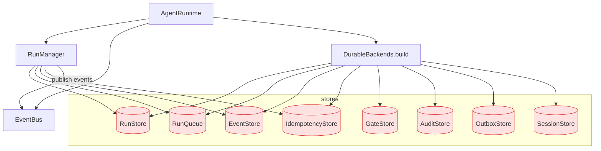

# server — AgentRuntime + RunManager + DurableBackends (L2)

> **L2 sub-architecture of `agent-runtime/`.** Up: [`../ARCHITECTURE.md`](../ARCHITECTURE.md) · L0: [`../../ARCHITECTURE.md`](../../ARCHITECTURE.md)

---

## 1. Purpose & Boundary

`server/` owns the **run lifecycle kernel and durable persistence boundary**. It holds the `AgentRuntime` umbrella, `RunManager` (thread-safe run lifecycle with lease heartbeat and idempotent replay), and durable Postgres-backed stores.

Owns:

- `AgentRuntime` — top-level umbrella; built by `agent-platform/runtime/RealKernelBackend`
- `RunManager` — run lifecycle state machine + lease heartbeat + queue-worker dispatch
- `DurableBackends.build()` — single construction path for all durable stores (Rule 6)
- 8 durable stores: `RunStore`, `RunQueue`, `EventStore`, `IdempotencyStore`, `GateStore`, `AuditStore`, `OutboxStore`, `SessionStore`
- `EventBus` — in-process pub-sub for outbox subscribers and SSE event fan-out

Does NOT own:

- HTTP transport (delegated to `agent-platform/api/`)
- Stage execution semantics (delegated to `../runner/`)
- LLM transport (delegated to `../llm/`)
- Framework dispatch (delegated to `../adapters/`)
- Reactive scheduling (delegated to `../runtime/ReactorScheduler.java`)

---

## 2. Building blocks



---

## 3. RunManager — state machine

```java
public class RunManager {
    public enum RunOutcome { CREATED, REPLAYED, REJECTED }
    
    public ManagedRun createRun(TaskContract contract, RunContext ctx) {
        // 1. tenant cross-check (auth-authoritative)
        validateTenantOrRaise(contract, ctx);
        
        // 2. idempotency reserve_or_replay
        var idem = idempotencyStore.reserveOrReplay(ctx.tenantId(), ctx.idempotencyKey(), contract.bodyHash());
        if (idem.isReplay()) return ManagedRun.replayed(idem);
        
        // 3. transition state machine
        runStore.upsert(RunRecord.queued(...));
        runQueue.enqueue(runId, ctx.tenantId());
        eventStore.append(ctx.tenantId(), runId, RunQueued.event());
        
        return ManagedRun.created(runId);
    }
    
    public void cancel(RunId id) {
        // 200 if known live; 404 if unknown; 409 if terminal (Rule 8 step 6)
    }
    
    public Flux<Event> iterEvents(TenantContext ctx, RunId id) {
        // SSE-friendly live stream from EventStore
    }
    
    public void rehydrateRuns() {
        // On startup: re-claim lease-expired runs; bump attemptId; link parentRunId
        // (mirrors hi-agent W35-T9)
    }
}
```

---

## 4. State transitions

```
INITIALIZED → WORKING → AWAITING_TOOL → WORKING → AWAITING_HITL → WORKING → FINALIZING → TERMINAL
                                                                        ↘ TERMINAL (CANCELLED / FAILED)
```

Single write path: `RunManager.transition(runId, fromState, toState)` rejects illegal edges (e.g., `TERMINAL → WORKING`). Lock-free via Postgres compare-and-swap (`UPDATE ... WHERE state = fromState`).

---

## 5. DurableBackends — single construction path (Rule 6)

```java
public class DurableBackends {
    public static DurableBackends build(DataSource ds, AppPosture posture, MeterRegistry meter) {
        // posture-aware: dev permits in-memory; research/prod requires real Postgres
        if (posture == DEV && System.getProperty("app.in-memory-stores") == "true") {
            return buildInMemory();
        }
        
        return new DurableBackends(
            new PostgresRunStore(ds, meter),
            new PostgresRunQueue(ds, meter),
            new PostgresEventStore(ds, meter),
            new PostgresIdempotencyStore(ds, meter),
            new PostgresGateStore(ds, meter),
            new PostgresAuditStore(ds, meter),
            new PostgresOutboxStore(ds, meter),
            new PostgresSessionStore(ds, meter)
        );
    }
}
```

**Forbidden** (Rule 6): inline `store != null ? store : new InMemoryX()`. CI rejects.

---

## 6. Architecture decisions

| ADR | Decision | Why |
|---|---|---|
| **AD-1: Single construction path** | `DurableBackends.build` is the only place stores are created | Hi-agent DF-11: inline fallback caused two unshared in-memory copies in production |
| **AD-2: Postgres CAS for state transitions** | `UPDATE ... WHERE state = fromState`; row count = 0 = rejected | Lock-free; no application-level locking on hot path |
| **AD-3: Run lease + heartbeat for crash detection** | Lease TTL = 60s; heartbeat every 15s | Mirrors hi-agent's pattern; rehydrate on startup re-claims expired |
| **AD-4: rehydrate bumps attemptId on re-lease** | Fresh UUID for each attempt; parentRunId links lineage | Hi-agent W35-T9: per-attempt metrics need distinct attemptId |
| **AD-5: Tenant_id in every store** | Postgres RLS + application-level cross-check | Cross-tenant leak prevented at multiple layers |
| **AD-6: 24h purge for IdempotencyStore** | `purgeExpired` + lifespan loop + `springaifin_idempotency_purged_total` | Mirrors hi-agent W35-T4; reference shape for all stores |
| **AD-7: EventBus is in-process at MVP** | Spring `ApplicationEventPublisher` | Multi-replica federation deferred to v1.1 (Kafka adoption) |

---

## 7. Cross-cutting hooks

- **Rule 5**: stores own connection-pooled `DataSource` (HikariCP); never construct per-request
- **Rule 6**: `DurableBackends.build` enforced
- **Rule 7**: store-write failures emit Counter + WARNING + RecoveryAlarm
- **Rule 11**: every persistent record carries `tenant_id` (RLS-enforced at Postgres + spine validator)
- **Rule 12**: `RunManager` capability targets L3 at v1 RELEASED (long-lived process + real-LLM + posture-default + observable)

---

## 8. Quality

| Attribute | Target | Verification |
|---|---|---|
| Run dispatch p95 (excl. LLM) | ≤ 50ms | OperatorShapeGate |
| Restart-survival | every persisted run recoverable | `tests/integration/RunCrashRecoveryIT` |
| Lease re-claim | within 60s of expiry | `tests/integration/LeaseRecoveryIT` |
| Tenant isolation | cross-tenant read returns 404 | `tests/integration/CrossTenantIsolationIT` |
| Cancellation contract | 200/404/409 | `gate/check_cancel.sh` |
| Idempotency | reserve+replay+conflict | `tests/integration/IdempotencyContractIT` |

---

## 9. Risks

- **EventBus is process-local**: multi-replica deployment requires every replica to wire to same DB; EventBus does not federate. Adopt Kafka in v1.1.
- **Single-process kernel**: `_runs` (in-flight registry) is process-local; partial restart between enqueue and event publish reconciles via lease expiry + rehydrate. Cross-process run sharing deferred.
- **Postgres CAS contention**: at very high concurrency on a single run, CAS may need retry; bounded retry budget configured.

## 10. References

- Hi-agent prior art: `D:/chao_workspace/hi-agent/hi_agent/server/ARCHITECTURE.md`
- L1: [`../ARCHITECTURE.md`](../ARCHITECTURE.md)
- Outbox: [`../outbox/ARCHITECTURE.md`](../outbox/ARCHITECTURE.md)
