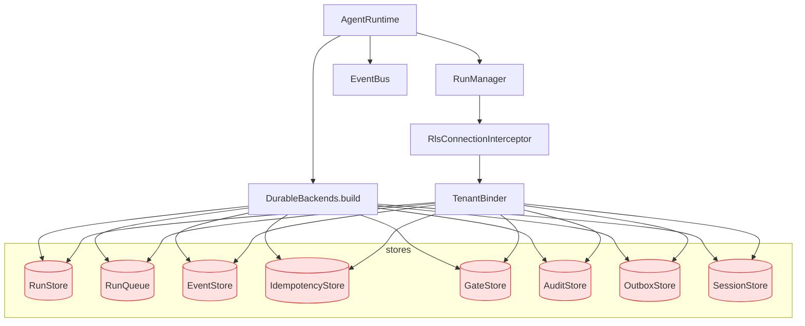

# server -- AgentRuntime + RunManager + DurableBackends + RLS Protocol (L2)

> **L2 sub-architecture of `agent-runtime/`.** Up: [`../ARCHITECTURE.md`](../ARCHITECTURE.md) . L0: [`../../ARCHITECTURE.md`](../../ARCHITECTURE.md)

---

## 1. Purpose & Boundary

`server/` owns the **run lifecycle kernel and durable persistence boundary**. It holds the `AgentRuntime` umbrella, `RunManager` (thread-safe run lifecycle with lease heartbeat and idempotent replay), durable Postgres-backed stores, and the **tenant-RLS connection protocol** that binds every database transaction to its `tenant_id` before any store query runs.

Owns:

- `AgentRuntime` -- top-level umbrella; built by `agent-platform/runtime/RealKernelBackend`
- `RunManager` -- run lifecycle state machine + lease heartbeat + queue-worker dispatch
- `DurableBackends.build()` -- single construction path for all durable stores (Rule 6)
- 8 durable stores: `RunStore`, `RunQueue`, `EventStore`, `IdempotencyStore`, `GateStore`, `AuditStore`, `OutboxStore`, `SessionStore`
- `EventBus` -- in-process pub-sub for outbox subscribers and SSE event fan-out
- `TenantBinder` -- single seam that runs `SET LOCAL app.tenant_id = :tenantId` at the start of every tenant-scoped transaction
- `RlsConnectionInterceptor` -- AOP advice that asserts a tenant binding is active before any tenant-scoped store call runs
- `TransactionStartGucValidator` -- defense-in-depth invoked by `TenantBinder` at the start of every tenant-scoped transaction; asserts `current_setting('app.tenant_id', true)` is empty (i.e., no stale GUC survived from a prior lease) before the new `SET LOCAL` runs. NOT a HikariCP lifecycle hook -- `connectionInitSql` runs only at connection creation, not at checkout (per HikariCP docs); the actual safety property is Postgres's transaction-scoped `SET LOCAL` auto-discard, validated by `PooledConnectionLeakageIT`.

Does NOT own:

- HTTP transport (delegated to `agent-platform/api/`)
- Stage execution semantics (delegated to `../runner/`)
- LLM transport (delegated to `../llm/`)
- Framework dispatch (delegated to `../adapters/`)
- Reactive scheduling (delegated to `../runtime/ReactorScheduler.java`)

---

## 2. Building blocks



---

## 3. RunManager -- state machine

```java
public class RunManager {
    public enum RunOutcome { CREATED, REPLAYED, REJECTED }

    public ManagedRun createRun(TaskContract contract, RunContext ctx) {
        return tenantBinder.inTenantTransaction(ctx.tenantId(), conn -> {
            // 1. tenant cross-check (auth-authoritative)
            validateTenantOrRaise(contract, ctx);

            // 2. idempotency reserve_or_replay
            var idem = idempotencyStore.reserveOrReplay(ctx.tenantId(), ctx.idempotencyKey(), contract.bodyHash());
            if (idem.isReplay()) return ManagedRun.replayed(idem);

            // 3. transition state machine
            runStore.upsert(RunRecord.queued(...));
            runQueue.enqueue(runId, ctx.tenantId());
            eventStore.append(ctx.tenantId(), runId, RunQueued.event());

            return ManagedRun.created(runId);
        });
    }

    public void cancel(RunId id) {
        // 200 if known live; 404 if unknown; 409 if terminal (Rule 8 step 6)
    }

    public Flux<Event> iterEvents(TenantContext ctx, RunId id) {
        // SSE-friendly live stream from EventStore
    }

    public void rehydrateRuns() {
        // On startup: re-claim lease-expired runs; bump attemptId; link parentRunId
        // (mirrors hi-agent W35-T9)
    }
}
```

Every entry to a tenant-scoped store call goes through `TenantBinder.inTenantTransaction`. Stores raise `TenantContextMissingException` if invoked outside an active binding.

---

## 4. State transitions

```
INITIALIZED -> WORKING -> AWAITING_TOOL -> WORKING -> AWAITING_HITL -> WORKING -> FINALIZING -> TERMINAL
                                                                        -> TERMINAL (CANCELLED / FAILED)
```

Single write path: `RunManager.transition(runId, fromState, toState)` rejects illegal edges (e.g., `TERMINAL -> WORKING`). Lock-free via Postgres compare-and-swap (`UPDATE ... WHERE state = fromState`).

---

## 5. DurableBackends -- single construction path (Rule 6)

```java
public class DurableBackends {
    public static DurableBackends build(DataSource ds, AppPosture posture, MeterRegistry meter) {
        // posture-aware: dev permits in-memory; research/prod requires real Postgres
        if (posture == DEV && System.getProperty("app.in-memory-stores") == "true") {
            return buildInMemory();
        }

        return new DurableBackends(
            new PostgresRunStore(ds, meter),
            new PostgresRunQueue(ds, meter),
            new PostgresEventStore(ds, meter),
            new PostgresIdempotencyStore(ds, meter),
            new PostgresGateStore(ds, meter),
            new PostgresAuditStore(ds, meter),
            new PostgresOutboxStore(ds, meter),
            new PostgresSessionStore(ds, meter)
        );
    }
}
```

**Forbidden** (Rule 6): inline `store != null ? store : new InMemoryX()`. CI rejects.

---

## 6. Tenant RLS connection protocol

The platform claims that every tenant-scoped record in Postgres is RLS-isolated. That claim is real **only if every database transaction runs with the right tenant binding active**. The protocol below makes the binding a structural property of the data path, not a matter of caller discipline. This is the explicit answer to security review sec-P0-3 and remediation sec-7.3.

### 6.1 Three layered guarantees

1. **Database (Postgres RLS)**: every tenant-scoped table has `ENABLE ROW LEVEL SECURITY` plus a policy of the shape `USING (tenant_id = current_setting('app.tenant_id'))`. Migrations ship the policy alongside the table; `RlsPolicyCoverageTest` greps the Flyway scripts and asserts every tenant-scoped table has its policy.
2. **Connection (`SET LOCAL app.tenant_id`)**: every tenant-scoped transaction issues `SET LOCAL app.tenant_id = :tenantId` immediately after `BEGIN` and before any tenant-scoped read or write. Because `SET LOCAL` is transaction-scoped, the binding cannot leak past `COMMIT` / `ROLLBACK`.
3. **Pool (transaction-scoped GUC; not `connectionInitSql`)**: `app.tenant_id` is set with `SET LOCAL`, which Postgres scopes to the current transaction and **automatically discards on `COMMIT` / `ROLLBACK`** (per Postgres docs on `SET LOCAL`). When the connection returns to the HikariCP pool, no `app.tenant_id` value persists on it. This is the actual safety property; it does **not** depend on HikariCP `connectionInitSql` -- that hook only runs once when a new connection is created and added to the pool, **not on every checkout**, so it is unsuitable as a per-checkout reset mechanism. Defense-in-depth: `TenantBinder` validates that `current_setting('app.tenant_id', true)` is empty at the start of each transaction (catches a hypothetical `SET` without `LOCAL` from a different code path). `PooledConnectionLeakageIT` proves connection reuse does not leak state by leasing a connection under tenant A, returning it, and asserting the next lease for tenant B starts with no `app.tenant_id` set.

### 6.2 The TenantBinder seam

```java
@Component
public class TenantBinder {
    private final DataSource dataSource;
    private final AppPosture posture;

    public <R> R inTenantTransaction(String tenantId, TransactionalWork<R> work) {
        Objects.requireNonNull(tenantId, "tenantId");
        if (tenantId.isBlank()) {
            // addresses P0-3 (status: design_accepted): research/prod fail closed; dev warns.
            if (posture.requiresStrict()) {
                throw new TenantContextMissingException(
                    ContractError.of("tenantScope", "tenantId is blank in tenant-scoped transaction"));
            }
            log.warn("blank tenantId in tenant-scoped transaction; dev posture only");
        }
        try (var c = dataSource.getConnection()) {
            c.setAutoCommit(false);
            try (var stmt = c.prepareStatement("SET LOCAL app.tenant_id = ?")) {
                stmt.setString(1, tenantId);
                stmt.execute();
            }
            try {
                R result = work.run(c);
                c.commit();
                return result;
            } catch (Throwable t) {
                c.rollback();
                throw t;
            }
        } catch (SQLException e) {
            throw new RuntimeContractException(
                ContractError.of("internal", "tenant-scoped transaction failed"), e);
        }
    }
}
```

`TenantBinder.inTenantTransaction` is the **only** sanctioned entry point to a tenant-scoped transaction. Stores call into it via a lambda; raw `JdbcTemplate.execute` against tenant-scoped tables is forbidden.

### 6.3 RlsConnectionInterceptor (AOP advice)

```java
@Aspect
@Component
public class RlsConnectionInterceptor {

    @Pointcut("execution(* agent-runtime.server..stores..*Store.*(..))")
    public void tenantScopedStoreCall() {}

    @Around("tenantScopedStoreCall()")
    public Object enforceTenantBinding(ProceedingJoinPoint pjp) throws Throwable {
        if (!TenantContext.isBoundOnCurrentTransaction()) {
            // No active tenant binding on the current Postgres connection.
            // Research/prod: fail closed. Dev: warn + permit.
            if (posture.requiresStrict()) {
                throw new TenantContextMissingException(
                    ContractError.of("tenantScope",
                        "tenant-scoped store called without active tenant binding: "
                        + pjp.getSignature()));
            }
            log.warn("tenant-scoped store called without binding (dev posture): {}",
                pjp.getSignature());
        }
        return pjp.proceed();
    }
}
```

`TenantContext.isBoundOnCurrentTransaction()` reads the `app.tenant_id` GUC via `SHOW app.tenant_id` (cached per-transaction). If the value is empty, the call is rejected.

### 6.4 Forbidden patterns

The following are static-analysis violations and fail CI via `RlsConnectionAuditTest`:

- A tenant-scoped store method that does not run inside `TenantBinder.inTenantTransaction`.
- A `JdbcTemplate.execute(...)` against a tenant-scoped table that did not first issue `SET LOCAL app.tenant_id`.
- A connection checkout that bypasses HikariCP (e.g., `DriverManager.getConnection`).
- A query whose WHERE clause filters by `tenant_id` parameter rather than relying on RLS -- RLS is the trust boundary; filter-by-parameter is defense-in-depth, not the boundary.

### 6.5 Cross-tenant read returns 404, not empty success

A tenant-scoped query that finds zero rows because the row belongs to another tenant returns the **same** envelope as a query that finds zero rows because the row does not exist: `404 NotFound`. Returning `200 OK` with an empty body would mask leakage by side channel (timing or cache). The HTTP layer (`agent-platform/api/`) maps `NotFoundException` to 404; the store returns `Optional.empty()` and the controller raises.

### 6.6 Tests (W2 deliverables)

| Test | What it asserts |
|---|---|
| `TenantBindingIT` | Every tenant-scoped store call inside `TenantBinder` emits `SET LOCAL app.tenant_id` at transaction start |
| `RlsConnectionIsolationIT` | A query running under tenant A cannot read rows belonging to tenant B; Postgres returns zero rows; controller maps to 404 |
| `CrossTenantEventReadReturns404IT` | `GET /v1/runs/{id}/events` for a run owned by tenant B, requested by tenant A, returns 404 -- not 200 with an empty array |
| `PooledConnectionLeakageIT` | After a connection serving tenant A returns to the pool, the next checkout for tenant B does not see `app.tenant_id` set to A |
| `MissingTenantFailsClosedIT` | Under `research` and `prod` posture, a store call without active tenant binding raises `TenantContextMissingException` |
| `RlsPolicyCoverageTest` | Every Flyway script defining a tenant-scoped table also creates the matching `tenant_isolation` RLS policy |
| `RlsConnectionAuditTest` | Reflective check: every store method routed through `TenantBinder`; raw `JdbcTemplate` against tenant-scoped tables fails the build |

---

## 7. Architecture decisions

| ADR | Decision | Why |
|---|---|---|
| **AD-1: Single construction path** | `DurableBackends.build` is the only place stores are created | Hi-agent DF-11: inline fallback caused two unshared in-memory copies in production |
| **AD-2: Postgres CAS for state transitions** | `UPDATE ... WHERE state = fromState`; row count = 0 = rejected | Lock-free; no application-level locking on hot path |
| **AD-3: Run lease + heartbeat for crash detection** | Lease TTL = 60s; heartbeat every 15s | Mirrors hi-agent's pattern; rehydrate on startup re-claims expired |
| **AD-4: rehydrate bumps attemptId on re-lease** | Fresh UUID for each attempt; parentRunId links lineage | Hi-agent W35-T9: per-attempt metrics need distinct attemptId |
| **AD-5: Tenant_id in every store** | Postgres RLS + application-level cross-check | Cross-tenant leak prevented at multiple layers |
| **AD-6: 24h purge for IdempotencyStore** | `purgeExpired` + lifespan loop + `springaifin_idempotency_purged_total` | Mirrors hi-agent W35-T4; reference shape for all stores |
| **AD-7: EventBus is in-process at MVP** | Spring `ApplicationEventPublisher` | Multi-replica federation deferred to v1.1 (Kafka adoption) |
| **AD-8: TenantBinder is the only entry to tenant-scoped transactions** | Raw `JdbcTemplate.execute` against tenant-scoped tables forbidden by `RlsConnectionAuditTest` | addresses P0-3 (status: design_accepted); tenant binding is structural, not caller-discipline |
| **AD-9: Transaction-scoped GUC, not `connectionInitSql`, is the per-lease safety mechanism** | `SET LOCAL app.tenant_id` is auto-discarded by Postgres on `COMMIT`/`ROLLBACK`; `TenantBinder` checks the GUC is empty at transaction start as defense-in-depth; `PooledConnectionLeakageIT` proves reuse does not leak | `connectionInitSql` runs only at connection creation (per HikariCP docs), not on every checkout, so it cannot be the reset hook. The transaction-scoped GUC is the property that actually holds. |
| **AD-10: Cross-tenant reads return 404, not 200 empty** | NotFoundException mapped to 404 | Empty 200 is a side-channel signal of "you almost saw something"; 404 is indistinguishable from "does not exist" |

---

## 8. Cross-cutting hooks

- **Rule 5**: stores own connection-pooled `DataSource` (HikariCP); never construct per-request
- **Rule 6**: `DurableBackends.build` enforced
- **Rule 7**: store-write failures emit Counter + WARNING + RecoveryAlarm; tenant-binding-missing emits `springaifin_rls_binding_missing_total{posture, store}`
- **Rule 11**: every persistent record carries `tenant_id` (RLS-enforced at Postgres + spine validator + RlsConnectionInterceptor at runtime)
- **Rule 12**: `RunManager` capability targets L3 at v1 RELEASED (long-lived process + real-LLM + posture-default + observable)

---

## 9. Quality

| Attribute | Target | Verification |
|---|---|---|
| Run dispatch p95 (excl. LLM) | <= 50ms | OperatorShapeGate |
| Restart-survival | every persisted run recoverable | `tests/integration/RunCrashRecoveryIT` |
| Lease re-claim | within 60s of expiry | `tests/integration/LeaseRecoveryIT` |
| Tenant isolation | cross-tenant read returns 404 | `tests/integration/CrossTenantIsolationIT` |
| RLS connection protocol | `SET LOCAL app.tenant_id` issued at every tenant-scoped txn start | `TenantBindingIT` |
| Pooled connection cleanup | no `app.tenant_id` leak across leases | `PooledConnectionLeakageIT` |
| Missing tenant fails closed under research/prod | `TenantContextMissingException` | `MissingTenantFailsClosedIT` |
| RLS policy coverage | every tenant-scoped table has its policy | `RlsPolicyCoverageTest` |
| Cancellation contract | 200/404/409 | `gate/check_cancel.sh` |
| Idempotency | reserve+replay+conflict | `tests/integration/IdempotencyContractIT` |

---

## 10. Risks

- **EventBus is process-local**: multi-replica deployment requires every replica to wire to same DB; EventBus does not federate. Adopt Kafka in v1.1.
- **Single-process kernel**: `_runs` (in-flight registry) is process-local; partial restart between enqueue and event publish reconciles via lease expiry + rehydrate. Cross-process run sharing deferred.
- **Postgres CAS contention**: at very high concurrency on a single run, CAS may need retry; bounded retry budget configured.
- **`SHOW app.tenant_id` per-call cost**: cached per-transaction; profiled at <1us hit; not on hot path.

---

## 11. References

- Hi-agent prior art: `D:/chao_workspace/hi-agent/hi_agent/server/ARCHITECTURE.md`
- L1: [`../ARCHITECTURE.md`](../ARCHITECTURE.md)
- Outbox: [`../outbox/ARCHITECTURE.md`](../outbox/ARCHITECTURE.md)
- Action-guard (consumer of TenantBinder via Stage 2 TenantBindingChecker): [`../action-guard/ARCHITECTURE.md`](../action-guard/ARCHITECTURE.md)
- Posture: [`../posture/ARCHITECTURE.md`](../posture/ARCHITECTURE.md)
- Security review: [`../../docs/deep-architecture-security-assessment-2026-05-07.en.md`](../../docs/deep-architecture-security-assessment-2026-05-07.en.md) sec-P0-3
- Systematic-architecture-remediation-plan: [`../../docs/systematic-architecture-remediation-plan-2026-05-08.en.md`](../../docs/systematic-architecture-remediation-plan-2026-05-08.en.md) sec-7.3
