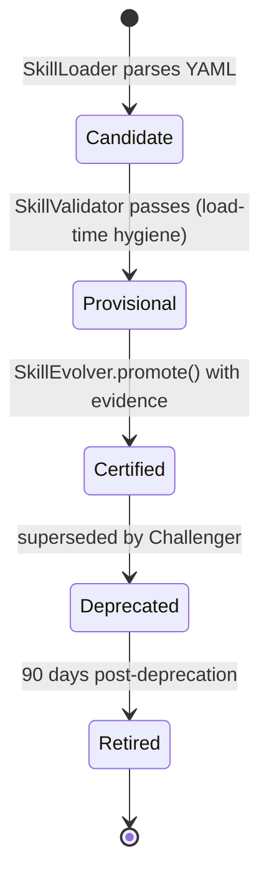

> **Pre-refresh design rationale (DEFERRED in 2026-05-08 refresh)**
> MERGED INTO `agent-runtime/tool/ARCHITECTURE.md` in the refresh.
> The authoritative L0 is `ARCHITECTURE.md`; the
> systems-engineering plan is `docs/plans/architecture-systems-engineering-plan.md`.
> This file is retained as v6 design rationale and will be
> archived under `docs/v6-rationale/` at W0 close.

# skill -- MCP Tools + Spring AI Advisors (L2)

> **L2 sub-architecture of `agent-runtime/`.** Up: [`../ARCHITECTURE.md`](../ARCHITECTURE.md) . L0: [`../../ARCHITECTURE.md`](../../ARCHITECTURE.md)

---

## 1. Purpose & Boundary

`skill/` owns the **skill capability layer**: definition parsing, lifecycle registry (Candidate -> Provisional -> Certified -> Deprecated -> Retired), observation telemetry, evolution loop, and version management (A/B + Champion/Challenger). It also owns the **load-time registry hygiene gate** (the dangerous-capability check).

> **Important security boundary** (per `../action-guard/` AD-1 and security review sec-P0-1, sec-P0-6):
> The load-time gate in this package is **registry hygiene**, not the runtime security boundary. It catches *registration* of skills that declare dangerous capabilities. Every actual side-effectful skill **invocation** at runtime must additionally pass through `ActionGuard.authorize(envelope)` (`../action-guard/`). Load-time and runtime are complementary, not redundant; both must hold for a skill to take effect on a tenant resource.

In the spring-ai-fin context, a "skill" = a reusable agent capability composed of:

- An MCP tool (StdIO transport) OR a Spring AI Advisor
- A skill definition (YAML) describing inputs/outputs/safety classification
- Observation telemetry feeding the evolve loop

Owns:

- `SkillDefinition` -- parsed YAML
- `SkillLoader` -- definition parser + validator + load-time hygiene gate
- `SkillRegistry` -- JSON-backed lifecycle store
- `ManagedSkill` -- lifecycle stage record
- `SkillObservation` -- JSONL telemetry per usage
- `SkillEvolver` -- OPTIMIZE / CREATE modes for prompt+tool evolution
- `SkillVersionManager` -- A/B versioning + Champion/Challenger
- `McpToolBridge` -- runtime entry point that constructs an `ActionEnvelope` and routes through `ActionGuard.authorize` for every tool invocation
- `SkillInvocationEntryPoint` -- runtime entry point that does the same for Spring AI Advisor calls that produce side effects

Does NOT own:

- LLM consumption (delegated to `../llm/`)
- Capability execution (delegated to `../capability/`)
- Runtime authorization (delegated to `../action-guard/`)
- HTTP routes (delegated to `agent-platform/api/`)
- Event-store recording (delegated to `../server/EventStore`)

---

## 2. Why JSON-backed registry, not a database

Skills are per-profile assets with read-once-at-boot pattern + small working set (hundreds per tenant). Single `registry.json` per tenant is sufficient. Adding a database would:

- Require migrations
- Add operational complexity
- Lose human-readability for `git diff` reviews of skill definitions

**v1 decision**: JSON-backed; promotion/demotion writes append a `PromotionRecord` (capped N=20 history per skill).

---

## 3. Lifecycle stages



Each stage has eligibility rules:

- **Candidate** -- loaded but not validated
- **Provisional** -- schema valid + dangerous-capability **load-time hygiene** gate passes
- **Certified** -- promoted with evidence (>=30 successful invocations through ActionGuard, posture default-on, audit clean)
- **Deprecated** -- superseded by Challenger; still callable but warning-logged
- **Retired** -- removed from registry; only audit history remains

A skill that is `Provisional` or higher is **registered** but not yet authorized for any specific runtime invocation. Authorization is decided at runtime by `ActionGuard`, per envelope.

---

## 4. Load-time hygiene gate (registry-quality check, NOT runtime authorization)

Skills declaring `allowed_tools: [filesystem.write, network.outbound, shell.exec]` are flagged dangerous. The gate fires at **skill load time** and rejects the registration if the declared tools are not approved for the tenant's profile:

```java
public class SkillLoader {
    public SkillDefinition load(Path yamlPath, AppPosture posture) {
        var def = parseYaml(yamlPath);
        var dangerous = extensionManifest.dangerousCapabilities(def.id());
        var allowed = def.allowedTools();
        var intersection = allowed.intersect(dangerous);

        if (!intersection.isEmpty()) {
            if (posture.requiresStrict()) {
                throw new DangerousCapabilityException(
                    "skill " + def.id() + " requests dangerous tools: " + intersection +
                    ". Requires explicit approval and documented mitigation.");
            } else {
                log.warn("skill {} requests dangerous tools {}; permitted in dev posture", def.id(), intersection);
            }
        }
        return def;
    }
}
```

This gate prevents a malformed or hostile skill definition from entering the registry under research/prod posture. It does **not** authorize any specific invocation; that decision belongs to ActionGuard.

---

## 5. Runtime security boundary (ActionGuard authorization)

Every side-effectful invocation of a registered skill -- whether through `McpToolBridge` (MCP tool) or `SkillInvocationEntryPoint` (Spring AI Advisor) -- constructs an `ActionEnvelope` and routes through `ActionGuard.authorize(envelope)`. The skill cannot reach its handler without the envelope being approved.

```java
@Component
public class McpToolBridge {
    private final ActionGuard actionGuard;       // mandatory gate
    private final CapabilityInvoker invoker;     // delegated to by ActionGuard Stage 10

    public Object invokeTool(String capabilityName, String toolName,
                             Map<String, Object> args, RunContext ctx) {
        var envelope = ActionEnvelope.builder()
            .tenantId(ctx.tenantContext().tenantId())
            .actorUserId(ctx.actor().userId())
            .runId(ctx.runId())
            .capabilityName(capabilityName)
            .toolName(toolName)
            .effectClass(descriptor(capabilityName).effectClass())
            .riskClass(descriptor(capabilityName).riskClass())
            .dataAccessClass(descriptor(capabilityName).dataAccessClass())
            .resourceScope(deriveResourceScope(args))
            .argumentsHash(sha256(args))
            .proposalSource(ProposalSource.LLM_OUTPUT)            // tool calls from LLM are tainted
            .proposalTaint(TaintLevel.UNTRUSTED)
            .build();
        return actionGuard.authorize(envelope);                   // Throws PolicyDecision.deny on rejection
                                                                   // Stage 10 Executor invokes CapabilityInvoker
    }
}
```

Code that bypasses `ActionGuard.authorize` and calls `CapabilityInvoker.invoke` directly is a CI violation, caught by `ActionGuardCoverageTest` in `../action-guard/`. The same `ActionGuardCoverageTest` walks `McpToolBridge`, `SkillInvocationEntryPoint`, and every Spring AI Advisor that produces a tool call.

### Why both gates

| Gate | When | What it catches | What it does NOT catch |
|---|---|---|---|
| Load-time hygiene (`SkillLoader`) | Skill registration | Malformed definitions; declared dangerous capabilities without operator approval; schema violations | Per-tenant entitlement, per-invocation taint, per-call OPA red-line policies, audit-before-action requirements |
| Runtime authorization (`ActionGuard`) | Every side-effect invocation | Tenant binding mismatch, missing entitlement, capability maturity vs posture, effect/data-access classification, OPA red-line, HitlGate, pre-action audit | Skill registration hygiene problems (those would have been caught at load) |

Both gates are mandatory. Removing the load-time gate would let malformed registrations sit in the registry; removing the runtime gate would let LLM-generated tool calls produce side effects without the per-tenant, per-call decision.

---

## 6. Architecture decisions

| ADR | Decision | Why |
|---|---|---|
| **AD-1: JSON-backed registry per tenant** | Not a DB | Read-once-at-boot pattern; small working set; git-diff-friendly |
| **AD-2: Lifecycle 5-stage** | Candidate -> Provisional -> Certified -> Deprecated -> Retired | Mirrors hi-agent's lifecycle; well-trodden |
| **AD-3: Load-time gate is registry hygiene; runtime authorization is ActionGuard** | Both gates run; neither replaces the other | addresses P0-1 + P0-6 (status: design_accepted); load-time alone leaves the runtime side-effect boundary undefended |
| **AD-4: SkillUsageRecorder != EventStore** | Two distinct stores | Recorder updates lifecycle counters; EventStore logs run events for replay |
| **AD-5: Champion/Challenger via SkillVersionManager** | A/B versioning with explicit promotion | Evolution loop produces challengers; champion holds production traffic until challenger proves out |
| **AD-6: Spine on every record** | tenant_id, project_id, run_id (where applicable) | Rule 11 strict-posture validation |
| **AD-7: Promotion history capped N=20** | per skill | Bounded growth; older history archived |
| **AD-8: McpToolBridge constructs ActionEnvelope on every invocation** | No raw bridge call to `CapabilityInvoker` | `ActionGuardCoverageTest` rejects bypass paths |

---

## 7. Cross-cutting hooks

- **Rule 11**: every `ManagedSkill` and `SkillObservation` carries spine; constructor raises `SpineCompletenessException` under strict posture if missing
- **Rule 7**: skill-load failures emit `springaifin_skill_load_errors_total` + WARNING + fallback to "skill unavailable; agent uses fallback path"; runtime ActionGuard rejections emit per-stage counters per `../action-guard/` Rule 7 hook
- **Rule 8**: skill registry warm at boot; `ActionGuardCoverageTest` is part of the operator-shape gate
- **Posture-aware**: dev permits dangerous capabilities at load with WARN; research/prod fail-closed at load AND fail-closed at runtime via ActionGuard

---

## 8. Quality

| Attribute | Target | Verification |
|---|---|---|
| Skill load time at boot | <= 2s for 100-skill registry | `tests/integration/SkillLoaderIT` |
| Cross-tenant skill isolation | yes | `tests/integration/SkillTenantIsolationIT` |
| Dangerous capability load-time gate enforcement | yes under strict posture | `tests/integration/DangerousCapabilityLoadTimeIT` |
| Runtime authorization for every side-effect invocation | 100% of invocations route through ActionGuard | `tests/integration/RuntimeActionGuardForEverySideEffectIT` |
| Promotion record capped | N=20 enforced | `tests/unit/PromotionRecordCapTest` |
| Bypass detection | bridge call to CapabilityInvoker without ActionGuard fails CI | `ActionGuardCoverageTest` (in `../action-guard/`) |

## 9. Risks

- **Skill ecosystem evolution**: customer-supplied skills evolve faster than platform; `SkillEvolver` provides primitive but customer-side workflow drives
- **Champion/Challenger traffic split**: Tier-2 GrowthBook integration when needed; until then, manual split
- **Mistaking load-time hygiene for runtime authorization**: documented in AD-3; reviewer audit on every PR that touches `SkillLoader` or `McpToolBridge`

## 10. References

- L1: [`../ARCHITECTURE.md`](../ARCHITECTURE.md)
- Capability registry: [`../capability/ARCHITECTURE.md`](../capability/ARCHITECTURE.md)
- Action-guard (runtime authorization): [`../action-guard/ARCHITECTURE.md`](../action-guard/ARCHITECTURE.md)
- Hi-agent prior art: `D:/chao_workspace/hi-agent/hi_agent/skill/ARCHITECTURE.md`
- Spring AI Advisors: https://docs.spring.io/spring-ai/reference/2.0/api/advisors.html
- MCP: https://modelcontextprotocol.io/
- Systematic-architecture-remediation-plan: [`../../docs/systematic-architecture-remediation-plan-2026-05-08.en.md`](../../docs/systematic-architecture-remediation-plan-2026-05-08.en.md) sec-7.2
