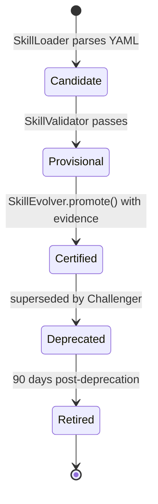

# skill — MCP Tools + Spring AI Advisors (L2)

> **L2 sub-architecture of `agent-runtime/`.** Up: [`../ARCHITECTURE.md`](../ARCHITECTURE.md) · L0: [`../../ARCHITECTURE.md`](../../ARCHITECTURE.md)

---

## 1. Purpose & Boundary

`skill/` owns the **skill capability layer**: definition parsing, lifecycle registry (Candidate → Provisional → Certified → Deprecated → Retired), observation telemetry, evolution loop, and version management (A/B + Champion/Challenger).

In the spring-ai-fin context, a "skill" = a reusable agent capability composed of:

- An MCP tool (StdIO transport) OR a Spring AI Advisor
- A skill definition (YAML) describing inputs/outputs/safety classification
- Observation telemetry feeding the evolve loop

Owns:

- `SkillDefinition` — parsed YAML
- `SkillLoader` — definition parser + validator
- `SkillRegistry` — JSON-backed lifecycle store
- `ManagedSkill` — lifecycle stage record
- `SkillObservation` — JSONL telemetry per usage
- `SkillEvolver` — OPTIMIZE / CREATE modes for prompt+tool evolution
- `SkillVersionManager` — A/B versioning + Champion/Challenger

Does NOT own:

- LLM consumption (delegated to `../llm/`)
- Capability execution (delegated to `../capability/`)
- HTTP routes (delegated to `agent-platform/api/`)
- Event-store recording (delegated to `../server/EventStore`)

---

## 2. Why JSON-backed registry, not a database

Skills are per-profile assets with read-once-at-boot pattern + small working set (hundreds per tenant). Single `registry.json` per tenant is sufficient. Adding a database would:

- Require migrations
- Add operational complexity
- Lose human-readability for `git diff` reviews of skill definitions

**v1 decision**: JSON-backed; promotion/demotion writes append a `PromotionRecord` (capped N=20 history per skill).

---

## 3. Lifecycle stages



Each stage has eligibility rules:

- **Candidate** — loaded but not validated
- **Provisional** — schema valid + dangerous-capability gate passes
- **Certified** — promoted with evidence (≥30 successful invocations, posture default-on, audit clean)
- **Deprecated** — superseded by Challenger; still callable but warning-logged
- **Retired** — removed from registry; only audit history remains

---

## 4. Dangerous-capability gate (W35 H1 in hi-agent)

Skills declaring `allowed_tools: [filesystem.write, network.outbound, shell.exec]` are flagged dangerous. The gate fires at **skill load time**, not runtime dispatch:

```java
public class SkillLoader {
    public SkillDefinition load(Path yamlPath, AppPosture posture) {
        var def = parseYaml(yamlPath);
        var dangerous = extensionManifest.dangerousCapabilities(def.id());
        var allowed = def.allowedTools();
        var intersection = allowed.intersect(dangerous);
        
        if (!intersection.isEmpty()) {
            if (posture.requiresStrict()) {
                throw new DangerousCapabilityException(
                    "skill " + def.id() + " requests dangerous tools: " + intersection +
                    ". Requires explicit approval and documented mitigation.");
            } else {
                log.warn("skill {} requests dangerous tools {}; permitted in dev posture", def.id(), intersection);
            }
        }
        return def;
    }
}
```

---

## 5. Architecture decisions

| ADR | Decision | Why |
|---|---|---|
| **AD-1: JSON-backed registry per tenant** | Not a DB | Read-once-at-boot pattern; small working set; git-diff-friendly |
| **AD-2: Lifecycle 5-stage** | Candidate → Provisional → Certified → Deprecated → Retired | Mirrors hi-agent's lifecycle; well-trodden |
| **AD-3: Dangerous-capability gate at LOAD time** | Not runtime | Reject before runner ever sees it; stronger interpretation of Rule 1 |
| **AD-4: SkillUsageRecorder ≠ EventStore** | Two distinct stores | Recorder updates lifecycle counters; EventStore logs run events for replay |
| **AD-5: Champion/Challenger via SkillVersionManager** | A/B versioning with explicit promotion | Evolution loop produces challengers; champion holds production traffic until challenger proves out |
| **AD-6: Spine on every record** | tenant_id, project_id, run_id (where applicable) | Rule 11 strict-posture validation |
| **AD-7: Promotion history capped N=20** | per skill | Bounded growth; older history archived |

---

## 6. Cross-cutting hooks

- **Rule 11**: every `ManagedSkill` and `SkillObservation` carries spine; constructor raises `SpineCompletenessException` under strict posture if missing
- **Rule 7**: skill-load failures emit `springaifin_skill_load_errors_total` + WARNING + fallback to "skill unavailable; agent uses fallback path"
- **Rule 8**: skill registry warm at boot; assert in `assertResearchPostureRequired` mirror
- **Posture-aware**: dev permits dangerous capabilities with WARN; research/prod fail-closed

---

## 7. Quality

| Attribute | Target | Verification |
|---|---|---|
| Skill load time at boot | ≤ 2s for 100-skill registry | `tests/integration/SkillLoaderIT` |
| Cross-tenant skill isolation | yes | `tests/integration/SkillTenantIsolationIT` |
| Dangerous capability gate enforcement | yes under strict posture | `tests/integration/DangerousCapabilityIT` |
| Promotion record capped | N=20 enforced | `tests/unit/PromotionRecordCapTest` |

## 8. Risks

- **Skill ecosystem evolution**: customer-supplied skills evolve faster than platform; `SkillEvolver` provides primitive but customer-side workflow drives
- **Champion/Challenger traffic split**: Tier-2 GrowthBook integration when needed; until then, manual split

## 9. References

- L1: [`../ARCHITECTURE.md`](../ARCHITECTURE.md)
- Capability registry: [`../capability/ARCHITECTURE.md`](../capability/ARCHITECTURE.md)
- Hi-agent prior art: `D:/chao_workspace/hi-agent/hi_agent/skill/ARCHITECTURE.md`
- Spring AI Advisors: https://docs.spring.io/spring-ai/reference/1.1/api/advisors.html
- MCP: https://modelcontextprotocol.io/
