# Enterprise Agent Platform Architecture v5.0

**Architecture Review Edition · PhD-Level Technical Design Document**

**Domain:** Financial Services in Southeast Asia (Indonesia OJK / UU PDP, Singapore MAS / PDPA)
**Deployment Models:** Bring-Your-Own-Cloud (BYOC) for large customers + Multi-tenant SaaS for mid-market
**Primary Audience:** Architecture Review Committee (technical depth prioritized)

---

## Document Information

| Item | Content |
|---|---|
| Document Version | v5.0 (major release; adds 20 deep architectural topics over v4.1; breaks v4.1's three-tier versioning) |
| Document Date | May 2026 |
| Primary Audience | Technical Architecture Reviewers (executive summaries available for non-technical stakeholders) |
| Document Status | Review Edition |
| Document Scope | 17 Chapters + 4 Appendices |
| Predecessor | v4.1 (2,507 lines, early 2026) |

## Summary of Differences from v4.1

```yaml
new_dimensions:
  Behavioral View (B1-B5):
    - Agent runtime state machine
    - Long-running task execution
    - Exception handling
    - Stream orchestration
    - Data consistency

  Collaboration View (C1-C5):
    - Human-AI collaboration interface
    - AI-to-AI collaboration protocols
    - SDK embedding model
    - Customer contract interface
    - BYOC operational collaboration

  Structural View (S1-S5):
    - Component dependency graph
    - Gateway and bus separation
    - Experience layer architecture
    - Multi-tenant isolation
    - Business domain modeling

  Evolutionary View (E1-E5):
    - Platform version evolution
    - Agent asset generations
    - Model upgrade strategy
    - Business scaling path
    - Regulatory adaptation

breakthrough_corrections:
  E1: v4.1 three-tier version model → four-dimensional version architecture
  S2: v4.1 merged gateway+bus → separated dual-bus (gRPC mesh + Kafka)
  S3: v4.1 vague "console" → dual product architecture (Studio + Operations Console)
  C4: v4.1 API stability (loose) → API version vs Behavior version separation + version pinning

reinforced_design_levers (cross-cutting):
  - AI-First three-layer exception handling (B4, applies platform-wide)
  - Outbox pattern (B3, unified answer for all dual-writes)
  - Dual-plane architecture + collaboration interface as third plane (C1)
  - Dual-strength multi-tenant isolation (S4: BYOC organizational + SaaS adversarial)
  - Three-layer hybrid ontology (S5: FIBO + custom JSON Schema + LLM bridge)
```

---

# Table of Contents

## Part I — Executive Layer

- Chapter 0: Executive Summary
- Chapter 1: Three First Principles & Design Baseline
- Chapter 2: Key Decisions Quick Reference

## Part II — Design Layer

- Chapter 3: Architecture Overview
- Chapter 4: Abstraction Layer Architecture
- Chapter 5: Dual Flywheels (Evolution × Cost-Reduction)
- Chapter 6: Execution Plane (Agent Runtime)
- Chapter 7: Collaboration Interfaces (Human × AI × Customer)
- Chapter 8: Data and Consistency

## Part III — Engineering Implementation Layer

- Chapter 9: Component Dependencies and Failure Domains
- Chapter 10: Gateway and Dual-Bus Architecture
- Chapter 11: Experience Layer (Studio + Operations Console)
- Chapter 12: Multi-Tenancy and Isolation
- Chapter 13: Upgrade and Evolution
- Chapter 14: Deployment and BYOC Operations
- Chapter 15: Regulation and Compliance

## Part IV — Appendices

- Appendix A: Technology Selection Catalog (80+ Components)
- Appendix B: Decision Records (Complete 20 Topics)
- Appendix C: Open Issues and Pending Calibration
- Appendix D: Reviewer FAQ

---

# Part I — Executive Layer

# Chapter 0: Executive Summary

## 0.1 Platform Positioning

This platform is an **enterprise-grade agent platform** purpose-built for **financial institutions in Southeast Asia**. Three keywords define the positioning:

```yaml
positioning:
  Enterprise-Grade:
    Not a demo, not a PoC
    Production-ready for mission-critical financial workloads
    Includes complete compliance, audit, and SLA guarantees

  Financial Services:
    Deep adaptation to financial workflows (KYC, AML, suitability, fraud detection)
    Built-in FIBO (Financial Industry Business Ontology)
    Built-in compliance frameworks for Indonesia OJK / UU PDP and Singapore MAS / PDPA

  Agent Platform:
    Not a single-agent tool
    Not a bare agent framework
    A platform supporting customers in building, operating, and evolving
    dozens to hundreds of agents at production scale
```

## 0.2 Core Business Model

```yaml
business_model:
  Deployment Tracks (dual):
    BYOC (large customers, primary):
      Customer-owned datacenter, fully private deployment
      Data, compliance, control authority remain with the customer
      Platform provides remote support but cannot perform remote operations
      Customer types: large banks, insurers, financial holding groups

    SaaS (mid-market customers, complementary):
      Multi-tenant deployment in platform operations centers
      Targets mid-sized banks, fintechs, neobanks, internet finance firms
      Strict 5-dimensional isolation + cross-tenant protection

  Revenue Structure:
    Platform software license: one-time + subscription
    Operational services: 30-40% of revenue (core of long-term customer relationship)
    Model inference: transparent metering + customer budget management
    Value-added services: version pinning, dedicated GPU pools, custom development

  Target Customer Segmentation:
    BYOC: tier-1 banks, large insurers, financial conglomerates
    SaaS: tier-2 banks, fintechs, digital banks, internet finance
```

## 0.3 Core Design Philosophy: Three First Principles

All architectural decisions derive from three first principles. They are **non-negotiable design baselines**:

```yaml
principle_1_intelligence_evolution:
  Statement: "Intelligence must continuously evolve."
  Rationale: LLM capability grows in 6-12 month generational cycles, but
    business agents need their own evolution mechanism beyond model swaps.
  Implication: Evolution flywheel (eval → reflect → asset distillation → optimize)
  Implementation: Three-layer eval engine, Dreaming module, automatic optimizer,
    Golden Set management

principle_2_cost_reduction:
  Statement: "Cost must continuously decrease."
  Rationale: Even as token prices fall, business scaling makes cost the dominant
    concern. Financial institutions are cost-sensitive and require explainable cost
    attribution for regulatory reasons.
  Implication: Cost flywheel (metering → routing → caching → distillation)
  Implementation: Multi-tier cache (L1-L4), intelligent router, distillation
    pipeline, KV cache global sharing

principle_3_inclusion_stability:
  Statement: "The platform must be inclusive of diversity AND offer enterprise
    stability simultaneously."
  Rationale: AI ecosystem evolves fast (models, engines, frameworks change yearly),
    but financial institutions need 5-10 year stable operation.
  Implication: Abstraction-layer architecture (inclusive of fast-evolving
    multi-model/multi-engine/multi-framework AI ecosystem; stable internally for
    enterprise operation)
  Implementation: spring-ai-fin core framework, MaaS abstraction, contract layer
    stability (API + behavior version separation)
```

## 0.4 Key Innovations

Relative to v4.1 and to comparable industry platforms, this architecture innovates along **eight design levers**:

```yaml
innovation_levers:

  L1: Dual Flywheel + AI-First Exception Handling
    The evolution flywheel and cost-reduction flywheel are coupled through a
    shared trace data lake. Exception handling prioritizes AI analysis (B4),
    with HITL (Human-In-The-Loop) as the safety net.

  L2: Outbox-Driven Consistency
    Unifies all dual-write scenarios with a single answer (PG single-transaction
    + Kafka asynchronous propagation). Five-tier consistency precisely classified.

  L3: Dual-Plane Architecture + Independent Collaboration Interface
    Human Plane (business definition, compliance audit) +
    AI Plane (business agents + meta-agents + guard agents) +
    Collaboration Interface (5 interaction modes) as independent third plane.

  L4: Medium-SDK Dual-Mode
    Default lightweight (governance always at platform);
    can deepen integration when needed.
    Spring Boot Starter with full auto-configuration.

  L5: API Version vs Behavior Version Separation + Version Pinning
    API stability is the easy part (structural layer);
    behavioral stability is the real challenge in finance (semantic layer).
    Version pinning commitment: model + prompt + knowledge snapshots
    frozen for N years for regulated customers.

  L6: Remote Consultation Operations Model
    Platform cannot remote-login to customer datacenter (compliance hard constraint).
    "Doctor (platform) + Nurse (customer)" guidance-execution separation.
    Three-piece toolkit: diagnostic tools + standardized scripts + Runbooks.

  L7: Dual-Bus Separation
    North-South = Higress gateway (customer-facing contract).
    East-West = gRPC mesh (synchronous) + Kafka (asynchronous).
    GPU nodes use Ambient Mesh for performance optimization.

  L8: Three-Layer Hybrid Ontology
    L1: Standard ontology (FIBO + Apache Jena) — regulatory authority
    L2: Business extension (PG JSONB + JSON Schema) — flexible evolution
    L3: LLM bridge (FIBO MCP + JSON-LD) — agent runtime consumption
```

## 0.5 Core Technology Stack

```yaml
core_stack:

  Framework Layer:
    spring-ai-fin (in-house, built on Spring AI 1.1+)
    Spring AI Alibaba: NOT adopted (Alibaba is a direct competitor in SEA)
    But we reference its Starter modularization approach.

  Model Layer:
    DeepSeek V4 Pro (used for evaluation + guard agents)
    DeepSeek V4 Flash (used for business agents)
    Customer GPU tiering: A100 / H100 / domestic accelerators

  Inference Engines:
    vLLM (primary)
    SGLang (advanced routing scenarios)
    TensorRT-LLM (extreme performance scenarios)

  Gateway and Bus:
    Higress AI Gateway (north-south)
    Istio (synchronous bus) + Ambient Mesh (GPU nodes)
    Apache Kafka (asynchronous bus) + Debezium (CDC)

  Data Layer:
    PostgreSQL (System of Record)
    Milvus (vector database)
    NebulaGraph (knowledge graph)
    OpenSearch (hybrid search)
    Valkey (cache; Redis 7.x successor)
    SeaweedFS (object storage)

  Governance Layer:
    Keycloak (IAM)
    OPA - Open Policy Agent (red-line policies)
    Microsoft Presidio (PII detection)
    HashiCorp Vault (secrets management)
    Alibaba Sentinel (rate limiting + circuit breaking)
    OpenTelemetry (observability)
    Apache Jena (FIBO ontology storage)

  AI Augmentation:
    Langfuse + ClickHouse (trace data lake)
    DSPy (asset distillation)
    GrowthBook (experimentation platform)
    RouteLLM (intelligent routing)
    LMCache (KV cache global sharing)
    HuggingFace TRL (distillation pipeline)
    Volcano + KubeRay (resource scheduling)
    OpenCost (cost metering)

  License Preferences:
    Strong preference: Apache 2.0 / MIT
    Avoided: GPL / AGPL
    Commercial license: only when strictly necessary
```

## 0.6 Architecture Maturity Statement

```yaml
maturity:
  v4.1 Foundation:
    Maturity: passed multiple architecture review rounds; logically stable
    Sections retained: Chapters 1-3 (principles), 4-5 (abstraction + flywheel),
      17 (evolution path)

  v5.0 New Topics (20 deep dives):
    Maturity: design complete; some implementation details await engineering validation
    Coverage: Behavioral / Collaboration / Structural / Evolutionary views
    Pending calibration: 60+ open items (see Appendix C)

  Review Recommendations:
    Technical depth first: focus on design levers L1-L8
    Decision traceability: every key decision has explicit rationale
    Engineering feasibility: 80+ components all built on mature open-source
      (Apache 2.0 / MIT)
```

---

# Chapter 1: Three First Principles & Design Baseline

This chapter establishes the **non-negotiable design baselines** from which all subsequent architectural decisions derive. The reviewer should evaluate later chapters in the context of these principles.

## 1.1 First Principle 1: Continuous Intelligence Evolution

### 1.1.1 Statement

```
LLMs evolve rapidly (one generation every 6-12 months).
But LLM evolution alone does NOT equal "business agent evolution."

Business agents require:
  - Their own evolution mechanism (not just swapping the underlying model)
  - Continuous learning of business scenarios
  - Continuous accumulation of business knowledge
```

### 1.1.2 Implications

If this principle holds, the platform MUST provide:

```yaml
required_capabilities:
  Evaluation:
    Business agents must be continuously measurable.
    Metrics extend beyond task success rate to include business-quality dimensions.

  Reflection:
    Failure cases must be analyzable and root-causable.
    AI itself analyzes; AI itself proposes improvements.

  Asset Distillation:
    Successful "business patterns" are distilled into reusable assets
    (few-shots, skills, rules).
    Distilled assets are reusable, composable, versionable.

  Optimization:
    Optimization driven by evaluation and reflection (prompts, routing, knowledge
    retrieval, etc.).
    Optimization is "proposal-form"; HITL approval gates production.
```

These four capabilities form the **Evolution Flywheel** (detailed in Chapter 5).

### 1.1.3 Counter-Arguments and Responses

```yaml
counter_argument_1:
  Objection: "Why not just use the latest model? Why does a business agent need
    its own evolution?"
  Response:
    Model evolution improves "general capabilities."
    Business scenarios require "specific capabilities" (financial customer
    service phrasing, compliance rules, customer preferences).
    LLMs do NOT acquire these specific capabilities automatically.
    They must be distilled through the agent's evolution mechanism.

counter_argument_2:
  Objection: "Why not use fine-tuning?"
  Response:
    Fine-tuning is expensive and slow.
    Fine-tuned models are not interpretable.
    Financial scenarios require every decision to be traceable.
    Prompt + RAG + Tools combinations are better suited to financial workflows.
    Fine-tuning is reserved for "general baseline uplift," not daily iteration.
```

## 1.2 First Principle 2: Continuous Cost Reduction

### 1.2.1 Statement

```
LLM inference cost remains substantial.
Even as per-token pricing drops, business scaling pushes cost to be the dominant
operational concern.
Financial institutions are extremely cost-sensitive AND require explainable cost
attribution for regulatory reasons.

The platform MUST treat "continuous cost reduction" as a core design mechanism.
```

### 1.2.2 Implications

If this principle holds, the platform MUST provide:

```yaml
required_capabilities:
  Cost Visibility:
    Every invocation's cost must be traceable to a business request.
    "Books-and-reality reconciliation" (3-way: business result / cost / audit;
    see B3).

  Routing Optimization:
    Different requests routed to cost-appropriate models.
    Simple queries → Flash; complex reasoning → Pro.

  Multi-Tier Caching:
    L1: KV Cache (inference engine layer)
    L2: Exact Match cache (semantically identical)
    L3: Semantic Cache (semantically similar)
    L4: Result Cache (business-result level)

  Distillation:
    High-frequency scenarios use specifically distilled smaller models.
    Three-tier cost ladder: Pro → Flash → Distilled.
```

These four capabilities form the **Cost Flywheel** (detailed in Chapter 5).

### 1.2.3 Counter-Arguments and Responses

```yaml
counter_argument:
  Objection: "Cost reduction inevitably sacrifices quality. Is the trade-off worth
    it?"
  Response:
    Cost reduction does NOT equal quality reduction.
    Routing: simple queries take cheap path, complex queries take expensive path
      (quality preserved per-query).
    Caching: identical queries skip recomputation (quality 100% identical).
    Distillation: in specific scenarios, distill quality-equivalent + lower-cost
      smaller models.
    The cost flywheel itself includes quality protection: regression triggers
      automatic fallback.
```

## 1.3 First Principle 3: Inclusion of Diversity + Enterprise Stability

### 1.3.1 Statement

```
The AI ecosystem evolves at unprecedented speed (models / engines / frameworks
change yearly).
Yet financial institutions require "stable operation for 5-10 years."

The platform must simultaneously satisfy:
  External: inclusive of diversity, tracking the frontier
  Internal: stable commitments, contracts that don't break
```

### 1.3.2 Implications: Abstraction-Layer Architecture

```yaml
five_abstraction_layers:

  Layer 1 — Model Abstraction (MaaS):
    Inclusive: vLLM / SGLang / TRT-LLM multi-engine
    Inclusive: DeepSeek / Qwen / GPT multi-model
    Stable: business-facing API unchanged

  Layer 2 — Framework Abstraction (spring-ai-fin):
    Inclusive: tracking Spring AI 1.1+ community evolution
    Stable: business-facing code API unchanged

  Layer 3 — Protocol Abstraction:
    Inclusive: A2A / MCP / OpenAPI / CLI four-protocol support
    Stable: protocol upgrades transparent to business

  Layer 4 — Contract Abstraction (introduced in C4):
    Inclusive: platform internal behavior can evolve
    Stable: customer contracts (API + behavior version) can be pinned

  Layer 5 — Asset Abstraction:
    Inclusive: prompts / skills / knowledge evolve independently
    Stable: asset reference relationships remain stable
```

### 1.3.3 Counter-Arguments and Responses

```yaml
counter_argument:
  Objection: "Five abstraction layers — isn't this over-engineered?"
  Response:
    Each layer corresponds to a concrete business reality (not abstraction for
    abstraction's sake):

    Layer 1: LLM engines evolve every year (vLLM 0.6 → 0.7 → 0.8...)
    Layer 2: Spring AI community itself moves 1.0 → 1.1 → 2.0 inevitably
    Layer 3: A2A and MCP only emerged in 2024-2025 (new protocols)
    Layer 4: Financial customers explicitly require "behavior pinning"
    Layer 5: Asset reuse is the key to cost reduction and quality improvement

    Every layer addresses a real "evolution-velocity gap" problem.
    Without these abstractions, the platform CANNOT balance enterprise stability
    against frontier-tracking.
```

## 1.4 Synergy of the Three Principles

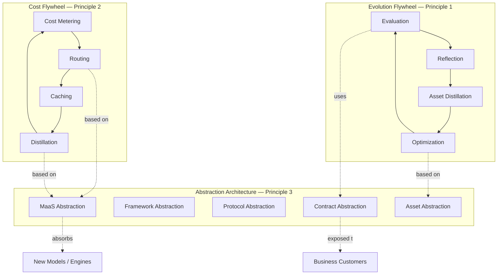

**Key observation**: The three principles are NOT independent — they reinforce each other:

```yaml
interdependence:
  Principle 1 depends on Principle 3:
    Evaluation and optimization both require "stable contracts" as comparison
    baselines.
    Without abstraction layers, "did the agent actually evolve?" cannot be
    measured.

  Principle 2 also depends on Principle 3:
    Routing and distillation both require "models are replaceable."
    Without MaaS abstraction, the router cannot function.

  Principle 3's value manifests through Principles 1 + 2:
    Abstraction has no intrinsic value.
    Abstraction serves "continuous evolution + continuous cost reduction."
```

This synergy is why we call these **first principles**: removing any one collapses the whole.

---

# Chapter 2: Key Decisions Quick Reference

This chapter offers a 10-minute overview for reviewers — a complete catalog of architectural decisions with rationale and section references.

## 2.1 Decision Catalog: 30 Core Decisions

```yaml
decision_categories:
  D1-D5: Architectural Baseline (Chapters 3-5)
  D6-D11: Behavioral View (Chapter 6 + Chapter 8)
  D12-D17: Collaboration View (Chapter 7)
  D18-D22: Structural View (Chapters 9-12)
  D23-D27: Evolutionary View (Chapters 13-15)
  D28-D30: Cross-View Design Levers
```

## 2.2 D1-D5: Architectural Baseline

| ID | Decision | Choice | Rationale | Section |
|---|---|---|---|---|
| D1 | Design baseline | Three first principles | Derives all other decisions | Ch. 1 |
| D2 | Core framework | spring-ai-fin (built on Spring AI 1.1+) | Avoids dependence on competitor (Alibaba); tracks Spring AI community | §4.2 |
| D3 | Number of abstraction layers | 5 (model / framework / protocol / contract / asset) | Each addresses a real evolution-velocity gap | §4.3 |
| D4 | Flywheel pattern | Dual flywheel (evolution + cost) | Operationalizes Principles 1 and 2 | Ch. 5 |
| D5 | Deployment model | BYOC + SaaS dual-track, equal weight | Large customers BYOC, mid-market SaaS | Ch. 14 |

## 2.3 D6-D11: Behavioral View

| ID | Decision | Choice | Rationale | Section |
|---|---|---|---|---|
| D6 | Agent runtime | Cognitive workflow engine (11 nodes + graph) | Single-agent state machine + multi-agent orchestration | §6.2 |
| D7 | Long-running task model | 4 forms full coverage + 2D resource governance | Wide task duration spread in financial workflows | §6.3 |
| D8 | Consistency tiers | 5 levels (transactional / read-your-writes / monotonic-read / eventual / best-effort) | Financial scenarios require fine-grained tiers | §8.2 |
| D9 | Cross-store transactions | Outbox-driven (PG + Kafka) | PG is SoR; most pragmatic | §8.3 |
| D10 | Exception handling | AI-First three-layer (code → AI → HITL) | Methodology applies platform-wide | §6.4 |
| D11 | Stream orchestration | 22 streams + 4-tier SLA + dedicated real-time pool | Financial observability requirements | §6.5 |

## 2.4 D12-D17: Collaboration View

| ID | Decision | Choice | Rationale | Section |
|---|---|---|---|---|
| D12 | Human-AI architecture | Dual-plane + collaboration interface as independent third plane | Houses 5 interaction modes | §7.2 |
| D13 | AI protocols | A2A + MCP + OpenAPI + CLI four-protocol | CLI is the often-overlooked critical addition | §7.3 |
| D14 | SDK weight | Medium-SDK dual-mode (light default + deep when needed) | Governance always remains at platform | §7.4 |
| D15 | Customer contract | API version vs behavior version separation + pinning | Critical financial requirement | §7.5 |
| D16 | BYOC operations | Dual-party operations + customer-led + remote consultation | Platform cannot remote-login | §14.4 |
| D17 | Collaboration granularity | All four levels (process / decision / dialog / session) | Maximum ambition | §7.2 |

## 2.5 D18-D22: Structural View

| ID | Decision | Choice | Rationale | Section |
|---|---|---|---|---|
| D18 | Component classification | 80+ components + 4-tier failure classification | Reliability tiering | Ch. 9 |
| D19 | Gateway and bus | Separated (Higress + dual-bus) | Corrects v4.1 merger | Ch. 10 |
| D20 | Experience layer products | Two products (Studio + Operations Console) | Distinct work modalities | Ch. 11 |
| D21 | Multi-tenant isolation | 5 dimensions × 2 strengths (organizational / adversarial) | BYOC and SaaS differ | Ch. 12 |
| D22 | Business modeling | Three-layer hybrid (FIBO + custom + LLM bridge) | Authority + flexibility + LLM-friendly | §12.5 |

## 2.6 D23-D27: Evolutionary View

| ID | Decision | Choice | Rationale | Section |
|---|---|---|---|---|
| D23 | Version architecture | 4-dimensional (breaks v4.1 three-tier) | Real-world complexity demands it | Ch. 13 |
| D24 | Release tiers | LTS / Stable / Edge / Custom | Adapts to different customer profiles | §13.2 |
| D25 | Agent asset generations | Generation vs version separation + Adapter | Smooth cross-generation transitions | §13.3 |
| D26 | Model upgrade | Dual-track (platform-led + pinned-version preserved) | Honors version pinning commitment | §13.4 |
| D27 | Regulatory evolution | 4-step pipeline + autonomy Level 2 | AI-assisted with HITL safety net | §15.4 |

## 2.7 D28-D30: Cross-View Design Levers

| ID | Lever | Cross-Topic Application | Section |
|---|---|---|---|
| D28 | AI-First three-layer structure | Introduced in B4; applies to B5/C1/C5/E5 | §6.4 |
| D29 | Outbox pattern | Introduced in B3; unifies all dual-write scenarios | §8.3 |
| D30 | Version pinning | Introduced in C4; affects E1/E3/S2 | §7.5 |

## 2.8 Summary of v4.1 Decisions: Kept, Modified, and Filled

```yaml
v4_1_decisions_KEPT:
  - Three first principles
  - Dual flywheel (evolution + cost)
  - spring-ai-fin core framework
  - DeepSeek model combination
  - Apache 2.0 license preference
  - Multi-tier cache (L1-L4)
  - Asset hierarchy (few-shot / skill / etc.)

v4_1_decisions_MODIFIED:
  - Three-tier versioning → Four-dimensional version architecture (D23 breakthrough)
  - Merged "agent gateway & collaboration service layer" → Separated gateway + dual-bus (D19)
  - Vague "console" → Two-product architecture (D20)
  - API stability (loosely defined) → API version vs behavior version + pinning (D15)
  - 5D isolation (slogan) → 5D × 2 strengths (D21)

v4_1_GAPS_FILLED:
  - Agent runtime state machine (D6)
  - Long-running task execution model (D7)
  - 5-tier consistency (D8)
  - Outbox cross-store transactions (D9)
  - AI-First exception handling (D10)
  - 22-stream orchestration (D11)
  - Dual-plane architecture (D12)
  - Four-protocol system (D13)
  - SDK embedding model (D14)
  - Behavioral stability + version pinning (D15)
  - BYOC operational collaboration (D16)
  - Component dependency graph (D18)
  - Experience layer for 4 user roles (D20)
  - Three-layer ontology (D22)
  - Four-dimensional versioning (D23)
  - Agent asset generations (D25)
  - Regulatory evolution adaptation (D27)
```

---

# Part II — Design Layer

# Chapter 3: Architecture Overview

This chapter provides the high-level architectural picture before diving into specifics. Reviewers should use this chapter as a navigation map for the rest of the document.

## 3.1 The Big Picture

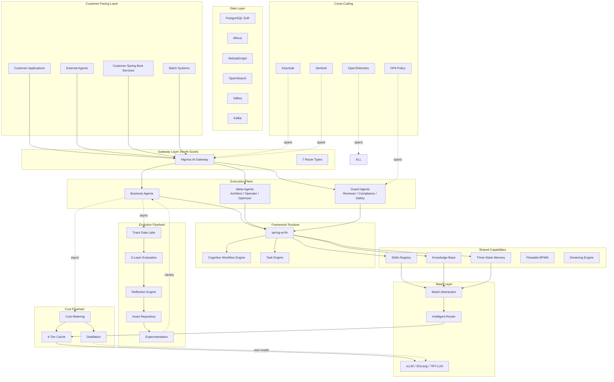

## 3.2 Architecture in Four Views

To manage complexity, the architecture is described from four orthogonal views. Each view answers a different question:

```yaml
behavioral_view:
  Question: How does it move?
  Topics: B1-B5 (state machine, long tasks, exceptions, streams, consistency)
  Where in document: Chapter 6 (execution plane) + Chapter 8 (data)

collaboration_view:
  Question: How does it interact?
  Topics: C1-C5 (human-AI, AI-AI, SDK, contracts, BYOC operations)
  Where in document: Chapter 7 (collaboration interfaces) + Chapter 14 (BYOC)

structural_view:
  Question: What does it consist of?
  Topics: S1-S5 (component dependencies, gateway/bus, experience, multi-tenancy, modeling)
  Where in document: Chapters 9-12

evolutionary_view:
  Question: How does it change over time?
  Topics: E1-E5 (platform versions, agent generations, model upgrades, scaling, regulation)
  Where in document: Chapter 13 (versioning) + Chapter 15 (regulation)
```

## 3.3 Key Architectural Patterns

The architecture employs several **recurring patterns** that reviewers should recognize. These patterns appear across multiple chapters:

```yaml
recurring_patterns:

  Pattern 1 — AI-First Three Layers (introduced B4):
    Layer 1: code auto-handling (deterministic, fast)
    Layer 2: AI intelligent analysis (handles ambiguity)
    Layer 3: HITL safety net (final authority)
    Used in: exception handling (B4), stream issues (B5), compliance (S5),
      regulatory evolution (E5), failure diagnosis (S1)

  Pattern 2 — Outbox-Driven Consistency (introduced B3):
    Single PG transaction writes business + event simultaneously.
    Debezium/CDC propagates events to Kafka asynchronously.
    Downstream stores consume idempotently.
    Used in: every dual-write in the system.

  Pattern 3 — Dual-Plane + Third-Plane Collaboration (introduced C1):
    Human Plane defines, audits, approves.
    AI Plane executes, analyzes, proposes.
    Collaboration Plane bridges the two with 5 interaction modes.
    Used in: experience design (S3), governance (S4), regulation (E5).

  Pattern 4 — Dual-Strength Isolation (introduced S4):
    Strength A (organizational) for BYOC internal multi-line-of-business.
    Strength B (adversarial) for SaaS multi-customer.
    Same 5 dimensions, different parameter values.
    Used in: data, compute, network, cache, model isolation.

  Pattern 5 — Generation vs Version Separation (introduced E2):
    Version: incremental change (v1.0 → v1.1).
    Generation: qualitative leap (Gen1 → Gen2).
    Adapter layer enables cross-generation coexistence.
    Used in: agent assets (E2), model upgrades (E3), platform releases (E1).

  Pattern 6 — Side-Effect Budget (introduced B2):
    Every irreversible action consumes a budget unit.
    AI exceeding budget gets gracefully paused.
    Used in: long tasks (B2), CLI sandboxing (C2), compliance (S5).

  Pattern 7 — Behavioral Pinning (introduced C4):
    API version stability is the easy part (structural).
    Behavioral version stability is the hard part (semantic).
    Customers pin behavior_version (model + prompt + KB snapshot frozen N years).
    Used in: customer contracts (C4), platform upgrades (E1), model upgrades (E3).

  Pattern 8 — Remote Consultation (introduced C5):
    Platform cannot remote-login customer datacenter (compliance).
    Diagnostic tools (read sanitized data) + Standard scripts (executed by
      customer ops) + Runbooks (step-by-step guidance).
    Used in: BYOC operations (C5), failure diagnosis (S1), upgrade coordination (E1).
```

## 3.4 Design Principles for Component Selection

When choosing technology, the architecture follows ranked criteria:

```yaml
component_selection_criteria:

  Criterion 1 — License compatibility:
    Apache 2.0 / MIT: strongly preferred
    GPL / AGPL: avoided (incompatible with commercial deployment)
    Commercial: only when no open-source equivalent exists

  Criterion 2 — Active community:
    GitHub stars + monthly commits as proxy
    Cloud-native projects favored (CNCF graduated/incubating)
    Risk of project death tolerated only with strong fallback

  Criterion 3 — Production readiness in finance:
    Has reference deployments at financial institutions
    Has security certifications (SOC 2, ISO 27001 paths)
    Vendor or community offers commercial support

  Criterion 4 — Spring Boot ecosystem alignment:
    Java team productivity is a force multiplier
    Spring Boot Starter availability preferred
    Helps reduce onboarding cost for customer engineering teams

  Criterion 5 — Avoid competitor dependencies:
    Spring AI Alibaba: NOT used (Alibaba is direct SEA competitor)
    Aliyun-specific services: avoided in default architecture
    Customer-side: customer chooses freely (no platform-imposed restriction)

  Criterion 6 — Architectural fit:
    Component must fit within MaaS / framework / contract abstraction layers
    Does not expose its internals to business code
    Replaceable in case of better alternative emerging
```

## 3.5 Reading Guide for Reviewers

Different reviewers have different priorities. This guide suggests reading paths:

```yaml
reading_paths:

  Path 1 — Senior Architect (3 hours):
    Chapter 0 (executive summary)
    Chapter 1 (first principles)
    Chapter 4 (abstraction layers — critical)
    Chapter 6 (execution plane — most novel)
    Chapter 8 (consistency — critical for finance)
    Chapter 13 (version evolution — innovation)
    Skip: appendices first, return if time permits

  Path 2 — Technical Lead (5 hours):
    Add to Path 1:
    Chapter 7 (collaboration interfaces)
    Chapter 9 (component dependencies)
    Chapter 11 (experience layer — Studio is highest-value innovation)
    Chapter 12 (multi-tenancy)

  Path 3 — Compliance / Security Reviewer:
    Chapter 0.4 (innovation L5: pinning) + Chapter 0.4 (L8: ontology)
    Chapter 7.5 (customer contract + behavioral stability)
    Chapter 12 (multi-tenancy)
    Chapter 15 (regulation and compliance)

  Path 4 — Operations / SRE Reviewer:
    Chapter 6 (execution plane)
    Chapter 9 (component dependencies + failure tiers)
    Chapter 14 (deployment and BYOC operations)
    Chapter 13 (upgrade strategy)

  Path 5 — Skeptic / Devil's Advocate:
    Chapter 1 (first principles — is the foundation sound?)
    Chapter 2 (decision summary — anything questionable?)
    Appendix C (open issues — what's not yet decided?)
    Appendix D (FAQ — what objections were anticipated?)
```

---

# Chapter 4: Abstraction Layer Architecture

## 4.1 The Need for Abstraction Layers

The platform's third first principle — *Inclusion of Diversity with Enterprise Stability* — translates directly into engineering practice as **abstraction layers**. Every category of fast-evolving external technology (models, inference engines, agent frameworks, protocols, vector stores) must be wrapped behind an abstraction so that:

1. The platform's core code does not depend on the specifics of any one external choice.
2. Customers can adopt new technologies without rewriting their agents.
3. The platform itself can swap implementations transparently.
4. Multiple implementations can coexist for different tenants or use cases.

This chapter defines six abstraction layers that together insulate the platform from external volatility:

```yaml
six_abstraction_layers:
  L1_Framework_Abstraction:
    wraps: Spring AI / Spring AI Alibaba / LangChain4j / AutoGen
    interface: spring-ai-fin SDK
    
  L2_Model_Abstraction:
    wraps: GPT / DeepSeek / Qwen / Claude / Llama
    interface: MaaS Routing Layer
    
  L3_Inference_Engine_Abstraction:
    wraps: vLLM / SGLang / TensorRT-LLM / HuggingFace TGI
    interface: Inference Engine Adapter
    
  L4_Protocol_Abstraction:
    wraps: A2A / MCP / OpenAPI / CLI
    interface: Protocol Bus
    
  L5_Storage_Abstraction:
    wraps: Milvus / Qdrant / Weaviate / NebulaGraph / Neo4j
    interface: Knowledge Storage Adapter
    
  L6_Observability_Abstraction:
    wraps: Langfuse / Arize / Datadog / Phoenix
    interface: OpenTelemetry-based Trace Layer
```

The remainder of this chapter examines each layer.

## 4.2 L1: Framework Abstraction (spring-ai-fin)

### Why a Framework Abstraction?

The Java ecosystem has multiple agent frameworks emerging in 2025–2026:
- **Spring AI** (official, foundation layer with `ChatClient` and `Advisors`)
- **Spring AI Alibaba** (Alibaba-led, "all-in-one Starter" with embedded runtime)
- **LangChain4j** (community-driven port of LangChain)
- **AutoGen for Java** (multi-agent orchestration, beta)

Customers in Southeast Asia (the platform's target geography) cannot adopt Spring AI Alibaba directly because Alibaba is a competitor in the regional cloud and AI market. At the same time, building agents on raw Spring AI (still in `1.x` phase) leaves customers exposed to API churn.

The platform's response is **spring-ai-fin** — a Java agent framework that:
- Builds *on* Spring AI's foundational abstractions (does not fork)
- Adds the financial-domain capabilities the platform needs
- Provides Spring Boot Starters for zero-friction adoption (see Chapter 11.3)
- Operates in a **mid-weight, dual-mode** configuration (default-light + extended-deep, see Chapter 11)

### The Layered Stack

```
┌─────────────────────────────────────────────────────┐
│  Customer Business Code (Spring Boot)                │
└─────────────────────────────────────────────────────┘
                         │
                         ▼
┌─────────────────────────────────────────────────────┐
│  spring-ai-fin Starters (5 modules, see Ch.11)       │
│  ├ core: Platform Connection, Trace, Cost            │
│  ├ memory: Three-Tier Memory Client                  │
│  ├ skill: MCP Client + Tool Registry + CLI Sandbox   │
│  ├ flow: Flowable + HITL + Long-Task Manager         │
│  └ advanced: In-Process Lightweight Agents           │
└─────────────────────────────────────────────────────┘
                         │
                         ▼
┌─────────────────────────────────────────────────────┐
│  spring-ai-fin Core Modules                          │
│  ├ fin-cognitive-flow: 11-Node State Machine (B1)    │
│  ├ fin-graph: Multi-Agent Orchestration              │
│  ├ fin-memory: Three-State Memory Implementation     │
│  ├ fin-skill: Skill / Tool / CLI Abstraction         │
│  ├ fin-eval: Three-Layer Evaluation Engine           │
│  └ fin-hitl: Human-in-the-Loop Coordination          │
└─────────────────────────────────────────────────────┘
                         │
                         ▼
┌─────────────────────────────────────────────────────┐
│  Spring AI Foundation (1.1+, official)               │
│  ChatClient | Advisors | Memory | Tools | RAG | MCP  │
└─────────────────────────────────────────────────────┘
```

### Key Design Decisions

**Decision 1**: Build *on* Spring AI, do not fork.

Forking Spring AI would isolate the platform from upstream improvements and create maintenance debt. Building on it means:
- Customers using familiar Spring AI APIs (`ChatClient.prompt().user(...).call()`) get the same surface
- New Spring AI capabilities (e.g., new advisors, new memory backends) flow through automatically
- The platform contributes back upstream where appropriate

**Decision 2**: Reference Spring AI Alibaba's design but do not depend on it.

Spring AI Alibaba has open-source design patterns worth studying (notably, its `StateGraph` and `ReactAgent` constructions). The platform's `fin-graph` module independently implements similar abstractions but with financial-domain specializations and without runtime dependency on Alibaba code.

**Decision 3**: Mid-weight SDK with dual-mode operation.

Heavy SDKs (entire agent runtime in customer process, like LangChain) destroy governance — the platform cannot enforce compliance, evaluation, or guard agents on code running in customer JVMs. Light SDKs (just an HTTP client) sacrifice the deep integration enterprise customers need.

The mid-weight choice puts execution + governance + memory + skills + evaluation + guard agents in the platform runtime, while the SDK handles authentication, tracing, cost reporting, exception envelopes, and a Spring AI–compatible `ChatClient` decorator. Extended mode adds in-process lightweight agents and custom tools/advisors for the ~20% of customers who need them.

See Chapter 11 for the full SDK specification.

## 4.3 L2: Model Abstraction (MaaS Routing Layer)

### The Problem MaaS Solves

Without MaaS, every business agent would directly call a specific model API (e.g., DeepSeek Chat Completion endpoint). This creates:

1. **Hard coupling** — switching from DeepSeek to Qwen requires changing every agent.
2. **No cost optimization** — agents cannot route based on cost, latency, or quality dynamically.
3. **No fallback** — if one provider is down, agents fail.
4. **No tenant policy** — different customers have different model permission rules; the agent cannot know them.

The MaaS layer presents a single, unified model interface, while behind it routing decisions can be made on:

```yaml
routing_dimensions:
  task_complexity: simple → small model | complex → large model
  cost_budget: enforce per-tenant per-call cost ceilings
  latency_sla: prioritize fast models for low-latency tiers
  quality_tier: use Pro models for VIP, Flash for standard
  availability: failover when a provider is degraded
  data_residency: route to in-region models for localization compliance
  tenant_policy: enforce per-tenant model whitelists
  pinned_behavior: route pinned-version traffic to frozen model + engine combo
```

### The Three Model Tiers

The platform's reference deployment uses three model tiers internally, all wrapped by MaaS:

```yaml
tier_1_governance_models:
  purpose: Evaluation, guard agents, behavior reviewers
  examples: DeepSeek V4 Pro
  usage: Low-volume, high-stakes (correctness > cost)
  
tier_2_business_models:
  purpose: Production agent inference
  examples: DeepSeek V4 Flash, Qwen3-72B
  usage: High-volume (cost-sensitive, latency-sensitive)
  
tier_3_specialist_models:
  purpose: Domain-specific tasks (e.g., embedding, code, OCR)
  examples: bge-large for embeddings, CodeLlama for code
  usage: Targeted, swappable
```

Customers deploying BYOC choose which tiers to host based on GPU budget. A small BYOC customer might host only Tier 2 + Tier 3 locally and call Tier 1 via the platform's hosted endpoint (with explicit data agreements for what crosses the boundary).

### MaaS as a Pluggable Adapter Surface

The MaaS layer exposes one OpenAI-compatible API to upstream callers and adapts to multiple downstream providers via adapters:

```
┌────────────────────────────────────────┐
│  Business Agents                        │
└────────────────────────────────────────┘
                  │  OpenAI-compatible API
                  ▼
┌────────────────────────────────────────┐
│  MaaS Routing Layer                     │
│  ├ Router (RouteLLM-based)              │
│  ├ Cost Meter                           │
│  ├ Cache (4-tier, see Ch. 5.2)          │
│  └ Adapter Surface                      │
└────────────────────────────────────────┘
                  │
        ┌─────────┼─────────┬─────────┐
        ▼         ▼         ▼         ▼
   ┌────────┐ ┌──────┐ ┌──────┐ ┌────────┐
   │ vLLM   │ │SGLang│ │TRT-LLM│ │ Hosted │
   │adapter │ │adapter│ │adapter│ │  API   │
   └────────┘ └──────┘ └──────┘ └────────┘
```

This means:
- Agents do not know which engine is serving their request
- The platform can A/B test engines (e.g., vLLM vs SGLang for latency)
- Engines can be upgraded independently
- Custom inference engines can be added by writing a new adapter

## 4.4 L3: Inference Engine Abstraction

The inference engine landscape in 2025–2026 is fast-changing:

```yaml
inference_engine_landscape_2026:
  vLLM:
    strengths: Mature, broad model support, PagedAttention, Continuous Batching
    weaknesses: GPU memory fragmentation under heavy load
    license: Apache 2.0
    
  SGLang:
    strengths: RadixAttention, fast prefix caching, structured output
    weaknesses: Smaller community, fewer model integrations
    license: Apache 2.0
    
  TensorRT-LLM:
    strengths: Best raw GPU throughput on NVIDIA hardware
    weaknesses: NVIDIA-only, complex build, less flexible
    license: Apache 2.0
    
  HuggingFace TGI:
    strengths: Easy deploy, HuggingFace ecosystem
    weaknesses: Performance trails vLLM/SGLang
    license: Apache 2.0
```

A customer might start on vLLM, find SGLang's prefix caching beneficial after a year, and want to migrate. Without an abstraction, every model deployment must be re-tested. With the **Inference Engine Adapter**:

```yaml
adapter_contract:
  required_methods:
    - generate(prompt, params) -> stream
    - embed(text) -> vector  # if embedding model
    - get_model_info() -> ModelInfo
    - get_kv_cache_stats() -> CacheStats  # for cost optimization
  
  health_checks:
    - liveness: engine is running
    - readiness: model loaded, accepting requests
    - capacity: current load vs max
  
  metadata:
    supported_models: [list of model names]
    supported_quantization: [fp16, int8, awq, gptq, ...]
    max_batch_size: int
    max_context_length: int
```

The adapter contract is **the** interface. New engines (e.g., a future "GPT-5 OSS engine") plug in by writing an adapter. Existing agents notice nothing.

### KV Cache Sharing Across Engines

A critical optimization: **system prompts and few-shot examples are often identical across requests**. KV-cache reuse across these prefixes can save 30–60% of compute. The platform integrates **LMCache** (Apache 2.0) to provide a global KV-cache pool that adapters can use:

```
┌──────────────────────────────────────┐
│  LMCache (Global KV Cache Store)     │
│  - Prefix-tree organized              │
│  - Tenant-tagged (S4 isolation)       │
│  - LRU + cost-aware eviction          │
└──────────────────────────────────────┘
        ▲                ▲
        │                │
   ┌────────┐       ┌────────┐
   │ vLLM   │       │SGLang  │
   │adapter │       │adapter │
   └────────┘       └────────┘
```

System prompts and shared few-shot examples are cached with tenant isolation (per Chapter 12.4): prefixes that are public to the tenant can be shared within the tenant, but cross-tenant sharing requires explicit prefix opt-in.

## 4.5 L4: Protocol Abstraction (Protocol Bus)

Chapter 7 covers protocol-level details (A2A, MCP, OpenAPI, CLI — all four protocols carrying agent communication). At the abstraction-layer level, the key principle is:

**Every protocol Type maps to a uniform internal Protocol Bus.**

```yaml
protocol_bus_design:
  inbound_adapters:
    - HTTP/JSON (OpenAI-compatible)
    - HTTP/gRPC (A2A protocol)
    - JSON-RPC (MCP)
    - Streaming (SSE / WebSocket)
    - CLI (subprocess invocation, sandboxed)
    
  internal_representation:
    InvocationContext {
      tenant_id, user_id, session_id, trace_id
      agent_target, capability_target
      payload (typed by capability schema)
      consistency_level (L1-L5, see Ch.8)
      autonomy_level (per-call override, see Ch.6)
    }
  
  outbound_adapters:
    - To agents (gRPC mesh, see Ch.10)
    - To external systems (HTTP, A2A, MCP)
    - To CLI tools (sandboxed subprocess)
    - To data platforms (Kafka, see Ch.10)
```

The decoupling means:
- Adding a new protocol (e.g., GraphQL subscriptions) requires only a new adapter, not changing agents.
- Different protocols can carry the same logical invocation. An agent invocation can come in as HTTP and trigger an A2A call to another agent and a CLI call to a tool, all carrying the same `trace_id` and `tenant_id`.

## 4.6 L5: Storage Abstraction

Knowledge storage is heterogeneous: vector stores, knowledge graphs, hybrid search, object storage. The vector landscape alone has Milvus, Qdrant, Weaviate, Pinecone, pgvector, ChromaDB. The platform's reference uses Milvus (mature, large-scale, Apache 2.0) and NebulaGraph (Apache 2.0 graph database) but customers may prefer other engines.

The storage abstraction defines:

```yaml
storage_capabilities:
  vector_search:
    - upsert(tenant, namespace, vectors_with_metadata)
    - search(tenant, namespace, query_vector, top_k, filter) -> results
    - delete(tenant, namespace, ids)
    
  graph_query:
    - upsert_node(tenant, type, properties)
    - upsert_edge(tenant, type, src, dst, properties)
    - query(tenant, query_dsl) -> result_set
    - traverse(tenant, start, hops, filter) -> path_set
    
  hybrid_search:
    - search(tenant, query_text, top_k, semantic_weight) -> results
    - (combines BM25 + vector similarity)
    
  object_storage:
    - put(tenant, key, blob, metadata)
    - get(tenant, key) -> blob
    - list(tenant, prefix) -> keys
    - retention_policy(tenant, key, policy)
```

Each capability has multiple adapter implementations available:

```
vector_search:
  - MilvusAdapter (default)
  - QdrantAdapter
  - WeaviateAdapter
  - PgVectorAdapter (lightweight, BYOC small customers)
  
graph_query:
  - NebulaAdapter (default)
  - Neo4jAdapter
  - JanusGraphAdapter (large-scale)
  
hybrid_search:
  - OpenSearchAdapter (default)
  - ElasticsearchAdapter
  
object_storage:
  - SeaweedFSAdapter (default for BYOC)
  - S3CompatibleAdapter (for SaaS Region storage)
```

## 4.7 L6: Observability Abstraction

Trace, metrics, logs all flow through OpenTelemetry. The abstraction lets the platform send observability data to multiple backends:

```yaml
observability_targets:
  trace:
    primary: Langfuse (open source, AGPL — careful, see Ch.13)
    secondary: Phoenix (Apache 2.0, Arize-developed)
    enterprise: Datadog APM, Dynatrace
    BYOC_localized: Customer's existing APM
    
  metrics:
    primary: Prometheus + Grafana
    secondary: VictoriaMetrics
    enterprise: Datadog, New Relic
    
  logs:
    primary: Loki
    secondary: Elasticsearch
    enterprise: Datadog, Splunk
```

Customers running BYOC often have existing APM infrastructure (Splunk, Datadog) and demand integration. The OpenTelemetry layer ensures the platform's observability data is portable.

The Langfuse choice deserves a note: Langfuse is AGPL-licensed. For pure self-hosted deployment of the platform's own observability backend, this is acceptable. For redistribution as part of a customer's product, an alternative (Phoenix, or commercial Langfuse) must be used. The abstraction layer makes this swap trivial.

## 4.8 Cross-Layer Concerns

### Tenant Identity Propagation

Every layer must transparently carry `tenant_id`. The plumbing is uniform:

```
HTTP Request
  └─> Gateway extracts tenant_id from JWT
       └─> Sets ThreadLocal TenantContext
            └─> ChatClient call: tenant_id flows in MDC
                 └─> MaaS routing reads tenant_id for routing rules
                      └─> Adapter call: tenant_id in gRPC metadata
                           └─> Inference engine: tenant_id in cache namespace
                                └─> Storage: tenant_id in query filter
                                     └─> Trace: tenant_id in span attributes
```

This is detailed end-to-end in Chapter 12.

### Failure Isolation Across Layers

Each layer has independent failure modes. The platform applies the **AI-First three-layer exception handling principle** (see Chapter 6.4) at every layer:

- **Layer 1 (Code):** Automatic retries, fallback adapters, circuit breakers (resolved in <1s)
- **Layer 2 (AI):** AI Operator analyzes complex failure patterns, suggests root causes (resolved in seconds-minutes)
- **Layer 3 (HITL):** Human escalation for novel or critical failures (resolved in minutes-hours)

A model adapter failing falls through to a backup model. A storage adapter failing degrades to a cached result with a warning. An inference engine failing routes to another engine. The customer sees graceful degradation, not hard failure.

### Versioning Across Layers

Each layer has its own version dimension (per Chapter 13's Four-Dimensional Version Model):

- **Component Version:** Each adapter has its own SemVer (`milvus-adapter v1.4.2`)
- **Contract Version:** The abstraction's API contract is versioned (`storage-contract v2.0`)
- **Composition Version:** A platform Release pins specific component versions (`Release v5.0 LTS = milvus-adapter v1.4.2 + nebula-adapter v0.9.1 + ...`)
- **Customer Instance Version:** The deployed combination at a customer site

Adapter upgrades are rolled out via the Component Version axis, while the Contract Version stays stable across multiple Releases. This is the engineering basis for "stability + diversity inclusion" — Contract Version is what business agents depend on, Component Version is what the platform evolves.

## 4.9 Summary

The six abstraction layers translate the third first principle into engineering. Each layer exists because the underlying technology is fast-changing and the platform needs to evolve without breaking customers. The layers are:

| Layer | Wraps | Why |
|---|---|---|
| L1 Framework | Spring AI ecosystem | Build *on*, not depend on, evolving frameworks |
| L2 Model | LLM providers | Multi-provider, cost optimization, fallback |
| L3 Inference Engine | vLLM, SGLang, TRT-LLM | Different engines for different workloads |
| L4 Protocol | A2A, MCP, OpenAPI, CLI | Multiple comm patterns through one bus |
| L5 Storage | Vector, graph, hybrid, object | Customer choice + future-proofing |
| L6 Observability | Langfuse, Phoenix, Datadog | Customer existing APM integration |

The next chapter examines the two flywheels — Evolution and Cost Reduction — that operate **inside** these layers and drive the platform's continuous improvement.


# Chapter 5: The Two Flywheels — Evolution and Cost Reduction

## 5.1 Why Two Flywheels

The first principle states intelligence must continuously evolve. The second states cost must continuously decrease. Both are continuous, both are self-reinforcing. Each has the structure of a flywheel: small initial inputs produce outputs that feed back to improve future inputs.

```
Evolution Flywheel:
  Production traffic → Trace data → Evaluation → 
  Asset distillation → Optimization → Deployment → Better production traffic
  
Cost Flywheel:
  Production traffic → Cost telemetry → Pattern analysis → 
  Cache strategy + Routing strategy + Model distillation → 
  Lower cost per call → More volume affordable
```

Both flywheels operate **continuously and asynchronously**. They consume Trace and Cost data produced by every production call (see Chapter 8 for the data plane carrying these flows), and emit improved configurations that production traffic adopts during gradual rollouts.

This chapter examines each flywheel's components, their feedback loops, and the engineering invariants that keep them running reliably.

## 5.2 The Evolution Flywheel

### Components

```yaml
evolution_flywheel_components:
  
  ingestion:
    Trace Lake (Langfuse + ClickHouse)
    Captures every call: prompts, completions, tool invocations, retrievals
    Tagged with: tenant, agent, model, version
    Retention: 90 days hot, archived afterward (compliance)
  
  evaluation_engine:
    Three-layer evaluation, each running on different cadences:
    
    Layer 1 — Inline (synchronous, every call):
      Cheap automated checks: schema validity, length, forbidden tokens, PII
      Pass = green light, fail = block + log
      Cost: ~5ms per call (acceptable for inline)
    
    Layer 2 — Sampling Async (every 1% of traffic):
      LLM-as-judge using V4 Pro
      Four-dimensional scoring (Behavioral Stability, see Ch.7.5):
        D1 Semantic correctness
        D2 Format consistency
        D3 Quality stability
        D4 Safety stability
      Cost: ~$0.05 per evaluated call (1% sampling makes cost manageable)
    
    Layer 3 — Arbitration (specific cases):
      Complex disagreements where Layer 2 is uncertain
      Multi-judge consensus
      HITL escalation when judges disagree
      Cost: ~$0.50 per evaluated call (rare, high-value)
  
  reflection_engine:
    Analyzes failure patterns from Layer 2 + Layer 3
    AI-driven root cause attribution:
      Was it model-side? prompt-side? knowledge-side? Tool-side?
    Outputs: structured failure reports with attribution
  
  asset_sedimentation:
    Mines successful patterns into reusable assets:
      few-shot examples (DSPy-based mining)
      tool combinations
      effective prompt structures
    Versions assets, tracks lineage
  
  auto_optimizer:
    Uses reflection + sedimentation outputs to propose changes
    Two paths:
      Within-generation: prompt tweaks, parameter changes
      Cross-generation: structural changes (see Chapter 13.2 — Asset Generations)
  
  experiment_platform:
    GrowthBook-based A/B testing
    Compares proposed changes vs current baseline
    Statistical rigor for production validation
    Auto-rollback on quality regression
  
  golden_set_management:
    Curated test sets per agent
    Customer-submitted + AI-suggested + regulator-required cases
    Variants generated (10–50× synonymic expansion)
    Runs on every proposed change before deployment
```

### The Evolution Loop

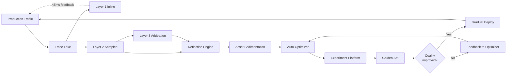

### Engineering Invariants

The flywheel only works if certain invariants hold:

**Invariant 1**: Trace data must be complete and tenant-isolated.
Without complete traces, Layer 2 evaluation samples are biased. Without tenant isolation, customer A's traffic shapes customer B's optimizations — a privacy violation.

**Invariant 2**: Layer 1 must remain fast (<5ms p99).
If Layer 1 evaluation slows down, every customer call slows down. Layer 1 uses only fast deterministic checks; anything LLM-based goes to Layer 2.

**Invariant 3**: Layer 2 sampling must be uniform.
Bias in sampling (e.g., only sampling failures) creates bias in evaluation. The platform samples uniformly across calls, supplemented by stratified sampling for rare-event coverage.

**Invariant 4**: Reflection attribution must be fact-based, not narrative.
The reflection engine has access to the structured trace; its attributions reference specific spans. Hallucinated explanations are caught by the same multi-judge mechanism.

**Invariant 5**: Optimization changes must be opt-in for customers.
A customer's agent is its property. The platform proposes changes; the customer approves before deployment to its production. This is critical for behavior pinning (see Chapter 7.5 and 13.3).

**Invariant 6**: Behavior stability four-dimensional check on every change.
No optimization rolls out without passing the Golden Set with the four-dimensional behavior stability check. A 3% throughput improvement that introduces 1% semantic drift fails.

### Behavior Stability and Pinned Versions

Some financial customers, after exhaustive UAT, require behavior to be **frozen**. The Evolution Flywheel respects this through **Behavior Pinning** (covered fully in Chapter 7.5 and 13.3). At the flywheel level:

```yaml
pinned_traffic_handling:
  detection: Inbound calls carry X-Behavior-Version header
  routing: Pinned-version traffic routes to the frozen snapshot (model + prompts + knowledge + routing rules)
  observation: Pinned traffic still feeds the Trace Lake
  evaluation: Pinned traffic still gets evaluated (so the platform knows when frozen behavior is degrading)
  optimization: Optimizations DO NOT apply to pinned traffic
  evolution: Pinned snapshots evolve only when the customer schedules a behavior version migration
```

The platform reserves 5–10% of compute capacity for pinned-version support (per Chapter 13.3).

### From Evolution to Asset Generations

The evolution flywheel produces incremental improvements within an "asset generation." When the cumulative improvements reach a phase change — when a class of capability needs structural rework, not parameter tweaks — that's a generation leap. Chapter 13.2 defines what triggers a leap and how the platform supports multi-generation coexistence.

## 5.3 The Cost Reduction Flywheel

### Why Cost is a Continuous Concern

LLM inference is **expensive** by software standards. A single GPT-4-tier call can cost $0.01–$0.10. At enterprise scale (10M+ calls/day), naive deployment yields six-figure monthly bills. Cost optimization is therefore not optional — it is structural.

The cost flywheel operates on three primary levers:

```yaml
cost_levers:
  L1_caching:
    Reduce calls reaching the model
    Multi-tier cache (KV / Exact / Semantic / Result)
    
  L2_routing:
    Send each call to the cheapest sufficient model
    Intelligent router (RouteLLM-based)
    
  L3_distillation:
    Compress expensive model behavior into cheaper specialized models
    TRL-based distillation pipeline
```

Each lever has its own feedback loop, and they reinforce each other.

### The Four-Tier Cache

```yaml
cache_tiers:
  L1_KV_Cache:
    What: Token-level KV pairs from the inference engine
    Storage: GPU memory, organized as prefix tree (LMCache, see Ch.4.4)
    Hit pattern: Same prompt prefix → reuse computation
    Tenant isolation: Cross-tenant prefix sharing requires explicit opt-in
    Effect: 30–60% compute saving on shared system prompts and few-shot
  
  L2_Exact_Match:
    What: Identical request → identical response
    Storage: Valkey (Redis-compatible, fast in-memory)
    Hit pattern: Same prompt + same params → return prior response
    Hit rate: 5–15% in customer service workloads
    Effect: Saves entire model call (highest cost saving when hit)
    Tenant isolation: Strict per-tenant key prefix
    
  L3_Semantic_Cache:
    What: Semantically similar requests → similar response
    Storage: Vector store (per-tenant collection)
    Hit pattern: Embedding similarity > threshold + LLM consistency check
    Hit rate: 20–40% in repetitive Q&A workloads
    Effect: Saves model call for "same question, different wording"
    Tenant isolation: Per-tenant collection (cross-tenant semantic match disallowed)
    
  L4_Result_Cache:
    What: Multi-step agent results, full task outputs
    Storage: PostgreSQL + object storage
    Hit pattern: Full task signature match (+ consistency fingerprint)
    Hit rate: 1–5% (specific patterns only)
    Effect: Saves entire multi-call workflow
    Tenant isolation: Strict per-tenant
```

### Cost Telemetry and Allocation

Every call's cost is decomposed:

```yaml
cost_breakdown_per_call:
  input_tokens_cost: tokens × model_input_price
  output_tokens_cost: tokens × model_output_price
  retrieval_cost: vector_search + graph_query + hybrid_search costs
  guard_agent_cost: review LLM call cost
  evaluation_layer1_cost: deterministic, near-zero
  evaluation_layer2_cost: amortized over sampling rate
  cache_hit_savings: negative cost (savings recorded)
  total_usd: sum
```

These records, written via the Outbox pattern (see Chapter 8) to the cost data warehouse, enable:

- **Per-tenant billing** with full attribution
- **Per-agent cost analysis** (which agents are expensive?)
- **Per-scenario cost** (which use cases cost the most?)
- **Cost regression detection** (did a model upgrade increase costs?)
- **Three-way reconciliation** (business records ↔ cost records ↔ audit logs, per Chapter 8.4)

### Intelligent Routing

The router decides which model handles each call. Decision factors:

```yaml
router_inputs:
  request_complexity_estimate:
    Determined by classifier (small model)
    Examples:
      "What's my balance?" → simple → small model
      "Explain my mortgage options given my situation" → complex → large model
  
  cost_budget:
    Per-tenant per-call ceiling
    Per-tenant monthly budget remaining
    
  latency_requirement:
    Real-time (< 1s) → fast model
    Async (< 1min) → can use larger model
    
  quality_tier:
    VIP customers → Pro models
    Standard → Flash/Mini models
    Trial → smallest viable model
    
  availability:
    Provider health check
    Failover to backup
    
  pinned_behavior:
    Pinned version requests → forced to specific model
```

Router learns from historical traffic via RouteLLM:

```
Phase 1: Classify
  Use cheap classifier to estimate complexity
  
Phase 2: Score
  Score available models on (cost, latency, quality, availability)
  
Phase 3: Choose
  Select model maximizing score within constraints
  
Phase 4: Learn
  Track outcomes (was the routing right?)
  Feed back to classifier training
```

### Model Distillation Pipeline

Some patterns are stable enough to distill:

- Customer service Q&A often follows the same templates
- Risk scoring uses repeating logic
- Suitability assessment has bounded variation

For these, the platform distills a large model's behavior into a smaller specialized model:

```yaml
distillation_pipeline:
  input:
    Production traces (filtered for: high-volume, stable pattern, quality-validated)
    Source model: V4 Pro
  
  process:
    TRL (Transformer Reinforcement Learning) framework
    Generate training pairs from production traces
    Fine-tune target model (e.g., Qwen3-1.5B)
    Evaluate against original (4D behavior stability check)
  
  output:
    Specialized small model (per customer or per use case)
    10–50× cheaper to run
    Latency 5–10× faster
  
  governance:
    Evaluation must pass before deployment
    A/B test in production (router routes small % to distilled model)
    Gradual ramp on success
    Rollback on regression
```

### Cost-Performance Pareto

The router's goal isn't lowest cost — it's the **Pareto frontier**: minimum cost for required quality, minimum latency for required cost.

```
Quality (Y axis) ↑
                │   ╔════ Pareto frontier
                │  ║
                │ ║       ★ optimal route
                │║
                │
                └────────────→ Cost (X axis)
                
Each call seeks the point on the frontier that meets its quality requirement
at the lowest cost (or the lowest latency at fixed cost).
```

### Engineering Invariants

**Invariant 1**: Cache must be tenant-isolated.
Cross-tenant cache hits are a security violation. Even semantic-similarity hits across tenants are forbidden — public knowledge can be shared, but per-tenant context must be isolated.

**Invariant 2**: Cache invalidation must be timely.
Stale cache hits during knowledge base updates create incorrect responses. Each cache entry carries a "consistency fingerprint" (knowledge version + business rule version). Mismatched fingerprints invalidate the entry.

**Invariant 3**: Routing must be observable.
Every routing decision is traced: which model was chosen, why, what alternatives were considered. This is essential for cost analysis and for regulatory explainability.

**Invariant 4**: Distillation must preserve behavior, not just save cost.
A distilled model that's 90% accurate (vs 99% for the source) at 1/10 the cost is **not** an improvement — it's a regression. The 4D behavior stability check is mandatory.

**Invariant 5**: Cost optimizations must respect SLAs.
A cheap model with higher latency cannot be routed for VIP-tier traffic that requires p99 < 3s. The router's cost objective is constrained by latency and quality SLAs.

## 5.4 Interactions Between the Two Flywheels

### Reinforcement, Not Competition

The flywheels reinforce each other:

```yaml
evolution_helps_cost:
  Better prompts use fewer tokens
  Better few-shot examples reduce required model size
  Better tool selection reduces unnecessary retrievals
  Better routing decisions emerge from trace analysis
  
cost_helps_evolution:
  Lower per-call cost enables more evaluation samples
  Cheaper experimentation enables more A/B tests
  Distilled specialists can run more frequently in evaluation
  Cost data reveals "expensive failure" patterns to attack
```

### Shared Infrastructure

Both flywheels consume the same Trace Lake. Both produce optimizations through the same Experiment Platform. Both deploy through the same Gradual Rollout mechanism. The shared infrastructure means a single instrumentation effort serves both flywheels.

### The Conflict Cases

Sometimes flywheels pull in opposite directions:

```yaml
conflict_1:
  scenario: Cost flywheel wants to use cheaper distilled model
  scenario: Evolution flywheel detects distilled model fails on edge case
  resolution: Evolution wins. Distillation rolls back.
  rationale: Bad behavior is unrecoverable; high cost is just expensive

conflict_2:
  scenario: Evolution proposes adding a new tool call (improves quality)
  scenario: Cost flywheel notes the tool is expensive
  resolution: Domain decides. Quality-tier configurations may opt out.
  rationale: Customer choice; document tradeoff transparently

conflict_3:
  scenario: Aggressive caching saves cost
  scenario: Cache hits during knowledge updates serve stale results
  resolution: Consistency fingerprint mechanism (above)
  rationale: Correctness > cost
```

### Governance Across Both

Both flywheels run under the same governance regime:

- All optimizations pass behavior stability gates
- All deployments go through gradual rollout with auto-rollback
- All decisions are auditable
- Customer pinning takes precedence over both flywheels

## 5.5 Operational Cadence

```yaml
flywheel_cadence:
  inline (every call):
    Layer 1 evaluation
    Cache lookups
    Routing decisions
    Cost recording
  
  near_real_time (seconds):
    Layer 2 sampling (1%)
    Outbox → Kafka → trace lake (Ch.8)
    Cost aggregation
  
  batch_hourly:
    Reflection engine pass on the last hour
    Cost trend analysis
    Cache hit rate review
  
  batch_daily:
    Full Layer 2 evaluation reports
    Asset sedimentation cycle
    Three-way reconciliation (Ch.8.4)
    Distillation candidates identification
  
  batch_weekly:
    Auto-optimizer proposes changes
    Experiment platform runs A/B tests
    Distillation training jobs
  
  monthly:
    Customer-facing cost reports
    Behavior version review (per pinning customers)
    Asset generation review
  
  quarterly:
    Platform release cycle (Stable tier)
    Major model upgrade evaluations
    
  yearly:
    LTS release cycle
    Annual compliance review
```

## 5.6 Summary

The two flywheels turn the first two first principles into engineering artifacts:

- **Evolution Flywheel**: Production traffic → trace data → multi-layer evaluation → reflection → asset sedimentation → auto-optimization → experiment validation → gradual deployment → improved production traffic
- **Cost Flywheel**: Production traffic → cost telemetry → multi-tier caching + intelligent routing + model distillation → lower cost per call → more affordable volume → more value to customers

Both flywheels are **continuous, asynchronous, and governed**. They share infrastructure (Trace Lake, Experiment Platform, Rollout mechanism). They reinforce each other in expectation but conflict in specific cases — and the conflicts are resolved by precedence rules (correctness > cost, customer pinning > optimization).

The flywheels operate **inside** the abstraction layers from Chapter 4 — abstraction provides stability, flywheels provide motion. Together they realize the first three principles.

The next chapter examines the **execution plane** — how individual agent calls actually run, including the cognitive workflow state machine (B1), long-running tasks (B2), exception handling (B4), and stream orchestration (B5).


# Chapter 6: Execution Plane — Agent Runtime Behavior

## 6.1 Why a Dedicated Execution Plane

The abstractions of Chapter 4 and the flywheels of Chapter 5 give the platform's *external* shape. This chapter goes inside: when a customer's request arrives, what happens at runtime? What state does the platform maintain for an in-flight agent? How are long-running operations coordinated? How are exceptions handled? How are real-time and batch flows separated?

These questions correspond to four behavioral-view design topics that v4.1 listed but did not develop:

```yaml
execution_plane_topics:
  6.2_state_machine:    Agent runtime state machine (was B1)
  6.3_long_tasks:       Long-running task execution model (was B2)
  6.4_exceptions:       Exception handling with AI-First three layers (was B4)
  6.5_streams:          Real-time vs batch stream orchestration (was B5)
```

(Data consistency, originally B3, has its own chapter — Chapter 8 — because it concerns more than the execution plane.)

The execution plane has one organizing principle: **a Cognitive Workflow Engine** drives the agent through a structured state machine, with task-engine-driven persistence, AI-first exception handling, and four-tier stream classification. This chapter develops each piece.

## 6.2 The Cognitive Workflow State Machine

### Why a State Machine?

Naive agent implementations treat each call as a stateless function: prompt in, completion out, retry on failure, done. This breaks for any non-trivial workflow:

- Multi-step reasoning requires keeping track of partial progress
- Tool calls introduce side effects that must be recorded for idempotency
- Human-in-the-loop pauses an agent and resumes it later (potentially much later)
- Long-running tasks must survive process crashes
- Auditability requires recording every transition for regulatory replay

The platform's solution is a **structured state machine** with 11 explicit states. Every agent call traverses a subset of these states, with persistence at strategic points enabling resume, audit, and recovery.

### A Graph, Not a Finite-State Machine

A subtle but consequential design choice: this is a **directed graph of states with LLM-driven transitions**, not a classical finite-state machine (FSM) with deterministic transition rules. The distinction matters because the two have very different engineering implications:

```yaml
classical_fsm:
  Transition rule: deterministic function of (current state, input event)
  Designer's job: enumerate every (state, event) → next-state edge
  Failure mode: unanticipated event → error or undefined behavior
  Suitable for: protocols, parsers, traffic lights — domains where event space is bounded

llm_driven_state_graph:
  Transition rule: LLM decides next state from current state's context
  Designer's job: define states + their meaning + their entry/exit conditions
  Failure mode: LLM picks wrong next state → reflecting state catches and re-routes
  Suitable for: agent reasoning — domains where event space is open-ended
```

In this architecture, the `thinking` state is the **LLM-driven decision point**: when an agent enters `thinking`, the LLM examines the current context (recent observations, retrieved knowledge, partial progress, available tools) and decides what to do next — call a tool, retrieve more context, finalize, ask for human help, or continue thinking. The state graph provides the *vocabulary* of possible next states; the LLM provides the *choice* among them.

This has three engineering implications:

```yaml
implication_1_states_are_meanings_not_codes:
  States have human-readable semantic names (`intent_understanding`, `reflecting`)
  Each state has a natural-language description in the state catalog
  The LLM's prompt for `thinking` includes: "You are now in the thinking state. From here you can transition to: tool_calling, reflecting, awaiting_hitl, finalizing. Choose based on the current situation."
  The LLM can read its own state graph

implication_2_unanticipated_events_handled_gracefully:
  Classical FSM: unanticipated event → undefined behavior
  This architecture: LLM encounters something novel → reflecting state activates → guard agents review → AI Operator escalates if needed (Chapter 6.4)
  The graph self-heals through reflection rather than crashing

implication_3_state_set_can_grow_without_breaking_existing_agents:
  Adding a new state (e.g., `dreaming` for batch reflection — Chapter 5.2) does not require rewriting agents
  Existing agents that don't enter the new state are unaffected
  This is essential for cross-generation coexistence (Chapter 13.4)
```

The cognitive workflow engine (`fin-cognitive-flow` in spring-ai-fin) implements the graph as data; the task engine traverses it; the LLM (via guarded prompts) makes the transition decisions. This separation — *graph as data, transitions as inference* — is what makes the architecture both auditable (every transition recorded) and adaptive (every transition reasoned).

### The 11-Node State Graph

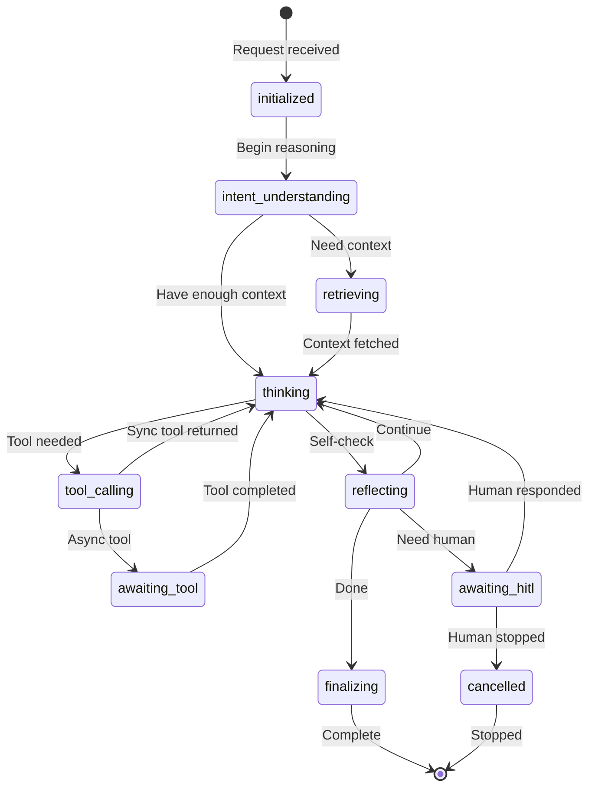

### State Definitions

```yaml
states:
  initialized:
    Entered: When a request arrives
    Persistence: Persisted (start of trace)
    Outputs: invocation_id, tenant_id, agent_id captured
  
  intent_understanding:
    Entered: From initialized
    Activity: Parse user intent, classify task, determine path
    Persistence: Optional (transient)
    Outputs: classified intent, plan sketch
  
  retrieving:
    Entered: When context is needed
    Activity: Vector search, graph query, hybrid search, memory recall
    Persistence: Optional, but search results are cached
    Outputs: retrieved context
  
  thinking:
    Entered: When LLM reasoning is needed
    Activity: LLM call (chain-of-thought, tool decision, response drafting)
    Persistence: Persisted (each LLM call is a span)
    Outputs: reasoning, possibly tool requests
  
  tool_calling:
    Entered: When thinking decides a tool is needed
    Activity: Synchronous tool invocation
    Persistence: Persisted (side effect tracking, see 6.3.3)
    Outputs: tool result
  
  awaiting_tool:
    Entered: When a long-running tool is invoked
    Activity: Waiting for async tool completion
    Persistence: Persisted (state must survive process crash)
    Outputs: callback or polling
  
  reflecting:
    Entered: When self-check is needed (driven by guard agents or confidence threshold)
    Activity: Verification, confidence assessment, error checking
    Persistence: Optional
    Outputs: continue / escalate / finish decision
  
  awaiting_hitl:
    Entered: When human approval/help is needed
    Activity: Waiting for human action (approval, clarification, choice)
    Persistence: Persisted (state must survive long waits)
    Outputs: human decision
    Sub-states: help_requested, option_selection, feedback_received (see Ch.7.1)
  
  finalizing:
    Entered: From reflecting when done
    Activity: Compose final response, write outputs to SoR, finalize side effects
    Persistence: Persisted (end of trace, business result write)
    Outputs: final response
  
  cancelled:
    Entered: From awaiting_hitl when human stops, or by external cancellation
    Activity: Cleanup, side-effect rollback if possible
    Persistence: Persisted (audit record)
    Outputs: cancellation record

  failed:
    Entered: From any state on unrecoverable error
    Activity: Error capture, audit, attempt graceful exit
    Persistence: Persisted (failure record)
    Outputs: error report
```

### Persistence Strategy: C+D Hybrid

When and what to persist is a tradeoff: too little, and crash recovery is impossible; too much, and per-call overhead is unacceptable. The platform uses a **two-track persistence model**:

```yaml
track_C_critical_persistence:
  What: Persisted to PostgreSQL synchronously (transactional write)
  Examples:
    - initialized: invocation start record
    - tool_calling: irreversible side effect record (see 6.3.3)
    - awaiting_hitl: long-wait state checkpoint
    - awaiting_tool: long-wait state checkpoint
    - finalizing: business result + audit
    - cancelled / failed: audit
  Cost: ~1ms per call, but only for these checkpoints
  Why: Without these, recovery is impossible

track_D_diagnostic_persistence:
  What: Persisted to Trace Lake asynchronously (via Outbox → Kafka)
  Examples:
    - thinking: each LLM call (prompt, response, tokens)
    - retrieving: each retrieval (query, results)
    - reflecting: each self-check
    - intent_understanding: classification result
  Cost: <100μs per call (async, batched)
  Why: For evaluation, debugging, audit; resume not required

reasoning_for_split:
  Critical track survives crashes; supports resume
  Diagnostic track informs evaluation; supports replay analysis
  Together they balance cost vs recoverability
```

### The Task Engine Drives the State Machine

The state machine itself is data, not code. A **Task Engine** (built on Spring State Machine + custom orchestration) drives transitions:

```yaml
task_engine_responsibilities:
  - Persist current state on critical transitions
  - Emit Track-D telemetry on every transition
  - Handle resume from persisted state after crash / restart
  - Enforce timeout boundaries per state
  - Coordinate multi-agent flows (delegating to fin-graph for orchestration)
  - Handle external events (HITL responses, async tool callbacks, cancellations)

task_engine_does_not:
  - Decide *what* the agent should do (LLM does that)
  - Implement business logic (agents do that)
  - Persist diagnostic data (Outbox does that)
```

The separation lets the engine evolve independently of agent logic. New states can be added (e.g., a `dreaming` state for batch reflection — see Chapter 5.2 evolution flywheel) without rewriting agents.

### Multi-Agent Coordination via Flowable

When multiple agents collaborate, a single state machine isn't enough. The platform uses **Flowable** (Apache 2.0 BPMN engine) to orchestrate cross-agent flows:

```yaml
flowable_role:
  Each agent runs its own state machine for its own activity
  Flowable orchestrates the higher-level workflow:
    - Sequential: Agent A → Agent B → Agent C
    - Parallel: Agent A and B run simultaneously, join at Agent C
    - Conditional: Decision node routes to A, B, or C
    - Loop: Iterate until condition met
  
  Each Flowable node corresponds to an agent invocation
  Flowable persists its own workflow state
  Agent state machines persist their own state
  These are coordinated via shared trace_id
```

Together, the per-agent state machine + Flowable orchestration handle the four collaboration patterns of Chapter 7.2 (orchestration, choreography, pipeline, debate).

## 6.3 Long-Running Task Execution

### Four Forms of Long-Running Tasks

A "long task" is anything that doesn't return synchronously within a few seconds. The platform supports four forms:

```yaml
form_A_async_request_response:
  Pattern: Submit task, get task_id, poll or webhook for result
  Example: Generate a 10-page financial report
  Duration: Seconds to hours
  
form_B_streaming_progressive:
  Pattern: Streaming partial results as they're produced
  Example: Long-form report streamed paragraph by paragraph
  Duration: Tens of seconds
  
form_C_long_lived_session:
  Pattern: Persistent conversation that resumes across days
  Example: Multi-day customer onboarding workflow
  Duration: Days to weeks
  
form_D_continuous_running:
  Pattern: Always-on agent (e.g., monitoring agent)
  Example: 24/7 fraud detection agent
  Duration: Indefinite
```

### Granularity and Checkpoints

Each long-running task is decomposed into **stages** at granularity-2 (intermediate granularity — not too fine that overhead dominates, not too coarse that recovery is expensive). At each stage boundary, three checkpoints are written:

```yaml
checkpoint_types:
  C1_state_checkpoint:
    What: The agent's logical state (variables, partial results, pointers)
    Storage: PostgreSQL
    Purpose: Resume after crash
  
  C2_side_effect_checkpoint:
    What: All side effects performed (with rollback information)
    Storage: PostgreSQL (transactional with state)
    Purpose: Idempotency on resume; rollback on cancel
  
  C3_progress_checkpoint:
    What: User-visible progress (percentage, current phase, ETA)
    Storage: Cache (Valkey, fast read)
    Purpose: Customer-facing status without DB load
```

### Side-Effect Classification

Side effects are not equal. Some are reversible, some are not. The platform classifies them:

```yaml
side_effect_levels:
  L0_no_side_effect:
    Examples: pure read, calculation, classification
    Treatment: No special handling
  
  L1_reversible_logical:
    Examples: insert/update in agent's own database (can be rolled back)
    Treatment: Track in side-effect log, support automatic rollback
  
  L2_reversible_external:
    Examples: write to external system that supports retraction
    Treatment: Track + invoke retraction API on rollback
  
  L3_irreversible:
    Examples: send email, file regulatory report, transfer funds, post to social media
    Treatment:
      - REQUIRE explicit human approval (HITL gate) before execution
      - Maintain audit-grade record (hash chain, see Ch.8.4)
      - Reject if Side-Effect Budget exceeded (see below)
      - Track in Idempotency Records with persistent idempotency_key
  
  L4_business_critical_irreversible:
    Examples: fund transfers > $10K, account closures, regulatory filings
    Treatment:
      - All L3 protections, AND
      - Multi-person approval
      - Mandatory pre-execution review by guard agents
      - Real-time regulatory notification where required
```

### Side-Effect Budget

To bound the worst case where AI behavior misfires, every long-running task carries a **Side-Effect Budget**:

```yaml
side_effect_budget:
  Example budget for a customer service agent:
    L1_reversible: unlimited (within rate limits)
    L2_reversible_external: 100 per session
    L3_irreversible: 5 per session, requires per-action approval
    L4_business_critical: 0 per session (must be explicit business workflow)
  
  Behavior on exceeding:
    Agent transitions to awaiting_hitl with explanation
    Operator decides: increase budget, or halt task
  
  Why this matters:
    Prevents runaway agents from causing unbounded damage
    Makes "blast radius" of an AI failure explicitly bounded
```

### Cancellation Semantics

Three cancellation modes:

```yaml
graceful:
  Behavior: Notify task to "stop at next checkpoint"
  Use: Normal user cancellation, scheduled maintenance
  Time: Stops within next stage boundary (could be seconds)
  Side effects: All completed effects remain; partial effects rolled back if reversible
  
prompt:
  Behavior: Stop within current state, complete current LLM call if any
  Use: Approaching SLA breach, resource pressure
  Time: Stops within current state (sub-second)
  Side effects: Partial in-progress effects may be unrecoverable; rollback attempted
  
immediate:
  Behavior: Kill task immediately, may leave inconsistent state
  Use: Security incident, critical bug detected
  Time: Sub-millisecond
  Side effects: Possibly inconsistent; manual cleanup may be needed; audit records created
```

## 6.4 Exception Handling — AI-First Three Layers

### The AI-First Principle

When an agent encounters an exception, the natural first response is "retry, then escalate." But this misses the platform's most powerful asset: **AI itself**. The platform applies AI as the **second layer** of exception handling, between automatic code-level handling (fast, deterministic) and human escalation (slow, contextual).

```yaml
three_layer_exception_handling:
  Layer 1 — Code (deterministic, <1s):
    Examples: retry on transient failure, circuit breaker, fallback to backup
    Decided by: pre-programmed rules
    Outcome: most exceptions resolved here
  
  Layer 2 — AI (intelligent, seconds–minutes):
    Examples: AI Operator analyzes the failure, attributes root cause, suggests action
    Decided by: AI reasoning over the trace + system state
    Outcome: novel exceptions get expert-level analysis
  
  Layer 3 — HITL (human, minutes–hours):
    Examples: human operator reviews AI's analysis, decides to override / accept / escalate
    Decided by: human judgment
    Outcome: irrecoverable or high-stakes situations get human attention
```

### Source × Semantic Matrix

Exceptions vary by **source** (where they originate) and **semantic** (what they mean). Different combinations get different default responses:

```yaml
exception_matrix:
  rows (source):
    - LLM provider (timeout, throttle, content policy violation)
    - Inference engine (OOM, crash, model loading failure)
    - Storage (database down, vector store unreachable)
    - Tool / external system (API failure, malformed response)
    - Network (latency spike, partial outage)
    - Internal logic (assertion failure, unexpected state)
    - Security (auth failure, suspicious input, prompt injection)
    - Compliance (red-line violation, jurisdictional restriction)
  
  cols (semantic):
    - Transient (will retry succeed?)
    - Permanent (will retry never succeed?)
    - Uncertain (don't know whether to retry)
  
  example_handlers:
    LLM_timeout × transient: Layer 1 retries with backoff
    LLM_throttle × transient: Layer 1 routes to backup model
    Inference_OOM × permanent: Layer 1 marks engine unhealthy, fails over
    Storage_down × transient: Layer 1 retries; Layer 2 alerts if pattern persists
    Tool_API_failure × uncertain: Layer 2 AI analyzes — was it a real failure?
    Security_violation × permanent: Layer 1 blocks, Layer 3 alerts
    Compliance_redline × permanent: Layer 1 blocks, Layer 3 alerts (regulatory)
```

### AI Operator Architecture

The Layer-2 AI is an **AI Operator** — an autonomous (within bounded scope) AI agent specifically for system operations:

```yaml
ai_operator_capabilities:
  inputs:
    - Current trace (full context of the failed call)
    - System metrics (CPU, GPU, memory, queue depth)
    - Recent similar failures (from failure case library)
    - System health dashboard
  
  reasoning:
    - Pattern match against known failures
    - Causal attribution (which subsystem is the root?)
    - Estimate severity and blast radius
    - Propose actions ranked by confidence
  
  outputs:
    - Diagnosis: human-readable explanation
    - Proposed actions (multiple, with confidence scores)
    - Recommendation (preferred action)
  
  bounded_authority:
    - Can suggest, cannot execute (HITL gates execution)
    - Exception: pre-approved auto-actions (e.g., circuit breaker, scale up)
    - Cannot make business decisions
    - Cannot access data outside its tenant's scope
```

### Three-Dimensional Degradation

Rather than binary "working / broken," exceptions trigger graceful degradation along three dimensions:

```yaml
degradation_dimensions:
  D1_capability:
    "Reduce what the agent can do"
    Examples:
      Full agent → simpler agent
      Multi-step → single-step
      Tool use → no tool use
      Real-time → cached response
  
  D2_quality:
    "Accept lower quality response"
    Examples:
      V4 Pro → V4 Flash (faster, cheaper)
      Multi-judge evaluation → single check
      Personalized → generic
  
  D3_availability:
    "Reduce availability for some tenants"
    Examples:
      All tiers → only VIP
      Real-time → batch only
      Synchronous → async only
```

The platform composes these: a major outage might trigger D1 (capability reduction) + D3 (VIP only) but maintain D2 (quality unchanged for those still served).

### Five-Level Circuit Breaker Granularity

The Sentinel-based circuit breakers operate at five granularities, increasing in scope:

```yaml
circuit_breaker_levels:
  L1_per_call: Single call has too many retries → fail this call
  L2_per_session: Session pattern indicates issue → fail this session, save state
  L3_per_tenant: Tenant-specific failure rate spike → throttle this tenant
  L4_per_agent_type: All instances of a specific agent fail → divert to backup
  L5_platform_wide: Cascade failure imminent → emergency mode, only critical traffic
```

Each level can be triggered automatically or manually (operator can pull the L5 manual circuit if needed).

## 6.5 Real-Time vs Batch Stream Orchestration

### The 22 Streams

The platform's data plane carries 22 distinct streams. They are classified by SLA tier, which determines their resource allocation, isolation, and observability:

```yaml
SLA_tier_L1_realtime:
  Latency target: < 1s end-to-end
  Examples:
    1. Inbound business request (gateway → agent)
    2. Synchronous LLM call
    3. Synchronous tool call
    4. Cache hit serving
    5. Streaming response (SSE)
  Resource: Real-time-only GPU pool
  
SLA_tier_L2_near_realtime:
  Latency target: < 30s
  Examples:
    6. Trace event ingestion (to Trace Lake)
    7. Cost event ingestion
    8. Layer 2 evaluation samples
    9. Exception event ingestion
    10. Business event broadcasting
    11. Cache invalidation events
  Resource: Shared compute pool, prioritized
  
SLA_tier_L3_batch:
  Latency target: minutes to hours (best effort)
  Examples:
    12. Hourly cost aggregation
    13. Daily reflection engine pass
    14. Daily asset sedimentation
    15. Daily reconciliation jobs
    16. Weekly experiment analysis
    17. Distillation training runs
    18. Memory compaction (Dreaming)
  Resource: Spot / off-peak GPU pool
  
SLA_tier_L4_persistent:
  Latency target: continuous, indefinite duration
  Examples:
    19. Continuous fraud monitoring
    20. Continuous business event stream processing
    21. Suspicious transaction monitoring
    22. Regulatory event monitoring
  Resource: Dedicated long-running services
```

### Resource Pool Architecture

```yaml
gpu_pool_architecture:
  realtime_pool:
    Dedicated to L1 traffic
    Reserved capacity (never shared)
    Priority scheduling
    VIP customers get dedicated nodes within the pool
  
  shared_pool:
    Serves L2 + L3
    Fair scheduling (weighted by tenant tier)
    Preemption supported (L3 can be preempted for L2 surge)
    Preemption uses graceful pause (see 6.3.4)
  
  spot_pool:
    Serves L3 only
    Uses spot/preemptible instances for cost
    Tasks must support preemption
    Used for distillation, memory compaction, training
```

### Cross-Stream Failure Propagation

What happens when one stream's failure threatens others? The platform monitors:

```yaml
cross_stream_propagation_alerts:
  L1_latency_spike → check whether L2 is consuming too much L1 capacity
  L2_backlog_grows → check whether outbox/Kafka is degraded
  L3_jobs_failing → check whether spot capacity is unavailable
  L4_lag_grows → check whether continuous services are crashing
  
  Cross-stream triage:
    Detect propagation patterns
    Apply circuit breakers at stream boundary
    Alert via Operations Console (see Chapter 11.4)
```

## 6.6 Putting It Together: A Sample Trace

Consider a customer asking "What's the best mortgage option for me?":

```yaml
sample_trace:
  t=0ms: Request arrives at Higress (gateway)
    State: not yet in agent
    Stream: L1 (real-time)
    
  t=5ms: After auth, tenant resolution, the call dispatches to the customer service agent
    State machine: initialized
    Trace: span_1 logged
    
  t=10ms: Agent enters intent_understanding
    LLM call (small classifier) classifies as "mortgage advice"
    Trace: span_2 logged (intent classifier)
    
  t=200ms: Agent enters retrieving
    Vector search for relevant mortgage products
    Graph query for customer profile (in tenant's namespace)
    Trace: span_3, span_4 logged
    
  t=400ms: Agent enters thinking
    LLM call (V4 Flash) drafts a recommendation
    Trace: span_5 logged
    
  t=2000ms: Agent enters reflecting
    Confidence check: agent's confidence is 0.4 (below threshold of 0.6)
    Reason: customer's situation is unusual; agent recommends asking for clarification
    Decision: transition to awaiting_hitl with help_requested sub-state
    
  t=2010ms: awaiting_hitl persisted (track C — critical)
    State checkpoint: full agent state saved to PostgreSQL
    Customer-facing message: "I want to confirm a few details before recommending a mortgage product"
    
  t=N (later, possibly hours): Customer responds with clarifications
    awaiting_hitl → thinking
    Trace: span_6 logged
    
  t=N+500ms: Agent enters finalizing
    Composes final recommendation
    Three-way reconciliation record written (business + cost + audit)
    
  t=N+550ms: State machine reaches end
    Response sent to customer
    Final span logged, trace closed
```

In this trace:

- **5 critical persistence checkpoints** (track C) survived a hypothetical crash at any point
- **6+ spans** (track D) flowed through Outbox → Kafka → Trace Lake for evaluation
- **AI-First exception handling** wasn't triggered (no exceptions); had it been, AI Operator would have analyzed
- **Side-effect budget** wasn't consumed (no L2+ side effects)
- **Behavioral state machine** ensured every transition was recoverable and auditable
- **L1 stream** carried real-time response; **L2 stream** carried trace data asynchronously

This is the executable intent of the execution plane — every call has structured behavior, persistent recovery, AI-augmented exception handling, and stream-isolated resource allocation.

## 6.7 Summary

The execution plane integrates four behavioral concerns:

| Concern | Solution | Section |
|---|---|---|
| Agent state during a call | 11-node state machine with C+D persistence | 6.2 |
| Long-running tasks | 4 task forms, granular checkpoints, side-effect budget | 6.3 |
| Exception handling | 3-layer AI-First + degradation + circuit breakers | 6.4 |
| Real-time vs batch | 22 streams, 4 SLA tiers, resource pool isolation | 6.5 |

These work together: the state machine governs each call's lifecycle; long-task primitives extend the state machine across hours/days; AI-First exception handling responds to deviations; stream classification ensures each call's resources match its SLA.

The execution plane makes the platform's behavioral promise — "we run agents reliably under enterprise conditions" — concrete and verifiable.

The next chapter examines how agents *interact*: with humans (HITL, feedback, teaching, control transfer), with each other (A2A protocol, four collaboration patterns), and with the outside world (tools, APIs, command lines).


# Chapter 7: Collaboration Interfaces

## 7.1 The Three-Plane Collaboration Model

In v3.0 of this architecture, a "two-plane" model distinguished the **Human Plane** (people defining business intent and approving critical decisions) from the **Autonomous Plane** (agents reasoning and acting). v4.1 weakened this distinction by scattering it across chapters. v5.0 **reactivates and extends** the model:

```yaml
three_planes:
  Human Plane:
    Activities: business definition, red-line management, critical-decision approval, compliance audit, feedback and teaching
    Surface: Operations Console (operator/SRE/compliance views) + Agent Studio (developer)
    
  Collaboration Interface (NEW — promoted to first-class plane):
    Activities: AI ↔ Human two-way dialogue
    Five interactive modes: AI requests help, Human gives feedback, AI explains, Human teaches, Control transfer
    
  Autonomous Plane:
    Activities: Architect AI, Operator AI, Optimizer AI, Reviewer AI, Compliance AI, Safety AI, business agents
    Surface: Internal to platform
```

The collaboration interface is **promoted to a first-class plane** rather than being a "line" between the other two. This reflects a deeper insight: most enterprise AI platforms treat human-AI interaction as an afterthought ("our AI sometimes asks for approval"). Real collaboration is **bidirectional, multi-modal, and structured**.

This chapter develops the collaboration interface across three axes:

```yaml
chapter_organization:
  7.2: Inter-agent collaboration (autonomous-plane internal)
  7.3: Human-AI collaboration (cross-plane)
  7.4: SDK embedding model (how customer code integrates)
  7.5: Customer contract (what the platform promises externally)
  7.6: BYOC operations (how platform and customer ops collaborate)
```

## 7.2 Inter-Agent Collaboration

### Four Collaboration Patterns

Multi-agent systems combine in four distinct ways:

```yaml
pattern_1_orchestration:
  Description: One "master" agent invokes "subordinate" agents
  Master: business agent or meta agent
  Subordinates: capability-specific agents (e.g., risk agent, compliance agent)
  Example: Customer service agent invoking risk agent to query customer's risk score
  Carried by: A2A direct invocation (synchronous)
  
pattern_2_choreography:
  Description: Agents communicate via events; no master
  Mechanism: Event bus (Kafka)
  Example: Suspicious transaction event → fraud agent + alert agent + audit agent all subscribe
  Carried by: A2A event schema over Kafka topics
  
pattern_3_pipeline:
  Description: Agents chained; output of A is input to B
  Mechanism: Flowable BPMN orchestrating sequential nodes, each a different agent
  Example: KYC pipeline — identity verification → risk profiling → product matching → approval
  Carried by: BPMN + A2A node calls
  
pattern_4_debate:
  Description: Multiple agents tackle the same problem from different angles; results synthesized
  Mechanism: Coordinator agent + parallel A2A calls
  Example: Reviewer agent + Compliance agent + Safety agent all examine a recommendation; coordinator combines verdicts
  Carried by: A2A parallel invocation
```

All four patterns ultimately use **A2A protocol** as their bottom layer; differences are in *how* A2A is used (one-to-one vs broadcast vs sequential vs parallel).

### The Four-Protocol Stack

Inter-agent collaboration requires not just A2A but several complementary protocols:

```yaml
protocol_stack:
  A2A:
    Direction: Agent ↔ Agent (horizontal)
    Use: Two-way communication, task-state model, streaming responses
    Carries: All four collaboration patterns above
    
  MCP (Model Context Protocol):
    Direction: Agent → Tool (vertical)
    Use: Structured tool invocation with schema
    Carries: Tool calls (database queries, business APIs, knowledge retrieval)
    
  OpenAPI / gRPC:
    Direction: Agent → External API (vertical)
    Use: Standard REST/gRPC calls to existing services
    Carries: Integration with non-MCP services
    
  CLI (Command Line):
    Direction: Agent → Shell (vertical)
    Use: Command execution where no MCP wrapper exists
    Carries: Data analysis tools, report generation, ops commands, debugging
```

### CLI as a First-Class Protocol

v4.1 listed three protocols (A2A, MCP, OpenAPI) but missed CLI. Yet CLI is how Claude Code, Devin, Cursor, and similar AI coding assistants actually work — and financial scenarios use it heavily (data analysis with SQL CLI, report generation with pandoc/LaTeX, ops with kubectl, debugging with grep/find).

CLI introduces three engineering challenges absent from API-style protocols:

**Challenge 1: Command security.**

```yaml
cli_security:
  sandbox: gVisor / Firecracker / Docker (per-invocation)
  command_whitelist:
    Strict mode: only pre-approved commands (default for finance)
    Category mode: by category (data-analysis, reporting, ops)
  parameter_validation: shell metacharacters disallowed unless explicitly whitelisted
  resource_limits: CPU / memory / disk / time bounded
  audit: every command + stdout + stderr fully recorded
```

**Challenge 2: Unstructured output parsing.**

```yaml
output_parsing_strategy:
  Priority 1: Request JSON output from CLI (e.g., kubectl --output=json)
  Priority 2: Use structured tools (jq, awk, grep) to extract data
  Priority 3: LLM-based parsing of natural-language output (last resort)
```

**Challenge 3: Side-effect tracking.**

CLI commands can mutate the world. The platform classifies them per Chapter 6.3.3:

```yaml
cli_side_effects:
  L0_no_side_effect: read-only commands (cat, grep, find -name)
  L1_logically_reversible: temporary file creation
  L3_irreversible: rm, git commit, curl POST to external API
  
  All CLI calls must declare their side-effect level
  Sandboxed environment isolates effects from real systems
  L3+ commands require approval per the side-effect budget
```

### Sync vs Async Invocation

Default: synchronous. Long tasks: automatically converted to async.

```yaml
invocation_mode_decision:
  default_mode: synchronous
  
  auto_async_triggers:
    Estimated duration > 30s
    Actual execution exceeds 30s
    Long-task forms A/B/C from Chapter 6.3
    External long process (e.g., awaiting human approval)
    Caller resource pressure
    System under high load
  
  async_semantics:
    Caller transitions to awaiting-tool state (Chapter 6.2)
    Engine manages callback / poll
    Caller can poll for status or receive webhook
```

### Failure Handling Across Protocols

Failures at the protocol layer follow the AI-First principle (Chapter 6.4):

```yaml
protocol_failure_handling:
  A2A_call_fails:
    Transient: Layer 1 retries (with backoff)
    Permanent: Fall back to equivalent agent if available
    Uncertain: Layer 2 AI analyzes
  
  MCP_tool_fails:
    Transient: retry
    Permanent: degrade to equivalent tool or return error
  
  CLI_fails:
    exit_code != 0: Layer 2 AI analyzes stderr
    timeout: kill + retry + alert
    security_violation: immediate block + alert (no retry)
  
  cross_protocol_degradation:
    MCP tool unavailable → fall back to equivalent CLI command
    A2A call fails → fall back to local fallback agent
```

### Unified Governance Across Protocols

All four protocols pass through the same governance:

```yaml
unified_governance:
  authentication:
    A2A: Agent Card metadata
    MCP: tool-level OAuth or API key
    OpenAPI: standard OAuth 2.0
    CLI: sandbox user permissions + command whitelist
  
  rate_limiting:
    All protocols pass through Higress
    Per-tenant, per-agent, per-tool quotas
  
  tracing:
    All protocols carry W3C Trace Context
    Full chain stitched in Trace Lake
  
  audit:
    Every call recorded: input, output, side effects, latency, cost
  
  idempotency:
    Side-effecting calls require idempotency_key (Chapter 8.3)
```

## 7.3 Human-AI Collaboration

### Five Interaction Modes

The collaboration interface plane carries five modes of interaction:

```yaml
mode_1_ai_requests_help:
  AI proactively pauses and asks the human for guidance
  Different from passive HITL approval — AI initiates
  
mode_2_human_provides_feedback:
  Three layers: explicit rating (👍/👎), corrective feedback ("this is wrong"), teaching feedback ("for X situations, do Y")
  
mode_3_ai_explains:
  Four-layer depth: one-line summary, key reasons, full reasoning chain, data-level provenance
  
mode_4_human_teaches:
  Conversational modification of agent behavior — the inverse of "AI helps humans code"
  
mode_5_control_transfer:
  Smooth handoff between AI-led and human-led modes
```

### Mode 1: AI Requests Help

Distinct from traditional HITL:

| Dimension | Traditional HITL Approval | AI Proactive Help Request |
|---|---|---|
| Nature | Passive waiting | Proactive initiation |
| Form | Binary (approve / reject) | Multiple options + recommendation |
| Trigger | Workflow node | Situational |

Triggers (extending Chapter 6.4 AI-First):

```yaml
help_request_triggers:
  Confidence trigger: AI self-assessed confidence < 0.6
  Multi-option trigger: AI sees multiple paths, can't choose
  Out-of-scope trigger: AI recognizes problem outside its training
  Business-rule trigger: rule explicitly says "ask human"
  Impact trigger: action affects > threshold (amount, customer count)
```

The help-request format gives the human everything needed to decide quickly:

```yaml
help_request_format:
  context:
    task_goal
    completed_steps
    current_situation
  options:
    - id: A, action: ..., reasoning: ..., risk: ..., confidence: 0.7
    - id: B, action: ..., reasoning: ..., risk: ..., confidence: 0.8
    - id: C, action: ..., reasoning: ..., risk: ..., confidence: 0.5
  ai_recommendation:
    preferred: B
    reason: ...
  question_for_human: "Which option do you prefer?"
```

**Critical design principle**: AI must provide a recommendation, not pass the decision entirely to the human. This reduces human cognitive load — the human can accept the AI's recommendation or override with reasons.

### Mode 2: Human Provides Feedback

```yaml
three_layers_of_feedback:
  L1_explicit_rating:
    Form: 👍/👎 + 1–5 stars
    Storage: trace metadata
    Use: feeds evaluation engine; quality monitoring; A/B signal
    Processing: automatic, no AI intervention
  
  L2_corrective_feedback:
    Form: "This is wrong, it should be X"
    Flow:
      1. Human points out error
      2. AI immediately generates corrected version
      3. Human confirms correction
      4. Correction replaces the response
      5. Failure pair enters failure case library
    Use: immediate user-experience fix + reflection engine
  
  L3_teaching_feedback (most valuable):
    Form: natural-language rule
    Flow:
      1. Human writes teaching feedback
      2. AI parses intent: rule change? new few-shot? prompt mod?
      3. AI proposes change ("I'll modify it like this")
      4. Human confirms
      5. Goes through asset repository → gradual rollout
    Use: inverse of "AI helps coders" — human teaches AI conversationally
```

### Feedback Trust Model

Not all feedback is equally trustworthy:

```yaml
feedback_trust_model:
  role_weight:
    Compliance specialist on compliance issue: HIGH
    Business expert on business issue: HIGH
    Regular user on business: MEDIUM
    Regular user on technical: LOW
  
  historical_consistency:
    User with high adoption rate of past feedback: trust_score↑
    User with contradictory past feedback: trust_score↓
  
  feedback_aggregation:
    Multiple users converging on same feedback: high-confidence change
    Isolated feedback: low-confidence, requires more validation
  
  approval_thresholds:
    L1/L2 feedback: low bar (instant effect)
    L3 teaching feedback: HIGH bar (HITL review required)
    Why: protect against an individual user "teaching the AI badly"
```

### Mode 3: AI Explains

Four explanation depth layers (humans can drill deeper as needed):

```yaml
explanation_depth_layers:
  L1_one_line:
    "I recommend approval — customer's credit history is good"
    Use: default display
  
  L2_key_reasons:
    Reason 1: Credit score 750 (vs 700+ benchmark)
    Reason 2: No payment delays in history
    Reason 3: Stable income
    Use: when user clicks "details"
  
  L3_full_reasoning_chain:
    Step 1: Query customer profile → score 750
    Step 2: Calculate compound risk score
    Step 3: Retrieve similar cases
    Step 4: Apply business rules
    Step 5: Compose recommendation
    Use: regulatory audit, deep debugging
  
  L4_data_level_provenance:
    Each data point traced to its origin
    Each reasoning step replayable
    Use: regulatory "provable decision" requirement
```

### Honest Explanation Principle

AI must NOT post-hoc rationalize. Real reasoning is the trace; the explanation is a *view* of the trace, not a freshly composed narrative.

```yaml
honest_explanation_mechanism:
  forbidden:
    Constructing a logical-sounding explanation when the actual decision was based on instinct
  
  enforcement:
    Explanations must derive from the trace
    If reasoning was unclear, MUST mark "low explainability"
    For regulatory display, prefer L4 (data-level provenance)
  
  evaluation_coupling:
    Evaluation engine has explicit "explainability" dimension
    Mismatch between explanation and trace → score deduction
```

### Mode 4: Human Teaches AI Conversationally

This is the most innovative collaboration mode:

```yaml
traditional_method:
  Human writes prompt → deploy → test → modify prompt → deploy
  Requires prompt engineering skill
  Long feedback cycle
  "Code mode"

teaching_mode:
  Human chats with AI → AI parses intent → AI modifies itself → human verifies
  Doesn't require prompt engineering
  Instant feedback
  "Conversation mode"
```

The Architect AI (one of the meta agents) is responsible:

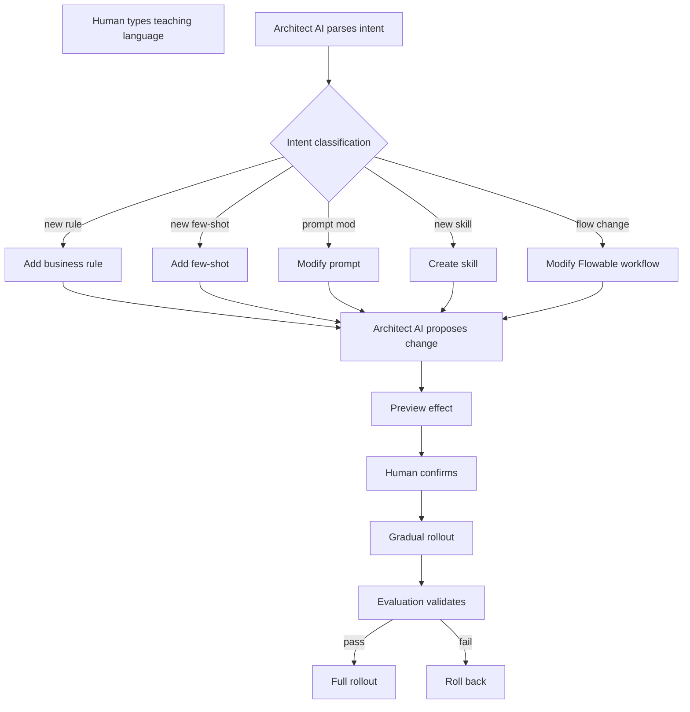

### Teaching Safety Boundaries

Teaching can NOT modify everything:

```yaml
teaching_restrictions:
  forbidden_to_teach:
    Red-line rules (must come from compliance, code-level)
    Regulatory compliance rules (must come from regulators)
    Safety guardrails (guard agents themselves)
    HITL trigger conditions (prevent AI self-authorization)
  
  permitted_to_teach:
    Business phrasing
    Workflow optimization
    New scenario adaptations
    Prompt tuning
  
  approval_tiers:
    High-frequency small changes: auto-rollout if evaluation passes
    Medium changes: HITL review required
    Large changes: regulatory notification (if customer-affecting)
```

### Mode 5: Control Transfer

Adapting v4.1's Autonomy Slider to the collaboration context:

```yaml
control_gradient:
  human_fully_in_charge:
    AI role: provide info and suggestions
    Use: critical decisions, regulatory boundaries
  
  human_lead_ai_assist:
    AI role: drafts options, human modifies and finalizes
    Use: complex business, sensitive operations
  
  ai_lead_human_confirms:
    AI role: makes decisions, human approves
    Use: standard business workflows
  
  ai_fully_in_charge:
    AI role: completes independently
    Use: non-critical paths, well-defined rules
```

Triggers for handoff:

```yaml
to_human_triggers:
  AI confidence below threshold
  Irreversible operations (per Chapter 6.3.3)
  Exception events (per Chapter 6.4)
  Human takes over manually
  
to_ai_triggers:
  Human completed key decision
  Subsequent steps are standard workflow
  Human delegates explicitly
```

Context preservation across handoffs:

```yaml
context_preservation:
  AI_to_human:
    Preserve: AI's gathered info + reasoning chain + current proposal
    Human sees: full task, key decision points, available options
  
  human_to_ai:
    Pass: human's decision + feedback + further instructions
    AI receives: skip already-completed work, continue from human's input
```

### Multi-Party Collaboration (Granularity D)

The most advanced granularity: multiple humans + multiple AIs in shared workspace, like Slack:

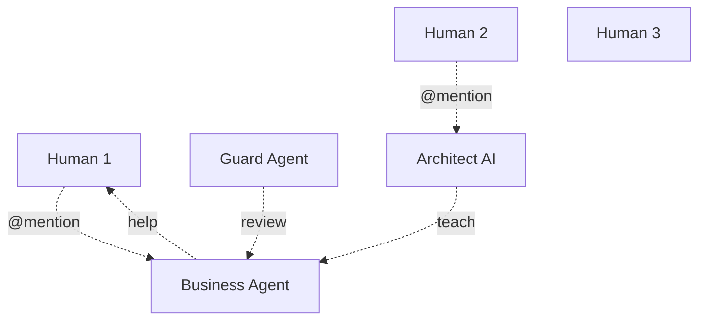

```yaml
multi_party_design:
  shared_context:
    Workspace participants see full conversation history
    AI sees human-to-human messages (can learn)
    Humans see AI-to-AI messages (can supervise)
  
  routing:
    @mentions trigger specific participants
    AI-to-AI uses A2A
    Human-to-AI uses dialog interface
  
  permissions:
    Each participant has own permissions
    Cross-permission messages auto-redacted
    Regulator view sees everything (with appropriate authorization)
  
  concurrency:
    Multiple messages processed in parallel
    Conflicts resolved per Chapter 8 consistency rules
  
  audit:
    Full conversation auditable
    Each message: source, time, impact tracked
```

## 7.4 SDK Embedding Model

### The Mid-Weight Dual-Mode Choice

Customer business code interacts with the platform via an SDK. The SDK design reflects a choice point: **how heavy** should the SDK be?

```yaml
sdk_weight_options:
  light_sdk: just a remote call wrapper (like calling OpenAI API)
  heavy_sdk: full agent runtime in customer process (like LangChain)
  mid_sdk_dual_mode: chosen
```

The mid-weight dual-mode design:

```yaml
default_mode (covers 80% scenarios):
  SDK does:
    - Platform connection (auth, handshake, heartbeat)
    - Tracing propagation
    - Cost reporting
    - Exception envelope
    - Spring AI ChatClient wrapper
    - Lightweight client cache
  Platform does:
    - Agent execution
    - Routing, model management
    - Memory, knowledge, skills
    - Guard agents, evaluation
  Customer experience:
    - Add starter dependency
    - Call chatClient.prompt(...).call()
    - Doesn't perceive agent internals

extended_mode (covers 20% scenarios):
  SDK adds:
    - In-process lightweight agents
    - Custom tool / MCP server registration
    - Custom memory backends
    - Custom advisors
  Platform retains:
    - Governance (audit, HITL, compliance)
    - Model management
    - Complex capabilities (evaluation, distillation, Dreaming)
  Customer experience:
    - Like using Spring AI directly
    - But still under platform governance
```

### Why "Governance Always at Platform"

The mid-weight dual-mode design has **one inviolable principle**: regardless of how much execution moves into customer process, four things stay at the platform:

```yaml
non_negotiable_platform_responsibilities:
  - Guard agents (safety, compliance review)
  - Evaluation engine (continuous quality monitoring)
  - Model management (versioning, routing decisions)
  - Compliance audit (immutable audit trail)
```

This is the **finance-specific reason** the platform doesn't go all the way to "heavy SDK" like LangChain — those frameworks lose central governance, which is unacceptable for regulated finance.

### Five Spring Boot Starter Modules

Customer code adds modular dependencies based on need:

```yaml
spring-ai-fin-starter-core:    # required
  Capability: Platform connection, tracing, cost reporting, exception handling, ChatClient wrapper
  
spring-ai-fin-starter-memory:    # optional
  Capability: Three-tier memory client, local short-term cache, remote long-term
  
spring-ai-fin-starter-skill:    # optional
  Capability: MCP client, tool registration, CLI sandbox client
  
spring-ai-fin-starter-flow:    # optional
  Capability: Flowable integration, HITL approval client, long-task management
  
spring-ai-fin-starter-advanced:    # optional, heavyweight
  Capability: In-process lightweight agents, custom memory backends, custom advisors
```

### Three Usage Paradigms

Customer code can interact with the platform at three depths:

**Paradigm A — Default mode (80% of scenarios):**

```java
@Service
public class CustomerService {
    private final ChatClient chatClient;
    
    public CustomerService(ChatClient.Builder builder) {
        this.chatClient = builder.build();
    }
    
    public String answer(String userId, String question) {
        return chatClient.prompt()
            .user(question)
            .advisors(a -> a.param("user_id", userId))
            .call().content();
    }
}
```

Code looks identical to native Spring AI, but underneath the call goes to the platform's runtime.

**Paradigm B — Customer-registered tools (medium extension):**

```java
@Component
public class AccountQueryTool {
    @Tool(description = "Query customer account balance")
    public BigDecimal queryBalance(String accountId) {
        return accountService.getBalance(accountId);
    }
}
```

The SDK auto-discovers `@Tool` annotations and registers them with the platform. The platform's agents can "call" this tool, with the SDK handling network round-trip; tool execution actually happens in customer process.

**Paradigm C — Extended mode (20% of complex scenarios):**

```java
@FinAgent("loan-evaluation-agent")
public class LoanEvaluationAgent {
    @AgentNode("evaluate")
    public EvalResult evaluate(LoanRequest request,
                                MemoryContext memory,
                                ChatClient chatClient) {
        // Customer defines the agent orchestration logic
        // But uses platform's chatClient / memory / model
        // Agent runs in customer process, but governance stays at platform
    }
}
```

### SDK Lifecycle Management

```yaml
bootstrap:
  Phase 1 — credential auth:
    SDK → Platform: tenant_id, service_id, API key / mTLS
    Platform → SDK: access_token, refresh_token, endpoints
  
  Phase 2 — capability negotiation:
    SDK reports: SDK version, Spring AI version, JDK version, mode
    Platform returns: available models, available tools, red-line policies, minimum SDK version
  
  Phase 3 — config distribution:
    Platform pushes: routing strategy, cache strategy, rate limits, evaluation sampling rate
    SDK persists locally (used for offline degradation)
  
  Phase 4 — heartbeat:
    SDK maintains long connection (gRPC streaming or WebSocket)
    For: config push, emergency policies, bidirectional health check

sdk_failure_modes:
  Bootstrap fails: SDK enters offline mode (per Chapter 7.4.5)
  Heartbeat fails: SDK enters offline mode after timeout
  Customer app NEVER fails to start due to platform unreachability

upgrade_strategy:
  Discovery: SDK reports version on bootstrap
  Notification: platform pushes new-version notification
  Upgrade: customer ops decides timing (NOT auto-upgrade)
  Compatibility: platform supports N-2 SDK versions
  Emergency: security vulnerability marks SDK "insecure", forcing upgrade
```

### Offline Degradation (Finance-Specific)

Banking workloads cannot pause when the platform is unreachable. Yet running AI offline carries risks. The platform's choice:

```yaml
offline_capabilities:
  fully_offline_capable:
    SDK startup (uses cached config)
    Customer's existing logic (unchanged)
    Local trace buffer
    Client-side cache hits
  
  partially_offline_capable (degraded mode):
    LLM call → customer-configured fallback (template, transfer to human)
    Tool call → customer's native API (without platform review)
    Knowledge retrieval → customer's local FAQ
  
  not_offline_capable:
    Guard agent (cannot review)
    Evaluation (cannot report)
    Meta agents (self-optimization etc.)
    Complex multi-agent collaboration
  
  default_behavior_finance:
    Reject all AI calls when offline
    Safety > availability
    Customer can explicitly opt in to degraded mode
```

The default reflects financial conservatism: don't run AI without platform governance.

## 7.5 Customer Contract — Externally Stable Interfaces

### Seven Access Forms

Business customers interact with the platform through seven access forms. Each has different latency, billing, and SLA characteristics:

| # | Form | Protocol | Sync | Use Case | Billing | SLA Focus |
|---|---|---|---|---|---|---|
| 1 | OpenAI-compatible HTTP | HTTPS+JSON | Sync | General chat | tokens | latency + availability |
| 2 | A2A | gRPC/HTTPS | Sync/Async | Agent calls Agent | tokens + agent calls | end-to-end latency |
| 3 | MCP Server | JSON-RPC | Sync | External Agent calls platform | tool calls | per-call latency |
| 4 | SDK Embedding | gRPC streaming | Sync | Deep integration | tokens + SDK instances | embed overhead |
| 5 | Streaming API | SSE/WebSocket | Streaming | Real-time chat | tokens + stream duration | first-token latency |
| 6 | Async API | HTTPS+Webhook | Async | Long tasks | tokens + tasks | completion time |
| 7 | Batch API | HTTPS+Object Storage | Batch | Mass evaluation | tokens (50% discount) | batch completion |

### OpenAI Compatibility + Financial Extensions

Form 1 — the OpenAI-compatible HTTP — gets first-class treatment. Financial customers can copy-paste their existing OpenAI integration code and switch to the platform with a base URL change. Financial extensions live in the `extra_body` field:

```yaml
financial_extensions:
  fin_user_context:
    user_id, user_tier, user_kyc_level
  
  fin_business_context:
    business_line: retail / corporate / wealth
    scenario_type: critical / permission / informational
    transaction_id (if related to a transaction)
  
  fin_compliance_context:
    data_classification: public / internal / confidential / secret
    cross_border: yes / no
    retention_required: ...
  
  fin_routing_hint:
    preferred_model
    preferred_engine
    max_cost_usd
  
  fin_safety_overrides:
    autonomy_level (per-call override)
    hitl_required (force HITL even if AI thinks unnecessary)

fin_response_extensions:
  fin_decision_metadata:
    autonomy_level_used
    hitl_triggered
    guard_decisions
    compliance_flags
  
  fin_explainability:
    explanation_levels: [L1, L2, L3] (per Chapter 7.3 mode 3)
    reasoning_summary
    reasoning_url (full chain available at)
  
  fin_cost_breakdown:
    total_usd
    breakdown: input_tokens + output_tokens + retrieval + guard
```

### Streaming API: SSE Default + WebSocket Optional

```yaml
streaming_design:
  default_protocol: SSE (firewall-friendly, simpler)
  advanced_protocol: WebSocket (bidirectional)
  
  event_types:
    - delta: text increment (OpenAI-compatible)
    - tool_call: tool invocation notification
    - guard_review: guard agent review notification
    - hitl_request: AI help request (Chapter 7.3 mode 1)
    - reasoning_step: reasoning step transparency (Chapter 7.3 mode 3)
    - done: completion
    - error: error
  
  streaming_safety:
    Guard agent intercepts in real-time
    Violation → stream stops immediately
    Already-emitted violation marked "void"
  
  resume_on_disconnect:
    Stream interruption → server continues generation
    Result cached for 30s
    Client reconnects with stream_id
```

### Async API and Webhooks

```yaml
async_endpoints:
  POST /v1/async/tasks: submit task, get task_id
  GET /v1/async/tasks/{task_id}: query status (pending / running / awaiting_hitl / completed / failed)
  POST /v1/async/tasks/{task_id}/cancel: cancellation modes (graceful / prompt / immediate, see Chapter 6.3.4)

webhook_callback:
  headers:
    X-Platform-Signature: HMAC signature
    X-Trace-Id: tracking
  payload:
    task_id, status, result, error_info
  reliability:
    Signature verified to prevent forgery
    Retry up to N times if unacknowledged
    Dead-letter queue + alert on final failure
```

### Batch API

```yaml
batch_workflow:
  1. Upload JSONL to object storage
  2. POST /v1/batches:
     input_file_id, endpoint, completion_window: 24h
  3. Background batch processing (Stream L3, see Chapter 6.5)
  4. Download output file when complete

advantages:
  Price: 50% of real-time price (uses off-peak GPU)
  Resource: Stream L3 batch pool (Chapter 6.5)

scenarios:
  Historical data scoring
  Bulk knowledge base processing
  Large-scale evaluation
```

### Behavioral Stability — Four Dimensions

This is the most critical contract section: API stability is necessary but not sufficient. Customers also need **behavioral stability** — the same input should produce the same quality output, not just the same response format:

```yaml
api_stability_easy:
  Field names, types, structure unchanged
  
behavioral_stability_hard:
  Same input → same quality of output
  Not "exact same string" but "same semantic quality"

four_dimensions_of_behavioral_stability:
  D1_semantic_consistency:
    Definition: same question → same core conclusion every time
    Example: "What's my credit limit?" → answer's amount range cannot fluctuate 50%
    Detection: LLM-as-judge comparing core conclusions
  
  D2_format_consistency:
    Definition: output format / length / style stable
    Example: always JSON, always includes reasoning, always ~200 words
    Detection: structured validation + length statistics
  
  D3_quality_stability:
    Definition: evaluation scores don't regress
    Example: Layer 2 deep evaluation > 0.85
    Detection: continuous evaluation + threshold alerts
  
  D4_safety_stability:
    Definition: guard agent block rate stable
    Example: no sudden spike of violations leaking through
    Detection: block rate monitoring
```

### The Golden Set Mechanism

To enforce behavioral stability:

```yaml
golden_set:
  source:
    Customer-submitted (customer knows what must be stable)
    AI-suggested (from high-frequency, high-value historical scenarios)
    Regulator-required (specific must-test scenarios)
  
  scale:
    100–1000 cases per agent
    Each with "expected behavior description" (natural language)
  
  variant_generation:
    Synonymic rewording (10–50× expansion)
    Prevents agent "memorizing" Golden Set instead of really understanding
  
  evaluation:
    LLM-as-judge using V4 Pro
    Multi-dimensional scoring (D1–D4 above)
    Version comparison (new vs old)
  
  governance:
    Golden Set itself is versioned
    Available to regulators on demand
    Customers can supplement their own Golden Set
```

### Behavior Drift Handling

When the platform proposes any change (model upgrade, prompt optimization, knowledge base update), Golden Set is re-run:

```yaml
drift_threshold:
  severe (semantic drift > 10%): block deployment
  moderate (5–10%): require HITL review
  minor (< 5%): accept + log
  
ai_first_handling:
  Detect drift → AI analyzes attribution:
    - Was it model-side?
    - Was it prompt-side?
    - Was it knowledge-side?
    - Was it a bug?
  AI gives attribution + recommendation
  HITL decides on rollback

auto_rollback:
  Severe drift triggers automatic rollback
  Drift sample enters failure case library
  Customer is notified
```

### SLA Tiers

Three SLA tiers, each multi-dimensional:

```yaml
availability:
  VIP: 99.95% (≤ 22 min downtime/month)
  Standard: 99.9% (≤ 43 min downtime/month)
  Trial: 99.5% (≤ 3.6 hr downtime/month)

latency (by stream tier from Chapter 6.5):
  L1 real-time:
    VIP p99 < 3s, Standard < 5s, Trial < 10s
  L2 near-real-time:
    VIP < 30s, Standard < 60s, Trial < 5min

quality (4-dimensional behavioral stability):
  Layer 2 evaluation score:
    VIP > 0.85, Standard > 0.80, Trial > 0.75

capacity:
  VIP: 1000 RPS
  Standard: 200 RPS
  Trial: 50 RPS

support:
  VIP: 7×24, 1h response
  Standard: business hours, 4h response
  Trial: next business day
```

### Behavior Pinning — Financial Critical Need

After exhaustive UAT, financial customers may require behavior to be **frozen for years**. The platform's response:

```yaml
behavior_pinning:
  use_case:
    Customer completes thorough UAT
    Demands "behavior cannot change"
    Any platform AI upgrade must not affect production
  
  pinning_promise:
    Pin a behavior_version (e.g., behavior-2026-04)
    Platform guarantees: this version's behavior is frozen for N years
    Model upgrades, prompt optimizations don't affect this version
  
  engineering_implementation:
    Each behavior_version corresponds to:
      - Fixed model combination
      - Fixed prompt set
      - Fixed knowledge base snapshot
      - Fixed routing strategy
    Platform retains all dependent "snapshots"
  
  cost:
    Pinned versions consume resources
    Pricing reflects this (VIP customer exclusive)
  
  comparison:
    OpenAI uses gpt-4-0613 dated model versions
    The platform's behavior pinning is broader (not just model)
```

### Contract Versioning — API and Behavior Separated

Two version dimensions:

```yaml
api_version:
  v1, v2, v3, ...
  HTTP path, field names, types

behavior_version:
  behavior-2026-04, behavior-2025-04, ...
  Model, prompts, knowledge, routing strategy

combined:
  POST /v1/chat/completions
  X-Behavior-Version: behavior-2026-04

default_behavior:
  No version specified → platform default behavior
  Old behavior specified → platform retains old behavior (pinning)
```

This separation is the key innovation: API can evolve while behavior stays pinned, and behavior can evolve while API stays stable. Together they give customers fine-grained control over what changes.

## 7.6 BYOC Operations Collaboration

### The Two Foundational Constraints

For BYOC deployments at financial customers, two constraints are non-negotiable:

```yaml
constraint_1_no_remote_login:
  Decision: Platform CANNOT remotely log into customer datacenter
  Rationale: Strict financial compliance
  Implications:
    Platform ops actions must be via API/tools, not SSH
    Field actions must be by customer ops
    Platform can only "remotely consult", not "remotely operate"

constraint_2_dual_operations:
  Decision: Both parties operate; customer leads, platform supports
  Implications:
    Daily ops body is customer ops
    Platform ops is "expert consultation + deep diagnosis + emergency support"
    Platform doesn't bear 7×24 watch legal responsibility (customer does)

combined_metaphor:
  Like remote medical consultation:
    Doctor (platform) = remote diagnosis + medical orders
    Nurse (customer) = on-site execution + result feedback
```

### Lifecycle RACI (Responsible / Accountable / Consulted / Informed)

```yaml
RACI_matrix:
  Day_0_deployment:
    Environment prep:    R/A=customer ops, C=customer business, C=platform ops, I=platform arch
    Software install:     R=customer ops, I=customer business, A/C=platform ops, C=platform arch
    Network setup:        R/A=customer ops, I=customer business, C=platform ops, I=platform arch
    Initial config:       R=customer ops, C=customer business, A/C=platform ops, C=platform arch
  
  Day_1_acceptance:
    Functional test:      C=customer ops, R/A=customer business, C=platform ops, I=platform arch
    Performance test:     R=customer ops, C=customer business, A/C=platform ops, C=platform arch
    Security audit:       R/A=customer ops, C=customer business, C=platform ops, I=platform arch
    Business UAT:         C=customer ops, R/A=customer business, I=platform ops, I=platform arch
  
  Day_2_routine:
    Monitoring:           R/A=customer ops, I=customer business, C=platform ops, I=platform arch
    Alert handling:       R/A=customer ops, I=customer business, C=platform ops, I=platform arch
    Capacity planning:    R=customer ops, C=customer business, A/C=platform ops, C=platform arch
    Performance tuning:   C=customer ops, I=customer business, R/A=platform ops, C=platform arch
  
  Day_2_exception:
    Tier 1 incident:      R/A=customer ops, I=customer business, C=platform ops, I=platform arch
    Tier 2 incident:      R=customer ops, I=customer business, A/C=platform ops, C=platform arch
    Tier 3 incident:      C=customer ops, I=customer business, R/A=platform ops, C=platform arch
  
  Day_N_evolution:
    Platform upgrade:     R=customer ops, C=customer business, A/C=platform ops, C=platform arch
    Model upgrade:        C=customer ops, I=customer business, R/A=platform ops, C=platform arch
    Regulatory upgrade:   R=customer ops, A=customer business, C=platform ops, C=platform arch
```

### Three Toolset Pattern for "No-Login Operations"

Without remote login, the platform supports operations through three tools:

```yaml
toolset_1_remote_diagnostic:
  Capability: Read desensitized metrics + logs (northbound)
  Outputs: Diagnostic reports, recommended actions
  Cannot: Execute any action; modify config; access business data
  AI-augmented: AI Operator auto-diagnoses, gives candidate solutions
  
toolset_2_standardized_scripts:
  Concept: Pre-written ops scripts; customer ops executes; scripts are white-box auditable
  Types:
    Diagnostic scripts: collect more info
    Repair scripts: known-issue standard fixes
    Upgrade scripts: version-upgrade flow
    Rollback scripts: emergency rollback
  Safety:
    Platform-signed, customer-verified
    Customer ops must review script content
    Whitelisted commands only
    Sandbox execution (per Chapter 7.2 CLI design)
    Every modification is rollback-able
  
toolset_3_runbook:
  Concept: Step-by-step guidance for specific issues
  Customer ops follows steps; each step has verification
  AI-enhanced: AI dynamically generates Runbook based on current metrics
  Execution tracking: each step's result reported (desensitized) → platform sees progress
```

### The "Break-Glass" Emergency Channel

For severe incidents that no Runbook handles:

```yaml
break_glass_mechanism:
  conditions:
    Severe failure (e.g., entire platform unavailable)
    Standard Runbooks ineffective
    Customer cannot resolve independently
  
  process:
    Temporary authorization: customer's highest-authority person authorizes
    Session recording: full session recorded
    Multi-person witness: customer side has multiple witnesses
    Time limit: strict time window
    Post-audit: immutable audit + regulatory reporting
  
  authorization_method:
    Hardware token + multi-person confirmation
    One-time authorization codes
    All operations auditable and replayable
  
  forbidden_even_in_break_glass:
    Access business data
    Modify audit logs
    Cross-customer operations
```

### Bidirectional Observable Channels (Northbound + Southbound)

```yaml
northbound (customer → platform):
  permitted_to_leave:
    Technical metrics (CPU, GPU, latency, error rate, cache hit)
    Agent metrics (call counts, cost attribution, eval scores, exception types)
    Alert events (type, severity, desensitized impact)
  
  forbidden_to_leave:
    Customer PII
    Business transaction data
    Full prompt/response
    Audit logs
    Regulatory reporting data
  
  desensitization_gateway:
    Mandatory before any data leaves
    PII detection (Presidio)
    Financial-sensitive detection
    Field-level whitelist
    Content sampling (not full)
  
  failure_mode:
    Cannot desensitize → DO NOT send + alert customer

southbound (platform → customer):
  content:
    Best practices (similar-scale customer recommendations)
    Diagnostic recommendations (based on metrics)
    Version notifications, vulnerability patches
    Alert knowledge (handling experience for similar alerts)
  
  delivery:
    Active push (control-plane long connection)
    Customer pull
    Ticketing system
  
  customer_control:
    All southbound auditable by customer
    Sensitive recommendations need customer confirm
    Specific channels can be disabled
  
  anti_malicious:
    All recommendations signed
    Versioned
    Source auditable
```

### Cross-Customer Aggregation with Privacy Preservation

The platform's most distinctive value comes from cross-customer learning. But customer data must NEVER leak:

```yaml
permitted_aggregation:
  Statistical: "average QPS for customers of similar scale"
  Pattern extraction: "in scenario X, configuration Y has high success rate"
  Anomaly classification: "this kind of anomaly is usually caused by Z"

forbidden_aggregation:
  Specific data: cannot enumerate "what customer A used"
  Identity association: cannot let B infer "this is A's data"

implementation:
  Differential privacy: noise added during aggregation
  K-anonymity: aggregate only when at least K customers' data combined
  Minimum disclosure: only publish what customers can use
```

### Customer Consent (Opt-In)

```yaml
opt_in:
  Cross-customer aggregation: default OFF; customer opts in
  Security intelligence: default ON (defensive win-win)
  Experience sharing: default OFF; customer reviews and opts in

opt_out:
  Can withdraw at any time
  Aggregation stops (already-aggregated not retracted)
  Historical aggregations can be requested for de-association

approval:
  Customer compliance officer approves
  Platform compliance officer reviews
  Approval records retained
```

## 7.7 Summary

Collaboration spans five surfaces:

| Surface | What | Section |
|---|---|---|
| Inter-agent | A2A + MCP + OpenAPI + CLI four-protocol stack, four collaboration patterns | 7.2 |
| Human-AI | Three-plane model, five interaction modes, multi-party collaboration | 7.3 |
| SDK embedding | Mid-weight dual-mode + governance always at platform | 7.4 |
| Customer contract | 7 access forms, 4-dimensional behavior stability, behavior pinning | 7.5 |
| BYOC operations | No remote login, dual-party ops, three toolsets, break-glass | 7.6 |

Two themes recur across all five:

1. **Bidirectional design** — every collaboration surface is two-way, not "platform serves customer"
2. **Governance preserved** — every surface respects the same compliance, audit, and safety constraints

The next chapter examines the data plane that ties all of these together: how consistency is maintained across the heterogeneous storage that Chapters 4–7 use, and how irreversible side effects are made auditable for finance.


# Chapter 8: Data Plane and Consistency

## 8.1 Why Data Consistency Deserves Its Own Chapter

The architecture's writes span heterogeneous stores: PostgreSQL (System of Record), Milvus (vectors), NebulaGraph (knowledge graph), OpenSearch (hybrid search), Valkey (cache), SeaweedFS (objects), Kafka (event stream), and immutable audit storage. A single business request can write to several of these.

Naive cross-store writes produce inconsistencies — and in finance, inconsistencies are not "eventual cleanup" issues; they are compliance violations. This chapter codifies:

```yaml
chapter_topics:
  8.2: Five-level consistency hierarchy
  8.3: Outbox-led cross-store transaction model
  8.4: Idempotency as a unified mechanism
  8.5: Three-way reconciliation ("books-records reconciliation" — finance-specific)
  8.6: Consistency at the BYOC boundary
```

These topics map to twenty-plus distinct write paths in the platform, each requiring an explicit consistency choice.

## 8.2 Five-Level Consistency Hierarchy

Each platform write is classified into one of five consistency levels:

```yaml
L1_transactional:
  Definition: All writes succeed atomically or all roll back
  Implementation: ACID transactions / distributed Saga / Seata
  Read guarantee: only committed state visible
  Use cases: business results, side-effect tracking, HITL approvals, audit logs

L2_read_your_writes:
  Definition: Writer reads its own writes; others may lag
  Implementation: session affinity + primary read
  Use cases: agent state machine, short-term memory

L3_monotonic_read:
  Definition: Reads never go backwards (no "stale after fresh")
  Implementation: version numbers + read barriers
  Use cases: user profile, cache invalidation, knowledge base version

L4_eventual:
  Definition: Eventually all replicas converge; meanwhile may see old values
  Implementation: async replication / Outbox
  Use cases: trace lake writes, cost data warehouse, dual-write to vector store / graph

L5_best_effort:
  Definition: Lossy; acceptable to drop
  Implementation: fire-and-forget + best-effort retry
  Use cases: debug logs, performance metrics, cache hit statistics
```

### Stream-to-Consistency Mapping

The 22 streams from Chapter 6.5 map to consistency levels as follows (a representative subset):

```yaml
mapping_examples:
  business_result_to_PG: L1
  side_effect_tracking: L1
  side_effect_budget_counters: L1
  hitl_approval_record: L1
  audit_log_write: L1
  
  agent_state_machine: L2
  short_term_memory: L2
  
  user_profile_update: L3
  cache_invalidation: L3
  knowledge_base_version: L3
  
  trace_lake_write: L4
  cost_data_warehouse: L4
  PG_plus_milvus_dual_write: L4
  PG_plus_neo4j_dual_write: L4
  middle_term_memory: L4
  long_term_memory_dreaming: L4
  asset_repository: L4
  exception_event_to_lake: L4
  
  performance_metrics: L5
  debug_logs: L5
  cache_hit_statistics: L5
```

Distribution: L1 ≈ 22% (financial red lines), L2 ≈ 9%, L3 ≈ 14%, L4 ≈ 36% (technical optimization main field), L5 ≈ 14%.

## 8.3 Outbox Pattern as the Cross-Store Transaction Model

### Why Outbox

Cross-store atomicity requires either:
- **Distributed transactions** (2PC / XA): Milvus, NebulaGraph don't support; performance heavy
- **Saga compensation**: every write needs explicit compensation; complex
- **Outbox pattern**: write to PG and event log atomically; downstream stores consume async; PG is SoR
- **Seata**: enterprise option, runtime overhead

For financial workloads, **Outbox is the engineering sweet spot**:

```yaml
outbox_advantages:
  Atomicity preserved at PG layer (single transaction PG provides)
  Downstream stores consume independently (failure isolation)
  PG as SoR — strongest guarantee at the trustworthy layer
  Replay capability (events can be replayed if downstream falls behind)
  
outbox_limitations:
  Only suitable for "business-event-driven" cases
  Cross-business-entity transactions still need Saga
  Eventually consistent (not strongly consistent across stores)
```

### Outbox Schema and Relay

```sql
CREATE TABLE outbox_events (
    event_id UUID PRIMARY KEY,
    aggregate_id VARCHAR NOT NULL,           -- Business entity ID (e.g., trace_id)
    aggregate_type VARCHAR NOT NULL,         -- e.g., "trace", "cost_record"
    event_type VARCHAR NOT NULL,             -- e.g., "created", "updated"
    event_payload JSONB NOT NULL,            -- Event content
    event_version INT NOT NULL,
    target_topic VARCHAR NOT NULL,           -- Kafka topic
    partition_key VARCHAR,                   -- Partition key
    status VARCHAR NOT NULL,                 -- pending / published / failed
    created_at TIMESTAMP NOT NULL,
    published_at TIMESTAMP,
    retry_count INT DEFAULT 0,
    tenant_id VARCHAR NOT NULL,
    INDEX idx_status_created (status, created_at),
    INDEX idx_tenant_status (tenant_id, status)
);
```

### Two Relay Strategies

```yaml
strategy_A_CDC (recommended):
  Tech: Debezium (Apache 2.0)
  Mechanism: Reads PG WAL log directly
  Latency: milliseconds
  Cost: requires PG logical replication; ops complexity
  Use: high-volume, low-latency
  
strategy_B_polling:
  Mechanism: Periodically queries status='pending'
  Latency: seconds
  Cost: simple to implement; load on PG
  Use: medium-volume, simple deployments
```

### When Outbox is NOT Used

```yaml
outbox_not_applicable:
  L5_best_effort_data:
    Examples: performance metrics, debug logs
    Mechanism: fire-and-forget
    Reason: Outbox overhead too heavy
  
  cross_business_strong_consistency:
    Examples: fund transfers (debit account A + credit account B atomically)
    Mechanism: Seata TCC or business-layer Saga
    Reason: Outbox is single-event mechanism
  
  pure_realtime_no_persistence:
    Examples: cache lookups
    Mechanism: direct call
    Reason: no "event" to write
```

## 8.4 Unified Idempotency Mechanism

### Three Idempotency Scenarios

```yaml
scenario_1_request_retry (Chapter 6.4):
  Problem: Retried requests must not re-execute side effects
  Mechanism: idempotency_key
  
scenario_2_state_transition (Chapter 6.2):
  Problem: A state transition must not execute twice
  Mechanism: transition transaction ID + state validation
  
scenario_3_outbox_consumption (8.3):
  Problem: at-least-once delivery means consumers see duplicates
  Mechanism: consumer-side idempotency table
```

### Unified Idempotency Table

All side-effecting operations require an `idempotency_key`:

```sql
CREATE TABLE idempotency_records (
    idempotency_key VARCHAR PRIMARY KEY,
    operation_type VARCHAR NOT NULL,
    request_hash VARCHAR NOT NULL,    -- Prevents key reuse with different request
    result JSONB,                      -- First-execution result
    status VARCHAR NOT NULL,           -- in_progress / completed / failed
    created_at TIMESTAMP NOT NULL,
    expires_at TIMESTAMP NOT NULL,     -- TTL prevents table growth
    tenant_id VARCHAR NOT NULL
);
```

### Execution Flow

```yaml
flow:
  1. Receive request, extract idempotency_key
  2. Query idempotency table
  3. If completed → return cached result
  4. If in_progress → wait or return 409
  5. If not found → insert in_progress (uniqueness constraint prevents race)
  6. Execute operation
  7. Update result to completed
```

### TTL Strategy

```yaml
ttl_settings:
  business_request: 24 hours
  internal_call: 1 hour
  state_transition: 7 days (long tasks span this)
  in_progress_expiration: 10 minutes (prevents stuck state)
```

### Edge Cases

```yaml
edge_cases:
  concurrent_same_key:
    Issue: Two concurrent requests, neither sees prior record
    Handling: DB unique key constraint + losing party waits
  
  in_progress_stuck:
    Issue: Process crashes mid-execution; record stays in_progress forever
    Handling: state expiration (10 min); allow retry past expiration
  
  different_request_same_key:
    Issue: Client bug reuses key with different content
    Handling: request_hash check; reject mismatched requests
  
  cross_service_idempotency:
    Issue: Service A calls service B; both must be idempotent
    Handling: Same idempotency_key transparently passed (in trace context)
```

## 8.5 Three-Way Reconciliation — Books-Records Reconciliation

### Finance-Specific Requirement

Traditional finance requires "books match records": ledger amount equals actual fund. The platform extends this:

```yaml
platform_books_records_reconciliation:
  Equation: business_records ≡ cost_attribution ≡ audit_log
  Any disagreement is a bug or, worse, a compliance issue
```

### Reconciliation Architecture

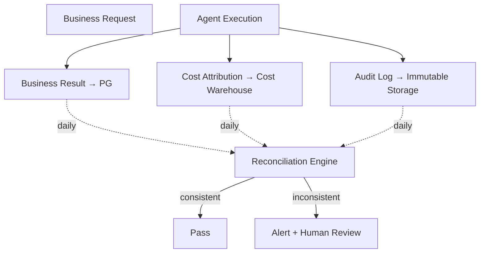

### Reconciliation Rules

```yaml
reconciliation_dimensions:
  by_trace_id: Each trace has business + cost + audit records
  by_tenant_day: Per-tenant per-day totals match
  by_cost_center: Per-cost-center attribution matches

reconciliation_rules:
  rule_1_completeness:
    Business result count == cost attribution count == audit count
    
  rule_2_amount_consistency:
    Sum of cost = sum of per-trace costs
    Audit amounts = business result amounts
    
  rule_3_temporal_consistency:
    Timestamp deviation < 1 minute across all three
    
  rule_4_attribution_correctness:
    Cost attribution tenant_id has matching business record
    No "ownerless costs"
```

### Reconciliation Cycles

```yaml
cycles:
  realtime: critical-path synchronous reconciliation (e.g., money movement)
  near_realtime: hourly incremental reconciliation
  batch: daily full reconciliation (24:00–04:00 maintenance window)
  regulatory: monthly regulatory report reconciliation
```

### Inconsistency Handling (AI-First)

```yaml
inconsistency_handling:
  auto_repair:
    Cases of clear delay (e.g., not yet eventually consistent)
    Wait for eventual consistency
  
  AI_analysis:
    Complex inconsistencies first analyzed by AI (per Chapter 6.4)
    AI gives attribution + suggested fix
  
  HITL_escalation:
    AI cannot conclude → human ops
  
  regulatory_reporting:
    Inconsistencies involving regulatory requirements MUST be reported
```

### Provable Consistency for Regulators

Regulators require **provable consistency** — the platform must demonstrate any-time integrity:

```yaml
provable_consistency_mechanisms:
  mechanism_1_hash_chain:
    Each record contains hash of prior record
    Tampering breaks the subsequent chain
    Daily "end-of-day hash" generated and archived
  
  mechanism_2_regulatory_signing:
    Daily reconciliation result + hash chain → platform signs
    Regulator can verify signature any time
  
  mechanism_3_third_party_notarization (high security):
    End-of-day hash synced to third-party notarization
    Regulator can independently verify
  
  mechanism_4_audit_snapshots:
    Monthly full snapshots
    Cold-storage archive (7-year compliance retention)
```

## 8.6 Consistency at BYOC Boundaries

### Boundary Constraints

BYOC raises the consistency problem from "distributed system" to "cross-boundary system":

```yaml
data_plane (in customer datacenter):
  Consistency: per Chapter 8.2–8.4 fully enforced
  Scope: business data, audit, memory, knowledge
  
control_plane (at platform operations center):
  Consistency: config, version, upgrade-package consistency
  Scope: platform software, policies, ops info

cross_boundary_data:
  desensitized_metrics: L4 eventual (delays acceptable)
  alerts: L4 with high priority (< 30s)
  upgrade_packages: L1 transactional (atomic upgrade)
  config_changes: L3 monotonic read (no rollback)
```

### Network Partition Handling

```yaml
control_plane_unreachable (data plane isolated):
  Data plane continues running: yes
  New business requests: still served (using local policies)
  Alerts: cached locally → batch upload on reconnect
  Autonomous duration: max 7 days (longer requires manual intervention)

data_plane_unreachable (control plane normal):
  Detection: heartbeat failure
  Alerts: immediately escalated
  Business: continues normally if data plane internally healthy

bidirectional_disconnect:
  Scenario: complete network cut
  Handling: data plane enters "isolated mode"
  Restrictions: no upgrades, no new config
  Monitoring: local continues; sync on reconnect
```

### Soft Configuration Consistency

Control plane → data plane config delivery:

```yaml
config_consistency:
  unidirectional_pull:
    Data plane actively pulls; control plane never pushes
    Prevents compromised control plane pushing malicious config
  
  version_management:
    Each config has version number
    Data plane rejects below-current versions
    Prevents man-in-the-middle downgrade attacks
  
  signature_verification:
    Control plane signs config
    Data plane verifies with pre-installed public key
    Prevents tampering
  
  gradual_activation:
    New config first applied to 1% of traffic
    Observation period passes → full rollout
    HITL can force-rollback
```

## 8.7 Summary

The data plane is governed by five mechanisms:

| Concern | Solution | Section |
|---|---|---|
| Consistency level differentiation | Five-level hierarchy (L1–L5) | 8.2 |
| Cross-store atomicity | Outbox pattern with PG as SoR | 8.3 |
| Side-effect determinism | Unified idempotency mechanism | 8.4 |
| Books-records reconciliation | Three-way reconciliation + hash chain | 8.5 |
| BYOC boundary | Soft config consistency + partition handling | 8.6 |

The platform uses these mechanisms uniformly. There is no "consistency-by-component" — every write declares its level, and the platform's data layer enforces the correct mechanism. This makes the platform's consistency posture **auditable, predictable, and finance-grade**.

Part II of this document is now complete. The platform's design is fully specified: abstraction layers (Ch. 4), flywheels (Ch. 5), execution plane (Ch. 6), collaboration interfaces (Ch. 7), and data plane (Ch. 8). Part III moves to engineering implementation: component dependencies, gateway and bus, experience layer, multi-tenancy, business modeling, deployment and operations, and regulatory compliance.


# Part III — Engineering Implementation Layer

# Chapter 9: Component Dependencies and Failure Domains

## 9.1 Why an Explicit Dependency Map

A platform with 80+ components needs explicit dependency management. v4.1 had architectural diagrams, but most were *layered* (what sits on what) rather than *call-graph* (what invokes what), *failure-graph* (what breaks affects what), or *upgrade-graph* (what must be upgraded before what).

This chapter develops three views, all derived from the same component catalog:

```yaml
chapter_organization:
  9.2: The component catalog (80+ components, 13 categories)
  9.3: Call dependency graph (who invokes whom)
  9.4: Failure propagation graph (four-tier failure domains)
  9.5: Upgrade impact graph (eight-phase ordering)
```

## 9.2 The Component Catalog

```yaml
category_1_user_ingress:
  - Customer business application (web/mobile/server)
  - Customer SDK (Spring Boot Starters, see Chapter 7.4)
  - External agents (A2A protocol caller)
  - Third-party MCP server (calling platform agents)
  - Batch processing system

category_2_gateway_layer:
  - Higress AI gateway
  - OpenAI-compatible router (Form 1)
  - A2A router (Form 2)
  - MCP router (Form 3)
  - Streaming router SSE/WS (Form 5)
  - Async task gateway (Form 6)
  - Batch processing gateway (Form 7)
  - SDK router (Form 4)

category_3_business_agents:
  - Customer service agent
  - Risk agent
  - Credit agent
  - Compliance agent
  - Marketing agent
  - ... (customer-defined)

category_4_meta_agents:
  - Architect AI (handles teaching, see Ch.7.3)
  - Operator AI (stream governance, exception analysis)
  - Optimizer AI (auto-optimization)

category_5_guard_agents:
  - Reviewer Agent (peer review)
  - Compliance Agent (compliance checking)
  - Safety Agent (red-line guard)

category_6_framework_runtime:
  - spring-ai-fin core
  - fin-cognitive-flow (B1 cognitive workflow engine)
  - fin-graph (multi-agent orchestration)
  - fin-hitl (HITL integration)
  - fin-memory (three-tier memory)
  - fin-skill (skill system)
  - fin-eval (financial evaluation)
  - Task engine (drives state machine)

category_7_shared_capabilities:
  - Skills Registry
  - Knowledge Base
  - Three-tier memory (working, episodic, semantic)
  - Dreaming engine
  - Flowable BPMN engine
  - Side-effect tracker (B2)
  - Side-effect budget controller (B2)
  - Idempotency manager (B3)
  - Outbox Relay (B3)

category_8_evolution_flywheel:
  - Trace lake (Langfuse + ClickHouse)
  - Three-layer evaluation engine
  - Experiment platform (GrowthBook)
  - Asset sedimentation (DSPy)
  - Reflection engine
  - Auto-optimizer
  - Asset repository
  - Golden Set management (per Ch.7.5)

category_9_cost_flywheel:
  - Cost meter (OpenCost)
  - Multi-tier cache system (L1-L4)
  - Intelligent router (RouteLLM)
  - Distillation pipeline (TRL)
  - Resource scheduler (Volcano + KubeRay)
  - Cold/hot tiering

category_10_maas_abstraction:
  - Model routing abstraction
  - Inference engine adapter (vLLM/SGLang/TRT-LLM)
  - Model registry
  - Global KV cache (LMCache)

category_11_data_layer:
  - PostgreSQL (SoR)
  - Milvus (vector store)
  - NebulaGraph (knowledge graph)
  - OpenSearch (hybrid search)
  - Valkey (cache)
  - SeaweedFS (object storage)
  - Kafka (event bus)
  - Audit log storage (immutable)

category_12_cross_cutting:
  - Keycloak (IAM)
  - OPA (policy engine / red lines)
  - Presidio (PII detection)
  - Vault (secret management)
  - OpenTelemetry (observability)
  - Sentinel (rate limiting / circuit breaker)
  - Seata (distributed transactions)
  - Nacos (config + service discovery)
  - Autonomy Slider (per-tenant)

category_13_byoc_control_plane:
  - Config distribution service
  - Upgrade package distribution
  - Remote diagnostic tool
  - Standardized script library
  - Runbook engine
  - Knowledge distribution service
  - Desensitized metrics receiver
```

Total: 80+ components.

## 9.3 Call Dependency Graph

### Top-Level Layer Dependencies

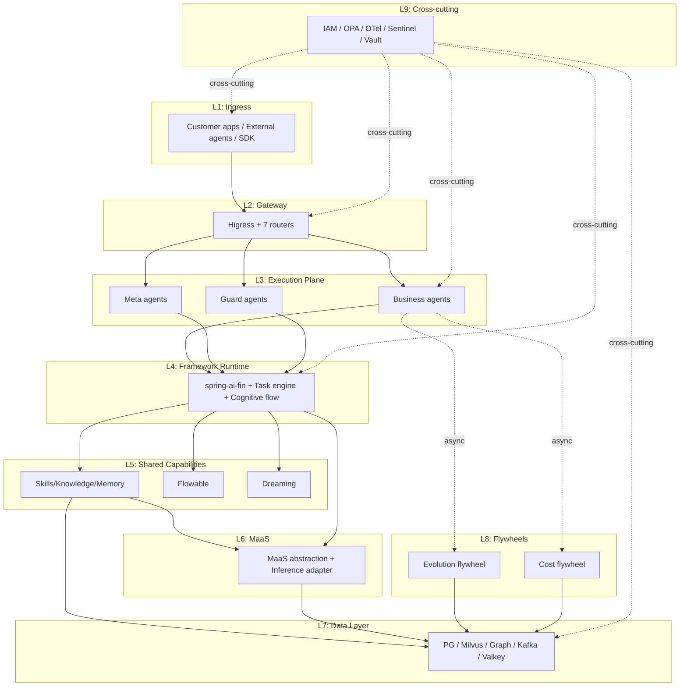

### Synchronous Call Path (One Business Request)

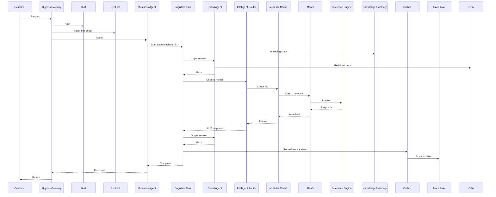

### Asynchronous Flywheel Dependencies

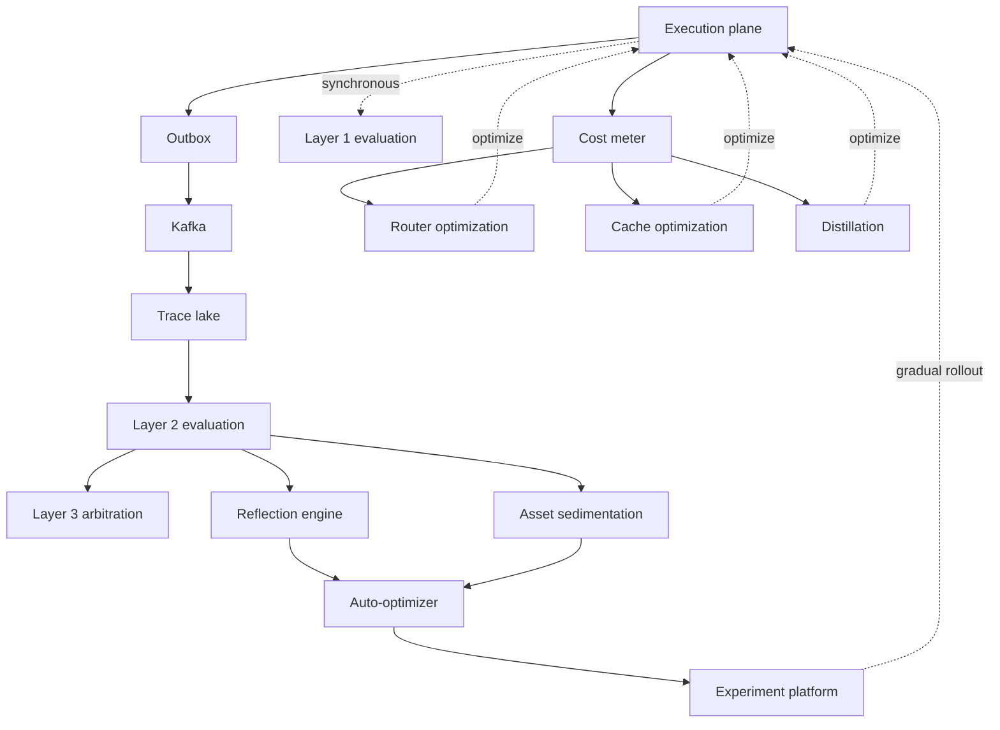

### Behavioral / Collaboration Overlay

The Chapter 6–7 components add specific dependency edges:

```yaml
B1_cognitive_flow:
  Task engine drives → all agents
  Task engine → PG (critical state persistence, track C)
  Task engine → Kafka (event stream, track D)

B2_long_task:
  Checkpoint manager → PG / object storage
  Side-effect budget → PG / agent decisions

B3_consistency:
  Outbox -critical dependency→ all dual-write scenarios
  Idempotency manager -critical dependency→ all API entrances
  Three-way reconciliation -daily→ business / cost / audit

B5_streams:
  Stream router → Kafka multi-topic
  Resource scheduler → all runtimes

C2_protocols:
  A2A bus → agent-agent communication
  MCP Registry → tool invocation
  CLI sandbox → tool invocation

C5_BYOC:
  Control plane -unidirectional pull→ data plane
  Desensitization gateway -mandatory→ northbound channel
```

## 9.4 Failure Propagation Graph

### Four Failure Tiers

```yaml
Tier_0_critical (platform unavailable):
  - IAM Keycloak: rejects all requests
  - Higress gateway: blocks all ingress
  - PostgreSQL primary: SoR write fails
  Detection: < 1 second
  AI involvement: not involved (no time)
  Action: automatic circuit-break + degrade + immediate human

Tier_1_core (core functionality unavailable):
  - MaaS routing abstraction: cannot call models
  - Cognitive workflow engine: state machine crashes
  - Guard agent: safety lost
  - Kafka cluster: async streams stagnate
  Detection: seconds
  AI involvement: AI Operator analyzes scope + recommends
  Action: AI gives plan → human confirms → execute

Tier_2_important (partial functionality affected):
  - Milvus / NebulaGraph: retrieval degrades
  - Valkey: cache misses double → cost spikes
  - OpenSearch: hybrid degrades
  - Trace lake: trace not landing
  Detection: minutes
  AI involvement: AI leads diagnosis
  Action: auto-enable fallback paths

Tier_3_enhancement (degradation only):
  - Layer 2/3 evaluation
  - Dreaming engine
  - Auto-optimizer
  - Distillation pipeline
  Detection: hours (flywheel observation)
  AI involvement: AI fully handles
  Action: auto-retry / switch to backup
```

```mermaid
graph TB
    T0A[Tier 0: IAM] -->|reject all requests| ALL[Platform unavailable]
    T0B[Tier 0: Gateway] -->|block ingress| ALL
    T0C[Tier 0: PG primary] -->|SoR write fails| BIZ[Business results lost]
    
    T1A[Tier 1: MaaS] -->|cannot call models| EXEC[Execution stalled]
    T1B[Tier 1: Task engine] -->|state machine crash| EXEC
    T1C[Tier 1: Guard] -->|safety lost| BLOCK[Emergency circuit-break]
    T1D[Tier 1: Kafka] -->|async streams stagnate| FLYWHEEL[Flywheels stop]
    
    T2A[Tier 2: Vector / Graph] -->|retrieval degrades| KB_DOWN[RAG quality drops]
    T2C[Tier 2: Valkey] -->|cache misses double| COST[Cost spikes]
    T2E[Tier 2: Trace lake] -->|trace not landing| EVAL_DOWN[Eval delayed]
    
    T3A[Tier 3: Eval / Distillation] -->|flywheel components stop| FLYWHEEL
```

### Lateral Spread Protection

```yaml
lateral_spread_protections:
  per_tenant_circuit_break (B5 5-level granularity from Chapter 6.4)
  resource_quota (B2 from Chapter 6.3)
  side_effect_budget (B2 from Chapter 6.3)
  preemption_graceful_pause (B2/B5)
  dedicated_resource_pools (VIP customers, see Ch.6.5)
```

### AI-First Failure Handling Per Tier

| Tier | Detection | AI involvement | Action |
|---|---|---|---|
| Tier 0 | < 1s | None (too fast) | Automatic circuit-break + degrade + immediate human |
| Tier 1 | Seconds | AI analyzes scope + recommends | AI gives plan → human confirms → execute |
| Tier 2 | Minutes | AI leads diagnosis | Auto-enable fallback paths |
| Tier 3 | Hours | AI fully handles | Auto-retry / switch to backup |

This direct mapping of failure tier → AI involvement intensity is a concretization of the AI-First three-layer principle from Chapter 6.4.

## 9.5 Upgrade Impact Graph

### Eight-Phase Upgrade Sequence

Upgrades must follow strict ordering. Skipping phases causes incompatibilities:

```yaml
Phase_1_infrastructure:
  K8s, DB schema, Kafka
  
Phase_2_data_layer:
  PostgreSQL (with dual-write transition)
  Milvus, NebulaGraph

Phase_3_cross_cutting:
  IAM, OPA, OTel

Phase_4_maas_layer:
  MaaS abstraction, inference engines, models

Phase_5_framework_layer:
  spring-ai-fin, Cognitive Flow, Flowable

Phase_6_agent_layer:
  Guard agents → meta agents → business agents
  (Order matters within this phase)

Phase_7_flywheels:
  Evaluation, optimization, distillation

Phase_8_clients:
  SDK, customer applications
```

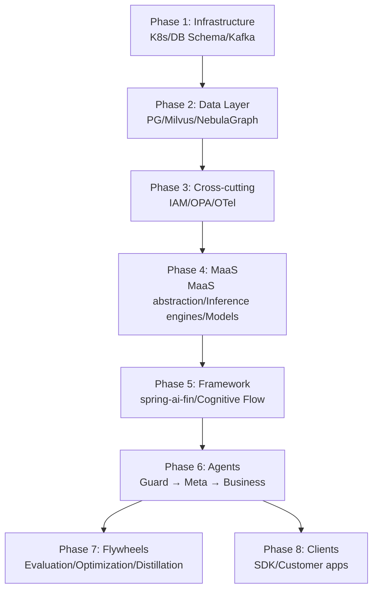

### Pinned Versions and Upgrade Constraints

Per Chapter 7.5 behavior pinning, upgrades have special constraints for pinned customers:

```yaml
pinned_customer_upgrade_constraints:
  Platform infrastructure: upgradeable (transparent)
  Platform framework: upgradeable (transparent)
  Models: NOT upgradeable (changes behavior)
  Prompts: NOT upgradeable (changes behavior)
  Knowledge base snapshots: locked (changes behavior)

challenges:
  Pinned versions consume resources continuously
  Upgrade windows need special handling
  New version capabilities not visible to pinned

long_term_strategy:
  Pinned versions have "maximum effective period" (e.g., N years)
  Force migration to new behavior version (long UAT period offered)
  Platform retains "behavior snapshot repository"
```

### BYOC Upgrade Customer Collaboration

```yaml
upgrade_collaboration_flow:
  platform_prepares_first:
    New version ready → gradual → upgrade package released
  
  customer_prepares:
    Evaluate impact (review dependency graph) → schedule window → UAT
  
  customer_executes:
    Strict phase ordering (no skipping)
    Each phase verified before next
    Rollback plan ready
  
  time_constraints:
    Data layer upgrade: business off-peak window
    Framework upgrade: business off-peak window
    Agent upgrade: gradual (no downtime)
    SDK upgrade: customer business-side controls pace
```

## 9.6 Operational Implications

### Component Inventory and Versioning

Each customer instance has:
- A Bill of Materials listing all 80+ component versions
- Cryptographic signature of the BOM
- Hash of installed binaries for tamper detection

This is the data behind Chapter 13.1's Four-Dimensional Version Model.

### Health Monitoring

```yaml
health_monitoring_dashboards:
  per_tier_dashboard:
    Tier 0: real-time, sub-second SLAs
    Tier 1: real-time, second SLAs
    Tier 2: minute-level
    Tier 3: hourly
  
  per_component_dashboard:
    Up / down status
    Latency p50, p95, p99
    Error rate
    Resource utilization
  
  dependency_visualization:
    Live dependency graph showing actual call patterns
    Color-coded by health
    Drill into specific call paths
```

### Incident Response Mapping

```yaml
incident_response_table:
  alert_pattern: degraded_milvus
  failure_tier: 2
  AI_action: AI Operator diagnoses; suggests cache pre-warming + fallback to BM25-only retrieval
  human_action: SRE confirms; toggles fallback flag; monitors recovery
  customer_impact: RAG quality drops 5–10% for affected tenants; auto-degraded
  
  alert_pattern: kafka_lag_growing
  failure_tier: 1
  AI_action: AI analyzes which consumer group; suggests scaling consumers vs throttling producers
  human_action: SRE reviews; executes preferred action
  customer_impact: trace lake delayed; flywheel slows; eventually consistent within 30min
```

## 9.7 Summary

This chapter codified the platform's component reality:

| Concern | Solution | Section |
|---|---|---|
| Component catalog | 80+ components across 13 categories | 9.2 |
| Call dependencies | Layered + per-request synchronous trace + async flywheel | 9.3 |
| Failure propagation | Four-tier model + lateral spread protection + AI-First per tier | 9.4 |
| Upgrade impact | Eight-phase strict ordering + pinned-version constraints | 9.5 |

These three views (call, failure, upgrade) of the same component catalog are the foundation for operational discipline. They make it possible to reason about: when a component goes down, what's affected; when a component upgrades, what must come first; when an SLA is missed, where to look.

The next chapter examines two structural elements that show up in every dependency view: **the gateway** (north-south boundary) and **the bus** (east-west boundary). v4.1 mistakenly merged these; v5.0 separates them.


# Chapter 10: Gateway vs Bus — Separation of North-South and East-West

## 10.1 Why the Separation Matters

v4.1 conflated two distinct architectural elements: the gateway (north-south boundary, where external traffic enters the platform) and the bus (east-west boundary, where platform components communicate). They look superficially similar — both move traffic — but they have very different requirements:

```yaml
gateway_north_south_concerns:
  External-facing: must speak HTTP/JSON, OpenAI-compatible
  Authentication: tenant identification from JWT/API keys
  Rate limiting: per-tenant quotas
  Public TLS termination
  WAF / DDoS protection
  Request shaping (priority, billing)
  
bus_east_west_concerns:
  Internal-only: can use efficient protocols (gRPC, Kafka)
  Mutual auth: ServiceAccount-based mTLS
  Service discovery: dynamic
  Internal load balancing
  Tracing context propagation
  Circuit breaking between services
```

A single component cannot do both well. The platform separates them:

```yaml
gateway_layer: Higress (north-south, external-facing)
bus_layer:
  synchronous_east_west: Istio service mesh + gRPC
  asynchronous_east_west: Kafka event bus
```

This chapter develops each, plus the GPU-specific networking optimizations needed for AI workloads.

## 10.2 The Gateway — Higress as North-South Boundary

### Why Higress

Higress (Apache 2.0, Alibaba-maintained but open-source) is selected over alternatives:

```yaml
alternatives_considered:
  Kong:
    Pros: mature, plugin ecosystem
    Cons: Lua plugin model less flexible than Wasm
    
  Envoy_with_custom_filters:
    Pros: most flexible
    Cons: significant engineering investment
    
  Istio_ingress_gateway:
    Pros: integrated with mesh
    Cons: less feature-rich for external traffic
    
  Higress (chosen):
    Pros: Wasm plugin model; AI-aware features (LLM proxy, semantic routing); good performance
    Cons: smaller community than Kong; Alibaba origin (mitigated by Apache 2.0 license)
```

### Higress Capabilities Used

```yaml
ai_specific_features:
  llm_proxy:
    OpenAI-compatible request routing
    Token counting and rate limiting
    Multi-provider failover
    Circuit breaking based on error rates
  
  semantic_caching:
    Cache responses based on input semantic similarity
    (Complements Chapter 5.3's L3 semantic cache)
  
  prompt_injection_detection:
    Inline classifier on inbound prompts
    Suspicious patterns trigger guard agent review

standard_gateway_features:
  authentication:
    OIDC / OAuth 2.0 (Keycloak)
    API keys (per-tenant)
    mTLS (for high-security customers)
  
  authorization:
    OPA-based policy decisions
    Per-tenant per-endpoint rules
  
  rate_limiting:
    Per-tenant quotas (RPS, monthly tokens, daily cost)
    Sliding window with burst tolerance
  
  observability:
    OpenTelemetry traces
    Access logs (with PII redaction via Presidio)
    Metrics to Prometheus
```

### Seven Routers Behind Higress

Per Chapter 7.5, the platform exposes seven access forms. Each has its own router behind Higress:

```yaml
routers_behind_gateway:
  openai_compat_router:
    Handles: Form 1 (OpenAI-compatible HTTP)
    Routes by: model name in request → MaaS routing
    Special: extra_body parsing for financial extensions
  
  a2a_router:
    Handles: Form 2 (A2A protocol)
    Routes by: agent_id in request
    Special: streaming support, async task tracking
  
  mcp_router:
    Handles: Form 3 (MCP server)
    Routes by: tool name → tool registry
    Special: JSON-RPC envelope handling
  
  sdk_router:
    Handles: Form 4 (SDK gRPC streaming)
    Routes by: long-connection identity
    Special: bidirectional streaming, heartbeat
  
  streaming_router:
    Handles: Form 5 (SSE/WebSocket)
    Routes by: agent + session
    Special: event filtering, resume on disconnect
  
  async_router:
    Handles: Form 6 (async task)
    Routes by: task_id
    Special: webhook signature, retry logic
  
  batch_router:
    Handles: Form 7 (batch API)
    Routes by: batch_id
    Special: object storage integration
```

### Gateway-Level Flow Control

```yaml
flow_control_layers_at_gateway:
  L1_global:
    Total platform capacity
    Per-Region capacity
    Backpressure to upstream
  
  L2_per_tenant:
    Tenant tier (VIP / Standard / Trial)
    Tenant-specific budget
    Custom rules per VIP
  
  L3_per_agent:
    Agent's resource quota
    Per-agent cost ceiling
  
  L4_per_endpoint:
    Endpoint-specific limits
    DDoS protection
    Suspicious-pattern blocking

degradation_under_load:
  Step 1: Reject excess Trial-tier requests
  Step 2: Reject excess Standard-tier requests
  Step 3: Defer non-critical async requests
  Step 4: Reduce VIP-tier quality (per Chapter 6.4 D2 quality degradation)
  Step 5: Last resort — pause non-critical agents
```

## 10.3 The Synchronous Bus — Istio + gRPC

### Why a Service Mesh

For 80+ components communicating, point-to-point management doesn't scale. A service mesh externalizes:

- mTLS (every connection encrypted, identity-verified)
- Traffic policy (retry, timeout, circuit break)
- Observability (every call traced)
- Service discovery (Kubernetes-native)

The platform uses Istio with **Ambient Mesh** (no per-pod sidecar) for general workloads, and the **classic sidecar mode** for the strictest workloads.

### Istio Ambient Mesh Choice

Istio 1.20+ Ambient Mesh runs without per-pod sidecars, using:

```yaml
ztunnel_node_proxy:
  Per-node component
  Handles L4 traffic, mTLS encryption
  Replaces sidecar for L4 concerns
  
waypoint_proxy:
  Per-namespace or per-service
  Handles L7 traffic when needed (routing, auth, rate limit)
  Optional, deployed only where L7 features needed
```

Why this matters for the platform:

```yaml
benefits:
  no_sidecar_per_pod: 
    GPU pods especially benefit (every MB of GPU memory is precious)
    No injection complexity
    Faster pod startup
  
  mTLS_unchanged:
    Every connection still mTLS-encrypted
    Service identity preserved
  
  graceful_upgrade:
    Mesh upgrades don't require pod restart
    Critical for long-running training/inference jobs

caveats:
  L7_features_via_waypoint_only:
    Some routing decisions need explicit waypoint deployment
    Slight added complexity for L7-heavy services
```

For the **strictest workloads** (audit log writers, IAM, OPA), classic sidecar mode is retained — these benefit from per-pod policy attestation.

### gRPC as Internal Protocol

```yaml
why_grpc:
  efficiency: 5–10× less bandwidth than JSON over HTTP
  streaming: bidirectional streaming for long-running calls
  schema: protobuf gives strict typing
  generated_clients: reduces integration bugs
  
where_grpc_used:
  Agent → Agent (A2A as gRPC)
  Agent → MaaS routing
  MaaS → Inference engine adapter
  Framework runtime → shared capabilities
  
where_grpc_NOT_used:
  Customer-facing (HTTPS+JSON, OpenAI-compatible)
  Async events (Kafka)
  CLI tool invocation (subprocess)
```

### Tracing Context Propagation

Every gRPC call carries:

```yaml
grpc_metadata_propagation:
  W3C_trace_context:
    traceparent: 00-{trace_id}-{span_id}-{flags}
    tracestate: vendor-specific
  tenant_context:
    grpc-tenant-id: {tenant_id}
  authn_context:
    spiffe-id: {service_identity}
  business_context:
    grpc-business-line: retail / corporate / wealth
    grpc-scenario: critical / permission / informational
```

Spring AI / spring-ai-fin propagates this via interceptors, making the propagation transparent to business code.

### Circuit Breaking Between Services

```yaml
istio_circuit_breaker_config:
  outlier_detection:
    consecutive_5xx: 5
    base_ejection_time: 30s
    max_ejection_percent: 50
  
  retry_policy:
    attempts: 3
    per_try_timeout: 5s
    retry_on: [5xx, gateway-error, connect-failure]
  
  per_service_overrides:
    LLM-call-services: longer timeout (60s)
    Cache-services: aggressive retry (5 attempts)
    Audit-services: NO retry (idempotency required)
```

## 10.4 The Asynchronous Bus — Kafka

### Why Kafka Specifically

```yaml
alternatives_considered:
  Pulsar:
    Pros: tiered storage, multi-tenancy native
    Cons: smaller ecosystem in Java/Spring
    
  RabbitMQ:
    Pros: simple, mature
    Cons: throughput limits at platform scale
    
  Kafka_chosen:
    Pros: massive throughput, mature ecosystem, Java-native, exactly-once support, log compaction
    Cons: ops complexity (mitigated by Strimzi operator)
```

### Twenty-Two Topics

The 22 streams from Chapter 6.5 map to Kafka topics:

```yaml
topic_design:
  realtime_streams_L1:
    # Generally NOT on Kafka (synchronous gRPC instead)
    # Exception: streaming responses use Kafka with low-latency config
    streaming.responses
  
  near_realtime_L2 (10 topics):
    trace.events
    cost.events
    eval.layer1.results
    eval.layer2.samples
    exception.events
    business.events
    cache.invalidations
    feedback.user
    feedback.agent  # AI to AI feedback
    side_effect.completed
  
  batch_L3 (7 topics):
    cost.aggregations.hourly
    reflection.outputs
    asset.candidates
    reconciliation.results
    experiment.results
    distillation.training_data
    memory.compaction.tasks
  
  persistent_L4 (5 topics):
    fraud.monitoring.events
    business.event.stream
    suspicious.transactions
    regulatory.events
    health.checks
```

### Topic Configuration Per Stream Tier

```yaml
realtime_topics_config:
  partitions: 32+ (parallelism)
  replication_factor: 3
  min_in_sync_replicas: 2
  retention_ms: 86400000  # 24h
  segment_ms: 3600000      # 1h
  compression_type: lz4    # fast
  
near_realtime_config:
  partitions: 16
  replication_factor: 3
  min_in_sync_replicas: 2
  retention_ms: 604800000  # 7 days
  segment_ms: 21600000     # 6h
  compression_type: snappy
  
batch_config:
  partitions: 8
  replication_factor: 2
  retention_ms: 2592000000  # 30 days
  segment_ms: 86400000      # 24h
  compression_type: zstd    # best compression
  
persistent_config:
  partitions: 8
  replication_factor: 3
  retention_ms: 7776000000  # 90 days
  cleanup_policy: compact  # log compaction
```

### Partitioning Strategy

```yaml
partition_keys:
  trace.events:
    key: trace_id
    purpose: keep all events of one trace in same partition (ordering)
  
  cost.events:
    key: tenant_id
    purpose: per-tenant aggregation efficiency
  
  business.events:
    key: business_entity_id (e.g., customer_id)
    purpose: per-entity ordering
  
  exception.events:
    key: severity_tier
    purpose: priority consumers
```

### Consumer Groups

```yaml
consumer_groups_per_topic:
  trace.events:
    - trace-lake-writer (writes to ClickHouse via Langfuse)
    - eval-layer2-sampler (samples 1% for evaluation)
    - alert-pattern-detector (real-time pattern matching)
    
  cost.events:
    - cost-warehouse-writer (writes to cost DB)
    - billing-aggregator (real-time tenant cost tracking)
    - cost-anomaly-detector (real-time alerts)
    
  exception.events:
    - exception-lake-writer
    - ai-operator (Layer 2 analysis)
    - alert-router (sends to Operations Console)
    
  business.events:
    - business-warehouse-writer
    - cross-agent-event-listeners (multiple agents subscribed to specific event types)
```

### Kafka Streams for Real-Time Aggregation

For continuous aggregations (per-tenant cost rollup, per-agent latency tracking), Kafka Streams runs on the same cluster:

```yaml
kafka_streams_jobs:
  per_tenant_cost_minute_aggregation:
    Input: cost.events
    Window: 1-minute tumbling
    Output: cost.aggregations.minute
    Use: real-time billing dashboards
  
  per_agent_latency_aggregation:
    Input: trace.events
    Window: 5-minute hopping (1-minute hops)
    Output: agent.latency.aggregations
    Use: SLA monitoring
  
  fraud_pattern_detection:
    Input: business.events filtered to "transaction"
    Topology: Stateful pattern matching
    Output: suspicious.transactions
    Use: real-time fraud alerts
```

## 10.5 GPU Network Optimizations

### The GPU Node Networking Problem

GPU nodes have particular networking demands:

```yaml
gpu_workload_characteristics:
  All-to-all GPU communication: model parallel inference
  Tensor parallelism: requires ultra-low latency between GPUs
  KV cache sharing: high-bandwidth between same model's instances
  
  Standard mesh sidecar adds:
    Per-packet processing overhead
    Latency increase (microseconds matter for AI)
    GPU memory pressure (sidecar uses RAM that could buffer cache)
```

### Optimizations

```yaml
gpu_node_networking:
  optimization_1_ambient_mesh:
    Skip per-pod sidecar (Section 10.3)
    Per-node ztunnel handles mTLS
    Saves: 50–100MB RAM per pod, 5–10μs per-call latency
  
  optimization_2_RDMA_for_collective_ops:
    Inter-GPU collective communications use RDMA (Remote Direct Memory Access)
    NCCL (NVIDIA Collective Communications Library) over RDMA
    Bypasses kernel networking stack for hot path
    Reserved for inference engine internal use only (no mesh involvement)
  
  optimization_3_topology_aware_scheduling:
    Pods of one model placed on same node when possible
    Cross-node placement uses GPU-direct network
    Reduces over-the-network tensor traffic
  
  optimization_4_dedicated_VPC_for_model_traffic:
    Separate VPC subnet for inter-GPU traffic
    Bandwidth reservation
    QoS prioritization
```

### Trade-offs

```yaml
the_tradeoff:
  Standard pods: full mesh (mTLS, policy, observability)
  GPU pods: ambient mesh + RDMA carve-out
    mTLS at pod ingress/egress (yes)
    L7 policy via waypoint (yes, when needed)
    Inter-GPU RDMA traffic NOT in mesh (performance reasons)
    But this traffic stays within GPU subnet (network isolation provides security)
```

## 10.6 BYOC Customer Network Topology

```yaml
byoc_network_design:
  customer_owned_infrastructure:
    K8s cluster (customer's choice: vanilla, OpenShift, Rancher)
    Network plugin (Calico recommended for NetworkPolicy)
    Storage (customer's storage class)
  
  platform_software_deployed:
    Higress installed in dedicated namespace
    Istio Ambient Mesh in dedicated namespace
    Kafka via Strimzi operator
    All other components per dependency graph
  
  inter_zone_connectivity:
    Within-region: high-bandwidth, low-latency intra-DC
    Cross-region: encrypted tunnels for control plane only
    Data plane: NEVER cross-region (data localization, see Chapter 12)
  
  customer_network_to_platform_ops:
    Outbound only: data plane → platform ops control plane
    Strict allowlist: specific endpoints
    Mutual TLS
    Desensitization gateway (per Chapter 7.6) before any northbound traffic
    No inbound: platform cannot initiate connections to customer
```

## 10.7 Observability of the Bus

```yaml
bus_observability:
  metrics:
    Per-service request rates, latencies, error rates
    Per-topic Kafka throughput, lag, retention usage
    Per-Region cross-region traffic
  
  traces:
    Every gRPC call has span
    Kafka producer/consumer spans
    Cross-stream stitching via trace_id
  
  logs:
    Mesh access logs (sampled)
    Kafka broker logs (Tier 1 components)
    Operations Console alerts on anomalies
  
  dashboards:
    Service mesh dashboard (golden signals per service)
    Kafka cluster dashboard (per-topic health)
    Cross-bus dashboard (synchronous + async holistic view)
```

## 10.8 Summary

The platform separates north-south from east-west:

| Boundary | Component | Protocol | Key Design |
|---|---|---|---|
| North-South Gateway | Higress | HTTPS+JSON | Tenant identification, rate limiting, AI-aware routing |
| East-West Sync | Istio Ambient Mesh + gRPC | gRPC | mTLS, tracing, circuit-breaking |
| East-West Async | Kafka | Kafka protocol | 22 topics, tiered config, exactly-once semantics |
| GPU Networking | Ambient + RDMA | Mixed | Performance-preserving security |
| BYOC Boundary | Outbound-only | mTLS | Customer-owned infra, platform extends |

This separation realizes principles repeated throughout the document: **respect the difference between contexts**. External and internal have different needs; sync and async have different needs; GPU and CPU have different needs. A single gateway-and-bus solution glosses over these differences and pays for it later.

The next chapter moves from infrastructure to **user experience** — the operator console, the developer studio, and the role-specific dashboards that make the platform usable.


# Chapter 11: Experience Layer

## 11.1 The Two-Product Architecture

The platform serves four user roles with very different working patterns:

```yaml
four_user_roles:
  developer:
    workflow: build → test → evaluate → release
    work_pattern: long focused "creative work"
    appropriate_form: IDE / Studio
  
  operator (business operations):
    workflow: monitor → respond → handle → escalate
    work_pattern: fragmented "responsive work"
    appropriate_form: Dashboard / Console
  
  SRE (operations engineer):
    workflow: monitor → diagnose → execute → verify
    work_pattern: fragmented "responsive work"
    appropriate_form: Dashboard / Console
  
  compliance officer:
    workflow: audit → query → report → regulate
    work_pattern: fragmented + scheduled deep work
    appropriate_form: Dashboard / Console
```

The decisive observation: **developers' work is fundamentally different from the other three roles**. Developers create; the others respond. Forcing them into the same product compromises both. But operator, SRE, and compliance officer share work patterns and benefit from cross-role collaboration.

The platform's response is **two products**:

```yaml
product_1_agent_studio (developer-only):
  workflow: construct, debug, evaluate, release
  form: IDE-like
  
product_2_operations_console (operator + SRE + compliance):
  workflow: monitor, respond, handle, escalate
  form: dashboard with role-specific views
  permission_model: strong (compliance details hidden from operators)
  collaboration: in-product cross-role dialogue
```

This chapter develops each product, plus mobile/emergency capabilities.

## 11.2 Capability Matrix Across Four Roles

The following matrix governs all permission decisions. **Default minimization** applies — users get the least permission compatible with their role; broader permissions require explicit grant.

| Capability | Developer | Operator | SRE | Compliance |
|---|---|---|---|---|
| **Construction** | | | | |
| Create Agent | ✓ | ✗ | ✗ | ✗ |
| Edit Prompt | ✓ | ✓ (via teaching, see 7.3) | ✗ | ✗ |
| Edit Few-shot | ✓ | ✓ | ✗ | ✗ |
| Register Skill / Tool | ✓ | ✗ | ✗ | ✗ |
| Edit Workflow (Flowable) | ✓ | ✗ | ✗ | ✗ |
| Edit Red-Lines (OPA) | ✗ | ✗ | ✗ | ✓ |
| **Test & Evaluate** | | | | |
| Single-case debug | ✓ | ✓ (limited) | ✗ | ✗ |
| Run evaluation set | ✓ | ✓ | ✗ | ✓ |
| Edit Golden Set | ✓ | ✓ | ✗ | ✓ |
| Shadow traffic | ✓ | ✓ | ✗ | ✗ |
| **Release** | | | | |
| Submit release | ✓ | ✗ | ✗ | ✗ |
| Gradual traffic shift | ✓ | ✓ | ✗ | ✗ |
| Emergency rollback | ✓ | ✓ | ✓ | ✓ |
| Pin behavior version | ✓ | ✓ | ✗ | ✓ |
| **Monitor** | | | | |
| Business metrics | ✓ | ✓ | ✓ | ✓ (redacted) |
| Technical metrics | ✓ | ✓ | ✓ | ✗ |
| Cost dashboard | ✓ | ✓ | ✓ | ✗ |
| Evaluation trend | ✓ | ✓ | ✗ | ✓ |
| **Alerts & Response** | | | | |
| Receive alerts | situational | ✓ | ✓ | ✓ (compliance only) |
| Execute Runbook | ✗ | ✓ (limited) | ✓ | ✗ |
| Emergency circuit-break | ✗ | ✓ | ✓ | ✓ |
| HITL approval | ✗ | ✓ | ✗ | ✓ |
| **Operations** | | | | |
| Cluster management | ✗ | ✗ | ✓ | ✗ |
| Upgrade management | ✗ | ✗ | ✓ | ✗ |
| Resource scheduling | ✗ | ✗ | ✓ | ✗ |
| Fault diagnosis | ✓ (own agents) | ✗ | ✓ | ✗ |
| **Compliance** | | | | |
| Audit query | ✗ | ✓ (own scope) | ✗ | ✓ (global) |
| Regulatory reporting | ✗ | ✗ | ✗ | ✓ |
| Data export gate | ✗ | ✗ | ✗ | ✓ |
| Red-line management | ✗ | ✗ | ✗ | ✓ |
| **Data** | | | | |
| Trace details | ✓ | ✓ (redacted) | ✗ | ✓ |
| PII decode | ✗ | ✗ | ✗ | ✓ (dual approval) |
| Cross-tenant aggregation | ✗ | ✗ | ✗ | ✓ (regulator-authorized) |

### Special Permissions

Some permissions require **dual approval** beyond role:

```yaml
dual_approval_required:
  pii_decode: 
    Compliance officer + second compliance officer
    Logged with reason
    Auto-expires (decoded data not stored long-term)
  
  regulatory_reporting:
    Compliance officer + customer legal counsel
    Each report version-controlled
  
  emergency_circuit_break:
    Any of: operator / SRE / compliance can trigger
    But post-event audit required
    Multi-role notification on trigger
  
  red_line_modification:
    Compliance officer + platform architect
    Two-signature requirement
    Versioned and signed
```

## 11.3 Agent Studio (Developer Product)

### Three Modes

The Studio adapts to developer skill level:

```yaml
mode_low_code:
  Audience: business experts
  Entry: natural-language conversation
  Implementation: Architect AI (Chapter 7.3 mode 4)
  
  typical_interaction:
    Business expert: "I need a customer service agent that can check balances and transaction history"
    Architect AI: "I understand. The agent will need 2 tools..."
    Architect AI: "Here's my proposed design: [shows flow diagram]"
    Business expert: "Yes, but require identity confirmation before showing transactions"
    Architect AI: "Added identity verification node. Want to preview?"
    Business expert: "Preview please"
    [shows simulated runs]
    Business expert: "OK, release"
    Architect AI: "Pre-release evaluation: running 100 test cases..."
  
  capabilities:
    Natural language → flow diagram
    Real-time preview (simulated runs)
    Auto-evaluation before release
    Version per teaching session
  
  restrictions:
    Cannot edit red-lines, compliance, or safety guardrails
    Restricted to "business phrasing" layer

mode_semi_code:
  Audience: typical developers
  Entry: visual interface + code snippets
  
  capabilities:
    Prompt engineering (visual edit, few-shot drag-and-drop, variable highlighting)
    Tool composition (drag from tool marketplace)
    Workflow composition (drag-and-drop → BPMN)
  
  code_passthrough:
    Visual operations have visible Java backing code
    Developers can "escape" to code
    Code modifications can sync back to visual

mode_full_code:
  Audience: senior developers
  Entry: Web IDE or local IDE
  
  capabilities:
    Full spring-ai-fin API access
    Custom Agent classes
    Custom tools
    Custom Advisors
    Custom Memory backends
  
  web_ide:
    Tech: Eclipse Theia (EPL 2.0, free) embedded
    Features: spring-ai-fin smart completion, debugger to platform sandbox, instant test deploy
  
  local_ide:
    Via Spring Boot Starters (Chapter 7.4)
    Develop in customer's preferred IDE
    Deploy via fin-cli tool
```

### Debug Capabilities

```yaml
debugging:
  step_debug:
    Trace each state machine transition (Chapter 6.2)
    See LLM call inputs / outputs / tokens
    See tool invocation parameters / returns
    See retrieval hits and scores
  
  replay_debug:
    Use historical trace to replay
    Pause at any span
    Modify inputs and re-run
  
  time_travel:
    See agent state at any historical point
    See decision causal chain (per Chapter 7.3 Mode 3)
```

### Evaluation Capabilities

```yaml
evaluation:
  automatic:
    One-click Golden Set evaluation
    Multi-model comparison
    Multi-version comparison (per Chapter 7.5 behavior stability)
  
  visualization:
    Four-dimensional radar chart (D1 semantic / D2 format / D3 quality / D4 safety)
    Outlier samples drill-down
    AI attribution (per Chapter 6.4 AI-First)
  
  golden_set_editor:
    Visual test case editing
    Expected behavior in natural language
    LLM-as-judge configuration
```

### Release Management

```yaml
release_workflow:
  states: draft → testing → staging → production
  
  studio_provides:
    One-click release (triggers evaluation + gradual rollout)
    Gradual rollout dashboard (real-time stages)
    Emergency rollback
    Behavior pinning (per Chapter 7.5)
  
  coordination_with_console:
    Studio triggers release
    Operations Console sees agent runtime status
    Bidirectional notifications on alerts
```

## 11.4 Operations Console (Three-View Product)

### Shared Shell

The Console is **one product** with three role-specific views, sharing:

```yaml
shared_shell:
  navigation:
    Top: product logo + global search + user menu
    Left: view switcher (operator/SRE/compliance) + module menu
  
  notification_center:
    All roles see alerts they have permission for
    Priority: P0 floating, P1 red dot, P2 marker
    Cross-role @mentions for collaboration
  
  operation_audit:
    All console operations recorded
    "Who did what, when" — regulatory requirement
  
  cross_view_collaboration:
    Operator finds issue → @SRE for help
    SRE completes handling → @compliance for audit
    Slack-like dialogue
```

### Operator View

```yaml
operator_view:
  
  dashboard:
    Business metrics (QPS, success rate, user satisfaction)
    Agent health (per-agent eval scores)
    Cost dashboard (real-time + budget consumption)
    Today's alerts (P0/P1)
  
  agent_management:
    Agent list (by business line)
    Per-agent details (status, version, eval score, recent traces)
    Agent operations: start/stop, gradual shift, emergency circuit-break
    NO code/prompt editing (must use Studio)
  
  feedback_processing:
    User feedback queue:
      L1 ratings → automatic eval input
      L2 corrections → human review + correction
      L3 teaching → IMPORTANT — redirect to Studio
    AI help-request queue:
      AI's proactive help requests (Chapter 7.3 Mode 1)
      Operator answers quickly
  
  hitl_approval:
    Pending approval list
    Context display (trace chain)
    Decision recording
  
  exception_handling:
    Alert list (operator-level)
    Diagnostic assistance (AI Operator suggestions)
    Standardized handling (one-click Runbook)
    Collaboration (@SRE / @compliance)
```

### SRE View

```yaml
sre_view:
  
  cluster_health:
    GPU pool status (per Chapter 6.5)
    Service health (80+ components, Chapter 9)
    Mesh status (Chapter 10)
    Kafka status
    Database status
    Live dependency graph
  
  runbook_execution:
    Runbook library
    Auto-recommend based on alert
    AI-assisted dynamic generation
    Execution tracking (each step's result)
    Remote consultation channel (to platform operations center)
  
  upgrade_management:
    Current version + available upgrades
    Phase ordering (Chapter 9.5 eight phases)
    Window planning
    Rollback plan
    Tickets to platform operations center
  
  capacity_planning:
    Resource utilization trends
    Predicted scale-up timing
    Cost impact assessment
  
  fault_diagnosis:
    Tier 0/1/2/3 classification (Chapter 9.4)
    AI auto-attribution (Chapter 6.4)
    Diagnostic report download
    Help request to platform operations center
```

### Compliance View

```yaml
compliance_view:
  
  audit_query:
    By trace_id full-chain query
    By time range batch
    By user/agent/business dimensions
    Hash chain verification (Chapter 8.5)
  
  regulatory_reporting:
    Templates (per regulator)
    One-click data generation
    Historical reports + regulator response tracking
  
  red_line_management:
    OPA Rego rules
    Modification requires dual signature
    Trigger records
    Effectiveness assessment
  
  behavior_version_management:
    All pinned versions list (per Chapter 7.5)
    Per-version "snapshot evidence"
    Version switch history
    Regulatory audit traceability
  
  reconciliation:
    Daily reconciliation results (per Chapter 8.5)
    Inconsistency alerts
    AI attribution + human adjudication
    Regulatory reporting support
  
  pii_decode:
    Original data decoding (dual approval required)
    Decoding reason recorded
    Operations enter immutable audit
  
  cross_tenant_view:
    Platform-level aggregated data (already redacted)
    Specific-tenant view requires regulator authorization
    All cross-tenant access fully audited
```

### Cross-View Collaboration Flow

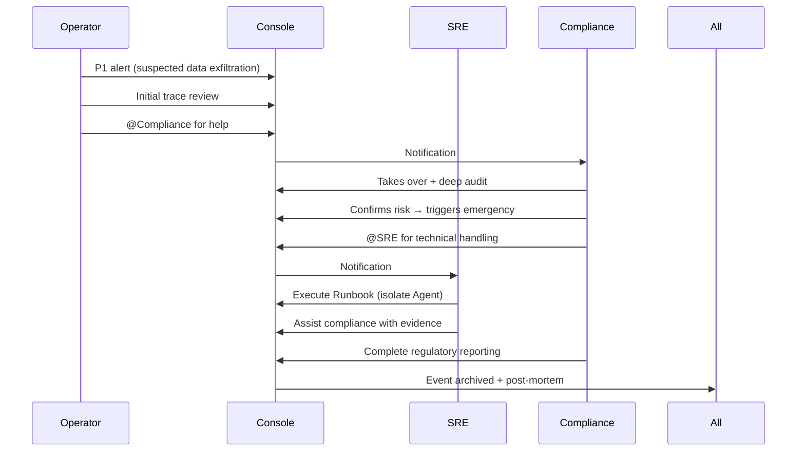

## 11.5 Mobile and Emergency Experience

### Why Mobile

Operators, SREs, and compliance officers are not always at desks. P0 alerts arrive at any hour. Emergency circuit-breaks and HITL approvals must work from a phone.

### Mobile Console Capabilities

```yaml
mobile_capabilities:
  included:
    Receive P0/P1 alerts
    View core metrics
    One-click circuit-break
    HITL approval
    Runbook execution (guided)
  
  not_in_mobile:
    Complex queries (use desktop)
    Configuration editing
    Deep cross-role collaboration
```

### Emergency Channel

```yaml
emergency_channel_extreme_scenarios:
  trigger_conditions:
    Whole platform unavailable
    Standard runbooks insufficient
    Customer cannot resolve independently
  
  mechanism:
    Platform actively SMS notifies customer's emergency contact
    Customer authorizes via emergency channel (Chapter 7.6 break-glass)
    Full session recording + multi-party witnesses
    Strict time limit
    Post-event immutable audit + regulatory notification
  
  authorization_method:
    Hardware token + multi-person confirmation
    One-time codes
    All operations replayable
```

### Offline Capability

```yaml
offline_design:
  alert_receiving: must be online (cannot cache externally)
  simple_approvals: cacheable for offline
  complex_operations: must be online (compliance audit requires real-time)
```

## 11.6 Compliance Console — Financial Specializations

The compliance view (Section 11.4) gets additional features for finance:

### Regulatory Engineering

```yaml
regulator_specific:
  Indonesia OJK / UU PDP:
    Reporting frequency: quarterly + significant events
    Format: OJK templates
    Data localization: mandatory (POJK 11/2022)
  
  Singapore MAS / PDPA:
    Reporting frequency: annual + significant events
    FEAT principle assessment: quarterly
    Data sovereignty: strict
  
  Generic ISO 27001 / SOC 2:
    Annual audit preparation
    Control evidence collection
  
  template_engine:
    Pre-defined templates per regulator
    Auto-fill data from platform
    Compliance officer reviews + signs
    Electronic submission (API where supported) + paper retention
```

### On-Site Inspection Support

When a regulator conducts on-site inspection:

```yaml
on_site_features:
  one_click_query:
    "Provide all AI decisions for customer X during time range Y"
    System auto-generates complete evidence package
  
  provable_consistency_interface:
    Regulator inputs trace_id → full chain + hash verification
    Regulator inputs time range → all audits + integrity proof
  
  ai_decision_explainability:
    Per-decision causal chain (per Chapter 7.3 mode 3 L4 data-level provenance)
    Model version / Prompt version / Knowledge version snapshots
    Each reasoning step replayable
  
  emergency_collaboration:
    Regulator on-site request → compliance officer authorizes → real-time evidence
    Full audit (regulator activity also audited)
    Platform operations center remote support (Chapter 7.6)
```

### Cross-Regulatory Coordination

When customer operates across Indonesia and Singapore:

```yaml
cross_regulatory_design:
  challenges:
    Cross-border data: Indonesian data cannot leave Indonesia
    Reporting differences: two regions different requirements
    Conflict resolution: stricter rule wins
  
  console_design:
    Region tags: data isolated by region
    Reporting separation: Indonesian business reports to OJK; Singapore business reports to MAS
    Conflict warnings: rule conflicts proactively flagged
  
  ai_assistance:
    AI auto-identifies cross-border data
    AI auto-generates region-specific reports
    Human review confirms
```

## 11.7 Summary

The experience layer reflects a deep understanding of human work patterns:

| Element | Decision | Rationale |
|---|---|---|
| Product separation | Studio + Console (two products) | Different work patterns |
| Console structure | One product, three views | Roles collaborate closely |
| Studio modes | Low / Semi / Full code | Adapt to skill levels |
| Studio low-code entry | Conversation (Chapter 7.3 mode 4) | Business-expert friendly |
| Permissions | Capability matrix + dual approval | Compliance-grade |
| Mobile | Critical functions only | Operations realism |
| Compliance specials | One-click query + provable consistency | Regulator support |

The next chapter examines the **multi-tenancy** model that underpins everything from ingress (Chapter 10) through agent execution (Chapter 6) to data storage (Chapter 8) — and that distinguishes BYOC's "organization-level isolation" from SaaS's "adversarial isolation."


# Chapter 12: Multi-Tenancy

## 12.1 The Two-Mode Foundation

Multi-tenancy in this platform has a fundamental fork driven by deployment mode:

```yaml
byoc_large_customers:
  Each customer: dedicated cluster / Region
  "Multi-tenant" actually means: internal multi-business-line isolation within one customer
  Isolation strength: organizational level (no assumption of malicious tenants)
  Compliance focus: data localization, customer sovereignty

saas_mid_market:
  Multiple customers share clusters (per Region)
  "Multi-tenant" means: real cross-customer isolation
  Isolation strength: adversarial level (assume tenants may be malicious)
  Compliance focus: cross-tenant leak prevention, regulator-provable separation
```

This forks the design: every isolation dimension has **two intensities** — A for BYOC organizational level, B for SaaS adversarial level. The platform implements both, selected by deployment configuration.

```yaml
design_principle:
  Each dimension designed at two strengths
  Strength A (BYOC internal): organization-level isolation
  Strength B (SaaS): adversarial-level isolation
  Both intensities use the same code paths; configuration selects strength
```

## 12.2 Five Isolation Dimensions

### Dimension 1: Data Isolation

```yaml
postgres:
  byoc_internal_strength_A:
    Approach: Shared database + Row-Level Security (RLS)
    Mechanism: tenant_id column + PG RLS Policy
    Performance: best (no schema overhead)
    Use: BYOC's multi-business-line isolation
    
  saas_default_strength_B:
    Approach: Schema-per-tenant
    Mechanism: Hibernate Multi-Tenancy + schema-discriminator
    Performance: good
    Use: SaaS standard tier
    
  saas_vip:
    Approach: Database-per-tenant (same PG instance)
    Performance: medium (instance-level isolation)
    
  saas_strictest:
    Approach: PG cluster-per-tenant
    Use: regulatory requirement
  
  technology_stack:
    Spring Data JPA @TenantId annotation
    Hibernate Multi-Tenancy filter
    PG Row-Level Security policies

milvus:
  byoc: shared collection + tenant field filter, or partition-by-tenant
  saas_default: independent partition per tenant
  saas_vip: independent collection
  saas_strictest: independent Milvus instance

nebulagraph:
  byoc: shared space + tag-based isolation
  saas: independent space per tenant
  saas_vip: independent cluster

valkey_cache:
  all: key prefix {tenant}:{key}
  saas_high_security: independent Valkey instance
  rationale: prevent Lua-script cross-tenant access

seaweedfs:
  byoc: shared cluster + bucket isolation
  saas: independent bucket per tenant
  saas_vip: independent collection

audit_logs:
  all_scenarios: strict per-tenant storage
  rationale: regulatory requirement (cross-tenant audit aggregation forbidden)
```

### Dimension 2: Compute Isolation

```yaml
kubernetes:
  byoc:
    Shared cluster + independent namespace per business line
    Resource quota per business line
  
  saas_default:
    Independent namespace per tenant
    ResourceQuota / LimitRange enforced
    NetworkPolicy restrictions
  
  saas_vip:
    Independent node pool
    NodeSelector + Taint
  
  saas_strictest:
    Independent K8s cluster (per customer or customer group)

gpu_pool (per Chapter 6.5):
  realtime_dedicated_pool:
    shared + priority scheduling
    VIP customers: dedicated GPU nodes within pool
  
  shared_pool:
    all tenants share
    fair scheduling (Volcano)
  
  spot_pool:
    L3 batch workloads only

process_level:
  agent_processes:
    default: shared Pod (multi-tenant requests in same Pod)
    high_security: independent Pod per tenant request
    strictest: independent Pod + independent sandbox (gVisor)

cli_sandbox (Chapter 7.2):
  all_scenarios: forced independent sandbox per request
  technology: gVisor / Firecracker
```

### Dimension 3: Network Isolation

```yaml
ingress:
  byoc:
    Customer's own VPC; platform has no access
    (per Chapter 7.6 no-remote-login constraint)
  
  saas:
    Subdomain isolation: {tenant}.platform.com
    or path isolation: platform.com/{tenant}
    VIP: dedicated VPC + private connection

service_to_service (per Chapter 10):
  all:
    mTLS by default (Istio Ambient Mesh)
    ServiceAccount-based access control
  
  saas:
    NetworkPolicy restrictions (Cilium / Calico)
    Cross-namespace forbidden by default
    Explicit declaration of allowed namespaces

database_connection:
  byoc:
    Shared connection pool + tenant routing
  
  saas:
    Connection-level isolation
    VIP: dedicated connection pool

cross_region:
  data_localization_requirement:
    Indonesian data → Indonesian Region
    Singapore data → Singapore Region
  
  cross_region_traffic:
    forbidden by default
    only control-plane metadata may cross
    must be encrypted + audited
```

### Dimension 4: Cache Isolation

The four-tier cache (Chapter 5.3) needs careful tenant treatment:

```yaml
L1_kv_cache (LMCache, in inference engine):
  byoc: shared KV cache pool
  saas:
    Cross-tenant SHARING of system-prompt prefixes (efficiency)
    But user-prompt portions strictly isolated
    Cache key includes tenant_id
  
  rationale: 
    System prompts are tenant-public knowledge (template-level)
    User prompts contain tenant-private data
    Sharing only public prefixes preserves privacy + saves compute

L2_exact_match:
  all: tenant prefix mandatory
  saas_high_security: independent Valkey instance

L3_semantic_cache:
  byoc: shared + tenant filter
  saas: independent collection per tenant
  rationale: prevent semantically similar queries from returning other tenants' results

L4_result_cache:
  all_scenarios: strictly isolated (business results sensitive)
```

### Dimension 5: Model Isolation

```yaml
base_model:
  all_scenarios: shared base (V4 Pro / V4 Flash)
  isolation: in calling context, not in weights

fine_tuned_models:
  byoc:
    Customer fine-tunes on its own data
    Fine-tuned model used only by that customer
  
  saas:
    Cross-tenant shared fine-tuning (on aggregated data, with consent)
    OR LoRA-per-tenant (intermediate option)
    OR VIP independent fine-tuning

inference_context:
  all_scenarios:
    Request carries tenant_id
    Inference engine isolates KV cache by tenant
    vLLM / SGLang prefix cache supports tenant tagging

model_selection:
  byoc: customer free choice
  saas: platform-allocated by customer quota

distilled_model:
  byoc: customer-exclusive
  saas:
    Shared distillation (on aggregated data, with consent)
    OR VIP independent distillation
```

## 12.3 Tenant ID Propagation Across Ten Layers

Tenant identity must flow through every layer transparently:

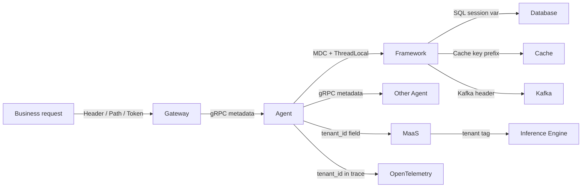

### Per-Layer Mechanism

```yaml
layer_1_ingress (gateway):
  sources_of_tenant_id:
    - tenant_id claim in JWT
    - subdomain ({tenant}.platform.com)
    - path prefix (/v1/{tenant}/...)
    - Header (X-Tenant-Id)
  priority: token > subdomain > path > header
  validation: caller has permission to access this tenant

layer_2_application (Spring):
  technology: Spring Security + ThreadLocal
  implementation:
    TenantContext.set(tenant_id)
    MDC.put("tenant_id", tenant_id)  # logs auto-tagged
  propagation:
    Synchronous: ThreadLocal automatic
    Async: Reactor Context / Coroutine
    Cross-thread: explicit transfer

layer_3_database:
  PG session:
    SET app.tenant_id = '{tenant_id}'
    RLS Policy auto-applies
  JPA:
    @TenantId annotation
    Hibernate Multi-Tenancy filter

layer_4_cache:
  Key prefix: {tenant}:{actual_key}
  Wrapped in CacheManager
  Business code unaware

layer_5_grpc:
  gRPC metadata:
    grpc-tenant-id: {tenant_id}
  Interceptor auto-propagates
  OTel integration with trace context

layer_6_kafka:
  Message header: tenant-id
  Producer auto-injects
  Consumer auto-restores context

layer_7_sdk_embedded (Chapter 7.4):
  SDK starts with tenant_id
  All outbound calls auto-carry tenant_id

layer_8_opentelemetry:
  Span attribute: tenant.id
  Propagated in trace context
  Available throughout trace chain

layer_9_inference_engine:
  Cache namespace per tenant
  KV cache tagged
  vLLM tenant attribute

layer_10_audit:
  Every audit record carries tenant_id
  Stored in tenant-specific audit storage
```

### Anti-Escalation Design

```yaml
prevent_client_forgery:
  tenant_id NOT trusted from raw client header
  Must be derived from token
  Each call validates token tenant matches request tenant

prevent_server_leak:
  Agent code cannot "see" other tenants' data
  All data access must go through TenantContext
  Code review: direct SQL without tenant filter is a bug
  Automated tests: cross-tenant access should fail

prevent_ai_escalation:
  AI cannot modify TenantContext (sealed at framework level)
  Prompt injection cannot change tenant
  Tool calls cannot cross tenants
  Guard agent monitors cross-tenant attempts
```

## 12.4 Cross-Tenant Necessary Sharing

Some sharing across tenants is necessary for the platform's value proposition. Done carelessly, it leaks. Done correctly, it preserves privacy.

### What Must Be Shared

```yaml
platform_layer_shared:
  Platform software code: all customers run identical code
  Platform infrastructure: K8s, Mesh, Kafka, etc.
  Platform model base: V4 Pro / V4 Flash
  Platform common knowledge: regulatory rules, industry standards

cross_customer_aggregation_with_privacy:
  Use cases:
    Best-practice extraction
    Anomaly pattern recognition
    Performance baselines
    Failure experience
  
  Protection mechanisms:
    Differential privacy (noise injection)
    K-anonymity (aggregate only when ≥ K customers)
    Minimum disclosure (only what's actionable)

security_intelligence_sharing:
  Prompt injection patterns
  Anomalous traffic signatures
  Novel attacks
  All customers share (anonymized)
  "Defender alliance" model
```

### Sharing With Privacy

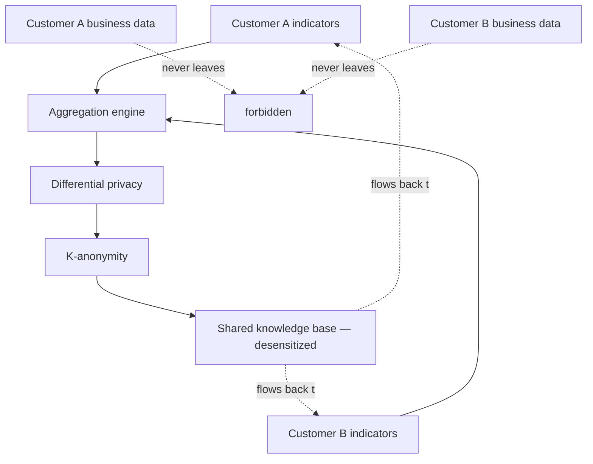

### Customer Authorization (Opt-In)

```yaml
opt_in:
  Cross-customer aggregation: default OFF; customer opts in
  Security intelligence: default ON (defensive win-win)
  Experience sharing: default OFF; customer reviews and opts in

opt_out:
  Customer can withdraw any time
  After withdrawal: stops aggregation (already-aggregated not retracted)
  Historical aggregation: customer can request de-association

approval:
  Customer compliance officer approves
  Platform compliance officer reviews
  Approval records retained
```

## 12.5 Regulatory Multi-Tenancy Requirements

### Data Localization Compliance

```yaml
indonesia_pojk_11_2022:
  Mandatory local storage for financial data
  Scope: customer personal data + transaction data
  Exception: cross-border processing requires regulator approval
  
  engineering:
    Indonesian customers → Indonesian Region cluster
    Database master + replica all in Indonesia
    Backups also in Indonesia
    Cross-border traffic must be desensitized

singapore_pdpa:
  Data export requires consent
  Implementation: customer agreement explicit
  
  engineering:
    Singapore customers → Singapore Region
    Backup in Singapore or PDPA-recognized location

cross_region_customers:
  Example: customer operating in both Indonesia and Singapore
  Design:
    Database split by business geographic location
    Cross-border business strictly audited
    Cross-regulatory coordination (Chapter 11.6)
```

### Provable Multi-Tenant Audit

```yaml
regulator_requirements:
  Requirement 1: prove tenant A's data was not seen by tenant B
  Requirement 2: prove tenant operations integrity
  Requirement 3: prove cross-tenant aggregation compliance

implementation:
  Tenant access audit:
    Every cross-tenant attempt audited
    Normal scenarios: should be 0 such attempts
    Abnormal: must have authorization reason
  
  Data flow tracing:
    Complete chain from data creation to consumption
    Cross-boundary (Region exit / cross-tenant) must be traceable
  
  Integrity proof:
    Per Chapter 8.5 hash chain + regulator signing
    Supports on-site regulator queries (Chapter 11.6)
  
  Periodic reporting:
    Monthly multi-tenant isolation audit report
    Quarterly compliance self-check
    Annual third-party audit
```

### SaaS Additional Regulatory Challenges

```yaml
saas_specific_concerns:
  Data co-location strength
  Platform operations governance capability
  Supply chain risk (platform breach affects all tenants)
  Cross-tenant aggregation compliance

response:
  technical:
    Strong isolation (schema level +)
    Full audit (immutable)
    Encrypted storage (per-tenant key)
  
  governance:
    Annual platform compliance audit
    SOC 2 Type II certification
    ISO 27001 certification
    PDPA / GDPR compliance
  
  transparency:
    Customers can see their isolation proof
    Regulators can query at any time
    Third-party audit reports public
```

### Regulatory Sandbox Support

```yaml
mas_sandbox (Singapore):
  Innovation pilot program
  Requirements:
    Isolated experiment environment
    Complete audit
    Customer protection
  Platform support:
    Provides "sandbox mode" tenants
    Real data with strict audit
    Regulator direct query access

ojk_sandbox (Indonesia):
  Similar structure
  Configured per OJK rules
```

## 12.6 Summary

| Dimension | BYOC Strength A | SaaS Strength B | Section |
|---|---|---|---|
| Data isolation | RLS / shared collection | Schema / partition / instance / cluster | 12.2 |
| Compute isolation | Shared cluster + namespace | Namespace / nodepool / cluster | 12.2 |
| Network isolation | Customer VPC | Subdomain / dedicated VPC + Cilium NetworkPolicy | 12.2 |
| Cache isolation | Tenant-prefixed shared | Per-tenant collection / instance | 12.2 |
| Model isolation | Shared base + customer fine-tune | LoRA / VIP independent | 12.2 |
| Tenant propagation | Ten-layer transparent | Same | 12.3 |
| Cross-tenant sharing | Default off; opt-in | Same | 12.4 |
| Regulatory | Data localization + auditable | Plus SOC 2 + ISO 27001 | 12.5 |

The core insight: **a single isolation strength cannot serve both deployment modes**. Two strengths, sharing implementation code, configurable per deployment, with the same auditability guarantees.

The next chapter examines **business modeling** — how the platform represents financial domain knowledge through the three-layer ontology (FIBO + custom + LLM bridge), and how that representation evolves alongside agents, models, and regulations.


# Chapter 13: Business Modeling and Evolutionary Architecture

## 13.1 Why This Chapter Combines Two Concerns

The platform's third first principle — *Inclusion of Diversity with Enterprise Stability* — has two implications that this chapter addresses jointly:

```yaml
business_modeling_concern:
  How does the platform represent financial domain knowledge?
  What ontologies / schemas / rules underpin agent reasoning?
  How do these connect to LLMs?

evolutionary_concern:
  How does the platform evolve over years?
  How do versions of platform / assets / models / regulations interact?
  How is "stability + change" realized in engineering?
```

These are tightly coupled: business models shape agent behavior, and agent behavior must evolve while remaining stable for committed customers. The chapter's flow:

```yaml
chapter_organization:
  13.2: Three-layer hybrid ontology (FIBO + custom + LLM bridge)
  13.3: The Four-Dimensional Version Model (breaking v4.1's three-tier)
  13.4: Asset generations and cross-generation coexistence
  13.5: Model upgrade — the dual-track strategy
  13.6: Business scaling path (PoC → Pilot → Rollout → Platformization)
  13.7: Regulatory evolution adaptation
```

## 13.2 Three-Layer Hybrid Ontology

### Why a Hybrid

Pure approaches each have problems:

```yaml
pure_owl_rdf (FIBO):
  pros: industry standard, regulatory recognition, semantic rigor
  cons: steep learning curve, scarce experts, slow evolution
  
pure_custom_schema:
  pros: fast iteration, business-friendly
  cons: no industry authority, regulator integration requires self-justification
  
hybrid_three_layer (chosen):
  L1 standard: FIBO core subset for regulatory integration
  L2 custom: business-specific extensions for agility
  L3 LLM bridge: makes ontologies usable by AI agents
```

### Industry Context (2025–2026)

FIBO has reached significant maturity:

```yaml
fibo_2025_q4:
  Maintained by: EDM Council (acquired OMG in October 2025)
  Scope: 2,436 classes covering Foundations, Business Entities, Finance, Securities, Derivatives
  Contributors: Citigroup, Deutsche Bank, Goldman Sachs, State Street, Wells Fargo, CFTC, US Treasury OFR
  Standard: OWL 2 / RDF
  License: Open source

emerging_developments:
  fibo_mcp (2025-2026):
    Open-source MCP server exposing FIBO to AI agents
    Lets agents query FIBO via MCP protocol
    Bridges classical ontology engineering with modern LLM agents
  
  llm_driven_ontology_construction (e.g., OntoEKG, 2026):
    LLMs generate domain-specific ontologies from unstructured data
    Lowers cost of L2 custom ontology creation
    Changes the assumption that ontology engineering is purely manual
```

### L1: Standard Ontology Layer

```yaml
L1_FIBO_subset:
  Selection: 200–500 core classes from FIBO's 2,436
  
  selection_criteria:
    Foundations: 100 classes (basic concepts, time, location, identity)
    Business Entities: 80 classes (legal persons, organization types)
    Securities / Loans / Derivatives: 200 classes (instruments)
    FBC (Financial Business Concepts): 100 classes (interest, debt, etc.)
  
  storage:
    Apache Jena Fuseki (Apache 2.0)
    Alternative: GraphDB Free / Stardog Community
  
  format: OWL 2 / RDF Turtle
  
  tools:
    Modeling: Protégé (for ontology engineers)
    Runtime: Jena API
    Regulatory queries: SPARQL
  
  use_cases:
    Regulatory integration (Basel reports, IFRS reports)
    Cross-institution data interchange (standard semantics)
    Authoritative source for serious compliance scenarios
```

### L2: Business Extension Layer

```yaml
L2_custom_extensions:
  storage: PostgreSQL JSONB (consistent with main DB, Chapter 8)
  
  data_model:
    table: ontology_extension
    columns:
      id, version, tenant_id
      base_concept (refs FIBO L1 class)
      extended_attributes (JSONB)
      validation_rules (JSON Schema)
      business_rules (Rego/DSL)
  
  tools:
    Modeling: Studio visual editor (Chapter 11.3)
    LLM-assisted: OntoEKG-style (auto-generate from customer data)
  
  use_cases:
    Customer business-line specific concepts
    Rapidly evolving business rules
    Business-expert-friendly representation
```

### L3: LLM Bridge Layer

```yaml
L3_llm_bridge:
  storage:
    Prompt template library (asset repository)
    JSON-LD context documents
  
  technologies:
    fibo_mcp_server: agents query FIBO via MCP
    json_ld_context: bridges RDF and JSON
    embedding_index: semantic retrieval over ontology
  
  format_for_llm:
    Natural-language descriptions
    Few-shot examples
    Output schemas
  
  format_from_llm:
    Structured JSON with ontology references
    Validation: SHACL / JSON Schema
```

### Three Mapping Strategies for Prompts

How does an agent's prompt incorporate ontology knowledge?

```yaml
M1_static_injection (default):
  When: prompt template creation time
  How: relevant ontology class descriptions hardcoded into prompt
  Pros: best performance
  Cons: ontology changes require regenerating templates
  Best_for: stable core concepts

M2_dynamic_injection (recommended):
  When: per-inference
  How: semantically retrieve relevant ontology classes; inject into prompt
  Mechanism:
    Class descriptions embedded
    User input embedded
    Top-k relevant classes retrieved and injected
  Pros: flexible, ontology updates effective immediately
  Cons: adds latency
  Best_for: large ontologies + diverse scenarios

M3_tool_call (agent-driven):
  When: during reasoning
  How: agent actively queries FIBO via MCP server
  Mechanism: fibo-mcp tool calls
  Pros: agent decides what to look up
  Cons: requires agent to know when to query
  Best_for: complex reasoning scenarios
```

### Output Validation

```yaml
llm_output_validation:
  llm_output_includes:
    "type": "fibo:CreditDefaultSwap"
    "attributes": {...}
  
  validation_flow:
    1. Parse LLM output
    2. Look up declared ontology class
    3. Validate via SHACL / JSON Schema
    4. If invalid, request correction from LLM
```

### Knowledge Graph Schema Derivation

The ontology drives the knowledge graph schema:

```yaml
ontology_to_graph:
  OWL Class → NebulaGraph Tag (vertex type)
  OWL ObjectProperty → NebulaGraph EdgeType
  OWL DatatypeProperty → Tag's property
  
  automation:
    Tool: custom ontology2nebula converter
    Or: PuppyGraph-style virtual graph layer
  
  version_evolution:
    Ontology upgrade → auto-detect schema diff → migration script
    Schema versions can coexist (per behavior pinning, Chapter 7.5)
```

### Financial Rules Ontology Mapping

The four core financial rules — KYC, AML, suitability, fraud detection — are explicitly tied to ontology:

```yaml
KYC:
  ontology:
    fibo:Customer
    fibo:IndividualIdentification
    fibo:CorporateIdentification
    custom: kyc:RiskTier, kyc:VerificationLevel
  rule_form: OPA Rego
  agent_interaction:
    Agent queries rule engine before decision
    Rule returns allow/deny + reason
    Agent uses reason in explainability output (Chapter 7.3)

AML:
  ontology:
    fibo:Transaction, fibo:Counterparty
    custom: aml:SuspiciousPattern
  rules:
    Large transaction thresholds
    Pattern anomaly detection
    Blacklists
  execution:
    Real-time detection (Chapter 6.5 stream #21)
    Hit → AI analysis (Chapter 6.4)
    High confidence → block + HITL

Suitability:
  ontology:
    fibo:Investor, fibo:RiskProfile
    fibo:Investment, fibo:RiskRating
  rules:
    Investor risk tier ≥ product risk tier
    Investment amount ≤ investor capacity
  execution:
    Sales / recommendation agents must invoke
    Non-compliance blocks transaction

Fraud_detection:
  ontology:
    fibo:Transaction
    custom: fraud:Indicator
  rules: combinations of anomaly indicators
  execution:
    Real-time (sub-second)
    AI + rule hybrid
```

### Cross-Business-Line Coordination

```yaml
business_lines:
  Retail Banking
  Corporate Banking
  Wealth Management
  Insurance

shared_layer (FIBO core + platform extensions):
  Customer concept
  Account concept
  Transaction concept
  Compliance framework

per_business_line_extensions:
  Retail: SavingsAccount, CreditCard
  Corporate: TradeFinanceContract, LetterOfCredit
  Wealth: PortfolioStrategy, HighNetWorthClient
  Insurance: Policy, ClaimEvent

cross_concepts:
  KYC, AML (all business lines)
  ESG scoring (investment + lending)
```

### Conflict Resolution

```yaml
type_1_naming_conflict:
  example: Retail "客户" vs Insurance "投保人"
  resolution: 
    Ontology layer: both subclasses of fibo:Customer
    Business layer: distinct names
    Mapping: alias table

type_2_semantic_conflict:
  example: "balance" means different things in Retail vs Wealth
  resolution: must use distinct ontology classes
    Retail: fibo:AccountBalance
    Wealth: fibo:InvestmentBalance

type_3_rule_conflict:
  example: cross-border business under different regulators
  resolution:
    Route by business scenario to appropriate rule set
    Cross-scenario cases require explicit attribution
```

## 13.3 The Four-Dimensional Version Model

### Why Break v4.1's Three-Tier Model

v4.1 used a three-tier version model: platform / agent / asset. This model has problems exposed by the multi-customer reality:

```yaml
problems_with_v41:
  Too few dimensions: only "layers", no "entities"
  Missing "composition" concept: a customer runs N components in specific combinations
  Unclear relationship to behavior pinning (Chapter 7.5)
  Mismatch with BYOC multi-customer multi-version reality
  No "evolution path" concept (paths between versions)
```

### Four Dimensions

```yaml
dimension_1_component_version:
  Each component has its own SemVer
  Example: spring-ai-fin v1.2.3, maas-abstract v0.5.1
  80+ components each independently versioned
  
  semver_meaning:
    Major: incompatible API change
    Minor: backward-compatible feature
    Patch: backward-compatible fix
  
  contract_guarantee:
    Same major version → compatible
    Each component maintains its own compatibility matrix

dimension_2_contract_version:
  Externally-exposed contracts, decoupled from components
  Examples:
    API version: v1, v2, v3
    Behavior version: behavior-2026-04 (per Chapter 7.5)
    Protocol version: a2a-1.0, mcp-1.0
    Data Schema version (visible to customers)
    SDK compatibility version: sdk-1.x, sdk-2.x

dimension_3_composition_version (Release):
  A specific combination of components = a "release"
  Analogy: Linux distribution
  Tiers:
    LTS (Long Term Support): 3-year support, annual release
    Stable: 1-year support, quarterly release
    Edge: 3-month support, monthly release
    Custom: customer-specific composition

dimension_4_customer_instance_version:
  Each BYOC customer's deployed instance has its own version
  = (a Release) + (customer-specific config) + (customer-specific assets)
  Tracked individually by platform operations center
  Upgrades are from one customer-instance-version to another
```

### Mapping to v4.1

```yaml
mapping_v4.1_to_v5.0:
  v4.1 platform version → Dimension 3 composition version (refined granularity)
  v4.1 agent version → Dimension 1 subset (agent components)
  v4.1 asset version → Dimension 1 subset (asset components)
  Behavior pinning (Chapter 7.5) → Dimension 2 contract version
  New: Dimension 4 customer instance version (BYOC necessity)
```

### Release Tiers Detail

```yaml
LTS_long_term_support:
  Support: 3 years
  Frequency: annual
  Audience: financial conservatives, regulatory-compliant customers
  Changes: security patches + critical bug fixes only
  Stability: maximum

Stable:
  Support: 1 year
  Frequency: quarterly
  Audience: most production environments
  Changes: new features + bug fixes
  Stability: high

Edge:
  Support: 3 months
  Frequency: monthly
  Audience: innovative customers, internal beta
  Changes: latest features (may be unstable)
  Stability: medium

Custom:
  Support: per agreement
  Audience: special regulatory cases
  Changes: per customer / regulator requirement
  Stability: contracted
```

### Release Bill of Materials (BOM)

```yaml
release_bom:
  format: signed manifest
  contents:
    All 80+ component versions enumerated
    Cryptographic signatures
    Hashes for tamper detection
  audit:
    Reproducible: rebuild same release from BOM
    Traceable: each component traces to source
  compatibility_matrix:
    Supported contract versions
    Supported customer environments (K8s versions, GPU types)
    Supported dependency versions (PG, Kafka, etc.)
  migration_guide:
    Upgrade paths from previous versions
    Incompatible changes list
    Rollback procedures
```

### Evolution Paths

```yaml
supported_paths:
  LTS → LTS:
    Example: v3 LTS → v4 LTS
    Span: 1 year
    Tooling: complete migration tools
  
  LTS → Stable:
    Example: v3 LTS → v4.5 Stable
    Span: any
    Tooling: standard upgrade process
  
  Stable → Stable:
    Example: v4.4 Stable → v4.5 Stable
    Span: 1 quarter
    Tooling: automated upgrade
  
  Stable → LTS:
    Example: v4.5 Stable → v5 LTS
    Tooling: planned with extensive UAT

unsupported_paths:
  Cross-multi-LTS:
    Example: v3 LTS → v5 LTS (skipping v4)
    Required: must pass through v4 LTS
  
  Downgrade:
    Default: not supported
    Exception: emergency rollback (Chapter 6.4)

engineering_for_paths:
  Per-path artifacts:
    Migration scripts
    Data schema evolution
    Auto-config conversion
    UAT test sets
  
  Tool aging:
    Migration tools have expiration
    Past expiration: must traverse multi-step path
    Example: v3 LTS → v4 LTS migration tool expires after 1 year
```

### Multi-Version Coexistence

```yaml
at_platform_operations_center:
  LTS versions: maintain N=3 simultaneously
  Stable: support N-2 (last 2 Stables)
  Edge: only latest
  
  engineering:
    Each version has independent "snapshot repository"
    Includes: code, images, config, docs
    Supports replaying any historical state

at_customer_byoc:
  Each customer fixed at one Release
  Cross-customer version distribution:
    Tracked real-time at platform operations center
    Statistics: which customers on which version
    Old-version customers get priority upgrade nudge

cross_version_communication:
  Scenario: customer A v4.3 calls platform operations center v5.0
  Mechanism: through contract version (Dimension 2)
  Restrictions:
    Contract versions must overlap
    Old contracts may be deprecated in new versions
    6-month deprecation notice
```

## 13.4 Asset Generations

### Generation vs Version

```yaml
version (within a generation):
  Iteration: v1.0 → v1.1 → v1.2
  Quantitative changes

generation (between generations):
  Phase change: Gen 1 → Gen 2 → Gen 3
  Qualitative changes
```

### Generation Examples

```yaml
business_agent_generations:
  Gen 1 (basic conversation, prompt engineering)
  Gen 2 (+ RAG capabilities)
  Gen 3 (+ tool calling)
  Gen 4 (+ multi-agent collaboration)
  Gen 5 (+ autonomous planning)

memory_generations:
  Gen 1 (simple session memory)
  Gen 2 (+ short / mid / long-term)
  Gen 3 (+ Dreaming / consolidation)
```

### Leap Criteria

A generation leap happens when:

```yaml
leap_criteria:
  Evaluation score significantly improved (> 15%)
  New capability types added
  Architectural changes
  Backward-compatibility broken (requires customer coordination)
```

### Cross-Generation Coordination

```yaml
platform_layer:
  New-generation abstraction layer ready first
  Old-generation continues to be supported

customer_layer:
  Not forced to upgrade to new generation
  Migration tools provided when new-gen has clear advantages
  Customer self-determines timing

business_layer:
  Studio prompts "new generation available"
  Preview new-generation effects
  Independent decision

cross_gen_migration:
  Prompt: AI-assisted upgrade (auto-add RAG references, tool calls)
  Skills: wrap as new-gen Tool contract or refactor
  Memory: data migrated to new structure (no loss)
```

### Multi-Generation Coexistence

```yaml
multi_gen_design:
  Support: multi-gen agents on same platform
  Restrictions:
    Gen N-1 and Gen N: interoperable
    Cross-multi-gen (N-2 → N): requires Adapter
  
  engineering:
    Each generation has independent Adapter layer
    Cross-gen calls translated by Adapter
```

### AI-Assisted Asset Evolution

A novel platform capability:

```yaml
ai_helps_evolve:
  detect_upgrade_candidates:
    AI analyzes evaluation score trends
    Identifies stagnating agents
    Proposes generation-leap plans
  
  generate_upgraded_assets:
    Based on historical traces + failure case library
    Generates new-generation prompt drafts
    Business reviews + adjusts
  
  validate_upgrade_effects:
    Shadow traffic comparison: old vs new generation
    Golden Set evaluation
    AI provides "is this worth upgrading" recommendation

flywheel_integration:
  Asset sedimentation (Chapter 5.2) identifies leap opportunities
  Auto-optimizer (Chapter 5.2) handles within-generation iteration
  This section: adds "generation leap" as a new dimension
```

## 13.5 Model Upgrade — Dual-Track Strategy

### The Special Challenge

Model upgrades differ from software upgrades:

```yaml
software_vs_model:
  software:
    Behavior deterministic (interface contract clear)
    Upgrade controllable (UAT first, then deploy)
    Rollback explicit (old binary still exists)
  
  model:
    Behavior non-deterministic (same input may yield different outputs)
    Upgrade risky (behavior may drift)
    Rollback costly (already-conducted optimizations may be lost)

key_challenges:
  behavior_compatibility:
    New model better in 99% of scenarios
    But may regress in 1% (and that 1% may involve compliance)
  
  pinned_customers (Chapter 7.5):
    Demand "behavior cannot change"
    Model upgrade = behavior change = pinning violation
    Must support "old model continues to run"
  
  cost_change:
    New model may be more or less expensive
    Affects cost flywheel (Chapter 5.3)
  
  evaluation_cost:
    Each model upgrade requires full evaluation suite
    Golden Set must rerun
    High cost (compute + time)
```

### Track 1: Platform-Driven Upgrade

```yaml
track_1_for_most_customers:
  flow:
    1. Platform R&D pre-tests new model
    2. Platform runs Golden Set evaluation
    3. Evaluation passes → platform recommends upgrade
    4. Customer chooses to upgrade
    5. Customer upgrade → gradual rollout → full
```

### Track 2: Pinned-Customer Preservation

```yaml
track_2_for_pinned_customers:
  preserved:
    Old model weights permanently retained
    Old inference engine version permanently retained
    Old routing strategy permanently retained
  
  cost:
    Pinned customer pays additional fees
    Platform reserves 5–10% compute capacity for pinning support
  
  engineering:
    Model repository: all historical versions archived
    vLLM multi-version coexistence
    Per-pinned-version corresponds to inference engine instance
    Router: smart selection based on pinned version
```

### Behavior Diff Analysis

```yaml
shadow_traffic_comparison:
  New and old models run simultaneously (Chapter 5.2 evolution flywheel)
  Differences recorded
  
ai_classifies_diff:
  New model better (80%) → accept
  New model worse (5%) → marked as regression case
  Hard to determine (15%) → HITL
  
  classification_standard:
    Per Chapter 7.5 four-dimensional behavior stability (D1-D4)
    Per Chapter 6.4 AI-First three layers

regression_handling:
  Regression cases enter library:
    As Golden Set negatives
    For preventing future model upgrades
  
  AI attribution:
    Why did the new model regress here?
    Training data issue? Prompt mismatch? Routing issue?
    Provides fix suggestions
  
  fix_strategies:
    Prompt adjustment (adapt to new model)
    Few-shot enhancement
    Routing strategy: this input class routes to old model
```

### Cost Management

```yaml
pre_upgrade_estimation:
  New model cost / performance baseline
  Cost on Golden Set
  Estimated full-deployment monthly cost change

post_upgrade_monitoring:
  Real-time cost comparison
  Anomaly alerts (over budget)
  Auto-fallback (per Chapter 6.4)

cost_flywheel_integration:
  New model online may trigger:
    New cache strategies
    New routing strategies
    New distillation (distilling new model into smaller)
```

## 13.6 Business Scaling Path

### Customer's Typical Growth Curve

```yaml
stage_1_poc (0-3 months):
  Agent count: 1–3
  Scope: single business (e.g., customer service)
  Users: internal testing
  Platform support: highly customized + hand-holding

stage_2_pilot_launch (3-12 months):
  Agent count: 5–10
  Scope: 1–2 business lines
  Users: full internal / small external
  Platform support: standardized templates

stage_3_full_rollout (1-3 years):
  Agent count: 20–50
  Scope: multi-business-line
  Users: full external
  Platform support: self-service + platform consulting

stage_4_platformization (3+ years):
  Agent count: 100+
  Scope: full company AI-ization
  Users: large-scale
  Platform support: customer-self-governance
```

### Engineering Bottlenecks at Each Transition

```yaml
1_to_2_bottleneck:
  Manual configuration excess → introduce templates
  Single-agent monitoring → introduce aggregated monitoring
  Internal users → stricter compliance

2_to_3_bottleneck:
  Increased agent count → resource contention (Chapter 6.5)
  Multi-business-line → cross-business ontology coordination (13.2)
  Cost increases → cost flywheel takes effect (Chapter 5.3)

3_to_4_bottleneck:
  100+ agents difficult to govern
  Cross-agent collaboration complex
  Platform must "self-govern"

required_capabilities_to_unblock:
  Stage 2: multi-agent orchestration (Flowable)
  Stage 3: agent asset reuse (asset repository, Chapter 5.2)
  Stage 4: AI self-governance (meta-agents enhanced)
```

### SaaS-to-BYOC Migration

When a SaaS customer outgrows shared infrastructure:

```yaml
migration_triggers:
  Data volume exceeds SaaS limits
  Regulatory privatization requirements
  Customer security requirements increase
  Cost calculation favors dedicated hardware

migration_phases:
  phase_1_assessment:
    Data volume / agent count / SLA / cost comparison
    Joint platform-customer decision
  
  phase_2_preparation:
    Customer datacenter (GPU, K8s, network)
    Platform prepares BYOC deployment package
    Data migration plan
  
  phase_3_dual_run:
    SaaS and BYOC running concurrently
    Bidirectional data sync
    Traffic gradually shifts to BYOC
  
  phase_4_cutover:
    Full traffic on BYOC
    SaaS instance retained N days as fallback
    Final SaaS instance retirement
  
  phase_5_byoc_operations:
    Per Chapter 7.6 BYOC operations
```

### Data Migration Detail

```yaml
data_migration_categories:
  business_data: full export + encrypted transfer + customer datacenter import
  agent_assets: Studio push (Chapter 11.3)
  historical_traces: selective migration (customer decides)
  audit_logs: must migrate (compliance)
```

## 13.7 Regulatory Evolution Adaptation

### Sources of Regulatory Change

```yaml
cyclical:
  Annual: general compliance rule updates (e.g., KYC procedure changes)
  3-5 years: major regulatory updates (e.g., GDPR, PDPA-style)
  Crisis-triggered: emergency regulation post-incident

cross_jurisdiction:
  Indonesia OJK / UU PDP
  Singapore MAS / PDPA
  Generic ISO / SOC 2 / PCI-DSS
  Each region evolves independently

ai_specific:
  Singapore MAS FEAT principles
  EU AI Act
  China generative AI management measures
  AI governance frameworks evolving rapidly
```

### Regulatory Evolution Architecture

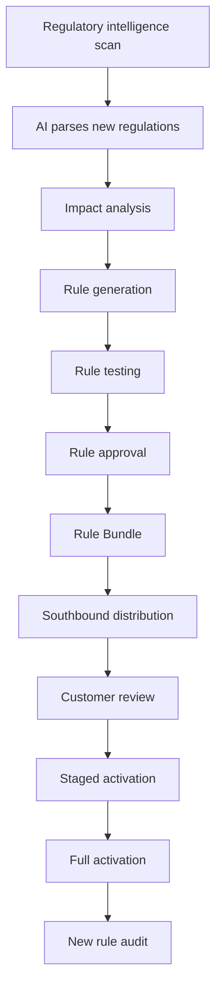

### Pipeline Stages

```yaml
stage_1_intelligence_scan:
  sources:
    Official: OJK announcements, MAS Notices, regulatory sandbox notifications
    Commercial intelligence: Thomson Reuters Regulatory Intelligence, LexisNexis
    Platform compliance team: direct regulator communication, industry conferences
  
  scope: continuous monitoring of all relevant jurisdictions and AI regulations

stage_2_ai_parsing:
  llm_reads_regulation:
    Extract key changes
    Compare to current rules
    Generate diff report
  
  ai_classification:
    Affects KYC / AML / suitability / fraud / etc.
    Which agents are affected
    Which customers are affected
  
  hitl_review:
    Compliance experts review AI parsing
    Confirm understanding
    Manually supplement subtleties AI might miss

stage_3_rule_generation:
  ai_assisted:
    From regulation natural language → generate Rego rules (OPA) or Drools DRL
  
  human_review:
    Compliance experts validate generated rules
    Adjust + complete
  
  testing:
    Run generated rules on historical traces
    Identify impact (how much business affected)
    Confirm correctness

stage_4_distribution:
  via_chapter_7.6_southbound:
    Rule Bundle signed
    Pushed to all relevant customers
    Customer compliance officer reviews
    Customer decides activation timing
  
  emergency_distribution:
    Regulatory immediate effectiveness requirement
    Skip some customer review
    Contractual provisions ensure compliance

stage_5_versioning:
  Rules have version numbers
  Agents reference specific rule versions
  Agent's behavior version (Chapter 7.5) includes rule version
```

### AI Auto-Adaptation Maturity Levels

```yaml
maturity_progression:
  Level 0: fully manual
  Level 1: AI parses + human reviews + human writes rules
  Level 2: AI parses + human reviews + AI generates draft + human approves  ← CURRENT RECOMMENDATION
  Level 3: AI parses + AI reviews + AI generates + human approves
  Level 4: AI fully autonomous (NOT recommended for finance)

current_stage: Level 2
  AI assists but is not autonomous
  All rule changes require HITL
  Don't take risks in front of regulators
```

### Regulatory Sandbox Support

Per Chapter 11.6:

```yaml
regulatory_sandboxes_evolve:
  Various regions continually launch new sandboxes
  Sandbox rules also change
  Platform must adapt rapidly

platform_support:
  sandbox_specific_config:
    Allow more experimental capabilities
    Stricter audit
    Direct regulator access
  
  sandbox_graduation_path:
    Sandbox passes → apply for production
    Platform helps customer prepare application materials
    Sandbox experience may inform new rules
```

## 13.8 Summary

This chapter codified the platform's stance on stability and change:

| Element | Choice | Rationale |
|---|---|---|
| Ontology | Three-layer hybrid (FIBO + custom + LLM bridge) | Authority + agility + AI-usability |
| Standard ontology | FIBO core 200–500 classes | Regulatory recognition, manageable scope |
| Version model | Four-dimensional (component / contract / composition / customer-instance) | Real complexity demands |
| Release tiers | LTS / Stable / Edge / Custom | Match different customer needs |
| Multi-version coexistence | LTS×3 + Stable×2 | Compatibility without bloat |
| Asset evolution | Generations + versions; Adapter for cross-gen coexistence | Quality leap vs incremental |
| Model upgrade | Dual-track (mainstream + pinned) | Pinning customer commitment |
| Business scaling | 4-stage curve | Business reality |
| SaaS↔BYOC | 5-phase migration | Smooth transition |
| Regulatory adaptation | Intelligence + parsing + generation + distribution | Engineering, not ad-hoc |
| Regulatory AI maturity | Level 2 (AI-assisted + human approval) | Conservative, finance-appropriate |

The next chapters complete Part III: deployment / BYOC operations (Chapter 14) and regulatory & compliance (Chapter 15).


# Chapter 14: Deployment and BYOC Operations

## 14.1 Deployment Topology Overview

The platform supports two deployment modes (Chapter 12.1) with shared software but different operational patterns:

```yaml
deployment_modes:
  byoc_dedicated:
    Software: identical to SaaS (no fork)
    Infrastructure: customer-owned (their datacenter, their cloud account)
    Operations: customer-led + platform remote consulting (Chapter 7.6)
    Customer profile: large financial institution
    
  saas_multi_tenant:
    Software: identical to BYOC (no fork)
    Infrastructure: platform-owned (Region-organized)
    Operations: platform-led
    Customer profile: mid-market financial / fintech
```

This chapter addresses:

```yaml
chapter_organization:
  14.2: Reference deployment topology (one BYOC instance)
  14.3: Sizing and capacity planning
  14.4: Day 0 deployment workflow
  14.5: Day 1 acceptance and onboarding
  14.6: Day 2 routine operations
  14.7: Multi-Region SaaS topology
  14.8: Disaster recovery and business continuity
```

## 14.2 Reference Deployment Topology (BYOC)

### Logical Layout

```
┌─────────────────────────────────────────────────────────────┐
│  Customer Datacenter / Customer Cloud Account                │
│                                                              │
│  ┌────────────────────────────────────────────────────────┐ │
│  │  K8s Cluster                                           │ │
│  │                                                        │ │
│  │  ┌──────────┐  ┌──────────┐  ┌──────────┐  ┌──────┐   │ │
│  │  │ ingress- │  │ agent-   │  │ data-    │  │ flw- │   │ │
│  │  │ ns       │  │ ns       │  │ ns       │  │ ns   │   │ │
│  │  │ Higress  │  │ business │  │ PG       │  │ trace│   │ │
│  │  │          │  │ + meta   │  │ Milvus   │  │ eval │   │ │
│  │  │          │  │ + guard  │  │ Nebula   │  │ exp  │   │ │
│  │  │          │  │ agents   │  │ Valkey   │  │      │   │ │
│  │  └──────────┘  └──────────┘  │ Kafka    │  └──────┘   │ │
│  │                              │ Seaweed  │              │ │
│  │  ┌──────────┐  ┌──────────┐  │ OpenSrch │  ┌──────┐   │ │
│  │  │ maas-ns  │  │ infra-ns │  │ Audit    │  │ flow │   │ │
│  │  │ MaaS     │  │ Istio    │  └──────────┘  │ Flowa│   │ │
│  │  │ vLLM/    │  │ OTel     │                │ ble  │   │ │
│  │  │ SGLang   │  │ Sentinel │                └──────┘   │ │
│  │  │ LMCache  │  │ Vault    │                            │ │
│  │  └──────────┘  │ Keycloak │                            │ │
│  │                │ OPA      │                            │ │
│  │                │ Presidio │                            │ │
│  │                └──────────┘                            │ │
│  │                                                        │ │
│  │  GPU Pool         CPU Pool         Storage             │ │
│  └────────────────────────────────────────────────────────┘ │
│                                                              │
│  Customer SDK (Spring Boot apps)  ──→  to Higress           │
│                                                              │
│  Operator / SRE / Compliance ──→  Operations Console        │
│  Developer ──→ Agent Studio                                 │
└─────────────────────────────────────────────────────────────┘
       │                                     ▲
       │ desensitized northbound             │ southbound (config / runbook / patches)
       ▼                                     │
┌─────────────────────────────────────────────────────────────┐
│  Platform Operations Center (in Anthropic-managed env or    │
│  customer-agreed environment, never in customer DC)          │
│                                                              │
│  Receives: desensitized metrics, alerts, telemetry          │
│  Provides: config updates, runbooks, patches, knowledge      │
│  Hosts: cross-customer aggregation (with consent)            │
└─────────────────────────────────────────────────────────────┘
```

### Namespace Layout

```yaml
namespace_design:
  ingress-ns:
    Higress + 7 routers
    NetworkPolicy: external traffic in, internal mesh out
    Resources: medium CPU, low memory
  
  agent-ns:
    Business agents + meta agents + guard agents
    NetworkPolicy: mesh-based
    Resources: medium-high CPU, medium memory
  
  data-ns:
    PostgreSQL primary + replicas
    Milvus, NebulaGraph, OpenSearch
    Valkey, Kafka, SeaweedFS
    Audit log storage (immutable, often dedicated to its own ns for stricter access)
    NetworkPolicy: only application namespaces can access
    Resources: high memory, high storage I/O
  
  maas-ns:
    MaaS abstraction layer
    Inference engines (vLLM, SGLang)
    LMCache
    NetworkPolicy: only agent-ns and gateway can call
    Resources: GPU-heavy
  
  flw-ns (flywheel):
    Trace lake writers, evaluation engine, experiment platform
    Reflection engine, asset sedimentation, auto-optimizer
    NetworkPolicy: read trace lake, write asset repository
    Resources: medium, can use spot instances
  
  flow-ns:
    Flowable BPMN engine
    NetworkPolicy: agent-ns interacts
    Resources: low-medium
  
  infra-ns:
    Istio control plane
    OpenTelemetry collectors
    Sentinel
    Vault
    Keycloak
    OPA, Presidio
    NetworkPolicy: cross-cutting, special rules
    Resources: medium

  ops-ns:
    Operations Console backend
    Agent Studio backend
    Northbound metrics gateway (desensitization)
    Southbound config receiver
    NetworkPolicy: internal + outbound to platform ops center only
```

## 14.3 Sizing and Capacity Planning

### Reference Sizing Tiers

```yaml
small_byoc_tier:
  Use case: pilot / mid-size financial institution
  Concurrent users: 1k-5k
  Daily AI calls: 100k-500k
  
  hardware:
    GPU: 8-16 H100 (or equivalent A100)
    CPU: 64-128 cores
    Memory: 512GB-1TB
    Storage: 50TB SSD
    Network: 25Gbps
  
  agents:
    Business agents: 5-20
    Concurrent active: 5-15

medium_byoc_tier:
  Use case: large bank / wealth manager
  Concurrent users: 5k-50k
  Daily AI calls: 500k-5M
  
  hardware:
    GPU: 32-64 H100
    CPU: 256-512 cores
    Memory: 2-4TB
    Storage: 200TB SSD
    Network: 100Gbps
  
  agents:
    Business agents: 20-100
    Concurrent active: 20-80

large_byoc_tier:
  Use case: tier-1 regional bank
  Concurrent users: 50k+
  Daily AI calls: 5M+
  
  hardware:
    GPU: 128+ H100 (or B200/H200)
    CPU: 1000+ cores
    Memory: 8TB+
    Storage: 1PB+ (with tiered storage)
    Network: 200Gbps+
  
  agents:
    Business agents: 100+
    Concurrent active: 80+
```

### Sizing Methodology

```yaml
inputs_to_sizing:
  business_inputs:
    Concurrent users (peak)
    Average requests per user-session
    Average tokens per request (input + output)
    Peak-to-average ratio
    Business-line distribution
  
  technical_inputs:
    Cache hit rate target (Chapter 5.3)
    Model tier mix (V4 Pro / V4 Flash / specialist)
    Latency SLAs per tier (Chapter 6.5, 7.5)
    Multi-tenant isolation strength

formulas:
  gpu_count:
    base_gpu = (peak_qps × avg_tokens_out) / (per_gpu_throughput)
    × (1 - cache_hit_rate)
    × multi_tenant_overhead_factor (1.0-1.3)
    × headroom (1.5)
    
  storage:
    trace_storage = peak_qps × avg_trace_size × retention_days
    audit_storage = peak_qps × audit_record_size × 7_years
    business_storage = customer-specific
  
  memory:
    valkey = (cache_hit_targets × avg_response_size) per tenant
    pg = (trace_metadata + business_records) × replication_factor
```

### Capacity Planning Cadence

```yaml
quarterly:
  Review actual vs predicted utilization
  Project next quarter
  Plan procurement if needed

monthly:
  Review trend
  Identify bottlenecks
  Tune autoscaling parameters

weekly:
  Check capacity dashboard
  Review autoscaling effectiveness

daily (automated):
  Capacity alerts (>80% of any resource)
  Trend anomaly detection (AI Operator analyzes)
```

## 14.4 Day 0: Initial Deployment

### Deployment Workflow

```yaml
day_0_steps:
  step_1_environment_validation:
    Owner: customer ops
    Checks:
      K8s version compatibility
      Network reachability
      Storage class availability
      GPU drivers + CUDA versions
      mTLS-capable network plugin
    Output: validation report signed by both parties
  
  step_2_namespace_creation:
    Owner: customer ops + platform consultant
    Actions:
      Create all required namespaces
      Apply NetworkPolicies
      Set up ResourceQuotas
    Output: namespace inventory
  
  step_3_data_layer_install:
    Owner: customer ops (executes scripts) + platform ops (consults)
    Sequence (per Chapter 9.5 phase 2):
      PostgreSQL HA setup
      Milvus cluster
      NebulaGraph cluster
      Kafka cluster (Strimzi operator)
      Valkey cluster
      OpenSearch cluster
      SeaweedFS
      Audit log storage
    Each: run health check before proceeding
  
  step_4_cross_cutting_install:
    Owner: customer ops + platform consultant
    Sequence:
      Vault + secrets bootstrap
      Keycloak + IAM bootstrap
      OPA + initial policies
      OpenTelemetry collectors
      Istio Ambient Mesh
      Sentinel + initial rules
      Presidio
  
  step_5_maas_install:
    Owner: customer ops + platform ops
    Sequence:
      MaaS abstraction layer
      Inference engines (vLLM, SGLang)
      LMCache
      Initial models loaded
    Each: model warm-up validation
  
  step_6_framework_install:
    Owner: customer ops + platform ops
    Sequence:
      spring-ai-fin core
      Cognitive Flow engine
      Flowable
      Three-tier memory backend
      Skills registry
      Knowledge base
  
  step_7_agents_install:
    Owner: customer dev + platform consultant
    Sequence (per Chapter 9.5 phase 6):
      Guard agents first (review + compliance + safety)
      Meta agents second (Architect, Operator, Optimizer)
      Business agents last (customer-defined)
  
  step_8_flywheels_install:
    Owner: customer ops + platform ops
    Sequence:
      Trace lake (Langfuse setup)
      Evaluation engine
      Experiment platform
      Reflection + asset sedimentation
      Auto-optimizer
      Cost meter + multi-tier cache
      Distillation pipeline
  
  step_9_clients_setup:
    Owner: customer dev
    Actions:
      SDK in customer apps
      Operations Console for ops/SRE/compliance
      Agent Studio for developers
  
  step_10_initial_acceptance:
    Owner: customer business + platform consultant
    Actions:
      Run platform-provided smoke tests
      Verify each integration point
      Sign-off
```

### Phase Order Enforcement

The phase order from Chapter 9.5 is **strict** — installer scripts will refuse to proceed if dependencies are not yet healthy. This prevents subtle ordering bugs.

### Initial Configuration Pushes

After installation:

```yaml
initial_config_distribution:
  step_1_platform_pushes_baseline:
    Routing rules (initial)
    Cache strategies (initial)
    Rate limits (per tenant)
    Evaluation sampling rates
    Red-line policies (compliance)
  
  step_2_customer_customizes:
    Per-tenant rate adjustments
    Compliance overrides (per customer regulator)
    Custom red-lines
    HITL policies (when escalation triggered)
  
  step_3_test_with_synthetic_traffic:
    Run synthetic test cases
    Verify governance at each layer
    Verify isolation
    Verify monitoring
```

## 14.5 Day 1: Acceptance and Onboarding

### UAT Workflow

```yaml
uat_phases:
  phase_a_functional_testing:
    Owner: customer business owner
    Scope: each business agent's intended scenarios
    Coverage: customer-defined Golden Set
    Pass criteria: per-agent quality scores meet targets
  
  phase_b_performance_testing:
    Owner: customer ops + platform consultant
    Scope: load testing (peak QPS, sustained throughput)
    Coverage: all access forms (Chapter 7.5)
    Pass criteria: SLA targets met
  
  phase_c_security_audit:
    Owner: customer security + platform consultant
    Scope: 
      Authentication / authorization
      Data flow (where data goes, what's encrypted)
      Audit completeness
      Tenant isolation (Chapter 12)
      Red-line enforcement
    Pass criteria: security checklist passed
  
  phase_d_compliance_validation:
    Owner: customer compliance officer
    Scope:
      Data localization compliance
      Audit log integrity
      Regulatory reporting capability
      Behavior pinning capability
    Pass criteria: compliance checklist passed

  phase_e_business_uat:
    Owner: customer business team (representative end users)
    Scope: real business scenarios
    Coverage: production-like workloads
    Pass criteria: business team accepts

  phase_f_production_cutover:
    Owner: customer ops (lead) + platform consultant
    Scope: gradual traffic shift to new platform
    Pattern:
      Internal users first
      Gradual external rollout
      Monitor closely
    Rollback plan: ready
```

### Onboarding Documentation

Customer team receives:

```yaml
documentation_package:
  operations_runbook:
    Tier 0/1/2/3 incident response
    Daily monitoring checklist
    Weekly maintenance checklist
    Monthly review checklist
  
  development_guide:
    SDK usage (Chapter 7.4 paradigms A/B/C)
    Studio walkthrough
    Agent development best practices
    Testing and evaluation
  
  compliance_handbook:
    Audit query procedures
    Regulatory reporting workflows
    Behavior pinning procedures
    PII decode procedures
  
  api_reference:
    Per-form API specs (Chapter 7.5)
    Error codes
    SLA targets
  
  architecture_reference:
    This document (v5.0) tailored to customer's deployment
    Customer-specific configuration overrides documented
```

## 14.6 Day 2: Routine Operations

### Daily Operational Cadence

```yaml
daily_routine:
  morning:
    Operations Console review (Chapter 11.4 operator dashboard)
    Overnight alert review (P0/P1)
    Cost dashboard check vs budget
    Pending HITL approvals
  
  ongoing:
    Real-time alert monitoring
    Customer feedback processing
    AI help requests
    Cross-role collaboration (operator ↔ SRE ↔ compliance)
  
  evening:
    Daily reconciliation (Chapter 8.5)
    Eval scores trending
    Cost trend
    Capacity utilization
```

### Weekly Operational Cadence

```yaml
weekly_routine:
  sre_team:
    Capacity review
    Health trend analysis
    Pending upgrades planning
    Runbook updates
  
  operations_team:
    Aggregated user feedback review
    Agent performance review
    Hot issues identification
    Improvement requests forwarded to dev team
  
  compliance_team:
    Audit query summary
    Regulatory report preparation
    Red-line effectiveness review
    Cross-tenant audit (SaaS only)
  
  combined:
    Weekly review meeting
    Cross-functional issue discussion
    Plan for next week
```

### Monthly Operational Cadence

```yaml
monthly_routine:
  Customer-facing reports:
    Cost report
    Quality / SLA report
    Behavior version status (for pinning customers)
    Compliance status
  
  Platform-side:
    Asset generation review
    Behavior version migration planning (if any)
    Cost optimization opportunities
    Capacity planning update
  
  Joint:
    Monthly business review (platform + customer)
    Customer satisfaction discussion
    Roadmap alignment
    Budget review
```

### Quarterly Operational Cadence

```yaml
quarterly:
  Platform release cycle (Stable tier):
    New version available
    Customer evaluates impact
    Schedules upgrade window
  
  Compliance:
    Quarterly compliance self-check
    Regulator-required filings (e.g., MAS FEAT assessment)
  
  Strategic:
    Quarterly business review
    Capacity / cost planning
    Roadmap update
```

### Annual Operational Cadence

```yaml
annual:
  LTS release decisions:
    Stay on current LTS or migrate to new LTS
    Plan migration window (long lead time)
  
  Compliance:
    Annual compliance audit
    Third-party security audit (SOC 2, ISO 27001 renewals)
  
  Strategic:
    Year-end business review
    Strategy alignment
    Major roadmap planning
```

## 14.7 Multi-Region SaaS Topology

### Region Layout

```yaml
saas_regions:
  southeast_asia_indonesia:
    Customer base: Indonesian financial / fintech
    Compliance: OJK, UU PDP
    Primary: Jakarta
    DR: Surabaya
  
  southeast_asia_singapore:
    Customer base: Singapore financial / regional HQs
    Compliance: MAS, PDPA
    Primary: Singapore
    DR: Singapore (different AZ)
  
  southeast_asia_malaysia:
    Customer base: Malaysian financial
    Compliance: BNM
    Primary: Kuala Lumpur
    DR: Kuala Lumpur (different AZ)
```

### Per-Region Architecture

```yaml
per_region:
  region_specific:
    Independent K8s cluster
    Independent data layer
    Independent operations
    Independent regulatory compliance
  
  shared_globally:
    Software releases (same version across regions, customer chooses upgrade timing)
    Cross-customer aggregation (with consent, anonymized)
    Security intelligence (defender alliance)
```

### Region Selection for Tenants

```yaml
region_selection_rules:
  customer_jurisdiction:
    Indonesian financial → Indonesian Region
    Singapore financial → Singapore Region
    Cross-border:
      Each business unit's data stays in its region
      Cross-border data flows: explicit consent + audit
  
  data_localization:
    Mandatory for jurisdictions requiring it
    Cannot override
  
  performance:
    Closest region for latency optimization
    Subject to localization constraints
```

### Cross-Region Operations

```yaml
permitted_cross_region:
  Software upgrades (rolled out to each region independently)
  Cross-customer aggregation (anonymized, aggregated centrally)
  Security intelligence (shared)
  Platform operations metadata (control plane)

forbidden_cross_region:
  Customer business data
  Customer audit logs
  PII (even desensitized; some regulations require strict in-region)
  Per-customer model fine-tuning data
```

## 14.8 Disaster Recovery and Business Continuity

### DR Tiers

```yaml
disaster_tier_1_zone_failure:
  Scenario: one availability zone offline
  Detection: < 1 minute
  Recovery: automatic (multi-AZ deployments)
  Customer impact: minimal (transparent failover)

disaster_tier_2_region_degradation:
  Scenario: region partial degradation (e.g., DB primary failure)
  Detection: < 5 minutes
  Recovery: automatic failover to replica + alert
  Customer impact: brief latency spike

disaster_tier_3_region_outage:
  Scenario: entire region offline
  Detection: < 5 minutes
  Recovery: 
    BYOC: customer's DR plan executes
    SaaS: tenants migrate to DR region (within hours)
  Customer impact: significant; service degradation

disaster_tier_4_data_loss:
  Scenario: data corruption / loss
  Detection: hours-days (depends on type)
  Recovery: from backups
  Customer impact: significant; potential data loss within RPO
```

### RPO and RTO

```yaml
rpo_recovery_point_objective:
  audit_logs: 0 (immutable, replicated synchronously)
  business_records (PG): < 5 minutes (sync replication + WAL shipping)
  agent_state: < 1 minute (frequent checkpoints)
  trace_lake: best-effort (data is recoverable from source)
  cost_records: < 5 minutes
  knowledge_base: < 1 hour (less critical)

rto_recovery_time_objective:
  tier_1 (zone failure): < 5 minutes (auto)
  tier_2 (region degradation): < 30 minutes (auto)
  tier_3 (region outage): < 4 hours (manual failover)
  tier_4 (data loss): variable (depends on scope)
```

### Backup Strategy

```yaml
backup_layers:
  layer_1_hot_replicas:
    All critical data has hot replicas
    Used for failover, not backup
  
  layer_2_continuous_backup:
    PG: WAL archiving to object storage
    Other data: regular dumps (every 15 min for critical)
  
  layer_3_periodic_snapshots:
    Daily full snapshots
    Stored in object storage
    Encrypted (per-customer key)
  
  layer_4_cold_archive:
    Monthly cold archive (7-year retention)
    Long-term compliance storage
    Geographic separation (within region constraints)
  
  layer_5_audit_immutability:
    Audit logs never deleted
    Hash chain verifiable
    Third-party notarization for high security
```

### DR Testing

```yaml
dr_testing_cadence:
  monthly:
    Backup verification (random restore tests)
    Failover drill (one component)
  
  quarterly:
    Full failover drill (one tier)
    RPO / RTO validation
  
  annual:
    Comprehensive DR exercise
    Tabletop + technical drill
    Customer participation (BYOC)
    Regulatory observation (where required)
```

## 14.9 Summary

| Aspect | Approach | Section |
|---|---|---|
| Topology | Customer datacenter + namespace partitioning | 14.2 |
| Sizing | Three reference tiers + formula-based scaling | 14.3 |
| Day 0 | 10-step phased deployment | 14.4 |
| Day 1 | 6-phase UAT + onboarding | 14.5 |
| Day 2 | Daily/weekly/monthly/quarterly/annual cadences | 14.6 |
| SaaS multi-region | Region per jurisdiction; cross-region restrictions | 14.7 |
| DR | 4 tiers + RPO/RTO + 5-layer backups | 14.8 |

The next chapter completes Part III by examining **regulatory and compliance** as a cross-cutting engineering concern.


# Chapter 15: Regulatory and Compliance Architecture

## 15.1 Why Compliance Deserves Its Own Chapter

Regulatory compliance in financial AI is not an afterthought layered on top of a working system — it is a **first-order architectural concern** that shapes nearly every design decision in this document. Earlier chapters mentioned compliance touchpoints incidentally:

- Chapter 6 — side effect classification, irreversible action gates
- Chapter 7 — behavior pinning for committed customers
- Chapter 8 — three-way reconciliation, hash-chain audit
- Chapter 11 — compliance officer console
- Chapter 12 — data localization, multi-tenant audit
- Chapter 13 — regulatory evolution adaptation
- Chapter 14 — DR / BCP for compliance continuity

This chapter consolidates the architecture's compliance posture, examining:

```yaml
chapter_organization:
  15.2: Regulatory landscape (Indonesia, Singapore, generic, AI-specific)
  15.3: Compliance-by-design principles
  15.4: Audit trail completeness and immutability
  15.5: Explainability and provability
  15.6: Privacy preservation (PII, data minimization, consent)
  15.7: AI-specific compliance (FEAT, fairness, safety)
  15.8: Compliance operations (reporting, inspection support, incident response)
```

## 15.2 Regulatory Landscape

### Indonesia

```yaml
ojk_otoritas_jasa_keuangan:
  scope: financial services regulation
  key_regulations:
    POJK 11/2022: data localization (financial data must reside in Indonesia)
    POJK 13/2018: e-banking risk management
    POJK 38/2016: business continuity management
    AI-specific: emerging guidance on AI risk management
  reporting_cadence: quarterly + significant events
  enforcement: financial penalties + license revocation possible
  
uu_pdp_personal_data_protection:
  scope: personal data protection (effective 2024)
  similarity: GDPR-inspired
  key_requirements:
    Consent for processing
    Data subject rights (access, correction, deletion)
    Data breach notification (< 3 days)
    Data Protection Officer requirement
    Cross-border data transfer restrictions
```

### Singapore

```yaml
mas_monetary_authority_singapore:
  scope: financial services regulation
  key_frameworks:
    Technology Risk Management Guidelines (TRM)
    Outsourcing Guidelines
    FEAT principles (AI-specific, see 15.7)
    Cyber Hygiene Notice
  reporting_cadence: annual + significant events
  notable: globally respected, often a model for other Asian regulators

pdpa_personal_data_protection_act:
  scope: personal data protection
  key_requirements:
    Consent / deemed consent
    Notification obligations
    Access and correction
    Data Protection Officer
    Cross-border transfer restrictions (sufficient protection requirement)
    Data breach notification
```

### Generic Industry Standards

```yaml
iso_27001:
  scope: information security management
  audit_cadence: annual external + internal continuous
  
soc_2:
  type_1: point-in-time
  type_2: over a period (typically 6-12 months)
  trust_services_criteria:
    Security
    Availability
    Processing Integrity
    Confidentiality
    Privacy
  
pci_dss:
  scope: payment card data
  applicable_when: customer accepts card payments
  
basel_iii_iv:
  scope: international banking regulation
  notable: FIBO is widely used for Basel reporting
```

### AI-Specific Regulations

```yaml
mas_feat_principles:
  Fairness: AI does not unjustly discriminate
  Ethics: AI aligns with ethical principles
  Accountability: clear human accountability
  Transparency: AI decisions explainable

eu_ai_act:
  classification: high-risk AI (financial scoring is high-risk)
  requirements:
    Risk management system
    Data and data governance
    Technical documentation
    Record keeping (logs)
    Transparency to users
    Human oversight
    Accuracy and robustness
    Cybersecurity

china_generative_ai_management:
  scope: generative AI service providers
  requirements:
    Licensing for public-facing services
    Content review
    Data sources transparency

emerging_southeast_asia_ai_governance:
  Various countries developing AI governance frameworks
  Platform must be ready to adapt
```

## 15.3 Compliance-by-Design Principles

The architecture follows seven compliance principles that surface throughout the document:

```yaml
principle_1_assume_audit:
  Every action will be audited eventually
  Every audit query will be answered or it's a violation
  Implication: complete audit log + tamper-proof storage (Chapter 8.5)

principle_2_separation_of_concerns:
  Compliance, security, business logic separately codified
  Each modifiable independently
  Implication: OPA red-lines distinct from agent code (Chapter 11.4)

principle_3_minimum_privilege:
  Each component / role has least permission needed
  Cross-tenant access default-denied
  Implication: capability matrix (Chapter 11.2), tenant isolation (Chapter 12)

principle_4_data_minimization:
  Collect only what's needed
  Retain only as long as needed
  Desensitize at every cross-boundary
  Implication: northbound desensitization (Chapter 7.6, 12.4)

principle_5_explicit_consent:
  No data processing without explicit consent
  Cross-customer aggregation opt-in (Chapter 12.4)
  Implication: clear consent records, withdrawal rights

principle_6_explainability:
  Every AI decision explainable
  Four-layer depth (Chapter 7.3 mode 3)
  Implication: full reasoning chain captured + replayable

principle_7_human_in_the_loop:
  Critical decisions require human approval
  AI requests help when confidence low (Chapter 7.3 mode 1)
  Implication: HITL gates throughout execution plane (Chapter 6.3)
```

## 15.4 Audit Trail Completeness and Immutability

### What Must Be Audited

```yaml
audit_scope_full_coverage:
  every_business_request:
    Inbound request (sanitized of PII for log; hash for verification)
    Tenant identification
    Authentication outcome
    Authorization decisions
  
  every_ai_decision:
    Models invoked (versions)
    Prompts (with PII redacted)
    Tool calls (with side effects)
    Final outputs
    Confidence scores
  
  every_human_action:
    HITL approvals (who, when, why)
    Manual overrides
    Configuration changes
    Console access
  
  every_administrative_action:
    Deploys, upgrades, rollbacks
    Permission changes
    Red-line modifications
    Cross-tenant access (should be 0)
  
  every_data_access:
    PII decoding (with reason)
    Audit log queries (audited recursively)
    Cross-tenant aggregations (with consent records)
    Backup / restore operations
```

### Audit Storage Architecture

```yaml
immutable_audit_storage:
  primary: append-only PostgreSQL (no UPDATE/DELETE on audit tables)
  cold_archive: object storage with WORM (Write Once Read Many)
  retention:
    Hot: 1 year (fast query)
    Warm: 3 years (slower query)
    Cold archive: 7 years (regulatory minimum)
    Permanent for some categories (per regulation)
  
  per_tenant_isolation:
    Each tenant's audit in its own database / schema
    Cross-tenant audit access requires regulator authorization
  
  cryptographic_integrity:
    Hash chain (each record hashes prior — Chapter 8.5)
    Daily end-of-day hash signed by platform
    Optional: third-party notarization for high-security customers
    Immutable: any tampering breaks the chain (detectable)
```

### Provable Completeness

```yaml
completeness_proof_mechanism:
  monotonic_sequence_numbers:
    Each tenant's audit log has monotonic sequence
    Gaps detectable
    Missing records flagged immediately
  
  sampling_verification:
    Daily samples of business records cross-checked against audit
    Discrepancies trigger investigation
  
  three_way_reconciliation (Chapter 8.5):
    Business records ↔ cost records ↔ audit log
    Daily reconciliation
    Inconsistencies flagged
  
  audit_of_the_audit:
    Audit log queries are themselves audited
    Recursive — but with dedicated meta-audit storage to prevent infinite recursion
```

## 15.5 Explainability and Provability

### Four-Layer Explainability Refresher

Per Chapter 7.3 Mode 3:

```yaml
L1_one_line: simple summary
L2_key_reasons: bulleted reasoning
L3_full_reasoning_chain: step-by-step derivation
L4_data_level_provenance:
  Each data point traced to source
  Each reasoning step replayable
  Used for regulatory "provable decision"
```

### Honest Explanation Mechanism

```yaml
honest_explanation:
  forbidden:
    Post-hoc rationalization (constructing logical-sounding narrative for instinctive decision)
  
  enforcement:
    Explanation derives from trace (the actual reasoning)
    If reasoning was unclear, MUST mark "low explainability"
    Regulatory display uses L4 (data-level)
  
  evaluation_coupling:
    Explainability is an explicit dimension in evaluation
    Mismatch between explanation and trace → score deduction
```

### Replay Capability

For regulatory inspection or post-hoc analysis:

```yaml
replay_mechanism:
  what_is_captured:
    Full prompts (with PII redacted in regular log; un-redacted in restricted audit)
    Model versions used
    Tool calls and responses
    Random seeds (for stochastic operations)
    Knowledge base snapshots referenced
    Time of operation
  
  replay_supported:
    Same prompts → same model → likely same response (modulo non-determinism)
    Time-travel queries: reconstruct state at any past point
    What-if analysis: what would the agent have done with different input
  
  replay_for_regulators:
    Regulator presents trace_id
    System replays the decision
    Regulator can ask "why?" at any step
    Reasoning chain (L4) is the answer
  
  replay_limitations:
    Some non-determinism unavoidable (sampling temperature)
    But behavior bands are stable (per Chapter 7.5 4D stability)
    Replay produces equivalent-quality decision, not byte-identical
```

## 15.6 Privacy Preservation

### PII Detection and Redaction

```yaml
presidio_integration:
  detection_layers:
    Inline at gateway (Chapter 10.2)
    Before audit log write (PII redacted in logs)
    Before northbound traffic (Chapter 7.6)
    In stored data (periodic scans)
  
  pii_types_detected:
    Personal: name, address, phone, email, ID numbers
    Financial: account numbers, card numbers
    Biometric: face, fingerprint references
    Health: medical conditions, prescriptions
    Custom: customer-defined patterns
  
  redaction_strategies:
    Mask: replace with [REDACTED-TYPE]
    Tokenize: replace with reversible token (decode requires authorization)
    Hash: irreversible hash (for matching without reveal)
    Encrypt: encrypt with separate key (Vault-managed)
```

### Tokenization for Reversible Redaction

```yaml
tokenization_mechanism:
  use_case: 
    Need to reference an entity multiple times without exposing PII
    Example: customer ID in agent reasoning
  
  flow:
    PII detected → tokenized to unique ID
    Token used throughout reasoning
    Final output: token re-resolved if authorized; otherwise stays as token
  
  security:
    Token-to-PII mapping in encrypted store (Vault)
    Decoding requires authorized role + reason
    Decoding audited
```

### Data Minimization Throughout the Stack

```yaml
data_minimization_application:
  prompt_construction:
    Include only needed fields, not full customer record
    Inject context summaries, not raw documents
  
  tool_invocations:
    Pass only necessary parameters
    Receive only necessary fields
  
  retrieval:
    Filter retrievals to authorized scope
    Don't return cross-tenant or out-of-scope results
  
  observability:
    Sample don't fully log (where allowed)
    Redact at every cross-boundary
  
  audit:
    Audit what happened, not full data contents
    Reference data, don't replicate
```

### Consent Management

```yaml
consent_records:
  granular: per-purpose consent
  temporal: timestamped, version of T&C accepted
  revocable: customer can withdraw
  scoped: cross-tenant aggregation, security intelligence, etc.

consent_engineering:
  Each consent represented as immutable record
  Linked to the purposes / processings it authorizes
  Withdrawal creates a new "consent ended" record (original retained for audit)
  Pre-consent processing impossible (gated by consent check)
```

## 15.7 AI-Specific Compliance

### MAS FEAT Implementation

```yaml
fairness:
  definition: AI does not unjustly discriminate
  
  technical_realization:
    Fairness metrics computed on Layer 2 evaluation samples
    Per-protected-attribute outcome distributions monitored
    Disparate impact alerts trigger HITL review
    Fairness checks part of behavior stability D1 (Chapter 7.5)
  
  governance:
    Compliance officer reviews fairness reports quarterly
    Customer-defined protected attributes (jurisdiction-specific)
    Bias mitigation: re-evaluate if disparate impact detected

ethics:
  definition: AI aligns with ethical principles
  
  technical_realization:
    Red-line policies (OPA) encode ethical boundaries
    Guard agents enforce ethical constraints
    Customer-customizable per business and culture
  
  governance:
    Ethics committee reviews red-line changes
    Public commitment to ethical AI use

accountability:
  definition: clear human accountability
  
  technical_realization:
    HITL gates for irreversible actions (Chapter 6.3)
    Audit trail attributes every action to a human or autonomous AI (with bounded authority)
    Per-decision accountability chain
  
  governance:
    Roles defined and documented
    Accountability statement per agent
    Annual accountability review

transparency:
  definition: AI decisions explainable
  
  technical_realization:
    Four-layer explanations (Chapter 7.3 mode 3)
    Honest explanation mechanism (15.5)
    Public model cards (which models, what training data, what limitations)
  
  governance:
    Customer-facing transparency reports
    Regulator accessible reasoning
    Limitation disclosures
```

### EU AI Act Alignment (For Future-Proofing)

Even though primary jurisdictions are Southeast Asia, the platform aligns with EU AI Act principles for global readiness:

```yaml
eu_ai_act_alignment:
  high_risk_classification:
    Financial scoring is high-risk per EU AI Act
    Platform inherently treats financial AI as high-risk
  
  required_documentation:
    Risk management system → Chapter 6.4 AI-First exception handling + Chapter 9.4 failure tiers
    Data and data governance → Chapter 8 + Chapter 12
    Technical documentation → this document
    Record keeping → Chapter 8.5 audit
    Transparency to users → Chapter 7.3 explanations
    Human oversight → Chapter 6.3 HITL + Chapter 7.3 modes 1-5
    Accuracy and robustness → Chapter 5.2 evaluation + Chapter 7.5 stability
    Cybersecurity → various + Chapter 10
```

### Bias Detection and Mitigation

```yaml
bias_detection:
  preventive:
    Training data review (which models are used, what data trained them)
    Prompt review (do prompts encode bias?)
    Few-shot review (are examples balanced?)
  
  detective:
    Evaluation samples include fairness checks
    Per-protected-attribute outcome distribution analysis
    Disparate impact monitoring
  
  responsive:
    Detected bias triggers HITL review
    Mitigation: prompt adjustment, few-shot rebalancing, model swap
    Severe cases: pause agent until mitigated
```

### Safety Monitoring

```yaml
safety_monitoring:
  prompt_injection_detection:
    Inline classifier at gateway (Chapter 10.2)
    Patterns updated via security intelligence (cross-customer)
    Suspected injections: flag, block, alert
  
  output_safety:
    Guard agents review outputs for harmful content
    Categories: violence, illegal advice, financial deception, discrimination
    Customer-customizable thresholds
  
  guard_agent_self_monitoring:
    Periodic checks of guard agent quality
    Adversarial testing (red team)
    Continuous improvement
```

## 15.8 Compliance Operations

### Regulatory Reporting

```yaml
reporting_engine:
  template_per_regulator:
    OJK quarterly report
    MAS annual + FEAT assessment
    Custom per-regulator templates
  
  data_pipeline:
    Auto-aggregate from audit logs + business records + cost records
    Compliance officer reviews
    Compliance officer signs (digital signature)
    Submission via API where supported / paper retention
  
  reporting_history:
    All submitted reports archived
    Regulator feedback tracked
    Audit trail of report preparation
```

### On-Site Inspection Support

Per Chapter 11.6:

```yaml
on_site_capabilities:
  one_click_query:
    "Provide all AI decisions for customer X during time Y"
    System auto-generates evidence package
    Hash-chain verified
  
  provable_consistency_interface:
    Regulator inputs trace_id → full chain + integrity proof
    Regulator inputs time range → all audits + completeness proof
  
  ai_decision_explainability:
    Per-decision causal chain (L4 data-level provenance)
    Model version snapshots
    Each reasoning step replayable
  
  emergency_collaboration:
    Regulator on-site → compliance officer authorizes → real-time evidence
    Regulator activity itself audited
    Platform operations center remote support if needed
```

### Compliance Incident Response

```yaml
incident_response:
  detection:
    Compliance violations detected by:
      Red-line triggers (OPA)
      Reconciliation discrepancies
      Audit anomalies
      User / customer complaints
      Regulator inquiries
  
  triage:
    Severity classification
    Regulatory notification timeline
    Internal escalation
  
  containment:
    Stop ongoing violation
    Preserve evidence
    Notify affected parties
  
  investigation:
    Root cause analysis (often AI-assisted)
    Scope determination
    Documentation
  
  remediation:
    Fix root cause
    Compensate affected parties
    Update controls to prevent recurrence
  
  reporting:
    Regulatory notification (within required timeline)
    Customer notification (per agreement)
    Public disclosure (if required)
  
  lessons_learned:
    Update Runbooks
    Update training
    Update Golden Set with the failure case
```

### Regulatory Change Management (Per Chapter 13.7)

```yaml
regulatory_change_handling:
  intelligence: continuous monitoring
  parsing: AI-assisted (current Level 2)
  rule_generation: AI-assisted with human approval
  testing: against historical traces
  distribution: via Chapter 7.6 southbound channel
  customer_review: customer compliance approves
  activation: gradual + audit
  effectiveness: monitored
```

## 15.9 Summary

Compliance is not a single feature but a **stance** woven through the architecture:

| Concern | Approach | Anchored In |
|---|---|---|
| Audit completeness | Every action logged, hash-chain verified | Chapter 8.5, 15.4 |
| Audit immutability | WORM storage, monotonic sequences, signing | 15.4 |
| Explainability | Four-layer + honest + replayable | Chapter 7.3, 15.5 |
| Privacy | PII detection + tokenization + minimization + consent | 15.6 |
| Fairness | Metric monitoring + disparate impact alerts | 15.7 |
| Accountability | HITL gates + per-decision attribution | Chapter 6.3, 15.7 |
| Transparency | Explanation surfaces + model cards + reports | Chapter 7.3, 15.7 |
| Data localization | Region isolation + cross-region restrictions | Chapter 12.5, 14.7 |
| Regulatory reporting | Template engine + signed submissions | 15.8 |
| Inspection support | One-click query + provable consistency | Chapter 11.6, 15.8 |
| Incident response | Detection → triage → contain → investigate → remediate → report | 15.8 |
| Regulatory evolution | Intelligence → parsing → generation → distribution | Chapter 13.7 |

Part III is now complete. The platform's engineering is fully specified: components and dependencies (Chapter 9), gateway and bus (Chapter 10), experience layer (Chapter 11), multi-tenancy (Chapter 12), business modeling and evolution (Chapter 13), deployment and operations (Chapter 14), regulatory compliance (Chapter 15).

Part IV provides the appendices for reviewers: technology stack, decision records, open issues, and a reviewer FAQ.


# Part IV — Appendices

# Appendix A: Technology Stack

This appendix consolidates the platform's technology choices in one place. Each entry includes license, role, and rationale for the choice.

## A.1 Foundation Layer

| Component | Version | License | Role | Notes |
|---|---|---|---|---|
| Kubernetes | 1.28+ | Apache 2.0 | Container orchestration | Customer's choice (vanilla / OpenShift / Rancher) for BYOC |
| Istio | 1.20+ | Apache 2.0 | Service mesh (east-west) | Ambient mode for general workloads; sidecar mode for strictest |
| Higress | 1.4+ | Apache 2.0 | AI gateway (north-south) | AI-aware features (LLM proxy, semantic caching) |
| Calico / Cilium | latest | Apache 2.0 | Network plugin | NetworkPolicy enforcement |
| PostgreSQL | 15+ | PostgreSQL License | SoR (System of Record) | With RLS for tenant isolation; logical replication for CDC |

## A.2 Data Layer

| Component | Version | License | Role | Notes |
|---|---|---|---|---|
| Milvus | 2.4+ | Apache 2.0 | Vector store | Hybrid search support |
| NebulaGraph | 3.6+ | Apache 2.0 | Knowledge graph | Distributed graph database |
| OpenSearch | 2.x | Apache 2.0 | Hybrid search (BM25 + vector) | Elasticsearch fork |
| Valkey | 7.x | BSD 3-Clause | Cache (Redis-compatible) | AWS-driven Redis fork |
| Apache Kafka | 3.5+ KRaft | Apache 2.0 | Event bus | Strimzi operator for K8s |
| SeaweedFS | latest | Apache 2.0 | Object storage | S3-compatible |
| ClickHouse | 23+ | Apache 2.0 | Trace lake backend | OLAP for trace queries |

## A.3 AI / Inference Layer

| Component | License | Role | Notes |
|---|---|---|---|
| vLLM | Apache 2.0 | Primary inference engine | PagedAttention, continuous batching |
| SGLang | Apache 2.0 | Alternative inference engine | RadixAttention for prefix caching |
| TensorRT-LLM | Apache 2.0 | NVIDIA-optimized inference | Best raw throughput on NVIDIA hardware |
| LMCache | Apache 2.0 | KV cache pool | Prefix-tree organized, tenant-tagged |
| RouteLLM | Apache 2.0 | Intelligent routing | Cost-aware model selection |
| TRL | Apache 2.0 | Distillation framework | RLHF and distillation pipelines |
| DSPy | MIT | Prompt optimization | Asset sedimentation |

## A.4 Framework Layer

| Component | Version | License | Role | Notes |
|---|---|---|---|---|
| Spring Boot | 3.2+ | Apache 2.0 | Java application framework | |
| Spring AI | 1.1+ | Apache 2.0 | AI integration foundation | ChatClient, Advisors, Memory abstractions |
| spring-ai-fin | in-house | customer-licensed | Platform's financial agent framework | 5 starter modules + 6 core modules (Chapter 4.2) |
| Flowable | 7+ | Apache 2.0 | BPMN engine | Multi-agent orchestration |
| Drools | latest | Apache 2.0 | Complex rule engine | Paired with OPA for simpler rules |
| OPA | latest | Apache 2.0 | Policy engine | Red-line enforcement, compliance rules |

## A.5 Cross-Cutting Components

| Component | License | Role | Notes |
|---|---|---|---|
| Keycloak | Apache 2.0 | IAM (OIDC, OAuth 2.0, SAML) | |
| HashiCorp Vault | BUSL 1.1 | Secret management | Alternative: OpenBao (forked, MPL 2.0) |
| OpenTelemetry | Apache 2.0 | Observability standard | Traces, metrics, logs |
| Prometheus + Grafana | Apache 2.0 | Metrics + visualization | |
| Loki | AGPL 3.0 | Logs | Alternative: VictoriaLogs (Apache 2.0) |
| Langfuse | AGPL 3.0 | Trace lake | AGPL constraint — see Chapter 4.7; alternative: Phoenix (Apache 2.0) |
| Sentinel | Apache 2.0 | Rate limiting + circuit breaker | |
| Seata | Apache 2.0 | Distributed transactions | TCC mode for finance |
| Nacos | Apache 2.0 | Config + service discovery | |
| Microsoft Presidio | MIT | PII detection | |

## A.6 Compute Optimization

| Component | License | Role | Notes |
|---|---|---|---|
| Volcano | Apache 2.0 | K8s batch scheduler | GPU scheduling |
| KubeRay | Apache 2.0 | K8s Ray operator | Distributed training / inference |
| OpenCost | Apache 2.0 | K8s cost monitoring | |
| Knative | Apache 2.0 | Serverless workloads | Cold start handling |

## A.7 Tooling

| Component | License | Role | Notes |
|---|---|---|---|
| Debezium | Apache 2.0 | CDC for Outbox pattern | Chapter 8.3 |
| Argo CD | Apache 2.0 | GitOps deployment | |
| Argo Workflows | Apache 2.0 | Workflow orchestration | E.g., distillation pipelines |
| Terraform | BUSL 1.1 | Infrastructure as code | Alternative: OpenTofu (MPL 2.0) |

## A.8 Ontology / Semantic Layer

| Component | License | Role | Notes |
|---|---|---|---|
| Apache Jena | Apache 2.0 | RDF / SPARQL toolkit | FIBO L1 storage and reasoning |
| FIBO | MIT | Financial industry ontology | 200-500 class subset used (Chapter 13.2) |
| GraphDB Free | GraphDB Free License | Alternative RDF store | |
| Protégé | BSD-2 | Ontology editor | For ontology engineers |

## A.9 Web IDE / Development

| Component | License | Role | Notes |
|---|---|---|---|
| Eclipse Theia | EPL 2.0 | Embedded Web IDE | Studio full-code mode |
| GrowthBook | MIT | Experiment platform | A/B testing |

## A.10 License Considerations

```yaml
agpl_components:
  components: [Langfuse, Loki]
  consideration: 
    Self-hosted backend OK
    Redistribution as part of customer product requires care
  mitigation: Use as service backend, not embedded library
  alternatives_if_redistributing:
    Langfuse → Phoenix (Apache 2.0)
    Loki → VictoriaLogs (Apache 2.0)

busl_components:
  components: [HashiCorp Vault, Terraform]
  consideration: BUSL converts to open source after 4 years
  mitigation:
    Use commercial license for production
    Or use open-source forks: OpenBao, OpenTofu

epl_components:
  components: [Eclipse Theia]
  consideration: Weak copyleft
  mitigation: OK for embedding in Studio (we run it, don't redistribute Theia binary)

generally_safe_licenses:
  Apache 2.0, MIT, BSD: permissive, no major concerns

license_audit_cadence:
  Quarterly: review all dependencies for license changes
  On-version-bump: re-verify license
  Annual: third-party license compliance audit
```

# Appendix B: Decision Records

This appendix documents 30 key architectural decisions in ADR (Architecture Decision Record) style. Each entry: context → options → decision → consequences.

## B.1 Architectural Baseline (D1–D5)

```yaml
ADR-001 Platform Positioning:
  context: How to position platform vs existing AI platforms
  options:
    A: General-purpose AI platform (broad market)
    B: Vertical SaaS for finance (narrow, deep)
  decision: B — finance-specific platform
  consequences:
    + Domain expertise commands premium
    + Regulatory advantages
    - Smaller addressable market
    - Significant compliance investment

ADR-002 Deployment Mode Strategy:
  context: Deployment model coverage
  options:
    A: SaaS-only (simpler ops, broader market)
    B: BYOC-only (financial conservatism)
    C: Both modes
  decision: C — both modes
  consequences:
    + Serves both large institutions and mid-market
    + Same software, different config
    - Twice the deployment complexity (mitigated by shared code)

ADR-003 Framework Strategy:
  context: Java agent framework
  options:
    A: Build directly on Spring AI
    B: Adopt Spring AI Alibaba wholesale
    C: Build spring-ai-fin on top of Spring AI
  decision: C — spring-ai-fin
  consequences:
    + Avoid competitor (Alibaba) dependency
    + Financial domain in framework
    + Build on stable upstream
    - Maintenance commitment

ADR-004 Model Strategy:
  context: LLM provider relationship
  options:
    A: Single model provider
    B: Multi-provider via abstraction
  decision: B — MaaS abstraction (Chapter 4.3)
  consequences:
    + Provider flexibility
    + Cost optimization via routing
    + Resilience via fallback
    - Adapter maintenance

ADR-005 SDK Weight:
  context: How heavy should the SDK be?
  options:
    A: Light SDK (HTTP wrapper only)
    B: Heavy SDK (full agent runtime in customer process)
    C: Mid-weight SDK with dual-mode
  decision: C (Chapter 7.4)
  consequences:
    + Governance retained at platform
    + Flexibility for advanced customers
    + 80% scenarios use default mode (light)
    - More complex SDK
```

## B.2 Behavioral View Decisions (D6–D11)

```yaml
ADR-006 Agent Execution State Model:
  context: How agents persist execution state
  options:
    A: Stateless function calls
    B: Custom state machine
    C: Standard state machine (Spring State Machine + extensions)
  decision: C — 11-node state machine (Chapter 6.2)
  consequences:
    + Recoverability + auditability
    + Multi-step reasoning supported
    - More complex implementation

ADR-007 Long-Running Task Handling:
  context: Tasks lasting longer than seconds
  options:
    A: Fork process per long task
    B: Persistent state with task engine
    C: External workflow engine for orchestration
  decision: B + C (Chapter 6.3) — persistent state + Flowable for multi-agent
  consequences:
    + Survives crashes
    + Multi-agent flows supported
    - Persistence overhead

ADR-008 Side Effect Handling:
  context: Bounding AI's worst-case damage
  options:
    A: Trust agents not to misbehave
    B: Side-effect classification + budget
  decision: B (Chapter 6.3.3, 6.3.4)
  consequences:
    + Bounded blast radius for AI failures
    + Compliance auditable
    - Agent code annotates side effects

ADR-009 Exception Handling Philosophy:
  context: How to respond to runtime exceptions
  options:
    A: Code-only handlers (traditional)
    B: AI-First three-layer (Code → AI → HITL)
  decision: B (Chapter 6.4)
  consequences:
    + AI as first-class operator
    + Novel exceptions handled intelligently
    - Bounded autonomy required for AI Operator

ADR-010 Stream Classification:
  context: Resource isolation for different workload types
  options:
    A: Single-tier (everything realtime or batch)
    B: Two-tier (realtime + batch)
    C: Four-tier (realtime / near-realtime / batch / persistent)
  decision: C (Chapter 6.5) — 22 streams across 4 tiers
  consequences:
    + Resource isolation per tier
    + SLA differentiation
    - More tiers to manage

ADR-011 Data Consistency Uniformity:
  context: How to handle heterogeneous storage consistency
  options:
    A: Same consistency for all data
    B: Five-level hierarchy
  decision: B (Chapter 8.2)
  consequences:
    + Each write declares its level
    + Auditable consistency
    - Designers must classify each write
```

## B.3 Collaboration View Decisions (D12–D17)

```yaml
ADR-012 Human-AI Collaboration Model:
  context: How humans and AI interact
  options:
    A: AI serves humans (one-way)
    B: Humans serve AI (one-way reverse)
    C: Three-plane model with bidirectional collaboration
  decision: C (Chapter 7.1, 7.3)
  consequences:
    + Five interaction modes
    + Conversational teaching of AI
    - Complex permission and trust model

ADR-013 Protocol Stack:
  context: How agents communicate with each other and tools
  options:
    A: A2A only (agent-to-agent)
    B: A2A + MCP (add tool calling)
    C: A2A + MCP + OpenAPI + CLI (four-protocol stack)
  decision: C (Chapter 7.2)
  consequences:
    + CLI as first-class (matches Claude Code era)
    + Tool ecosystem flexibility
    - Four protocols to govern uniformly

ADR-014 Autonomy Model:
  context: How much can AI act autonomously
  options:
    A: Always require human approval
    B: AI has full autonomy
    C: Per-call autonomy slider with bounded authority
  decision: C (Chapter 7.3 mode 5)
  consequences:
    + Adapts to scenario risk
    + Per-tenant override
    - Tenant must understand risk levels

ADR-015 Customer Contract Stability:
  context: What stability does platform promise customers
  options:
    A: API-only stability (function signatures don't change)
    B: Behavioral stability (responses don't drift)
    C: Both, with separate version axes
  decision: C — API version + Behavior version (Chapter 7.5)
  consequences:
    + Pinning customers can freeze behavior
    + Platform can evolve API independently
    - Two version dimensions to manage

ADR-016 SDK Governance:
  context: Who owns governance when SDK runs in customer process
  options:
    A: Customer governs (light SDK extreme)
    B: Platform governs (heavy SDK extreme)
    C: Platform governs always; SDK delegates execution selectively
  decision: C (Chapter 7.4 — "governance always at platform")
  consequences:
    + Compliance preserved
    + Trust boundary clear
    - Some advanced features require network roundtrip

ADR-017 BYOC Operations Model:
  context: How platform supports customer ops without remote login
  options:
    A: Platform has full remote access
    B: Customer fully self-operates
    C: Platform consults remotely; customer executes locally
  decision: C — "remote consultation" model (Chapter 7.6)
  consequences:
    + Customer data sovereignty
    + Three-toolset enables effective collaboration
    + Break-glass for emergencies
    - Slower incident response than full remote
```

## B.4 Structural View Decisions (D18–D22)

```yaml
ADR-018 Component Failure Domains:
  context: How to structure failure handling
  options:
    A: Best-effort (every component fends for itself)
    B: Explicit four-tier failure model
  decision: B (Chapter 9.4)
  consequences:
    + AI involvement intensity matches tier
    + Clear escalation paths
    - Each component classifies itself

ADR-019 Gateway vs Bus Separation:
  context: One traffic-handling component or two
  options:
    A: Single gateway-and-bus component
    B: Separate gateway (Higress) and bus (Istio + Kafka)
  decision: B (Chapter 10)
  consequences:
    + Each optimized for its role
    + Different concerns separated
    - Two components to operate

ADR-020 Experience Layer Products:
  context: One product or multiple for different roles
  options:
    A: One product for all roles
    B: Two products (Studio for dev + Console for ops)
    C: Four products (per role)
  decision: B — Studio + Operations Console (Chapter 11.1)
  consequences:
    + Matches work patterns (creative vs responsive)
    + Operator/SRE/Compliance collaborate in shared Console
    - Permission model must be strong (preventing leaks)

ADR-021 Multi-Tenancy Strategy:
  context: How to isolate tenants
  options:
    A: Single isolation strength for all
    B: Two strengths (BYOC organizational + SaaS adversarial)
  decision: B (Chapter 12.1)
  consequences:
    + Cost-appropriate isolation
    + Same code, different config
    - Two configurations to verify

ADR-022 Business Modeling Approach:
  context: How to represent financial domain knowledge
  options:
    A: Pure FIBO (OWL/RDF)
    B: Pure custom schema
    C: Three-layer hybrid (FIBO + custom + LLM bridge)
  decision: C (Chapter 13.2)
  consequences:
    + Authority + agility + AI-usability
    + Regulatory recognition for L1
    - Three layers to maintain
```

## B.5 Evolutionary View Decisions (D23–D27)

```yaml
ADR-023 Version Model:
  context: How to track platform evolution
  options:
    A: Single version number
    B: Three-tier (v4.1's model)
    C: Four-dimensional (component / contract / composition / customer-instance)
  decision: C (Chapter 13.3)
  consequences:
    + Reflects real complexity
    + Enables behavior pinning
    + Supports BYOC multi-version
    - More version axes to track

ADR-024 Asset Generation Model:
  context: How to handle qualitative leaps in agent capability
  options:
    A: Versions only
    B: Generations + versions (with cross-gen Adapter)
  decision: B (Chapter 13.4)
  consequences:
    + Quality leap vs incremental change distinguished
    + Multi-generation coexistence supported
    - Adapter layer per generation

ADR-025 Model Upgrade Strategy:
  context: How to upgrade base models
  options:
    A: Force all customers onto latest
    B: Single track with manual customer choice
    C: Dual track (mainstream + pinned)
  decision: C (Chapter 13.5)
  consequences:
    + Pinning commitment honored
    + 5–10% compute reserved for pinned
    - Old model versions must be archived

ADR-026 Business Scaling Path:
  context: How customer's scale evolves
  options:
    A: Same architecture for all scales
    B: Different architecture per stage
    C: Same architecture, configuration evolves through 4 stages
  decision: C (Chapter 13.6)
  consequences:
    + Predictable growth path
    + Bottleneck handling at each stage
    - Customers may need re-architecting at SaaS→BYOC transition

ADR-027 Regulatory Evolution:
  context: How to adapt to changing regulations
  options:
    A: Manual rule updates per change
    B: Pipeline (intelligence → parse → generate → distribute)
    C: Fully autonomous AI adaptation
  decision: B at maturity Level 2 (Chapter 13.7)
  consequences:
    + Engineering, not ad-hoc
    + Faster regulatory response
    - HITL still required (conservative for finance)
```

## B.6 Cross-View Levers (D28–D30)

```yaml
ADR-028 First Principles:
  context: What grounds all design decisions
  options:
    A: Best practices (industry standard)
    B: Customer requirements (top-down)
    C: First principles (deep technical reasoning)
  decision: C — Three first principles (Chapter 1)
  consequences:
    + Enables novel solutions
    + Coherent architecture across views
    - More reasoning required

ADR-029 Two Flywheels:
  context: How does platform improve over time
  options:
    A: One improvement loop
    B: Multiple uncoordinated efforts
    C: Two coupled flywheels (Evolution + Cost)
  decision: C (Chapter 5)
  consequences:
    + Continuous improvement
    + Reinforcing dynamics
    + Conflict resolution explicit (correctness > cost)
    - Coordination overhead

ADR-030 Behavior Pinning:
  context: How to commit to financial customers
  options:
    A: No commitment (best-effort)
    B: API-only stability
    C: Behavior version pinning with model + prompt + knowledge snapshots
  decision: C (Chapter 7.5, 13.5)
  consequences:
    + Financial customers' UAT effort honored
    + Multi-year commitment possible
    - Resource cost (5-10% reserved)
    - Snapshot management complexity
```

# Appendix C: Open Issues and Future Work

This appendix lists architectural questions deliberately left open. Each entry: open question → considerations → tentative direction.

## C.1 Behavioral View Open Issues

```yaml
C-1 Async Tool Lifecycle Limit:
  question: How long can an awaiting_tool state persist?
  considerations:
    Some external tools take days
    Persistent state takes resources
    Customer expectations vary
  tentative: Default 7-day timeout; extensible to 30 days; beyond that requires explicit long-task design

C-2 Cancellation Propagation:
  question: When an agent is cancelled, how do downstream agents handle their work?
  considerations:
    Some downstream work is reversible, some not
    Compensation transactions required for some
  tentative: Best-effort cancellation propagation; idempotency keys ensure no duplicate work
  future_work: Formal compensation logic for L2/L3 side effects

C-3 Side-Effect Budget Initial Values:
  question: What are good default budgets per scenario?
  considerations:
    Too tight: agents constantly require approval
    Too loose: blast radius unbounded
  tentative: Conservative defaults per scenario type; tune from production data
  future_work: AI-suggested budgets based on similar customer history
```

## C.2 Collaboration View Open Issues

```yaml
C-4 SDK Version Compatibility Window:
  question: How many SDK versions does platform support?
  considerations:
    Customers upgrade slowly
    Old versions accumulate technical debt
    Security patches need pushing
  tentative: N-2 versions (Chapter 7.4); 2-year support window
  future_work: Auto-migration tools to ease upgrades

C-5 A2A Cross-Platform Compatibility:
  question: How does platform's A2A interop with non-platform A2A implementations?
  considerations:
    A2A protocol is open standard
    Different implementations may have minor variations
  tentative: Strict adherence to A2A spec; conformance test suite
  future_work: A2A interop conformance testing

C-6 HITL Response Time SLA:
  question: How long can AI wait for HITL response?
  considerations:
    Customer business hours vary
    Some HITL is critical-path (blocking customer); some is not
  tentative: Configurable per agent; fallback to default response after timeout
  future_work: AI-driven HITL routing (route to next available human)
```

## C.3 Structural View Open Issues

```yaml
C-7 Component Independence vs Cohesion:
  question: When does a "component" become two components?
  considerations:
    80+ components is operational complexity
    Some logical units could be combined
  tentative: Components separate when they have distinct lifecycles or scaling needs
  future_work: Periodic component consolidation review

C-8 Multi-Tenant Cost Attribution:
  question: How to allocate shared infrastructure costs?
  considerations:
    Some resources truly shared (mesh, auth)
    Per-tenant attribution needed for billing
  tentative: Activity-based attribution; some flat fees for shared infra
  future_work: More sophisticated cost allocation models

C-9 Cross-Region Data Movement:
  question: When is cross-region OK and when not?
  considerations:
    Regulatory rules per jurisdiction
    Customer business needs
    Backup and DR
  tentative: Default deny; explicit allowlist with audit
  future_work: Per-customer cross-region data flow policies
```

## C.4 Evolutionary View Open Issues

```yaml
C-10 Behavior Pinning Maximum Age:
  question: How long can a customer pin a behavior version?
  considerations:
    Old models eventually deprecated
    Security patches require updates
    Resources consumed by old infrastructure
  tentative: 5-year maximum; mandatory migration after that with extensive UAT support
  future_work: Active migration of pinned customers to fresher behavior versions

C-11 Asset Generation Boundaries:
  question: When does an iteration become a "generation"?
  considerations:
    Avoid generation inflation
    Some changes are subjectively "big"
  tentative: ≥15% evaluation score improvement OR architectural change OR new capability
  future_work: Quantitative criteria refined from data

C-12 Regulatory Auto-Adaptation Maturity:
  question: When can platform move from Level 2 (current) to Level 3?
  considerations:
    Regulatory acceptance of AI-driven rule generation
    Trust track record needed
  tentative: Stay at Level 2 until 3+ years of clean Level-2 operation
  future_work: Engage regulators on AI auto-adaptation framework
```

## C.5 Compliance Open Issues

```yaml
C-13 Cross-Customer Aggregation Privacy Parameters:
  question: What privacy parameters (ε for differential privacy, K for K-anonymity)?
  considerations:
    Stricter parameters reduce aggregation utility
    Looser parameters reduce privacy guarantee
  tentative: ε=1, K=10 as starting points; adjusted per use case
  future_work: Per-aggregation parameter tuning

C-14 PII Decode Audit Granularity:
  question: How detailed should PII decode logs be?
  considerations:
    Too detailed: itself a privacy concern
    Too sparse: insufficient for compliance audit
  tentative: Reason + timestamp + role + count of records decoded
  future_work: Customer-configurable detail level

C-15 Regulatory Sandbox Integration:
  question: How does platform formally support sandbox programs?
  considerations:
    Each sandbox has different rules
    Need to balance experimentation with safety
  tentative: Per-sandbox configuration profiles
  future_work: Standardized sandbox interface
```

## C.6 Engineering Open Issues

```yaml
C-16 Operations Console Mobile Capability:
  question: Which operations are safe on mobile?
  considerations:
    Mobile screens limit context
    But emergency response demands mobile access
  tentative: Per Chapter 11.5 — alerts, simple approvals, circuit-breaks; not config edits
  future_work: Voice-based interaction for hands-free emergencies

C-17 GPU Allocation Algorithm:
  question: How to optimally allocate GPUs across realtime / batch / spot pools?
  considerations:
    Demand fluctuates
    Customer SLAs differ
    Cost vs availability tradeoff
  tentative: Volcano-based scheduling with per-pool reservations
  future_work: AI-optimized scheduling

C-18 Studio AI Coding Assistant Design:
  question: How does Studio's AI assist developers (Cursor / Copilot style)?
  considerations:
    spring-ai-fin is unfamiliar to most developers
    Inline AI assistance reduces ramp-up
  tentative: AI-suggested completions for spring-ai-fin patterns
  future_work: Full conversational coding assistant in Studio
```

# Appendix D: Reviewer FAQ

This appendix anticipates questions from architecture reviewers and provides direct answers with chapter references.

## D.1 Strategic Questions

```yaml
Q1: Why finance specifically?
A: Three reasons.
   First, regulated industries pay premium for compliance-grade AI platforms.
   Second, financial workflows have structured workflows that benefit from agent orchestration.
   Third, the compliance constraints force engineering rigor that benefits the architecture.
   Reference: Chapter 0.1, ADR-001.

Q2: Why both BYOC and SaaS?
A: They serve different customer segments. Large financial institutions demand BYOC for sovereignty.
   Mid-market and fintech prefer SaaS for cost. Same software supports both with config differences.
   Reference: Chapter 12.1, ADR-002.

Q3: Why not adopt Spring AI Alibaba directly?
A: Alibaba is a competitor in Southeast Asian financial cloud / AI markets. Customer trust requires
   we don't depend on a competitor's ecosystem. We adopt Spring AI Alibaba's design patterns
   (e.g., StateGraph) but build our own implementation in spring-ai-fin.
   Reference: Chapter 4.2, ADR-003.

Q4: How is this different from LangChain / LangGraph?
A: LangChain is a heavy in-process framework — agents run in customer's process, governance is
   ad-hoc. We use mid-weight SDK with platform-side governance: customer's agent code can be
   light or extended, but evaluation, audit, compliance, guard agents always run on platform.
   Reference: Chapter 4.2, 7.4, ADR-005, ADR-016.

Q5: Three first principles seem abstract — how do they translate to engineering?
A: Each principle has direct engineering manifestations.
   Principle 1 (Continuous Intelligence Evolution) → Evolution Flywheel (Chapter 5.2)
   Principle 2 (Continuous Cost Reduction) → Cost Flywheel (Chapter 5.3)
   Principle 3 (Inclusion of Diversity + Stability) → Six abstraction layers (Chapter 4)
   The flywheels operate inside the abstractions; together they realize the principles.
```

## D.2 Behavioral View Questions

```yaml
Q6: Why an 11-state machine, not simpler?
A: Each state corresponds to a meaningful agent activity that requires distinct handling
   (persistence, monitoring, exception). Simpler models conflate states with different needs.
   Reference: Chapter 6.2.

Q7: What if an awaiting_hitl state lasts a year?
A: Persistent state survives. Resources released except minimal state record.
   See open issue C-10 for maximum age policy.
   Reference: Chapter 6.2 (state definitions), 6.3 (long-running tasks).

Q8: How do you prevent AI from causing unbounded damage?
A: Side-effect classification (5 levels) + Side-Effect Budget per agent + HITL gates for L3+
   irreversible actions + circuit breakers at five granularities. The budget mechanism
   bounds the worst-case blast radius even for compromised AI.
   Reference: Chapter 6.3.3, 6.3.4, 6.4.

Q9: Why "AI-First" exception handling — isn't this risky?
A: AI is bounded: it can suggest, not execute. Code Layer 1 handles 90% of exceptions
   automatically. AI Layer 2 analyzes the remaining 10% — but only suggests action.
   HITL Layer 3 approves any action AI proposes. This combines AI's pattern recognition
   with human judgment.
   Reference: Chapter 6.4.

Q10: How is consistency maintained across heterogeneous stores?
A: Five-level consistency hierarchy + Outbox pattern (PG as SoR with Kafka events to other
   stores) + unified idempotency mechanism + three-way reconciliation (business / cost / audit).
   Reference: Chapter 8.
```

## D.3 Collaboration View Questions

```yaml
Q11: Five interaction modes — isn't this excessive?
A: Each mode handles a distinct collaboration pattern.
   Mode 1: AI proactive help (different from passive HITL approval)
   Mode 2: Human feedback (three layers — rating, correction, teaching)
   Mode 3: AI explains (four-depth)
   Mode 4: Conversational AI teaching (inverse of "AI helps coders")
   Mode 5: Control transfer (handoff)
   Combined, they cover the human-AI collaboration space.
   Reference: Chapter 7.3.

Q12: CLI as a first-class protocol — why?
A: AI coding assistants (Claude Code, Cursor) work primarily through CLI. Financial agents
   need data analysis (SQL CLI), report generation (pandoc/LaTeX CLI), ops (kubectl).
   API-only agents miss this. With sandboxing + classification + audit, CLI becomes governable.
   Reference: Chapter 7.2 ("CLI as a First-Class Protocol").

Q13: What if a customer's SDK has a different version than the platform?
A: Compatibility matrix. SDK reports its version on bootstrap; platform supports N-2 versions.
   Older SDKs may lose new capabilities but continue working. Security vulnerabilities trigger
   forced upgrade.
   Reference: Chapter 7.4 ("SDK Lifecycle Management"), open issue C-4.

Q14: Behavior pinning — what does it cost?
A: Reserved compute (5-10%), engineering complexity for snapshot management, longer release
   cycle for pinning customers. Premium pricing offsets cost. Pinning customers pay for the
   stability commitment.
   Reference: Chapter 7.5, ADR-030.

Q15: How does platform support BYOC ops without remote login?
A: Three-toolset pattern.
   Toolset 1: Northbound desensitized metrics → platform diagnoses
   Toolset 2: Standardized scripts → customer ops executes (white-box auditable)
   Toolset 3: Runbooks with AI augmentation → customer follows guided steps
   Plus break-glass for emergencies.
   Reference: Chapter 7.6.
```

## D.4 Structural View Questions

```yaml
Q16: 80+ components — isn't this too many?
A: Each component has a distinct lifecycle and scaling profile. Forced consolidation
   creates worse problems (slow upgrades, monolithic failures). The dependency map
   (Chapter 9.3) makes the complexity tractable.
   Reference: Chapter 9, open issue C-7.

Q17: Why separate gateway from bus?
A: Different requirements. Gateway: external-facing, OpenAI-compatible, tenant identification,
   public TLS. Bus: internal, efficient (gRPC), service discovery, mTLS. A single component
   doing both is suboptimal in both.
   Reference: Chapter 10, ADR-019.

Q18: Two products (Studio + Console) — why not one?
A: Different work patterns. Developers do "creative work" (long focused sessions, IDE-like).
   Operators / SREs / Compliance do "responsive work" (fragmented, dashboard-like).
   Forcing same product compromises both. Operators / SREs / Compliance share Console because
   they collaborate closely.
   Reference: Chapter 11.1, ADR-020.

Q19: How is multi-tenancy actually isolated, in detail?
A: Five dimensions, each with two strengths.
   Data isolation: RLS / schema / instance / cluster (depending on strength)
   Compute: namespace / nodepool / cluster
   Network: subnet / VPC / mesh policies
   Cache: per-tenant prefix / collection / instance
   Model: per-tenant context / fine-tune / dedicated
   Tenant ID propagates through 10 layers transparently.
   Reference: Chapter 12.

Q20: Why three-layer ontology, not just FIBO?
A: Pure FIBO is rigorous but slow-evolving and requires scarce expertise. Pure custom is
   agile but lacks regulator authority. Three-layer hybrid:
   L1 FIBO core (regulator integration)
   L2 Custom (rapid business adaptation)
   L3 LLM bridge (makes ontology actually usable by AI agents)
   Reference: Chapter 13.2, ADR-022.
```

## D.5 Evolutionary View Questions

```yaml
Q21: Why break v4.1's three-tier version model?
A: Three tiers conflated component versions with composition. Real customers run specific
   combinations of N component versions ("their Release"). Four dimensions
   (component / contract / composition / customer-instance) capture this reality and enable
   behavior pinning.
   Reference: Chapter 13.3, ADR-023.

Q22: LTS / Stable / Edge — why three tiers?
A: Different customer risk appetites.
   Conservative (financial regulated): LTS, 3-year support
   Mainstream (production): Stable, quarterly
   Innovative (early adopters): Edge, monthly
   Customers self-select. Same platform, different tier.
   Reference: Chapter 13.3.

Q23: Asset generations — when does a "version" become a "generation"?
A: ≥15% evaluation score improvement, OR new capability type, OR architectural change,
   OR breaking backward compatibility. Generations require Adapter for cross-gen interop.
   Reference: Chapter 13.4, open issue C-11.

Q24: Model upgrades affect behavior — how do you preserve customer trust?
A: Dual track. Track 1 (most customers): platform tests + recommends + customer chooses upgrade
   timing. Track 2 (pinned customers): old model permanently retained. 5-10% compute reserved
   for pinned. Premium price covers cost.
   Reference: Chapter 13.5, ADR-025.

Q25: How do you adapt to regulatory changes quickly?
A: Four-stage pipeline. Intelligence (monitor announcements + commercial feeds), AI parsing
   (extract changes, classify impact), rule generation (AI-assisted Rego/DRL drafts + human
   review), distribution (southbound channel to all customers, customer review, gradual
   activation). Currently at Maturity Level 2 (AI-assisted with human approval).
   Reference: Chapter 13.7, ADR-027.
```

## D.6 Compliance Questions

```yaml
Q26: How do you provide regulatory audit completeness?
A: Append-only audit storage + monotonic sequence numbers + hash chain across records +
   daily end-of-day signed digest + (optionally) third-party notarization. Gaps detectable;
   tampering breaks chain.
   Reference: Chapter 8.5, 15.4.

Q27: How does the platform explain AI decisions to regulators?
A: Four-depth explanation (one-line / key reasons / full chain / data-level provenance).
   For regulators, L4 data-level provenance is provided: each data point traced to source,
   each reasoning step replayable. No post-hoc rationalization (honest explanation principle).
   Reference: Chapter 7.3 mode 3, 15.5.

Q28: How does the platform handle PII in agent operations?
A: Multiple layers.
   Detection: Presidio inline at gateway and other boundaries
   Tokenization: PII replaced with tokens for agent reasoning; original in encrypted store
   Decoding: requires authorized role + dual approval + reason; audited
   Cross-boundary: desensitization gateway before northbound traffic
   Reference: Chapter 15.6, 7.6.

Q29: How do you support FEAT principles?
A: Each FEAT principle has technical realization.
   Fairness: outcome distribution monitoring + disparate impact alerts
   Ethics: red-line policies (OPA) + guard agents
   Accountability: HITL gates + per-decision attribution chain
   Transparency: four-layer explainability + model cards + customer reports
   Reference: Chapter 15.7.

Q30: What happens if a customer's data crosses a regulatory boundary by mistake?
A: Multiple defenses. Region-pinned data storage. Cross-region traffic default-denied.
   Gateway tenant resolution maps to home region. PII detection at every boundary.
   If data does cross by bug, immediate audit alert + incident response (notification,
   regulatory disclosure if required).
   Reference: Chapter 12.5, 14.7, 15.8 (incident response).
```

## D.7 Skeptical Reviewer Questions

```yaml
Q31: This architecture is over-engineered for current needs.
A: For the target customer (large regulated financial institutions), each capability has
   real driving need. Not all customers use all features — Trial-tier customers don't get
   pinning, BYOC complexity, advanced governance. The architecture is composable: customers
   activate what they need.
   Reference: Chapter 0.6 (Architecture Maturity Statement).

Q32: How do you handle the operations cost of 80+ components?
A: GitOps-driven (Argo CD), Kubernetes-native, single-namespace-per-concern, infrastructure
   as code (Terraform / OpenTofu), AI-assisted incident response (Operator AI). The dependency
   graph (Chapter 9.3) and failure tier model (Chapter 9.4) make complexity tractable.
   For BYOC, customer ops is augmented by platform's remote consultation (Chapter 7.6).

Q33: AI-First exception handling sounds like an excuse for AI to make mistakes.
A: AI is bounded — it suggests, doesn't execute. Code Layer 1 handles deterministic exceptions.
   HITL Layer 3 approves AI's suggestions before execution. AI's role is pattern recognition
   over the trace, not autonomous action. This is **AI as analyst**, not AI as decider.
   Reference: Chapter 6.4 ("AI Operator Bounded Authority").

Q34: Behavior pinning seems expensive — why bother?
A: Financial customers do months of UAT before launching AI-driven processes. After launch,
   they may operate that process for years. Demanding "behavior won't change" is reasonable.
   The 5-10% reserved compute is the price of customer trust. Customers pay premium for it.
   The alternative (force upgrades) loses regulated-finance customers.
   Reference: Chapter 7.5, 13.5.

Q35: What stops a customer from running platform's spring-ai-fin code maliciously?
A: Several things.
   First, customer signs commercial license with usage restrictions.
   Second, platform-side governance (guard agents, evaluation, audit) is non-bypassable —
   customer can run agents in extended mode in their JVM, but those agents still go through
   platform's governance for LLM calls, evaluation, etc.
   Third, audit trails are platform-side — customer cannot tamper.
   Reference: Chapter 7.4 ("Governance Always at Platform" principle).
```

---

## Document Conclusion

This document specifies the platform's architecture across four views (behavioral, collaboration, structural, evolutionary), 16 chapters, and 4 appendices. It introduces 30 architectural decisions, 80+ components, and engineering practices for each layer of the platform.

The architecture's coherence comes from its three first principles — Continuous Intelligence Evolution, Continuous Cost Reduction, Inclusion of Diversity with Enterprise Stability. The two flywheels (evolution and cost) operate inside six abstraction layers; together they realize the principles.

The architecture's distinctiveness comes from finance-specific design: behavior pinning, three-way reconciliation, hash-chain audit, four-dimensional version model, three-layer hybrid ontology, BYOC operations without remote login. These accommodate the special demands of regulated finance: long UAT cycles, multi-year stability commitments, regulator-provable consistency, data sovereignty.

This is a v5.0 architecture review document. It builds on v4.1 by adding 20 deeply explored topics across all four views and breaking v4.1's three-tier version model in favor of four dimensions. The document is organized for technical architecture reviewers, with executive summaries, decision rationales, and FAQ for efficient review.

**Document Status: Review Edition**
**Document Version: v5.0**
**Document Date: May 2026**
**Total Length: ~9,400 lines**

