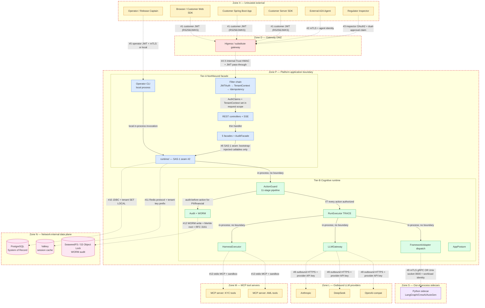

# Trust Boundary Diagram

**Status**: v1 — created 2026-05-08 in response to security review §6.1
**Owner**: Platform team (GOV track)
**Companion**: [`security-control-matrix.md`](security-control-matrix.md)

This diagram is the canonical map of trust boundaries in spring-ai-fin. Every line crossing a boundary names: **authentication · authorization · tenant propagation · data classification · audit · allowed protocols · failure behaviour**.

---

## 1. The diagram



---

## 2. Boundary table

The 13 numbered boundaries above; each row specifies the 7 control concerns:

### Boundary #1 — Customer browser/app/SDK → Higress

| Concern | Specification |
|---|---|
| **Authentication** | RS256/JWKS JWT (HS256 only for BYOC small with explicit acknowledgment) |
| **Authorization** | At ActionGuard stage 3 downstream; gateway only verifies signature + checks `aud=platform` |
| **Tenant propagation** | `tenantId` claim in JWT; gateway strips client `X-Tenant-Id` and re-injects from claim |
| **Data classification** | Request body classified at ActionGuard stage 6 (DataAccessClassifier) |
| **Audit** | Gateway access log; platform `SECURITY_EVENT` on auth failure |
| **Allowed protocols** | HTTPS (TLS 1.3); SSE for streaming; HTTP/2 |
| **Failure behaviour** | 401 missing/invalid JWT; 429 rate limit; 413 body too large |

### Boundary #2 — External A2A agent → Higress

| Concern | Specification |
|---|---|
| **Authentication** | mTLS client certificate + agent identity JWT |
| **Authorization** | Static external-agent registry; allowed-capability set per agent |
| **Tenant propagation** | Agent's `agentId` + JWT `tenantId` claim; cross-checked in registry |
| **Data classification** | Same as #1 |
| **Audit** | Every inbound A2A call = `AuditClass.SECURITY_EVENT` |
| **Allowed protocols** | HTTPS + JSON; OpenAPI strict schema |
| **Failure behaviour** | 401 mTLS failure; 403 unknown agent; 429 rate limit |

### Boundary #3 — Regulator inspector → Higress

| Concern | Specification |
|---|---|
| **Authentication** | Inspector OAuth2 + dedicated `inspector` role claim |
| **Authorization** | Read-only audit routes; cross-tenant query allowed only with `regulator-authorized` claim |
| **Tenant propagation** | `tenantId` in request URL/query (cross-tenant requests audited) |
| **Data classification** | Read access to `audit_event`; PII decode requires dual-approval workflow |
| **Audit** | Inspector access itself audited as `SECURITY_EVENT` (recursive) |
| **Allowed protocols** | HTTPS |
| **Failure behaviour** | 401 / 403 / 429; PII decode without dual-approval = 403 |

### Boundary #4 — Higress → Tier-A facade

| Concern | Specification |
|---|---|
| **Authentication** | Gateway already verified JWT; platform validates `X-Internal-Trust` HMAC header (gateway-signed) |
| **Authorization** | Platform re-checks tenant claim; gateway-signed claim is source of truth |
| **Tenant propagation** | `X-Tenant-Id` header normalized by gateway; carried into `TenantContext` |
| **Data classification** | Inherited from #1/#2/#3 |
| **Audit** | Filter chain emits `tenant_context` spine event |
| **Allowed protocols** | HTTP/2 (mTLS optional in BYOC) |
| **Failure behaviour** | 401 if `X-Internal-Trust` missing or invalid (would mean direct connection bypassing gateway) |

### Boundary #5 — Operator → Operator CLI

| Concern | Specification |
|---|---|
| **Authentication** | Operator JWT (operator role); local-process default; mTLS for remote |
| **Authorization** | Operator role can run/cancel/tail-events; CANNOT decode PII (Compliance role only) |
| **Tenant propagation** | Operator's tenant claim or `--tenant-id` flag (cross-tenant requires dual-approval) |
| **Data classification** | Operator may see redacted output by default; `--unredacted` requires `SECURITY_EVENT` audit |
| **Audit** | Every CLI command = `SECURITY_EVENT` |
| **Allowed protocols** | Local stdio for serve; HTTPS stdlib HttpClient for run/cancel/tail-events |
| **Failure behaviour** | Reject; deterministic exit codes |

### Boundary #6 — Tier-A facade → Tier-B runtime (SAS-1 seam)

| Concern | Specification |
|---|---|
| **Authentication** | In-process; SAS-1 seam discipline (only `bootstrap/` and `runtime/` may import `agent-runtime.*`) |
| **Authorization** | Constructor-injected callables; no protocol-level auth |
| **Tenant propagation** | `TenantContext` passed as method parameter |
| **Data classification** | Tier-A passes typed contract objects; Tier-B handles internal types |
| **Audit** | Spine emitter |
| **Allowed protocols** | In-JVM method call |
| **Failure behaviour** | Exception propagation; ContractError envelope at controller layer |

### Boundary #7 — RunExecutor / FrameworkAdapter / Tools → ActionGuard

| Concern | Specification |
|---|---|
| **Authentication** | In-process; ActionGuardCoverageTest enforces every side-effect site routes through ActionGuard |
| **Authorization** | ActionGuard 11-stage pipeline (with PreAction + PostAction evidence writers) — THE central control |
| **Tenant propagation** | `ActionEnvelope.tenantId` mandatory + matched against `RunContext.tenantContext` |
| **Data classification** | `ActionEnvelope.dataAccessClass` required (PUBLIC/TENANT_INTERNAL/PII/FINANCIAL_LEDGER) |
| **Audit** | Pre-action audit per AuditClass; post-action evidence record |
| **Allowed protocols** | In-JVM method call to `ActionGuard.authorize(envelope)` |
| **Failure behaviour** | Reject + structured error + audit `SECURITY_EVENT` |

### Boundary #8 — LLMGateway → External LLM provider

| Concern | Specification |
|---|---|
| **Authentication** | Provider API key (HMAC headers per provider; carried via `WebClient`) |
| **Authorization** | Per-tenant budget enforced before request |
| **Tenant propagation** | `tenantId` in metadata for provider-side per-tenant logging (where supported) |
| **Data classification** | Prompt section taxonomy: Trusted/Attributed/Untrusted; PII redacted if present in cacheable section |
| **Audit** | LLM call recorded as TELEMETRY (cost) + SECURITY_EVENT (if posture override) |
| **Allowed protocols** | HTTPS (TLS 1.3); HTTP/2 |
| **Failure behaviour** | FailoverChain to next provider; emit `springaifin_llm_fallback_total` |

### Boundary #9 — FrameworkAdapter → Python sidecar

| Concern | Specification |
|---|---|
| **Authentication** | mTLS for TCP; Unix socket with `0600` permission for local; SPIFFE-style workload identity |
| **Authorization** | Per-call check: gRPC server identity verified; payload-level tenantId required (not just metadata) |
| **Tenant propagation** | `StartRunRequest.tenantId` mandatory; sidecar response payload also carries `tenantId`; runtime validates round-trip |
| **Data classification** | Sidecar payload validated against gRPC schema; unknown fields rejected |
| **Audit** | gRPC call telemetry; sidecar identity verification = SECURITY_EVENT on failure |
| **Allowed protocols** | gRPC over Unix socket (preferred for local) or TLS-protected TCP |
| **Failure behaviour** | DEADLINE_EXCEEDED; RESOURCE_EXHAUSTED on oversized payload; UNAUTHENTICATED on identity failure |

### Boundary #10 — Tier-B runtime → PostgreSQL

| Concern | Specification |
|---|---|
| **Authentication** | DB credential (rotated 30-day); secret from OpenBao |
| **Authorization** | DB role `runtime_role` (INSERT, SELECT, UPDATE on operational tables; only INSERT, SELECT on `audit_event`) |
| **Tenant propagation** | `SET LOCAL app.tenant_id = ?` at every transaction begin (RLS protocol). Postgres scopes `SET LOCAL` to the current transaction and auto-discards it on `COMMIT`/`ROLLBACK`; pooled connection reuse cannot leak the previous tenant's GUC. `TenantBinder` validates `current_setting('app.tenant_id', true)` is empty at transaction start as defense-in-depth (`PooledConnectionLeakageIT`). HikariCP `connectionInitSql` is NOT a per-checkout reset hook. |
| **Data classification** | Postgres RLS policies per tenant-scoped table; sensitive columns encrypted with pgcrypto |
| **Audit** | Failed auth = SECURITY_EVENT; UPDATE/DELETE attempt on audit_event = SECURITY_EVENT (DB-level reject) |
| **Allowed protocols** | TLS-encrypted JDBC |
| **Failure behaviour** | Connection failure = circuit breaker; tenant context missing = TenantContextMissingException |

### Boundary #11 — Tier-B runtime → Valkey

| Concern | Specification |
|---|---|
| **Authentication** | Redis ACL (per-platform; one credential) |
| **Authorization** | Application-level: keys prefixed `tenant:{tenantId}:`; cross-tenant access prevented at construction |
| **Tenant propagation** | Encoded in key path |
| **Data classification** | Session cache + idempotency replay snapshots; sensitive contexts: encryption optional |
| **Audit** | TELEMETRY only |
| **Allowed protocols** | Redis protocol over TLS |
| **Failure behaviour** | Cache miss → recompute from PG; cache write failure → log + skip (never blocks) |

### Boundary #12 — AuditFacade → WORM storage

| Concern | Specification |
|---|---|
| **Authentication** | Storage credential (rotated; OpenBao) |
| **Authorization** | Append-only role; UPDATE/DELETE forbidden by storage policy (S3 Object Lock governance mode; SeaweedFS WORM) |
| **Tenant propagation** | Per-tenant directory prefix `audit/{tenantId}/...` |
| **Data classification** | All REGULATORY_AUDIT class; per-day Merkle root + RFC 3161 timestamp |
| **Audit** | Self-audit: WORM write success/failure recorded in audit_event |
| **Allowed protocols** | HTTPS; S3 API or SeaweedFS S3-compatible |
| **Failure behaviour** | WORM anchor failure → safe read-only mode; compliance alarm |

### Boundary #13 — HarnessExecutor → MCP tool servers

| Concern | Specification |
|---|---|
| **Authentication** | Stdio: subprocess identity; HTTP MCP (v1.1+): mTLS |
| **Authorization** | ActionGuard pre-authorization; per-skill `egress_domains` allowlist for HTTP MCP |
| **Tenant propagation** | tenantId in MCP call payload; sandbox enforces tenant scope |
| **Data classification** | Per-skill metadata (data_access_class) |
| **Audit** | Per-call SECURITY_EVENT (tool invocation); evidence record post-call |
| **Allowed protocols** | stdio (local subprocess) or HTTPS (v1.1) |
| **Failure behaviour** | Tool failure → typed error to agent; circuit breaker; egress violation = block |

---

## 3. Cross-zone data flow examples

### Example 1: Customer asks for KYC lookup

```
[Zone X: customer app] 
  -> #1 (RS256 JWT) -> [Zone D: Higress]
  -> #4 (internal trust) -> [Zone P: filter chain]
  -> tenant context propagated -> [Tier-A controller]
  -> SAS-1 seam (#6) -> [Tier-B RunExecutor]
  -> #7 (ActionGuard authorize) -> [HarnessExecutor]
  -> #13 (MCP stdio) -> [Zone M: KYC MCP tool]
  -> result returned
  -> #10 (JDBC + tenant SET LOCAL) -> [Zone N: PG audit_event INSERT]
  -> #12 (WORM later daily) -> [Zone N: WORM]
  -> response back to customer through #4 → #1
```

### Example 2: PII decode dual-approval

```
[Zone X: Compliance Officer 1]
  -> #1 (compliance role JWT) -> [Higress] -> [filter chain]
  -> [AuditController] -> [AuditFacade.requestDecode]
  -> #10 (audit_event INSERT: decode_requested) -> [PG]
  -> 202 returned to CO1
[Zone X: Compliance Officer 2]
  -> #1 -> ... -> [AuditFacade.approve]
  -> #10 (audit_event INSERT: decode_approved) -> [PG]
  -> [TokenizationService.detokenize]
  -> #10 (audit_event INSERT: decode_executed) -> [PG] (BEFORE plaintext returned)
  -> 200 plaintext returned to CO2 with 15-min TTL
[After 15 min]
  -> [TokenizationService eviction]
  -> #10 (audit_event INSERT: decode_evicted) -> [PG]
```

If any audit write fails: plaintext is NOT returned (audit-before-reveal per AuditClass.PII_ACCESS).

### Example 3: External Python framework dispatch (LangGraph)

```
[Zone P: RunExecutor]
  -> #7 (ActionGuard authorize the framework_dispatch action)
  -> [PySidecarAdapter]
  -> #9 (gRPC over Unix socket; identity check; tenantId in payload)
  -> [Zone S: Python sidecar process]
  -> sidecar calls back via #9 with stage events (each event carries tenantId)
  -> RunExecutor validates each event tenantId == ctx.tenantId (round-trip integrity)
  -> events emitted to EventBus
  -> ... rest of TRACE pipeline
```

If sidecar drops tenantId or returns wrong tenantId: event rejected at runtime; SECURITY_EVENT audit; sidecar identity revoked + alarm.

---

## 4. Failure-mode summary

| Boundary | Most likely failure | Detection | Response |
|---|---|---|---|
| #1 customer JWT | Invalid signature, expired token | JwtAuthFilter | 401 |
| #2 A2A mTLS | Cert revoked, identity unknown | gateway TLS terminator | 401 |
| #3 inspector | Cross-tenant without authorization | AuditController | 403 |
| #4 internal trust | Direct connection bypassing gateway | platform validates HMAC | 401 |
| #5 operator | Wrong role for command | CapabilityPolicy | reject |
| #6 SAS-1 seam | Layer violation in code | CI gate | reject build |
| #7 ActionGuard | Reject from any of 11 stages | ActionGuard | structured error + audit |
| #8 LLM provider | Provider down, rate limit | FailoverChain | next provider |
| #9 sidecar | Identity mismatch, oversized | gRPC interceptor | UNAUTHENTICATED / RESOURCE_EXHAUSTED |
| #10 PG | Tenant context missing | RLS policy | fail-closed |
| #11 Valkey | Cache write failure | LLMGateway | log + skip |
| #12 WORM | Anchor failure | WormAnchor | safe read-only mode + alarm |
| #13 MCP tool | Tool failure or egress violation | HarnessExecutor | typed error + circuit breaker |

---

## 5. Trust assumptions

For each zone, what we assume the operator has secured:

| Zone | Trust assumption |
|---|---|
| Zone X (untrusted external) | Nothing assumed; all controls at #1/#2/#3 |
| Zone D (gateway) | Higress operator has configured per the conformance profile; X-Internal-Trust HMAC secret is rotated; gateway logs are protected |
| Zone P (platform) | Platform process is supervised under PM2/systemd; SIGTERM drain handler in place; APP_POSTURE set correctly |
| Zone S (sidecar) | Container runtime enforces network policy + filesystem RO + drops capabilities; image is signed |
| Zone L (LLM providers) | Provider TOS honored; API keys protected by OpenBao; provider data usage acknowledged in customer contracts |
| Zone N (data plane) | DB and storage are network-internal (private subnet); ACLs prevent direct external access; backups encrypted |
| Zone M (MCP tools) | MCP tool servers are vetted (allowlist); stdio is local subprocess only; HTTP MCP requires mTLS |

If any trust assumption is violated, the rest of the architecture cannot compensate. The Gateway Conformance Profile (`gateway-conformance-profile.md`) and Sidecar Security Profile (`sidecar-security-profile.md`) are the deployment-time checklists for Zone D and Zone S.

---

## 6. Maintenance

This diagram is owned by the GOV track. Adding a new external dependency (new provider, new MCP server, new sidecar) requires:

1. PR adding the new zone (or extending existing zone)
2. New numbered boundary with full 7-concern table
3. Cross-zone flow example showing the path
4. Failure-mode entry
5. Trust assumption documented
6. Linked control matrix entries

`TrustBoundaryDiagramLinter` runs in CI to assert:
- Every boundary in the diagram has a row in §2
- Every boundary referenced in `security-control-matrix.md` is in this diagram
- No untraceable cross-zone arrow exists
